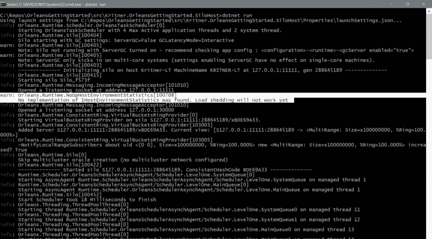
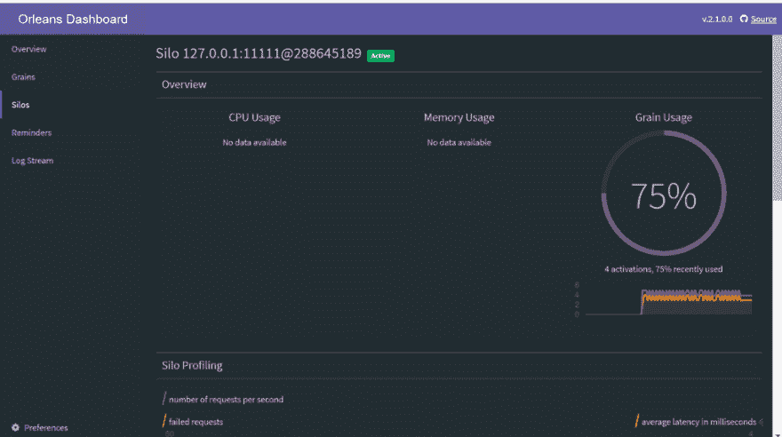
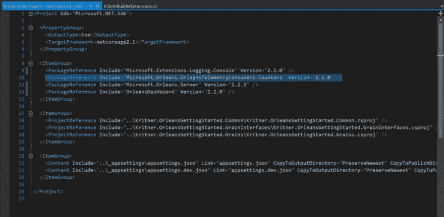
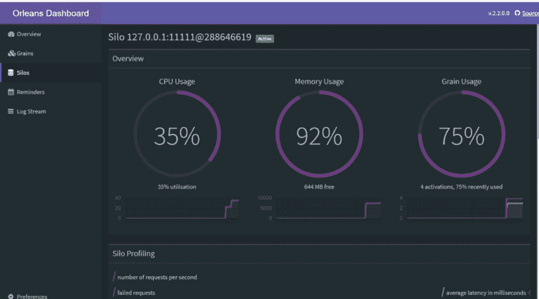

# 微软奥尔良—仪表板更新—CPU/内存统计

> 原文：<https://dev.to/kritner/microsoft-orleansdashboard-updatecpumemory-stats-111k>

### 微软奥尔良—仪表板更新—CPU/内存统计

快速更新我不久前发表的一篇关于 Orleans Dashboard 的帖子—针对您的群集的附加报告指标！

作为复习，Orleans 是一个虚拟演员模型框架——一个可以用来构建新的、分布式“原语”的框架。这些原语的工作可以外包给一个节点集群，作为一种比局限于单个硬件更快完成“工作”的方式。

在之前的帖子中:

[如何设置微软奥尔良的报告仪表板](https://dev.to/kritner/microsoft-orleansreporting-dashboard-2716)

我曾指出:

> 目前，CPU/内存使用情况在中不可见。奥尔良的 net 核心实现。希望将来能有所补救？也许是 netstandard 中可用的 API 的限制？

这个 ***似乎*** 在某个时间点上曾经是真实的，但现在不再是了！(至少如果你在 windows 运行时环境下运行。)

额外的 CPU 和内存指标完全依赖于注册的 IHostEnvironmentStatistics 实现。默认情况下，会注册一个“NoImplementation”实现，您会在 Orleans 日志中看到类似这样的内容:

[](https://res.cloudinary.com/practicaldev/image/fetch/s--bPV4agk2--/c_limit%2Cf_auto%2Cfl_progressive%2Cq_auto%2Cw_880/https://cdn-images-1.medium.com/max/1024/1%2ALUNEWSPH4EmnMcjyeX4KyA.png) 

<figcaption>奥良日志显示了阻止减载工作的问题</figcaption>

你仪表板上的这个:

[](https://res.cloudinary.com/practicaldev/image/fetch/s--5WN5j55S--/c_limit%2Cf_auto%2Cfl_progressive%2Cq_auto%2Cw_880/https://cdn-images-1.medium.com/max/1024/1%2Ankh0T8cIULk5Qnjh26ecxQ.png) 

<figcaption>Sad Orleans 仪表板不带 CPU/内存指标:(</figcaption>

我偶然发现让这些 CPU/内存指标在仪表板上工作的全部原因是，我在追求让负载分流功能发挥作用——这显然依赖于这些指标。

通过在 [Orleans Gitter](https://gitter.im/dotnet/orleans) 上的反复讨论，我发现了 IHostEnvironmentStatistics 类所需的注册实现。其中一个类确实存在于 Orleans 代码中，尽管它在一个单独的包中，并且是该包的一个内部类:

[点网/奥尔良](https://github.com/dotnet/orleans/blob/e2b25a695767ae5746ffe47218c1331427997894/src/TelemetryConsumers/Orleans.TelemetryConsumers.Counters/Statistics/PerfCounterEnvironmentStatistics.cs)

幸运的是，有一个 SiloHost 扩展方法可以注册 IHostEnvironmentStatistics 的这个实现以供使用——尽管是在仅支持 Windows 的运行时环境中(至少在编写本文时)。

为了让 CPU/内存指标在我们的仪表板上工作(并让我们能够进行负载分流)，我们需要做一些事情:

*   安装新的 NuGet 包
*   注册 IHostEnvironmentStatistics 的一个实现——类似于 NuGet 包本身提供的实现。

#### 安装 NuGet 包

IHostEnvironmentStatistics 实现存在于 Microsoft。orleanstelemetryconsumers . counters 包，通过 GUI、CLI 等安装它。完成后，SiloHost 项目中的 csproj 文件应该如下所示:

[](https://res.cloudinary.com/practicaldev/image/fetch/s--xKr8a9dd--/c_limit%2Cf_auto%2Cfl_progressive%2Cq_auto%2Cw_880/https://cdn-images-1.medium.com/max/1024/1%2AXDZnP9oDOIz96A2XZBOC0A.png) 

<figcaption>csproj 安装完 NuGet 包后微软。Orleans . orleanstelmetryconsumers . counters</figcaption>

#### 注册 IHostEnvironmentStatistics 的实现

如前所述，新的 NuGet 包中包含了 IHostEnvironmentStatistics 的 Windows 特定实现，尽管它是一个内部类。然而，有一个扩展方法可以用来注册这个内部类。

让我们更新一下我们的`SiloHostBuilder`:

原创

```
var builder = new SiloHostBuilder()
 .ConfigureClustering(
  ServiceProvider.GetService<IOptions<OrleansConfig>>(),
  Startup.HostingEnvironment.EnvironmentName
 )
 .Configure<ClusterOptions>(options =>
 {
  options.ClusterId = "dev";
  options.ServiceId = "HelloWorldApp";
 })
 .Configure<EndpointOptions>(options => options.AdvertisedIPAddress = IPAddress.Loopback)
 .AddMemoryGrainStorage(Constants.OrleansMemoryProvider)
 .ConfigureApplicationParts(parts =>
 {
  parts.AddApplicationPart(typeof(IGrainMarker).Assembly).WithReferences();
 })
 .ConfigureServices(DependencyInjectionHelper.IocContainerRegistration)
 .UseDashboard(options => { })
 .UseInMemoryReminderService()
 .ConfigureLogging(logging => logging.AddConsole()); 
```

而我们只需要加上`.UsePerfCounterEnvironmentStatistics()`。

更新

```
var builder = new SiloHostBuilder()
 .ConfigureClustering(
  ServiceProvider.GetService<IOptions<OrleansConfig>>(),
  Startup.HostingEnvironment.EnvironmentName
 )
 .Configure<ClusterOptions>(options =>
 {
  options.ClusterId = "dev";
  options.ServiceId = "HelloWorldApp";
 })
 .Configure<EndpointOptions>(options => options.AdvertisedIPAddress = IPAddress.Loopback)
 .AddMemoryGrainStorage(Constants.OrleansMemoryProvider)
 .ConfigureApplicationParts(parts =>
 {
  parts.AddApplicationPart(typeof(IGrainMarker).Assembly).WithReferences();
 })
 .ConfigureServices(DependencyInjectionHelper.IocContainerRegistration)
 .UsePerfCounterEnvironmentStatistics() // <- this guy
 .UseDashboard(options => { })
 .UseInMemoryReminderService()
 .ConfigureLogging(logging => logging.AddConsole()); 
```

这就是全部了！现在，我们应该在 Orleans 仪表板上报告我们的 CPU/内存使用情况，并且可以更好地进行负载削减——也许是为了下一篇文章！

现在，在我们的仪表板上，我们可以看到:

[](https://res.cloudinary.com/practicaldev/image/fetch/s--ML2HzOx2--/c_limit%2Cf_auto%2Cfl_progressive%2Cq_auto%2Cw_880/https://cdn-images-1.medium.com/max/1024/1%2A050BNc2zKDgssiqmx4VSbQ.png)

<figcaption>CPU/内存利用率！</figcaption>

现在，我们对集群的运行方式有了更深入的了解，我们还可以使用其他功能，例如负载分流！

#### 相关:

*   [如何设置微软奥尔良的报告仪表板](https://dev.to/kritner/microsoft-orleansreporting-dashboard-2716)
*   [关于启用 CPU/内存指标的信息。由克里特纳拉请求# 212 OrleansContrib/OrleansDashboard](https://github.com/OrleansContrib/OrleansDashboard/pull/212)

*   发布时的代码—[https://github . com/krit ner-Blogs/OrleansGettingStarted/releases/tag/v 0.57](https://github.com/Kritner-Blogs/OrleansGettingStarted/releases/tag/v0.57)

*   [微软奥尔良入门](https://medium.com/@kritner/getting-started-with-microsoft-orleans-882cdac4307f?source=friends_link&sk=1fc3451d71a19dcb49f2c8bbeb6b079e)

*   [微软奥尔良——再利用谷物和谷物状态](https://medium.com/@kritner/microsoft-orleans-reusing-grains-and-grain-state-136977facd42?source=friends_link&sk=f19cfa3f17665c3d700bfe0df56e27a9)

*   [微软奥尔良—报告仪表板](https://medium.com/@kritner/microsoft-orleans-reporting-dashboard-16465d255199)

*   使用多态性更新新奥尔良项目，为新奥尔良范例做好准备！

*   [微软奥尔良—依赖注入](https://medium.com/@kritner/microsoft-orleans-dependency-injection-6379d52a7169?source=friends_link&sk=6c3883a5213d65eb251b56c717e0e4f2)

*   [微软奥尔良——在“开发”和“生产”配置之间轻松切换。](https://medium.com/@kritner/microsoft-orleans-easily-switching-between-development-and-production-configurations-20e109be6458?source=friends_link&sk=1e8fc6aa072a5b293d029c00012165b3)

*   [。网络核心控制台应用程序选项配置](https://medium.com/@kritner/net-core-console-application-ioptions-t-configuration-ae74bfafe1c5?source=friends_link&sk=c5bcab4f7f10c97175ad68fc12cb9cc6)

*   [微软奥尔良—观察家](https://medium.com/@kritner/microsoft-orleans-observables-5e0040c949cd?source=friends_link&sk=bcb921fdf593bdc97b9c5909b2730f2d)

* * *