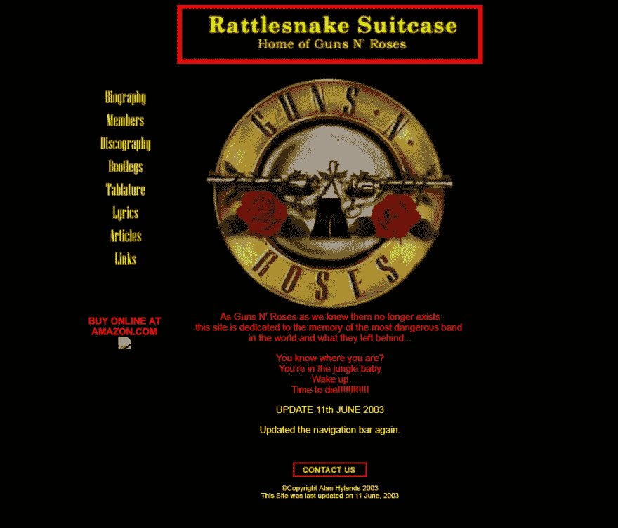
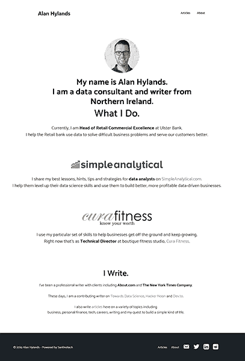

# 将我的博客从 Wordpress 迁移到 Gatsby -第 1 部分

> 原文：<https://dev.to/alanhylands/migrating-my-blog-from-wordpress-to-gatsby-part-1-580c>

## 开始的地方。

在我的记忆中，语言战争和追逐闪亮的新框架一直是 web 开发世界的标志。[我的第一个网站](http://www.oocities.org/rattlesnake_suitcase/index.htm)是在记事本上用 HTML 手工编码的。我们这里说的是 2001 年末/2002 年初。

我打开了 Internet Explorer，它光彩照人。那是一段简单的时光。

我首先跳到微软的 Frontpage(笨拙而可怕),然后是 Macromedia Dreamweaver，它使用起来流畅得多。在这个过程中，我停止了手工编写 HTML 代码。

当我在 2005 年开始写我的第一个博客时，似乎每个人都在谈论一个新人。现在很难相信，但在当时，人们仍然对 Matt 能否真正在 CMS 领域取得进展持怀疑态度。尤其是在 PHP 已经开始受到来自开发人员社区的批评的时候。现在回想起来，大约有三分之一的网站运行在 Wordpress 上，你不得不说 Matt 知道他在做什么！

在这期间，我花了很多时间用 Wordpress 建立网站。网上商店。代销店的产品页面由亚马逊的 API 填充(等等)。沙龙预订系统。会员网站。个人博客一遍又一遍。盛大开幕，盛大闭幕。当我想建立一个网站时，我安装了 Wordpress。正如 WP 安装数量所显示的那样，我和世界上大多数其他人。

## 再次回到马鞍上。

去年早些时候，我又开始写博客和写作，比十年来最好的时候更加认真。我一直忙于建立企业数据科学事业。和一个家庭。不一定是这个顺序，但一定要同时进行。我想写下并分享我在那段时间里学到的一些东西。我参与了大大小小的商业活动，并找到了技术和数据开始真正改善商业的最佳点，我认为我有值得写的东西。

因此，我为我的数据科学写作创建了[SimpleAnalytical.com](https://simpleanalytical.com)，为我的其他各种写作兴趣创建了[AlanHylands.com](https://www.alanhylands.com)。Wordpress 是其中之一。另一个是 Wordpress。有一段时间效果很好。就像一条舒适的旧裤子一样，我的老朋友已经伸展了一点，但仍然足以让我认出来，并带着复仇跳回去。

## 哪里开始出问题了？

Wordpress 为网站开发者可能需要的任何可能发生的事情储备了大量的插件。主题也是如此，因为网络在如此多免费和优质主题的重压下吱吱作响。正如你所知，我的品味很简单。即便如此，在一次严重的牦牛毛事件中，我设法为 AlanHylands.com 设计了不到 200 个版本的主页。是的，200。最后，我得到的 Generatepress 主题的最差版本是这样的:

200 个版本，我有一个普通的白色主页，上面有一张图片和一点文字。干得好。*咳咳。*

然而，该网站仍然很慢。我没有使用很多花哨的魔法，但插件的数量似乎仍在增加。谷歌的页面速度洞察应用程序根本不喜欢它。它像狗一样跑着。鉴于我所做的只是偶尔写一篇带有大量文本和一些图片的文章，我开始思考——为什么我需要所有这些插件和数据库呢？

我已经很好地融入了优秀开发者社区，并开始阅读越来越多的关于静态站点生成器的内容。雨果哲基尔盖茨比。这些名字不断出现，我很感兴趣。我已经很久没有写任何 Javascript 了，所以一想到要开始学习这些东西就足以让我分心。

不过，我本不必担心。

所以我硬着头皮决定给盖茨比一次机会。作为一名主持人，我一直在阅读关于 Netlify 的精彩文章，并且有十几篇博客文章要转化为 Markdown，我想我应该转化 AH.com，看看我是如何做的。最坏的情况是浪费几个小时，但如果结果很好...

## 站在巨人的肩上。

React 开发者戴夫·塞德迪亚有一本很好的《T2 入门指南》，可以和盖茨比和奈特丽菲一起开博客，非常适合我的需要。我接触了终端、节点、Javascript 和 Github，这是对整个前端开发世界的一个很好的介绍，而我的目光更多地集中在数据科学上。

Dave 指导您安装 Gatsby starter，以便快速启动和运行。一旦我在它周围戳了戳，做了一些改变，我就有了信心，开始将博客文章列表移到另一个页面，并重新创建我以前在 Gatsby 中的 Wordpress 主页的外观。

新帖子是用 Markdown 编写的，本质上是文本文件，所以它非常轻量级，不需要数据库。没有管理部分或脚本来破解，所以这样也更安全。每个运行过 Wordpress 网站的人都知道丢掉安全球是多么容易。尤其是当我们开始添加越来越多的插件来获得更多的功能时。SSG 没有相同的问题，这是一个很大的好处。它们也快如闪电，深受读者喜爱(谷歌也是如此)。双泡。

Dave 的教程会带你把你的新博客推到 Github repo，然后部署到 Netlify。它需要几分钟的时间，而且是实时的。嘣。任务完成。不完全是。

## 稍有美中不足。

当我们不在绿色场地工作时，事情永远不会像我们希望的那样没有压力。对我来说，主要问题是我用于登录和通信的电子邮件地址。Netlify 不做电子邮件托管，所以我不得不从大约 20 个开放的 Chrome 标签和搜索中寻找解决方案。

我仍然在测试它，只是为了确保它工作正常，但我想我已经找到了一个可行的解决方案。我的老经销商主机包使用 WHM 和 cPanel。使用我现有的帐户，我可以在 Netlify DNS 上添加 A 和 MX 记录，将任何电子邮件重定向回我旧帐户上的电子邮件主机。

在那里，我可以设置邮件转发，并使用他们的 SMTP 通过我的个人 Gmail 用化名发送邮件。如果它看起来是一个长期的成功，我会写下来，因为这是一个有点汗的工作。

## 接下来是什么？

我还想对这个网站做几个更新，所以这将是一项正在进行的工作。很干净。它很快。这对我来说是一个新的尝试，也是一个探索盖茨比的好基础。但是我在顶部没有一个导航栏，我想我会在接下来添加它。任何逃避做任何正当工作的事情！

我现在真正要考虑的是，我是否要将简单的分析迁移到 Gatsby 上，增加更多的帖子、代码块、表格和 Mailchimp 集成。当我解决这个难题时，请关注第 2 部分。

## 那么我现在可以不用 Wordpress 了吗？

简单的回答是否定的。像所有的技术选项一样，它将归结为马的课程。对于一个干净、简单的博客，我喜欢写一个降价文件，上传并观看直播的想法。对于可以使用完整的 Wordpress admin 后端和数据库的网站和在线应用程序，在可预见的未来，我仍然会使用它。

生活不一定非此即彼，有时在你的工具箱里保留几个选项是很好的。我已经把做数据工程师作为我的职业，当我第二个十年的网站建设结束时，没有理由改变这一点。

(最初发布于[AlanHylands.com](https://www.alanhylands.com))