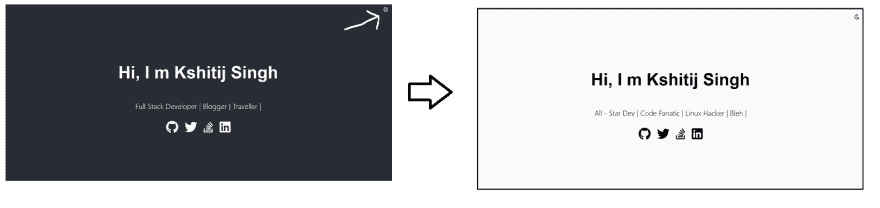
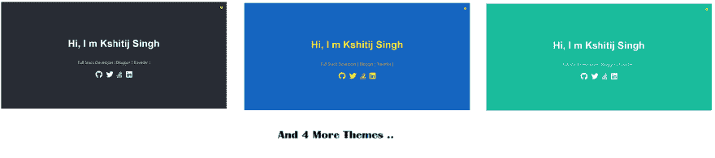
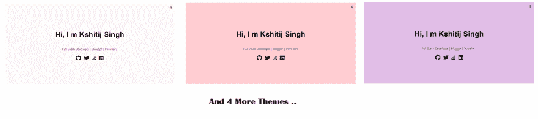
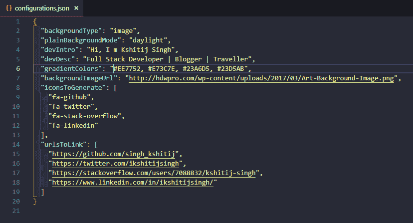

# 开发人员为使用 Github 页面的开发人员构建的最小投资组合

> 原文：<https://dev.to/singhkshitij/minimal-portfolio-built-by-developer-for-developers-2c54>

嘿，伙计们，想要一个很棒的登陆页面吗？看看这个库，我用 REACT 和 Material UI 构建的，在这里你可以简单地改变一些 JSON 属性，然后免费部署到 GitHub 页面上，只需要 5 分钟。

演示:[https://bit.ly/2Ocnxwg](https://bit.ly/2Ocnxwg)(点击页面看魔术)

你可以在这里找到代码:[https://github.com/singhkshitij/My-Landing-Page](https://github.com/singhkshitij/My-Landing-Page)。

## 为什么？

一个晴朗的日子，我浏览 GitHub，在 Dinesh Pandiyan 的简介中发现了一个很棒的概念，并看到人们真的很喜欢它，我也是。我真的很喜欢极简主义的方法，因此我认为我应该向前迈进一步。

实际上，原始回购有一些静态文件，您需要手动编辑其中的源代码，以便启动并运行您的登录页面。所以我用 create-react-app 引导了相同的内容，即 **REACTJS** 。现在你只需要改变一个配置文件，运行几个命令就可以了。

## 包含哪些内容？

你永远不知道未来会发生什么，但是现在它支持:

*   通过单击按钮切换明暗模式的材质背景

*   默认情况下，每个暗模式和亮模式都支持 7 种颜色组合。(共 14 人)

### 深色背景

### 浅色背景

*   当您单击页面上的任意位置时，背景会随之改变。
*   带有自由流动动画的渐变背景支持

*   图像背景

*   n '超链接社交简档支持的数量
*   使用几个命令在 GitHub 帐户上部署项目。
*   只需更改配置文件:D 就可以进行更改

最初发布于: [Mytrashcode](https://mytrashcode.com)