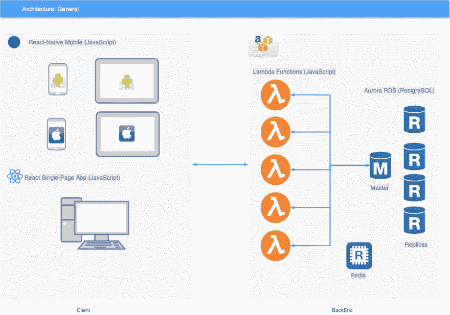

# 极简产品的极简建筑。

> 原文：<https://dev.to/dmitryame/minimalistic-architecture-for-minimalistic-product-ffd>

# 一般校长

鉴于初创公司的稀缺性，该架构的主要目标是提供简单的解决方案，但具有潜在的可扩展性，需要最少的开发运营参与和维护。这一目标可以通过最大限度地减少关键技术、语言和组件的数量，以及依靠行业成熟的解决方案来实现。

# 编程语言

目前唯一可以跨所有架构层和组件使用的语言是 JavaScript。全面采用 JavaScript 语言将允许建立真正的跨职能工程团队。虽然允许并鼓励一些专门化，但是每个团队成员都应该适应系统的任何层，并根据需要在前端/后端之间切换。JavaScript 需要一定的熟练程度。为了保持高水平的标准，开发团队必须就适用于不同层的某些技术和工具达成一致，例如:

*   Linter(共享定制规则)

*   是 7 月 6 日

*   异步/等待结构

*   广泛的单元测试(至少 70%的覆盖率)

# 客户端

为了支持简化的目标，基于 React 的 UI 将用于所有类型的客户端。React 的口头禅:学一次——到处写。Android 和 iOS 用户界面将共享相同的代码库。移动用户界面代码不能按原样转移到基于浏览器的单页应用程序，因为浏览器用户界面在概念上与移动用户界面非常不同。但是，对于一个熟练的开发人员来说，维护这两种类型的客户端应该是相当容易的，因为语言、事件模型和工具是相同的。

# 后端

我们将依赖 AWS 基础设施，这是业内公认的解决方案。将使用 AWS Lambda 无服务器中间件，它具有以下优势:

*   易于使用和部署。

*   支持已更改服务的增量部署(无需重新部署 monolith)。

*   当天热重新部署，不会中断服务。

*   自动扩展以满足无限需求。

*   现收现付(与其他选择相比非常优惠的价格)。

*   支持 JavaScript。

# 数据存储

PostgreSQL 将被用作数据库。AWS 目前支持 Aurora RDS，这大大简化了数据库维护和管理。Aurora RDS 针对 IO 进行了高度优化(这对于任何数据库技术来说都是一个大问题)。与 MongoDB 不同，PostgreSQL 保证了写入。如果我们需要支持文档数据结构，PostgreSQL 支持 JSONB 类型，它可以被索引以便快速访问。

# 结论

这就是现代产品所需要的——简单、优雅、可伸缩、可维护、低成本。如果产品没有成功(偶尔仍会发生)，扔掉没什么大不了的，冲洗一下，重复使用。

本文原帖[此处](https://www.echowaves.com/blog/minimalistic-architecture-for-minimalistic-product)
这个[开源示例项目](https://github.com/echowaves)叫做[我所见](https://www.wisaw.com/)。