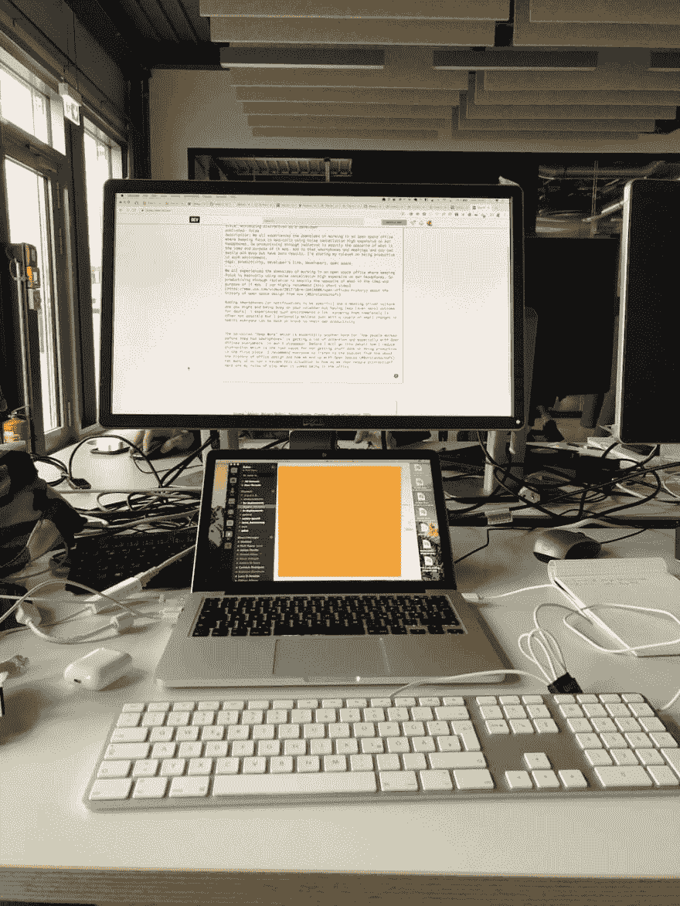

# 尽可能减少开发人员的注意力分散

> 原文：<https://dev.to/fokusman/minimizing-distraction-as-a-developer--c8m>

 
*照片由克里斯纳四世在 Unsplash 上拍摄*

我们都经历过在一个开放的办公室工作的缺点，在那里保持注意力需要使用噪音消除和昂贵的入耳式耳机。因此，通过隔离来提高生产力与它的理念和目的正好相反。我可以推荐[这个来自 Vox (#Bürolandschaft)的关于开放空间设计历史的短视频](https://www.vox.com/videos/2017/10/4/16414808/open-offices-history)。

添加智能手机(具体来说是通知)，一种会议驱动的文化，你最终会让自己忙起来。这项业务与生产率或结果并不相关，往往是相反的。根据我的经验，完全摆脱它们通常是不可能的，但是通过我们习惯上的一些小改变，我们可以再次变得更有效率。

一切从你自己开始。从一些睿智的话开始(这是我经常喜欢的):

> 昨天我很聪明，所以我想改变世界。今天我变聪明了，所以我在改变自己。鲁米

我们都被我们的组织结构和工作方式所束缚。通常我们接受事物是如何工作的(包括我自己！)而且不要质疑某些套路，工作方式。这很正常，但这使得倾听新加入者、局外人的意见变得更加重要。但首先，还是先从自己做起吧。

*   禁用你的通知功能——这个似乎很明显。尽管如此，我还是看到许多人在严格控制不看智能手机方面苦苦挣扎。我们都太习惯智能手机和通知了。忽视我们消费内容的方式也在伤害我们([略读](https://www.theguardian.com/commentisfree/2018/aug/25/skim-reading-new-normal-maryanne-wolf))是许多人抱怨缺乏专注的原因。转到您的设置并完全禁用通知。在你的一生中至少有一次浏览所有应用程序的列表并手动禁用它们。之后，(可能)启用最重要的 3 个 app。我禁用了所有社交媒体通知。既然它是异步的，为什么我们要同步一些设计为异步消费的东西呢？
*   **将你的智能手机转到背面** -你臀部 5 到 X 英寸的大屏幕对你来说很有吸引力，因为它可能会为你提供下一次[多巴明治疗](https://motherboard.vice.com/en_us/article/a3a848/facebook-notification-overload)。所以不分心的最好方法是关掉屏幕或者打开它，这样你就能看到后盖。
*   **不要把手机放在桌子上**——把智能手机放在桌子上不仅会分散你的注意力，还会分散别人的注意力。例如，我有一个同事因为和家人一起搬家而收到很多信息。这并不容易，但几天后，我让他把他的智能手机放在别的地方，因为我的桌子每次都会震动，或者关掉它。你应该经常思考你的分心是如何导致你周围的人分心的。
*   **减少你观看的屏幕数量**——我们都认为像这些花哨的电影一样看 3+个屏幕是`cool`。在过去的几年里，我从 Macbook 屏幕(用于交流)，一个屏幕用于我正在调试的 web 应用程序，第二个屏幕用于调试器，几乎变成了一个屏幕。对我来说，一个屏幕对焦就可以了。有些人可能仍然想要这个巨大的 2-3 屏幕设置，但当我和他们交谈时，许多人对这个设置并不满意。缩小你的屏幕。得到一个大屏幕，一个 4K 屏幕，仍然专注于拥有一个。

就我个人而言，我习惯上的这些小变化对我保持专注于我现在正在做的任务帮助很大。但是关于更大的领域，你的团队，你的组织，我想分享更多。下面的规则可以追溯到我多年前读过的一句话:

> “你的时间是 1000 美元/小时，你需要据此行动。”杰森·科恩

我对这句话的理解是，我们很多人都在高薪岗位上工作，公司也有期望。尽管如此，我还是经常观察到一些无益的行为。

*   **不允许人勾肩搭背**——所谓 strenfried(德语；意思是捣蛋鬼)。如果你正在开发一个应用程序，并且有一个清晰的工作流程(Scrum，Kanban...)不太可能需要马上讨论什么事情。人们购买昂贵的耳机来提高工作效率。尤其是在开放空间的办公室里，频繁地走到人们的办公桌前是一种反模式。不要误解我的意思，有些情况下需要这样做，例如，一个关键的 bug 需要注意，临时修饰，团队喝咖啡休息时间(蛋糕时间)。然而它们很少发生，异步是一条必由之路。每个人都在使用 Slack / Hipchat / Jabber 或者某种形式的内部聊天。所以让他们在那里等着。向前看。做点别的。如果你想当天得到反馈，等一两个小时，当他们已经在讨论或跟进时，试着抓住他们。另一方面，作为一名开发人员，我不接受不断碰壁和分心的行为。如果不急的话，我总是让人们通过聊天给我发信息，这样我一有空就可以接。这种行为很难一直遵循，但是纪律是作为开发人员的一个关键方面。
*   不要参加没有准备/议程的会议——你应该预料到邀请你参加会议的人会提前做好准备。多亏了出色的网络界面，创建一个会议并邀请人们只需几分钟。准备它需要几个小时。这就是为什么许多人邀请并使用会议作为某种形式的头脑风暴会议，但称之为不同的，往往期待一个决定。这就是为什么每当我收到邀请时，我都会检查是否有关于它的内容和议程。如果没有，我正在写信给组织者，请他们在会议前提供一些东西，否则我将跳过它。
*   **听取反馈** -开发人员通常会把一个新的团队成员和入职流程视为阻碍。我不知道。恰恰相反。这样一个新鲜的想法加入你的团队，你的组织可以成为一个金矿，对你基本上看不见的事情提供重要的反馈。支持、开放，并邀请新的团队成员积极挑战你。这样你总能找到有价值的东西。

## 结论

> “专注就是说不。”——史蒂夫·乔布斯

当你在阅读我们为了减少分心而必须改变的习惯时，目标是专注于一项任务。作为集中注意力的第一步，减少周围不必要的噪音很重要。开发人员通常从优化工作流程开始，尝试不同的`get stuff done`方法，而没有意识到当你不断检查其他东西时，即使是最好的工具也是毫无价值的。这就是为什么我同意史蒂夫·乔布斯的观点，我们需要开始经常对身边的事物说`No`。

我敢肯定人们会遵守更多的规则，我真的很想了解更多关于人们每天必须进入`deep work`的内容，所以请评论她或通过 Twitter 联系她。