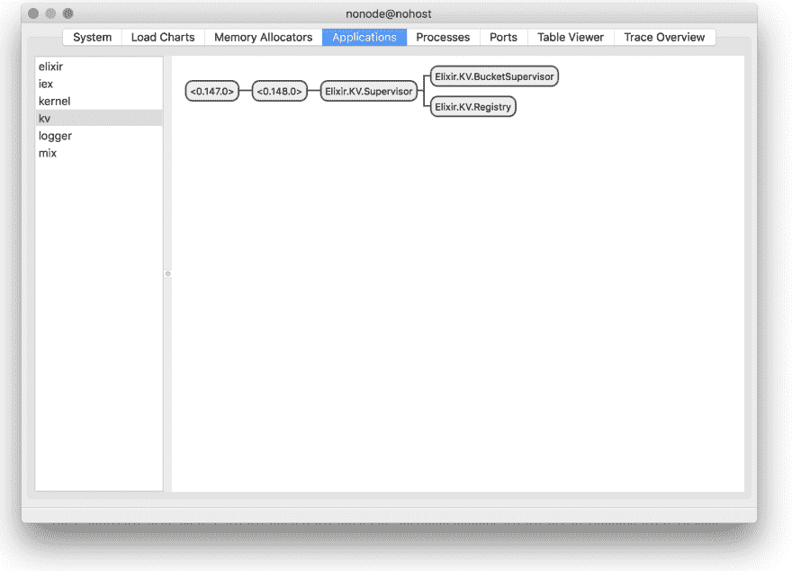
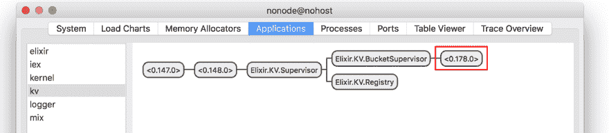
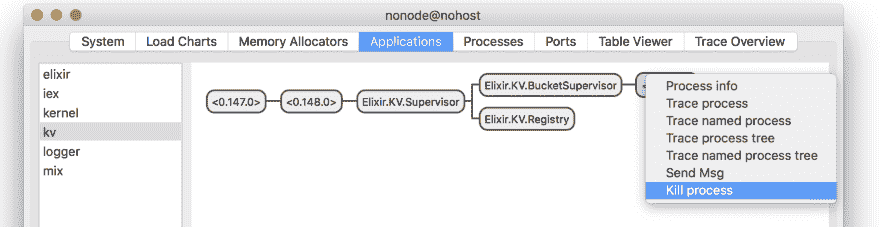

# Mix 和 OTP 05 :动态主管

> 原文：<https://dev.to/gumi/mix-otp-05-l3p>

本文在 Elixir 官网的许可下，根据“[Dynamic supervisors](https://elixir-lang.org/getting-started/mix-otp/dynamic-supervisor.html) ”的解说，加以修改，对 Elixir 中`DynamicSupervisor`的使用方法进行说明。

在“[Mix 和 OTP 03: GenServer](https://qiita.com/fumio_nonaka/private/ab814543e82e777d6a5f) ”“监视器和链接”中，指出模块`handle_cast/2`不适合同时实现进程链接和监视器。

```
{:ok, pid} = KV.Bucket.start_link([])
ref = Process.monitor(pid) 
```

Enter fullscreen mode Exit fullscreen mode

链路是双向的。 这意味着，如果进程崩溃，注册它的进程也会下降。 当然，增加了管理员。 您可以恢复并重新启动注册过程。 但是，如果注册进程崩溃，则与注册的每个进程的名称关联的所有数据都将丢失。

因此，注册过程必须继续运行，即使添加的过程下降。 在`test/kv/registry_test.exs`中加入以下测试吧。

已经有一个停止该过程的测试(“removes buckets on exit”)。 该测试不同的是，为[`Agent.stop/3`](https://hexdocs.pm/elixir/Agent.html#stop/3)的第 2 自变量的理由提供了不正常(默认值`:normal`)的`:shutdown`。 如果进程由于正常原因而未结束，则所有链接的进程都会收到 EXIT 信号。 然后，链接的进程也会终止，除非进行了避免这种情况的处理。

```
test "removes bucket on crash", %{registry: registry} do
  KV.Registry.create(registry, "shopping")
  {:ok, bucket} = KV.Registry.lookup(registry, "shopping")

  # プロセスを正常でない理由で止める
  Agent.stop(bucket, :shutdown)
  assert KV.Registry.lookup(registry, "shopping") == :error
end 
```

Enter fullscreen mode Exit fullscreen mode

这个测试会失败。 因为如错误信息所示，在去叫`KV.Registry.lookup/2`到`GenServer.call/3`的时候，注册的过程会丢失。

```
$  mix test test/kv/registry_test.exs
..  1) test removes bucket on crash (KV.RegistryTest)
     test/kv/registry_test.exs:26 ** (exit) exited in: GenServer.call(#PID<0.153.0>, {:lookup, "shopping"}, 5000)
 ** (EXIT) no process: the process is not alive or there's no process currently associated with the given name, possibly because its application isn't started
     code: assert KV.Registry.lookup(registry, "shopping") == :error
     stacktrace:
       (elixir) lib/gen_server.ex:924: GenServer.call/3
       test/kv/registry_test.exs:32: (test)

Finished in 0.03 seconds
3 tests, 1 failure

Randomized with seed 221887 
```

Enter fullscreen mode Exit fullscreen mode

为了解决此问题，新的管理员将生成和监视流程。 与至今为止使用的管理员不同，不需要预先确定子进程，就可以动态地创建并开始。 这种情况下使用的是[`DynamicSupervisor`](https://hexdocs.pm/elixir/DynamicSupervisor.html)，初始化时不需要子程序的列表。 相反，子进程分别以[`DynamicSupervisor.start_child/2`](https://hexdocs.pm/elixir/DynamicSupervisor.html#start_child/2)开始。

# DynamicSupervisorを使う

在`lib/kv/supervisor.ex`的`KV.Supervisor`模块中使用`DynamicSupervisor`。 请在`init/1`中规定的子进程列表中，按如下方式命名`KV.BucketSupervisor`。

```
def init(:ok) do
  children = [
    {KV.Registry, name: KV.Registry},
    {DynamicSupervisor, name: KV.BucketSupervisor, strategy: :one_for_one}  # 追加
  ]

  Supervisor.init(children, strategy: :one_for_one)
end 
```

Enter fullscreen mode Exit fullscreen mode

与`Supervisor`不同，`DynamicSupervisor`不会用`use/2`调用模块。 通过添加到监视树中直接开始的。 初始化时可以不预先给出子进程。

用`iex -S mix`试试`DynamicSupervisor`吧。 [在`DynamicSupervisor.start_child/2`](https://hexdocs.pm/elixir/DynamicSupervisor.html#start_child/2)的两个自变量中，传递管理者的名称和要开始的子流程的规格。

```
iex> {:ok, bucket} = DynamicSupervisor.start_child(KV.BucketSupervisor, KV.Bucket)
{:ok, #PID<0.144.0>}
iex> KV.Bucket.put(bucket, "eggs", 3)
:ok
iex> KV.Bucket.get(bucket, "eggs")
3 
```

Enter fullscreen mode Exit fullscreen mode

在`lib/kv/registry.ex`的登录模块`KV.Registry`的`handle_cast/2`中加入以下步骤。 这样就可以使用`DynamicSupervisor`了。

```
def handle_cast({:create, name}, {names, refs}) do
  if Map.has_key?(names, name) do
    {:noreply, {names, refs}}
  else
    # {:ok, pid} = KV.Bucket.start_link([])
    {:ok, pid} = DynamicSupervisor.start_child(KV.BucketSupervisor, KV.Bucket)
    ref = Process.monitor(pid)
    refs = Map.put(refs, ref, name)
    names = Map.put(names, name, pid)
    {:noreply, {names, refs}}
  end
end 
```

Enter fullscreen mode Exit fullscreen mode

这样就按测试进行了。 但是，会泄漏到 APP 应用程序的资源中。 被监视的进程结束后，管理员将启动新的替代进程。 这正是管理者的作用。

但是，即使管理员重新启动新进程，注册进程也不会知道。 对管理员来说，会产生一个没有人可以参照的空流程。 为了防止这种情况，决定过程是暂时的。 然后，不管什么原因，终止的进程都不会再开始。 因此，请在`KV.Bucket`的`use Agent`中加入选项`restart: :temporary`，如下所示。

```
defmodule KV.Bucket do
  # use Agent
  use Agent, restart: :temporary

end 
```

Enter fullscreen mode Exit fullscreen mode

通过对`test/kv/bucket_test.exs`进行以下测试来确认过程为`:temporary`。 用`Supervisor.child_spec/2`函数从模块中得到子的规格，用`assert`调查`restart`的值是否为`:temporary`。

```
test "are temporary workers" do
  assert Supervisor.child_spec(KV.Bucket, []).restart == :temporary
end 
```

Enter fullscreen mode Exit fullscreen mode

```
$  mix test test/kv/bucket_test.exs
..  Finished in 0.04 seconds
2 tests, 0 failures

Randomized with seed 83872 
```

Enter fullscreen mode Exit fullscreen mode

现在，如果不重新启动子进程，你可能会怀疑为什么要使用管理员。 管理员的作用不仅仅是重新启动。 此外，还规定启动和关闭可以正确进行，特别是在监视树崩溃时。

# 监视树

将`KV.BucketSupervisor`加到`KV.Supervisor`中，就完成了监视管理员的管理员。 所谓的“监视树”被创造出来了。

每次向管理员添加新的子进程时，评估管理员策略或子进程的顺序是否正确都很重要。 在这次的例子中，战略为`:one_for_one`，`KV.Registry`比`KV.BucketSupervisor`先开始。

首先注意到的问题是过程的顺序。 `KV.Registry`调用`KV.BucketSupervisor`。 于是，`KV.BucketSupervisor`必须比`KV.Registry`先开始。 因为如果不这样做的话，在管理员还没有启动之前，注册的进程可能会尝试访问。

其次，也应该研究监视战略。 `KV.Registry`下降后，与`KV.Bucket`进程的名称相关联的信息也将全部丢失。 因此，`KV.BucketSupervisor`和所有子进程也必须终止。 否则，就会形成没有父母的子进程。

这样想的话，监视战略就必须重新审视。 如果要选择其他的话，可以是`:one_for_all`或者`:rest_for_one`。 使用`:rest_for_one`的管理员将强制终止并重新启动在崩溃的子进程之后启动的子进程。 在这种情况下，`KV.Registry`结束时，`KV.BucketSupervisor`也将结束。 这是试图将管理员放在注册过程之后。 与上述顺序的决定方法相反。

剩下的战略是`:one_for_all`。 如果任何子进程丢失，管理员将退出所有子进程并重新启动。 这是最适合这次 APP 应用的战略吧。 因为没有管理员，注册过程将无法运行，而管理员将在没有注册过程的情况下退出。 改变在`KV.Supervisor`的`init/1`中安装的流程顺序和战略吧。

```
def init(:ok) do
  children = [
    {DynamicSupervisor, name: KV.BucketSupervisor, strategy: :one_for_one},
    {KV.Registry, name: KV.Registry}  # 順序変更
  ]
  # Supervisor.init(children, strategy: :one_for_one)
  Supervisor.init(children, strategy: :one_for_all)
end 
```

Enter fullscreen mode Exit fullscreen mode

# 测试中的状态共享

到目前为止，注册的过程每个测试都开始了一个。 因为不受其他影响。

```
setup do
  registry = start_supervised!(KV.Registry)
  %{registry: registry}
end 
```

Enter fullscreen mode Exit fullscreen mode

但是，注册过程开始使用`KV.BucketSupervisor`。 管理者是全球性的。 然后，即使每个测试都有各自的注册流程，测试也将依赖于共享的管理员。 那样可以吗？

答案取决于情况。 即使依赖于共享的状态，只要使用了不被共享的部分就没有问题。 如果多个注册进程在共享的管理员上启动进程，则这些进程或注册进程也可以相互分离。 在`KV.BucketSupervisor`中使用[`Supervisor.count_children/1`](https://hexdocs.pm/elixir/Supervisor.html#count_children/1)这样的函数时会发生同时执行的问题。 因为当计算所有注册进程的子进程并并行运行测试时，结果可能会有所不同。

到目前为止，它只依赖于主管的非共享部分。 因此，您可以不在乎一系列测试中的并发问题。 出现问题时，可以在每次测试时启动管理员，并将状态作为参数传递给注册过程的`start_link`函数。

# 观察员

既然已经确定了监视树，我们来看看 Erlang 附带的观察器工具吧。 请在`iex -S mix`中打开的`iex`外壳中调用[`:observer.start/0`](http://erlang.org/doc/man/observer.html#start-0)。

```
iex> :observer.start 
```

Enter fullscreen mode Exit fullscreen mode

将打开 GUI，显示有关系统的各种信息。 选项卡之间的切换包括常见统计信息、负载图以及所有正在运行的进程和 APP 应用程序的列表。

“[Applications]”选项卡沿监视树显示当前在系统上运行的所有 APP 应用程序(图 001 )。 可以从左侧的列表中选择 APP 应用程序。

#### t0.t1 .在 001■[Applications]中示出的监视树

[](https://res.cloudinary.com/practicaldev/image/fetch/s--pyEW8yoj--/c_limit%2Cf_auto%2Cfl_progressive%2Cq_auto%2Cw_880/https://qiita-image-store.s3.amazonaws.com/0/262045/5a12bbec-3175-f415-b3d4-5ed29c093460.png)

然后，用`iex`外壳制作新的流程吧。 然后，在观察器的“[Applications]”下，监视树中也应该添加了新的进程(图 002 )。

```
iex> KV.Registry.create(KV.Registry, "shopping")
:ok 
```

Enter fullscreen mode Exit fullscreen mode

#### t0 .加入到 002■[Applications]的监视树的新的过程

[](https://res.cloudinary.com/practicaldev/image/fetch/s--UXFtm8mL--/c_limit%2Cf_auto%2Cfl_progressive%2Cq_auto%2Cw_880/https://qiita-image-store.s3.amazonaws.com/0/262045/2cd732f5-b73f-cb7e-7e0a-fc4a42f06479.png)

双击监视树中的某个进程，可以显示该进程的更多详细信息。 或者，右键单击并选择“[Kill process]”即可发送结束信号(图 003 )。 系统将模拟故障，以验证管理员的反应是否与预期相符。

#### t0 .在 003■[Kill process]中模拟故障

[](https://res.cloudinary.com/practicaldev/image/fetch/s--PqAPUjEZ--/c_limit%2Cf_auto%2Cfl_progressive%2Cq_auto%2Cw_880/https://qiita-image-store.s3.amazonaws.com/0/262045/453ea379-542c-14be-be7c-19266264ccb3.png)

在“监视”树下启动的进程可以在“观察器”中查看和内部检查。 即使流程是`:temporary`，也是使用管理员的理由之一。

#### Mix 和 OTP 也抽签

*   [尝试使用 Mix 和 OTP 01:mix](https://dev.to/gumi/mixotp-01-mix-dg1)
*   MixとOTP 02:经纪人
*   MixとOTP 03:基因服务器
*   [Mix 和 OTP 04 :管理员和 APP 沟通](https://dev.to/gumi/mix-otp-04-bj0)
*   Mix 和 OTP 05 :动态主管
*   [MixとOTP 06: ETS](https://dev.to/gumi/mix-otp-06-ets-ol3)
*   [Mix 和 OTP 07 :依存关系和模糊项目](https://dev.to/gumi/mix-otp-07-1p5k)
*   MixとOTP 08: Taskとgen_tcp
*   [Mix 和 OTP 09: DocTest 和 with 的模式匹配](https://dev.to/gumi/mix-otp-09-doctest-with-533g)
*   [Mix 和 OTP 10 :分散处理的 Task 和设定](https://dev.to/gumi/mix-otp-10-3i31)