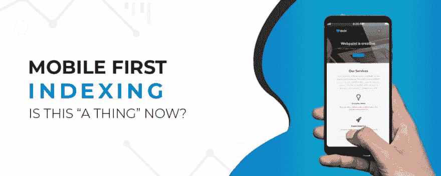

# 移动第一索引:现在这是“一个东西”吗？

> 原文：<https://dev.to/edword12/mobile-first-indexing-is-this-a-thing-now-a2h>

移动优先索引已经成为 SEO 世界谈论的话题很长时间了。因此，当谷歌上周正式宣布推出并开始按照移动优先索引的最佳实践迁移网站时，它收到了来自 SEO 社区的不同反应，而不是所有的掌声和欢呼。这一切都要归功于围绕着移动索引的世界性混乱。

那么，什么是移动索引，作为一个创业者，它对你意味着什么？你需要做什么都不做，从头开始吗？你的手机友好网站能自己处理这个问题吗？这种移动索引对你来说是一种祝福还是另一种灾难？让我们找出答案。

### **什么是移动优先索引？**

嗯，听起来确实如此，谷歌主要使用移动版本的内容进行索引和排名。简而言之，这是谷歌为其移动用户提供更多相关结果的方式。

从现在开始，你的网站的移动版本将成为谷歌将其纳入索引的起点，以及它如何确定排名的基线。

谷歌已经在识别符合公司标准的移动友好设计的网站，并使用移动版本来填充 SERPs。

例如，如果搜索巨头选择你的网站参与移动优先索引的推出，谷歌爬虫将首先开始爬行你的移动网站，然后是桌面版本，而不是相反。

### 哪些网站会受到影响？

很可能是 m 点。因此，如果您的网站有不同的移动和桌面版本的网址，您的网站将基于移动版本的索引。

但是，如果你在手机和桌面上有相同的网址，它仍然会受到影响，因为你的网站可能会为两个版本提供不同的信息，在这种情况下，谷歌将在索引时优先考虑移动信息。

### **我应该如何处理移动优先索引？**

我能建议的最简单的答案是使用响应式设计。因为如果你记得的话，谷歌机器人一直在检查移动性能，包括加载速度，内容布局等。甚至在移动优先索引之前。响应是应该走的路。

而如果你使用的是单独的 **[移动网站](https://www.clapcreative.com/)** ，那么你应该考虑以下选项。

*   保持两者的内容相同，因为如果你在移动设备上提供的内容少了，那么“少”将会被谷歌索引。
*   考虑在两个版本中使用相同的结构化数据标记，并避免添加任何与页面内容无关的数据。
*   确保所有页面的两个版本的标题和元描述是相同的。
*   不要忘记添加社交元数据，如 Twitter 卡片、OpenGraph 标签等。在网站的两个版本上。
*   此外，确保任何指向站点地图的链接(包括 robots 指令)都可以从站点的移动版本中访问。
*   如果您只在 Google 搜索控制台中验证了桌面版本，那么也要添加并验证移动版本。
*   最后，如果您最近实现了移动总机标签，那么它们应该保持不变。不要改变这些。

### 我真的需要做这一切吗？

嗯，不。如果你确定你的网站完全符合谷歌的规则和最佳实践，那么你不需要做任何事情。但是如果你有疑问，雇佣一个有价值的搜索引擎优化团队，他们知道如何完美地执行。

原文来源:[https://www . clap creative . com/mobile-first-indexing-is-this-a-this-this-a-this-now/](https://www.clapcreative.com/mobile-first-indexing-is-this-a-thing-now/)