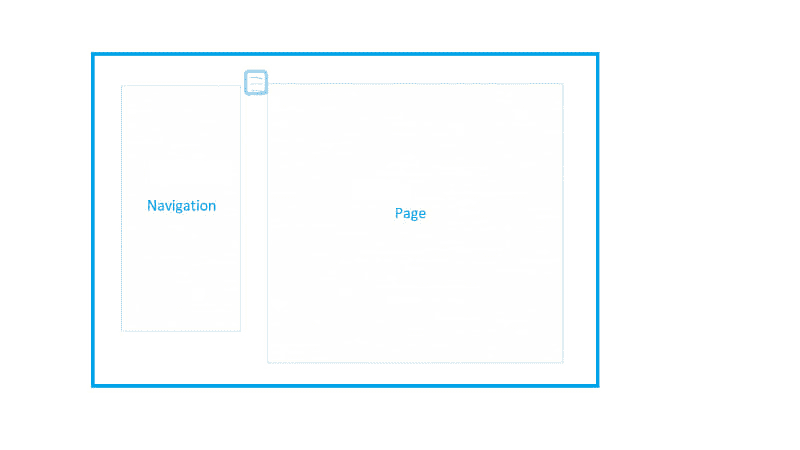
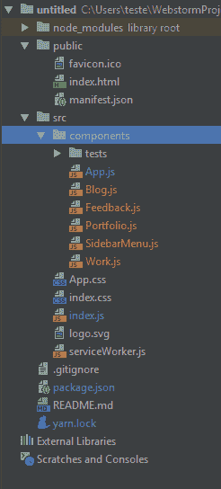
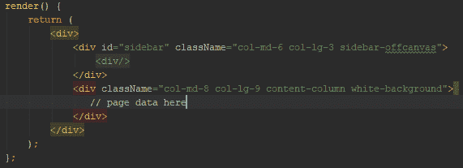
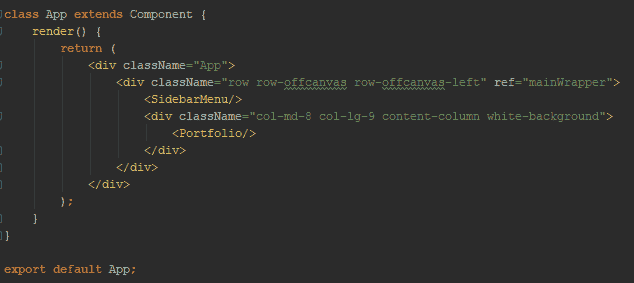
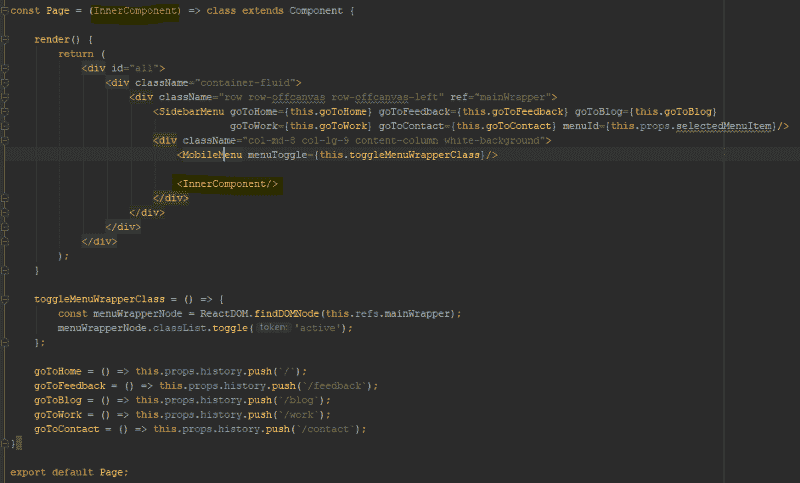
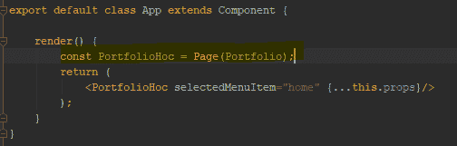
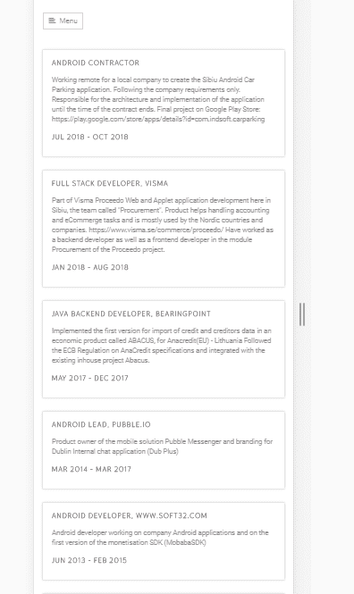

# React 和 HOC 中的移动友好侧导航

> 原文：<https://dev.to/gabriela/mobile-friendly-navigation-in-react-and-hoc-4316>

我刚刚完成了我的第一个 React 应用程序。我试着给自己制定一些练习时间表，通过做一些练习 app 来学习和积累知识。我完成了韦斯博斯的“React for 初学者”和“Learn Redux”课程(我绝对推荐它们，它们太棒了)，这样我就可以对如何使用 React 有所了解。作为必须，我决定强迫自己写单元测试。这些测试让我感觉更舒服，并且我走在正确的道路上。

其中一个练习应用是我的作品集网站([http://www.gabrielaradu.me/](http://www.gabrielaradu.me/))。这个网站是在 Heroku 上免费托管的，有免费的 Dynos，所以一开始它可能会加载得比较慢。

我遇到的最困难的问题之一是在 React 中添加导航菜单并学习高阶组件。

以下是我遵循的步骤:

**1。我选择了一个我喜欢的模板。**

我找到了一个 Bootstrapious.com 的免费模板。我选择了一个 HTML5 和 Bootstrap 模板，它还没有准备好用于 React，然后我将它集成到我的新 React 应用程序中。如何做到这一点，请查看我的另一篇博文[。](https://dev.to/gabrielaradu/integrate-a-bootstrap-html-template-in-your-react-application-1aje)

**2。根据屏幕决定布局。**

我知道我想保持页面的简单和平衡。我想让信息成为我的网络应用程序的“主星”，并且导航要清晰。在中等和更大的屏幕上，菜单总是显示在左侧。在小屏幕上，由于空间限制，这种布局无法保持，因此在移动设备上，导航将从左向右滑动。这种切换状态将由点击“汉堡包”菜单按钮触发。

**3。我尽可能重用代码**

我将代码分解成多个部分，最终可以根据需要重用和捆绑在一起。导航、页面和汉堡包图标都将是不同的独立组件。这是因为我想有可能改变我认为合适的布局。我可能想在未来改变这一点。最大的好处是，这种分离的项目结构使我的测试更容易编写。
[T3】](https://res.cloudinary.com/practicaldev/image/fetch/s--elT2I9Lh--/c_limit%2Cf_auto%2Cfl_progressive%2Cq_auto%2Cw_880/https://thepracticaldev.s3.amazonaws.com/i/eaex9p1sn0no50fimuc7.png)

**4。通向更高阶组件的路径**

期望的用户故事是，每次用户单击菜单中的一个项目，我应该在右边有一个不同的页面，但我不想每次都有多余的代码，所以我应该能够只替换页面组件，其余的保持原样。

第 0 阶段:在项目开始时，每个页面都有导航和详细页面代码。在我的例子中，Home.js、Feedback.js、Blog.js、Work.js 和 Contact.js 有复制粘贴的菜单代码。这不太好。我想尽可能多地重用代码，但结果恰恰相反。

[T9】](https://res.cloudinary.com/practicaldev/image/fetch/s--SyhFOmRF--/c_limit%2Cf_auto%2Cfl_progressive%2Cq_auto%2Cw_880/https://thepracticaldev.s3.amazonaws.com/i/d54kevof30l0r8hu6h4r.png)

**第 1 阶段:**我创建了一个名为 SidebarMenu.js 的新导航组件，然后我想将它注入到现有的代码中。这怎么可能呢？以 App.js(主页)为例:左边是 SidebarMenu.js，右边是投资组合数据。

但这是所有组件的样子。我们需要进一步分离代码，并使用一个包装器，其中的内容将根据从导航中选择的内容而动态变化。这就是高阶组件出现的地方。来自官方文件:

`A higher-order component (HOC) is an advanced technique in React for reusing component logic. HOCs are not part of the React API, per se. They are a pattern that emerges from React’s compositional nature.`

第二阶段:所以我创建了一个无状态组件 Page.js，它将作为其他独立组件使用的构建器。在我们的例子中，为了更加清晰，我们声明我们的导航、移动菜单和将被注入的动态页面为 InnerComponent。

App.js 组件现在将如下所示:

Page 将组件组合作为单一参数，结果是一个全新的组件，其中包含所有的导航和移动菜单以及实际的页面组合。相当整洁！

**5。我的代码在 GitHub** 上是公开的

如果你想了解这个项目的代码细节，看看 GitHub:[https://github.com/gabrielaradu/myportfoliowebsite](https://github.com/gabrielaradu/myportfoliowebsite)

