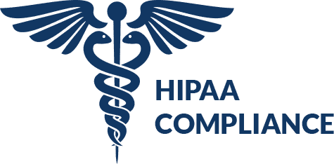
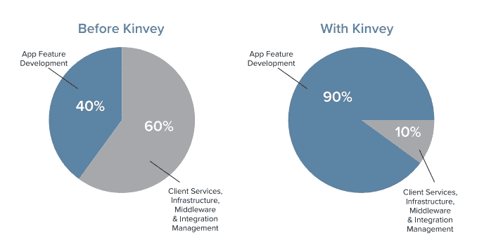
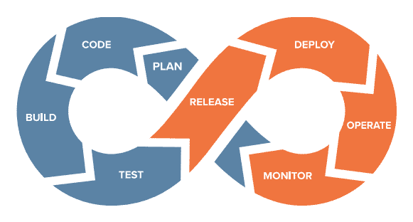

# 移动医疗保健应用和 HIPAA 合规性

> 原文：<https://dev.to/progress/mobile-health-care-apps-and-hipaa-compliance--g09>

说数据完整性和安全性至关重要是对这十年的轻描淡写。对于我们使用的每一个平台和屏幕来说，曾经是事后才想到的桌面计算现在已经变成了数十亿美元的问题。

医疗保健因素，没有一个人不关心自己健康数据的安全和隐私。围绕医疗保健数据的数据泄露的影响是巨大的，这至少是早在 1996 年美国政府颁布健康保险便携性和责任法案的部分原因，该法案通常被称为 [HIPAA](https://www.hhs.gov/hipaa/index.html) 。

## HIPAA 到底是什么？

HIPAA 实际上不是由一个，而是由五个独立的标题组成。在本文的上下文中，我们只关注标题 II:

> HIPAA 标题二:防止医疗保健欺诈和滥用；行政简化；医疗责任改革

在这个标题中有很多强烈的词汇，如“欺诈”、“滥用”和“改革”——考虑到我们尊敬的民选官员喜欢在标题中夸大他们制定的法律的力量，这很容易被忽略！但是，HIPAA 已经制定了非常重要的指导原则，要求为医疗保健行业中的每个人(提供商、保险计划、雇主和消费者)建立电子医疗保健交易标准和国家标识符。

其中的一个关键部分是 HIPAA 隐私规则。隐私规则由受保护健康信息(PHI)的*使用和披露*规定组成:

*   患者姓名
*   地址-比州更具体的任何信息，包括街道地址、城市、县、辖区，在大多数情况下还包括邮政编码及其等效的地理编码。
*   日期——包括出生、出院、入院和死亡日期。
*   电话和传真号码
*   电子邮件地址
*   社会安全号码
*   驾照信息
*   医疗记录号码
*   账号
*   健康计划受益人数
*   认证/许可证号码
*   车辆标识符和序列号，包括车牌号码
*   设备标识符和序列号
*   亲戚的名字
*   互联网协议(IP)地址号码
*   生物识别——包括指纹和声纹。
*   全脸摄影图像和任何类似的图像。

请花点时间重新阅读上面的列表，因为如果您的企业在美国处理*上述数据元素中的任何*为所涵盖的实体服务(或代表该实体)，那么 **HIPAA 合规性就不是可选的**。

你问什么是“被覆盖的实体”？

*   医生办公室，牙科诊所，诊所，心理学家
*   疗养院、药房、医院或家庭保健机构
*   健康计划，保险公司，健康维护组织
*   支付医疗保健费用的政府项目
*   卫生保健票据交换所

显然，HIPAA 的内容远不止以上几段。TL；dr 是，如果你正在开发一个处理医疗保健行业 PHI 数据的应用程序，你绝对需要确保所述数据的数据存储和传输符合 HIPAA。

> 阅读 [HIPAA 合规清单](https://www.progress.com/solutions/health-cloud/resources/progress-hipaa-compliance-checklist)

## 机动性和 HIPAA

这是上世纪 90 年代的事情，当时电子医疗保健数据还处于起步阶段，应用程序是在相对受控的桌面/大型机环境中管理的。移动性从根本上动摇了这一点，因为 PHI 数据可以被任何人和你周围的任何人随身携带。

到 2020 年，移动医疗保健市场(又名 mHealth)有望成为近 600 亿美元的市场。这个市场的责任使得 HIPAA 合规性成为应用程序开发体验的一个重要部分，无论平台、屏幕或医疗保健行业的消费者如何。

随着这个市场的繁荣，我们看到医疗保健行业的每个人对移动应用的使用都在急剧增加。与此同时，成本压力迫使提供商将数据转移到云中...同时 HIPAA 监督(和罚款！)在应用程序开发和部署的选择中日益成为关键因素。

> 阅读更多关于[保护您的移动应用](https://www.progress.com/campaigns/kinvey/securing-the-modern-mobile-app)的信息。

*让我们总结一下我们的现状:*

1.  医疗保健行业的移动和桌面应用正在蓬勃发展。
2.  移动医疗市场正在爆炸式增长，仅在几年内就达到了 600 亿美元。
3.  不可否认的数据安全性和完整性是等式中不可协商的部分。
4.  我们正在将数据从内部迁移到云中，以实现我们需要的性能和成本效益。

那么，这给我们带来了什么？

让我们来看一下本文的核心:HIPAA 合规性至关重要，因此我们需要一些工具和服务来提供我们可以依赖的现成的基于云的 HIPAA 合规性。

输入 [Progress Kinvey](https://www.progress.com/kinvey) 。

## 进步金威

其核心是，Kinvey 是一个现代平台，用于快速构建复杂的企业应用程序和可扩展的消费者应用程序体验。Kinvey 平台的一个关键组件是 [Progress Health Cloud](https://www.progress.com/solutions/health-cloud) 。

Progress Health Cloud 是符合 HIPAA 的解决方案，可在所有医疗保健领域快速构建和提供以患者为中心的互联数字健康体验。

> 了解 Progress Health Cloud 的[商业价值](https://www.progress.com/solutions/health-cloud/resources/the-business-value-of-progress-health-cloud)

这款符合 HIPAA 标准的解决方案运行在 AWS 之上，通过一个安全完整的平台满足医疗保健提供商、支付者和保险公司的所有需求，解决了他们数据安全性和完整性的各个方面。

健康云让应用程序开发人员专注于交付他们的应用程序，而不是构建、管理、保护和修补基础设施，从而降低运营成本和缩短上市时间。

您可以将 Progress Health Cloud 分为四个关键领域:

### 数字体验加速器

借助专为患者参与、资格、自付费用计算和其他流行医疗保健使用案例而构建的应用模板，快速提供成功的数字体验。SDK 提供预构建的应用开发加速器，在所有数字渠道中提供统一的体验。

### 云服务加速器

使用 20 多种支持数字体验的预建服务显著降低成本，这些服务包括:患者的 360°视图、互联医疗设备的数据存储、应用程序通知、针对安全性和合规性的访问控制等。

### 医疗保健集成加速器

轻松、安全、快速地访问 EPIC、Cerner、Allscripts、Salesforce、HL7 和 FHIR 以及许多其他医疗保健、企业和云数据源。

### HIPAA 合规加速器

实现现成的端到端平台安全性和 HIPAA 合规性。数据在客户端、传输中和静态时都是加密的。全面的政策和程序确保我们的平台现在和将来都是安全的。

> 阅读 [Canopy Health 如何利用 Progress Health Cloud](https://www.progress.com/customers/canopy-health)

借助 Progress Health Cloud，医疗保健组织可以在创纪录的时间内推出他们的最低可行产品(MVP)应用程序，同时还能创造出用户满意度高的出色数字体验。

## 下一步

这只是对 Kinvey 能为你和你的应用开发者做些什么的简要概述。如需了解更多信息，请访问我们的网站:progress.com/kinvey 和 T2 安排时间演示金维服务。

如果你想进一步了解 Progress Kinvey 提供的安全特性，请看一下[这个丰富的资源](https://www.progress.com/campaigns/kinvey/securing-the-modern-mobile-app)。