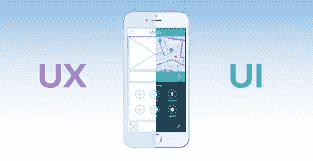

# 移动 UX:它更注重用户参与度，而不是创造力

> 原文：<https://dev.to/credencys/mobile-ux-it-focuses-more-on-user-engagement-than-creativity-1in0>

如今，移动应用程序设计不仅仅是展示创意和充满活力的图形艺术。无论你的视觉效果多么吸引人，但如果应用程序没有满足用户的期望，它就毫无价值。当谈到移动应用程序开发时，我们必须考虑两个不同的设计方面来开发一个吸引用户情绪的应用程序。用户体验(UX)和用户界面(UI)。

[手机应用开发公司](https://www.credencys.com/mobile-application-development-services/)

所有的图形都在用户界面下。UI 帮助用户通过不同的设计元素与应用程序进行交流。它在吸引顾客方面起着重要的作用，但是参与度呢？于是，“用户体验”这个词就应运而生了。在本帖中，您将了解移动应用程序 UX 设计的基础知识，以及在创建一个伟大的 UX 时需要考虑哪些方面。

## 什么是 UX？

当用户与你的移动应用程序交互时，UX 就是要增强用户的整体体验。实践 UX 流程的最终目的是了解客户对你的移动应用的感受。它涉及到用户对你的移动应用的感知、期望、需求和欲望。一个好的 UX 可以确保用户一步到位地理解应用程序的工作原理。它确保用户在使用移动应用程序时不会感到失落或沮丧。

## 用户体验与人息息相关

在开始用户体验设计之前，UX 设计师必须了解目标用户在使用应用程序时的行为和交互。要开发一个成功的移动应用程序，UX 必须包括对用户动机、目标、需求、愿望和欲望的全面理解。

不了解用户的视角，UX 的设计师就无法创造出满足用户期望的应用。UX 的设计是非常动态的，UX 的需求总是随着新技术的出现而不断发展，用户也分享他们对该应用的反馈。

## 用户体验的不同方面

那时，用户体验是基于包含内容、上下文和用户等三个方面的信息架构来定义的。期望是开发一个高可用性的应用程序。但随着时间的推移，UX 的概念已经演变，现在它侧重于七个不同的方面。

这些品质是 UX 的设计师在采用简单方法设计移动应用程序的用户之旅时必须考虑的。让我们对每个方面有一个基本的了解。

### 有用的

确保应用程序解决用户生活中的日常挑战。如果它不能填补用户需求的空白，他们就不会使用它。

### 可用的

使用直观的用户界面设计创建易于使用的移动应用程序，以便用户可以快速有效地轻松执行他们想要的操作。

### 可发现的

保持手机应用程序导航流程应该非常简单，这样用户可以很容易地找到他们需要的东西。

### 可靠的

了解影响用户信任的设计元素，并在移动应用中实现它们，让客户很容易相信你想要传达的内容。

### 易接近的

您定义的参数的所有用户都应该可以访问移动应用程序。

### 令人满意的

创建具有吸引力和迷人的图形元素的用户界面，应该是非常令人愉快的。视觉上吸引人的设计能让你的目标受众产生积极的情感归属。

### 有价值的

除了为最终客户提供卓越的用户体验，移动应用 UX 设计还必须帮助公司提高业务底线和客户满意度。

## 如何创造一个伟大的 UX 设计？

所有成功的移动应用都有一个共同点，那就是为用户提供好处。它们解决了以前没有解决的问题。如果移动应用不能满足用户的期望，他们就不会使用它。

如果你与一家经验丰富的[敏捷软件开发公司](https://www.credencys.com/agile-software-development-company/)合作，你的移动应用程序将会有一个令人惊叹的 UX 设计。他们有一群熟练的 UX 设计师，他们执行广泛的研究过程，包括竞争分析、定义用户角色、开发 MVP(最小可行产品)、POC(概念验证)以及创建原型来测试市场有效性或功能有效性。
UX 的设计师们通过考虑以下几个方面以及吸引人的 UI 设计，创造了一个伟大的 UX。

### 熟悉

使用熟悉的元素，如符号、图标、按钮、行动号召、颜色等。在手机应用程序设计中，你可以很容易地向用户传达一个信息。而且对第一次使用你的 app 的用户会有帮助。新手可以很容易地探索你的应用程序的不同功能。

### 清楚

用户界面应该包含简单清晰的视觉和语言，以避免任何模糊和混乱。移动应用程序的最佳品质是，它不需要手册来让用户了解如何使用应用程序。

### 一致性

在移动应用中保持用户界面的一致性，帮助用户了解使用模式。一旦用户了解了移动应用程序的一些部分是如何工作的，他们就可以利用这些知识来探索其他特性和功能。因此，他们可以快速做出决策并采取必要的行动。

### 响应性

用户界面的设计应该能够快速响应用户的动作。当一个屏幕加载时，让用户了解正在发生的事情，它通过提供关于应用程序的知识来增加用户的兴趣和参与度。

### 获得关注

以这样一种方式设计你的手机屏幕，让用户的注意力被吸引到你希望他们关注的地方。

### “撤销”操作

允许用户撤消他们的任何操作。永远不要从您的用户帐户中永久删除任何数据或信息。你永远不知道他们什么时候想重新审视旧的细节。所以在安全网中，你需要提供一个撤销操作的选项。

### 美学

通过为您的移动应用程序创建有吸引力且功能齐全的用户界面设计，为客户提供愉快的用户体验。

## 外卖食品

UX 通过提高手机应用程序的可用性来确保其有效性。通过了解客户行为和期望来创建移动应用程序。人们可能会被你的移动应用吸引，因为它吸引人的视觉效果或图形展示，但如果应用能帮助他们实现最终目标，他们会停留一段时间。

为你的移动应用 UX 设计定义一个赚钱的策略，当你在幕后驱动用户的时候，用户会感觉到他们在应用程序中做的事情在他们的掌握之中。一个强大的移动 UX 设计理解您的业务需求和最终用户的需求，以增加您的忠实客户群和销售。品牌可以通过创建令人惊叹的移动应用 UX 设计来确保用户、顾客和客户拥有积极的体验和互动。