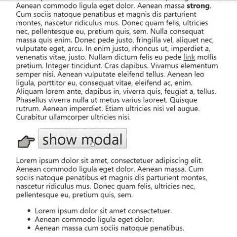
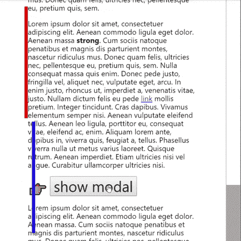

# 模态和滚动条

> 原文：<https://dev.to/kevinkace/modals-and-scrollbars-66l>

今天在构建模型时，我尝试了一种不同的布局，用简单的方式解决了滚动条的一些问题。跳到[最终版本](#modal-over-everything)，或者继续阅读。

## 基本模态

最基本的模态是 2 个`
`元素:

1.  `<body>`中的一个覆盖图`position: fixed;`
2.  和嵌套在覆盖图中的内容

[https://codepen.io/kevinkace/embed/PgLwPM?height=600&default-tab=result&embed-version=2](https://codepen.io/kevinkace/embed/PgLwPM?height=600&default-tab=result&embed-version=2)

## 滚动条

这个简单的模式有一个问题:当模式打开时，主要内容的垂直滚动条持续存在。

打开一个模态应该将上下文从底层内容完全切换到模态。滚动演示和交互需要遵循这种上下文切换。

一个常见的解决方案是在`<html>`或`<body>`上添加`overflow: hidden`，完全移除滚动条。如果模式内容是可滚动的，这也是可行的。

[https://codepen.io/kevinkace/embed/oOVgyO?height=600&default-tab=result&embed-version=2](https://codepen.io/kevinkace/embed/oOVgyO?height=600&default-tab=result&embed-version=2)

## 内容移位

移除滚动条解决了一个问题，但是引入了另一个问题:底层内容移动了位置。

当滚动条被移除时，内容占据了额外的宽度，导致文本和内容重排，以及背景重新定位。

过去我用两种方法解决过这个问题:在`<html>`上添加`padding` / `margin`，或者设置`<html>`的`width`。

[https://codepen.io/kevinkace/embed/GLeQOr?height=600&default-tab=result&embed-version=2](https://codepen.io/kevinkace/embed/GLeQOr?height=600&default-tab=result&embed-version=2)

当调整`window`的大小时，或者添加/删除内容时，必须重新计算和更新这些值。

## 情态盖过一切

所以今天当我在构建一个模型的时候，我到了这个阶段，并且思考了为什么这个模型存在于可滚动的内容中。它应该是完全独立的，并且*在滚动条的顶部*。这可以通过重新组织文档来实现。

模式必须在可滚动内容之外；它被添加到`<body>`中，在 DOM 中不能再高了，所以可滚动的内容需要是`<body>`的子元素。

[https://codepen.io/kevinkace/embed/gyEpQX?height=600&default-tab=result&embed-version=2](https://codepen.io/kevinkace/embed/gyEpQX?height=600&default-tab=result&embed-version=2)

我喜欢的是:

1.  没有删除/添加滚动条的代码
2.  没有设置滚动条宽度/边距的代码
3.  调整大小时不重新计算

它只是工作。

## 最后

这种设置的一个缺点是它是非典型的。任何其他期望`overflow`在`<html>`或`<body>`上的代码都需要重构。这个问题和其他问题可能不难解决。

我计划进一步测试这个解决方案的浏览器和设备兼容性，希望它能被证明。