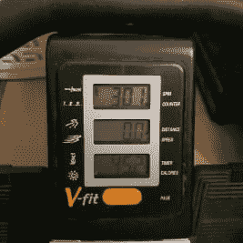
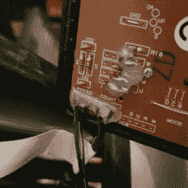
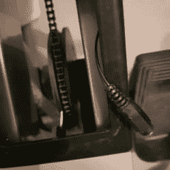
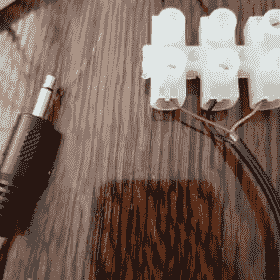
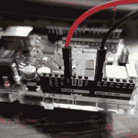

# 用 Arduino 改装我的划船机——第 2 部分——读取速度传感器

> 原文：<https://dev.to/alistairjevans/modding-my-rowing-machine-with-an-arduino-part-2-reading-the-speed-sensor-b58>

如果你没有看到我之前关于设置 Arduino 的帖子，那么为了赶上你，我有一个划船机，我正试图用我自己的代替它的基本 LCD 显示器；为此，我需要读取它收集的传感器数据，并自己进行处理。

<figure> 

<figcaption>这就是我现在的‘比赛’</figcaption>

</figure>

每个人都知道，这篇文章也可以被命名为“我是如何与基础电子学斗争的”或者“当逆向工程时你不应该做假设”。

当我开始这个小项目时，我看着现有的为划船机提供 LCD 显示器的电路板，看到了两个连接器。一个是速度(连接到前面的风扇轮)，一个是计数(连接到座位下的传感器)。

<figure>

<figcaption>PCB 背面的连接器。</figcaption>

</figure>

我做了*假设*因为速度是一个模拟值，那么输入的数据也应该是模拟的。这被证明是不正确的，但是首先我将向您展示告诉我这不是正确的连接/代码。

### 接线

速度传感器的连接器实际上是一个 3.5 毫米单声道母插孔:

<figure> 

<figcaption>右边的插孔是速度传感器，中间的是座椅运动传感器。</figcaption>

</figure>

所以，我买了一根便宜的 3.5 毫米的电缆，把它的一端切掉，然后把它接到一个接点上。

<figure> 

<figcaption>有线单声道插孔。</figcaption>

</figure>

单声道连接器有 3 根电缆而不是 2 根，这让我一时糊涂，但结果是黄线直接连到了红线上，所以我忽略了那根。

### 读取一个模拟值

我认为速度传感器可能是某种可变电阻，因此随着速度的增加，允许通过连接的电压也会增加。

首先，我将 Arduino 上的 5V 线路连接到连接点上的红线，将黑线(GND)连接到 Arduino 上的 A0 模拟输入引脚:

<figure> 

<figcaption>接线到模拟输入引脚。</figcaption>

</figure>

然后，我编写了一些代码来读取模拟值(以伏特为单位)并将其写入串行连接器: