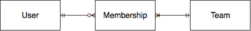
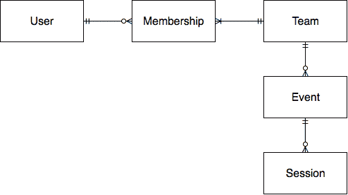
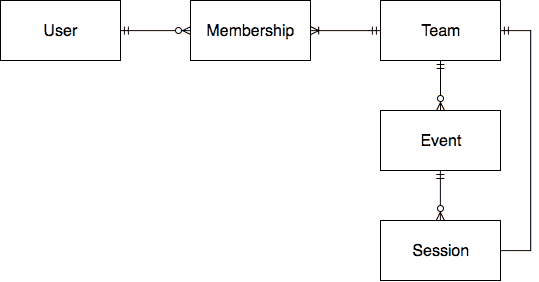
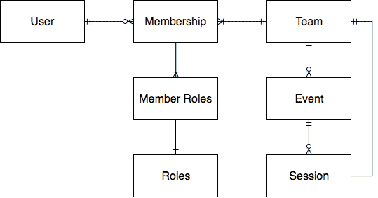

# 使用 Hasura 的建模团队和用户安全性

> 原文：<https://dev.to/lineup-ninja/modelling-teams-and-user-security-with-hasura-204i>

当第一次为[阵容忍者](https://lineup.ninja)设计用户安全时，我渴望用户能够通过一次登录成为多个团队(或组织)的成员。我们的一些客户是代理机构，与多个不同的客户合作，需要能够轻松地在他们之间转换，而不需要记住不同的登录负载。

我们最近从 RTDB[Firebase](https://firebase.google.com/docs/database/)迁移到了 [Hasura](https://hasura.io) ，这篇文章详细描述了我是如何在 Hasura 中模拟安全性来支持这种“多团队”配置的。

这些关系看起来像这样:

[](https://res.cloudinary.com/practicaldev/image/fetch/s--KuE0OuDN--/c_limit%2Cf_auto%2Cfl_progressive%2Cq_auto%2Cw_880/https://thepracticaldev.s3.amazonaws.com/i/ubkbcexmixpuxbbh5w98.png)

也就是说每个用户可以有零个或多个成员记录。每个成员记录属于一个用户和一个团队。每个团队至少有一名成员。

成员记录详细说明了成员在团队中拥有的权限，它具有布尔属性，如

*   `read_team`
*   `write_team`
*   `read_event`
*   `write_event`

诸如此类。

在排队忍者，我们编写了令人敬畏的软件，以帮助活动策划人管理他们的活动。一个活动的核心组成部分是一个“环节”，它可以是一个演示，一个舞台上的乐队，或者一个分组讨论。对于能够写入会话的用户，他们必须拥有该会话的`write_event`权限。

会话属于事件，事件属于团队。我们可以遍历这个关系来验证用户。

下面是 ERD 通过会话:

[](https://res.cloudinary.com/practicaldev/image/fetch/s--xs01n4sg--/c_limit%2Cf_auto%2Cfl_progressive%2Cq_auto%2Cw_880/https://thepracticaldev.s3.amazonaws.com/i/n1ndm57spvubozxwg9b0.png)

当用户请求一个会话对象时，它看起来像这样

```
query  {
  session(where: {id: {_eq:"1234"}}) {
    id
    name
    description
  }
} 
```

此外，请求将与包含用户 ID 的 JWT 一起发送，作为他们的声明之一:

```
{
...
  "https://hasura.io/jwt/claims": {
    "x-hasura-allowed-roles": [
      "user"
    ],
    "x-hasura-default-role": "user",
    "x-hasura-user": "bdb04fa3-4de3-4434-8d7f-75b10fe2669a",

  },
...
} 
```

在 Hasura 中，安全性是按表应用的。首先创建一个角色，在本例中是`user`，然后为该角色应用插入、选择、更新和删除权限。

每种类型操作的权限由“检查”和您希望向该角色公开的字段组成。如果您愿意，可以只向某些用户公开字段的子集，这样就可以很容易地将面向管理员和用户的数据存储在同一个表中。

作为关系树和逻辑测试的“检查”。它可以遍历模式中的关系，并最终根据用户的 ID 执行检查。您可以在 UI 中构建配置，也可以通过迁移文件导入。

对于会话示例，检查如下:

```
{
    "event": {
        "team": {
            "memberships": {
                "_and": [
                    {
                        "event_write": {
                            "_eq": true
                        }
                    },
                    {
                        "user": {
                            "id": {
                                "_eq": "x-hasura-user"
                            }
                        }
                    }
                ]
            }
        }
    }
} 
```

这是执行该检查的完全非规范化的方式。如果您检查的牌桌离团队“更远”,那么您可能需要考虑牌桌与团队的直接关系，如下所示:

[](https://res.cloudinary.com/practicaldev/image/fetch/s--27oREnhj--/c_limit%2Cf_auto%2Cfl_progressive%2Cq_auto%2Cw_880/https://thepracticaldev.s3.amazonaws.com/i/grdejplrjqp1uwl5y923.png)

这可以在执行安全检查时跳过对事件表的遍历，这应该对性能有一点帮助，如果您必须遍历许多关系来执行检查，这种帮助就更大了。

您会注意到，在上面的规则中，我们通过遍历用户关系然后检查 ID 来检查用户的 ID。这是不必要的，因为用户的 ID 是成员资格表本身的一个属性，实际上正是这个 FK 用于创建关系。因此，我们可以通过检查成员资格表上的 user_id 值来节省一些计算。

将这两个更改放在适当的位置，我们可以像这样更新安全规则:

```
{
    "team": {
        "memberships": {
            "_and": [
                {
                    "event_write": {
                        "_eq": true
                    }
                },
                {
                    "user_id": {
                        "_eq": "x-hasura-user"
                    }
                }
            ]
        }
    }
} 
```

差不多就是这样了！

如果你想更进一步，你可以扩展创建一个“基于角色的访问控制”(RBAC)风格的模式。如果您要管理大型团队，这是一个特别有用的结构。

您可以通过添加一个角色表来实现这一点，定义角色的权限，然后添加一个成员角色表，将每个成员记录链接到该团队中的用户角色(假设您希望一个用户拥有多个角色)。看起来会像这样:

[](https://res.cloudinary.com/practicaldev/image/fetch/s--e0zgfukx--/c_limit%2Cf_auto%2Cfl_progressive%2Cq_auto%2Cw_880/https://thepracticaldev.s3.amazonaws.com/i/4ipbv10joxfp6001hhdp.png)

然后从 Membership->Roles 中添加一个关系，使用“Member Roles”连接该表，并更新 Hasura 检查，如下所示:

```
{
    "team": {
        "memberships": {
            "_and": [
                {
                    "roles": {
                        "event_write": {
                            "_eq": true
                        }
                    }
                },
                {
                    "user_id": {
                        "_eq": "x-hasura-user"
                    }
                }
            ]
        }
    }
} 
```

我希望 Hasura 添加的一件事是直接检查用户令牌中的值的能力。例如，我想将团队 id 和权限直接添加到令牌中，就像这样

```
 "x-hasura-team": "1234",
    "x-hasura-event-write": "true", 
```

然后把规则简化成这样

```
{
    "_and": [
        {
            "team_id": {
                "_eq": "x-hasura-team"
            }
        },
        {
            "x-hasura-event-write": {
                "_eq": true
            }
        }
    ]
} 
```

目前这是不可能的，因为你不能表达检查`x-hasura-event-write`是`true`，或者至少不能不为每个表中的每一行添加一个值为`true`的列，这显然是我想要避免的！

我希望看到这一点，因为很明显它的性能更高，因为它只需要检查它所访问的行中的数据，而且它会使从 Firebase 的迁移变得更容易，因为这是我最初实现检查的方式:-)

我希望这个简短的运行是有趣的，让我知道你是否有任何意见！

附注:我将于 4 月 12/13 日出席 GraphQL Asia 。如果你要去，联系一下，让我们打个招呼！