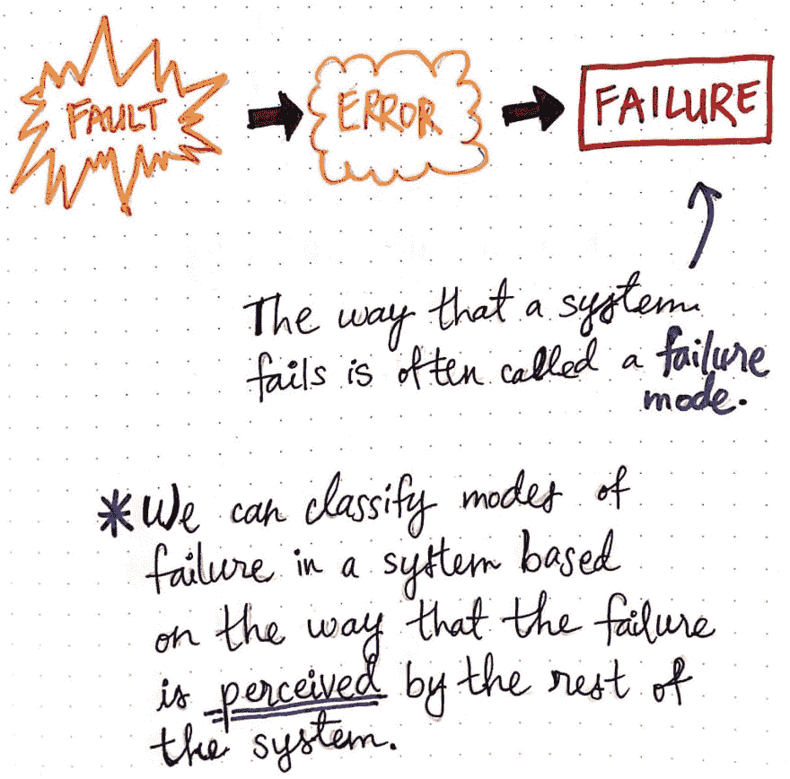
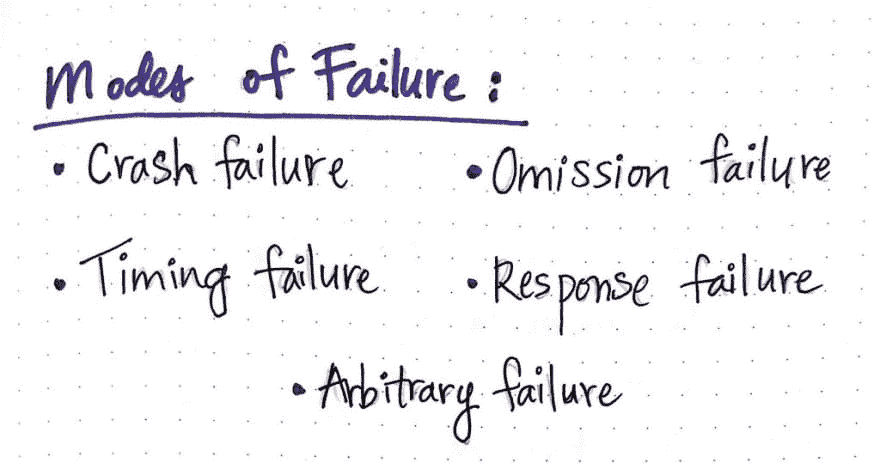
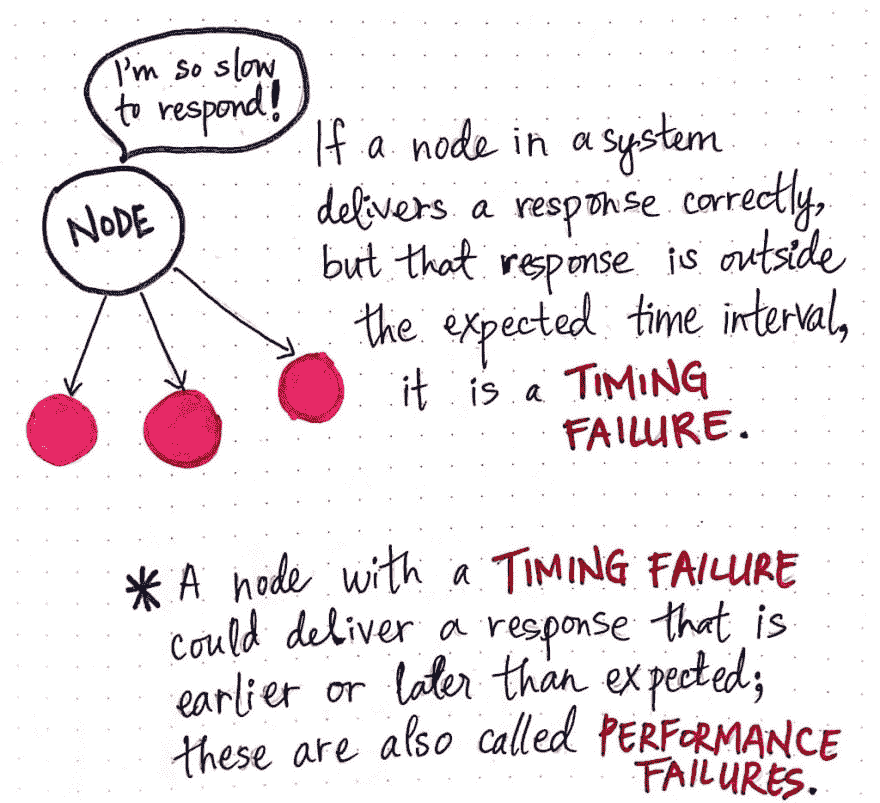
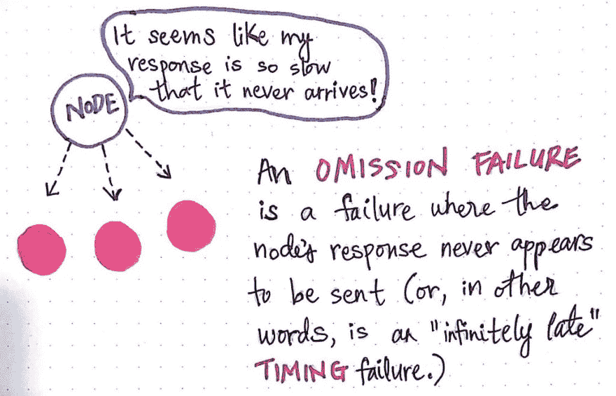
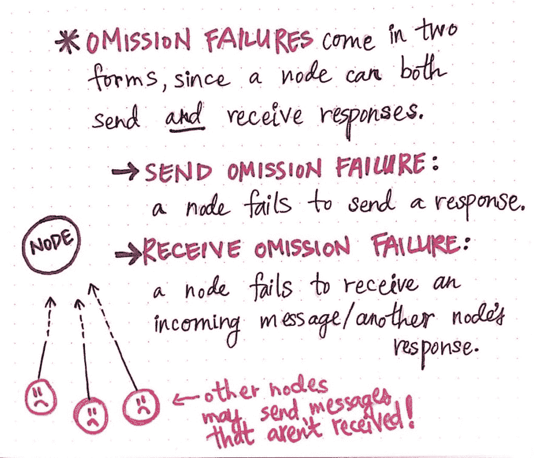
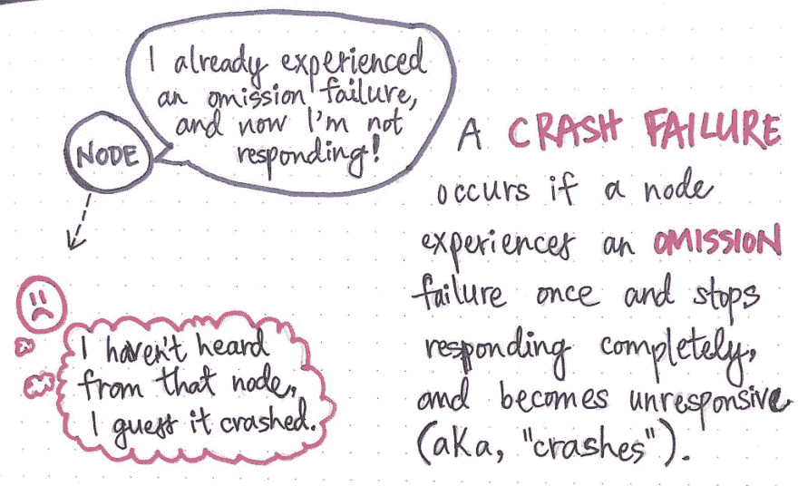

# 故障模式(第一部分)

> 原文：<https://dev.to/vaidehijoshi/modes-of-failure-part-1-4db1>

当我们谈论事情出错时，通常我们想回答的第一个问题是*它们到底是如何出错的。这在软件领域尤其如此，但在生活中也是一条普遍遵循的经验法则。更好地理解一个问题是我们开始寻找解决方案的装备。*

在分布式系统领域，这在另一个层面上也是如此。我们谈论问题的方式是帮助我们更好地理解问题的根本原因的方式。换句话说，当我们发现系统中的故障点时，能够识别这些点也可以帮助我们了解系统的哪个部分出了问题。

故障分类是理解如何构建和设计[容错系统](https://dev.to/vaidehijoshi/ready-and-available-distributed-systems-bck)的重要部分。当然，完全的容错是不可能的，但是我们会努力让*朝着*的方向发展！就像我们最近学习如何[识别错误](https://dev.to/vaidehijoshi/fantastic-faults-and-what-to-call-them-2djb)一样，我们也需要知道如何谈论和指出失败！所以让我们开始学习不同的失败模式。

#### 我们如何谈论失败

在我们最近对[断层](https://dev.to/vaidehijoshi/fantastic-faults-and-what-to-call-them-2djb)的深入研究中，我们了解到断层可以以不同的方式出现，来来去去，或者有时永久存在。我们现在知道，在一个故障变得活跃(而不是潜伏)的系统中会发生多米诺骨牌效应——也就是说，事情开始变得非常非常糟糕！

<figure> 

<figcaption>失败回顾:我们如何对失败模式进行分类。</figcaption>

</figure>

故障可能源于系统的任何部分，可能导致意外行为，从而导致意外结果或错误。如果错误没有以某种方式处理或对系统的其他部分隐藏，那么最初出现错误的节点将返回该错误，这就是我们所说的 ***故障*** 。当我们谈论系统中不同种类的故障时，这些故障可能来自不同种类的故障，我们可以用不同的方式对它们进行分类。

我们在分布式系统中看到的各种故障的不同分类也称为故障模式。 ***故障模式*** 是我们如何识别系统发生故障的确切方式。有趣的是，故障模式的分类有些全面；也就是说，当我们试图确定我们正在处理的是哪种失败时，我们会考虑整个系统。

> 我们可以根据系统的其他部分对故障的看法来对故障进行分类；系统中其他节点查看或感知故障的方式可以帮助我们了解故障的类型。

当我们看到一些特定的故障模式时，这将更有意义。在这篇文章和下一篇文章之间，我们将仔细看看崩溃故障、遗漏故障、定时故障、响应故障和任意故障。

<figure> 

<figcaption>这就是我们将要讨论的主要失效模式。</figcaption>

</figure>

随着我们在这篇文章和下一篇文章之间了解每种故障模式，我们将开始了解每种故障如何对整个系统产生重大影响，以及分布式系统中的不同节点如何以各种方式感知不同的故障。

所以，让我们开始吧，看看我们能有多快…好吧，失败！

#### 等待不合时宜的回应

虽然我们知道拥有一个[就绪且可用的](https://dev.to/vaidehijoshi/ready-and-available-distributed-systems-bck)分布式系统是我们都在努力的事情，但是完整的正常运行时间是非常困难的，尤其是在系统增长的时候。当试图设计一个可用的系统时，我们必须面对的一个关键障碍是处理诸如网络问题、硬件故障之类的事情。

处理和解决意外的速度下降使得我们更难确保系统中不同节点之间的可靠通信。通常情况下，解决潜在沟通延迟的方法之一是设置一个 ***预期时间间隔*** ，或者你期望某事发生的一定时间。例如，我们可以决定系统中的节点必须在 5 到 15，000 毫秒之间响应(相当于 0.005 到 15 秒)，因此我们期望的时间间隔是该间隔的下限和上限之间的时间范围。

<figure> 

<figcaption>分布式系统中的定时/性能故障。</figcaption>

</figure>

如果一个节点正在与系统中的其他节点通信，并在预期的时间间隔内发送响应，那么一切都很好，事情正在以我们考虑的方式运行。但是，如果一个节点发送一条消息，时间太长，超过了我们预期的时间间隔，会发生什么呢？

我们现在遇到了一些意想不到的行为。我们期望系统中的所有节点都能够在特定的时间间隔内发送和接收消息，但是一个节点超过了该时间间隔，我们可能没有考虑到这一点！似乎很糟糕。

这种特定情况被称为**定时故障**，当系统中的节点做出响应的时间量超出预期时间间隔时，就会发生这种情况。

当出现计时故障时，需要注意两点:

1.  节点可能需要太长时间来传递响应(超过预期时间间隔的上限)，但它也可能比预期更早地传递响应(超过预期时间间隔的下限)。
2.  节点实际上正在传递正确的值——这不是失败的意外部分；意想不到的是交付正确值所花费的时间！

计时故障也被称为 ***性能故障*** ，因为它们实际上确实以正确的消息*最终*做出响应，但是它们所花费的时间量表明了该节点的性能问题。系统中的其他节点将感知到性能故障，因为它们必须等待在预期时间间隔内没有响应的节点；他们会认为故障节点对系统中的消息的响应出乎意料地慢或快。

然而，即使是定时故障也可能有它们自己的故障子集。举个例子，一个节点不仅花了很长时间来响应，而且实际上…根本没有响应！然后呢？那么，在这种情况下，一个节点基本上花费了“无限晚”的时间来响应，这也被称为 ***遗漏故障*** 。

<figure> 

<figcaption>分布式系统中的遗漏故障是一种定时故障。</figcaption>

</figure>

当一个节点似乎从来没有时间接收或发送消息给系统的其他节点时，其他节点会认为这是一种定时故障的“特例”。如果节点只是未能回复，它实际上忽略了任何响应，这就是忽略失败得名的原因。节点中的遗漏故障尤其独特，因为根据节点忽略响应的时间长短，可能会发生不好的事情。

但是不要害怕——让我们找出那些不好的事情到底是什么，这样我们就知道如何提防它们了！

#### 省略回复(或者，tfw 东西来了轰然倒下)

遗漏失败本身有两种形式；如果我们仔细想想，这开始变得有意义，因为节点既可以发送消息，也可以从其他地方接收消息。因此，一个节点可能永远无法发送消息(并且在向别处发送响应时“无限延迟”)，或者永远无法接收消息(并且在从别处接收响应时“无限延迟”)。

<figure> 

<figcaption>省略失误的两种主要形式。</figcaption>

</figure>

推而广之，我们可以根据这两个具体的结果进一步对遗漏失败进行分类。当一个节点完全没有发送响应时，我们称之为 ***发送遗漏失败*** 。类似地，如果一个节点未能接收到来自另一个节点的传入消息，并且不承认它收到了另一个节点的响应，我们称之为 ***接收遗漏故障*** 。

我们可以想象，在这两种情况下，系统的其他部分可能会开始担心！嗯，节点不能完全“担心 _ ”,但它们有望识别问题。理想情况下，其他节点会看到另一个节点的遗漏故障，并将其标记为问题。也许——如果我们在设计这个系统时聪明的话——我们有一个计划来解决这些遗漏故障，比如重新发送消息，或者向另一个节点请求故障节点没有提供给我们的任何信息。

但是如果那个节点只是一直…忽略所有人，会发生什么？好吧，那就是我们说事情崩溃的时候！或者更具体地说，发生了崩溃故障。

<figure> 

<figcaption>分布式系统崩溃故障。</figcaption>

</figure>

一个 ***崩溃故障*** 发生在一个节点发生一次遗漏故障，然后继续*不*响应。对于系统的其余部分来说，崩溃的节点看起来像是曾经正确响应，然后省略了一次响应，随后停止了响应！

崩溃故障似乎非常可怕，但有时处理这种故障的解决方案可能非常简单，只需重新启动节点。而且，我们很快就会知道，崩溃故障甚至不是最难以处理的故障；还有一些比更复杂的竞争者更可怕的失败。但是，我将把它留到本系列的第二部分。

在那之前，失败快乐！

#### 资源

容错和故障是分布式系统领域的主要话题，特别是因为在分布式系统中工作和构建分布式系统需要我们考虑故障的潜在原因以及如何处理故障。如果你想继续学习不同的失败模式，那里有很多资源；在我看来，以下是一些最好的开始。

1.  [分布式系统中的容错](https://www.slideshare.net/sumitjain2013/fault-tolerance-in-distributed-systems)，Sumit Jain
2.  [分布式系统中的故障模式](http://alvaro-videla.com/2013/12/failure-modes-in-distributed-systems.html)，阿尔瓦罗·维德拉
3.  [分布式系统:容错](https://www.cs.helsinki.fi/webfm_send/1262)，Jussi Kangasharju 教授
4.  了解容错分布式系统
5.  [故障模式和模型](https://ti.tuwien.ac.at/cps/teaching/courses/dependable_systems-ss08/dcs_slides/dcs-2007-p5.pdf)，Stefan Poledna
6.  [容错系统](http://www-itec.uni-klu.ac.at/~laszlo/courses/DistSys_BP/FaultTolerance.pdf)，拉斯洛·伯什罗姆尼

* * *