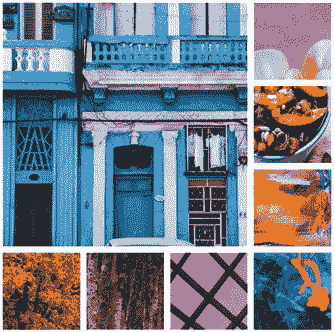
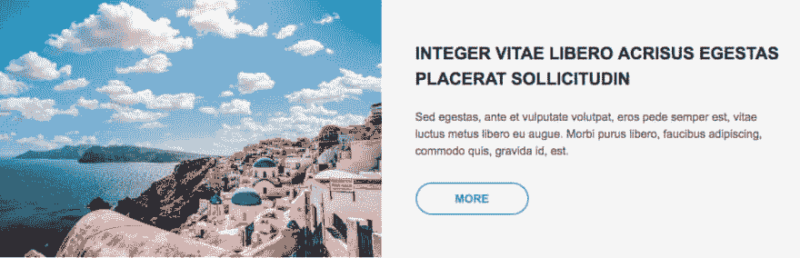
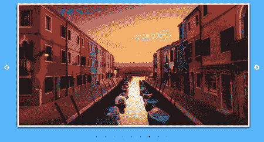

# 动画 CSS 网格，跟随滑块，光滑的旋转木马和更多|模块星期一 22

> 原文：<https://dev.to/tyrw/module-monday-22-animate-css-grid-follow-slider-slick-carousel--more-59p7>

## 为您的下一个项目提供开源 mods

以下所有内容都是开源的，可以在任何网站、web 应用程序或其他任何地方免费使用。Anymod 还有数百个这样的。

单击一个 mod 来查看它及其源代码。

### 动画 CSS 网格

灵活、互动的图像网格。

[视图对](https://anymod.com/mod/badkkr?v=20)视图

 [
T4】](https://anymod.com/mod/badkkr?v=20)

### 跟随我滑块

把你的跟随者卷成一个按钮。

[视图对](https://anymod.com/mod/orlnnb)视图

 [
T4】](https://anymod.com/mod/orlnnb)

### 响应式卡段

通过行动号召拆分图像和文本。

[视图对](https://anymod.com/mod/mlbokb?v=20)视图

 [
T4】](https://anymod.com/mod/mlbokb?v=20)

### 光滑的旋转木马 B

支持触摸和滑动的经典幻灯片。

[视图对](https://anymod.com/mod/badkbl?v=20)视图

 [
T4】](https://anymod.com/mod/badkbl?v=20)

### 简单社交页脚

添加社交链接和基本信息，适用于任何地方。

[视图对](https://anymod.com/mod/kdkbol)视图

 [
T4】](https://anymod.com/mod/kdkbol)

* * *

我每周一都会在这里贴上新的 MODS-我希望你会觉得它们有用！

快乐编码✌️