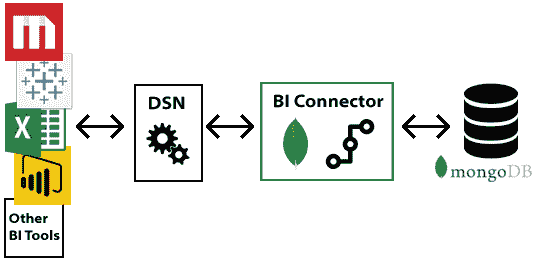
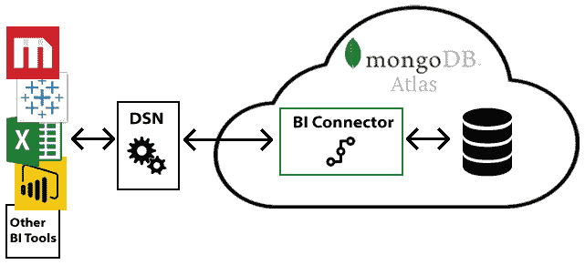
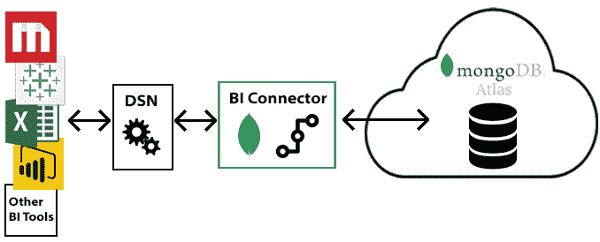
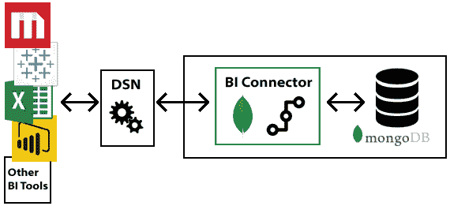

# MongoDB 电子商务智能

> 原文：<https://dev.to/delbussoweb/mongodb-e-business-inteligence-4f1o>

各位，今天我要写一篇我很少或根本看不到的文章，是关于使用 mongodb 与 BI 工具。

在第一部分中，我将概述这种通信的必要性和工作方式，因为我们更经常看到有关关系数据库和 BI 的文章、视频和更多信息。想法是写关于体系结构和可用组件以及它们的角色。我们走吧？

### 关键点！

第一个关键组件是用于 BI 的 mongodb 连接器或用于亲密用户的 BI 连接器！没有它，我们无法直接将任何 BI 工具连接到 mongodb。我有两个消息要告诉你们：

1.  mongodb connector for bi 只能与 mongob 的企业版一起使用
2.  但我...-我...。可在此下载，并可不受限制地用于开发和测试！

### O que é？

基本上，mongodb connector for BI 使我们能够使用 SQL 创建查询，并使用现有 bi 工具(如 power、[table](https://docs.mongodb.com/bi-connector/master/connect/tableau/)或 [Qlik](https://docs.mongodb.com/bi-connector/master/connect/qlik/) 从 monodb 数据查看图表和报告。

BI Connector 充当一个层，用于在 mongodb 实例和 BI 工具之间转换需求和数据。它不存储任何类型的数据，在这种情况下，它只是 mongodb 群集和 BI 工具之间的桥梁。基本上是这样的: 

要进一步描述上图中的组件，请执行以下操作:

*   mongodb:数据存储在哪里
*   Bi Connector:提供关系架构，并翻译 Bi 工具和 mongodb 之间的 SQL 请求
*   ODBC 数据源名称(DNS):负责身份验证和配置数据
*   BI 工具:数据可视化和分析

我们还可以看到，例如，BI 工具和 DSN 将始终在您的桌面上本地运行，但 MongoDB 数据库和 BI Connector 实例可能位于本地、按下或云上。我们将看到以下几种可能的情况-我...。

### 云和 BI 连接器

如果不想担心安装 BI Connector 甚至 MongoDB 的实例，可以将数据托管在“[mong odb atlas”](http://mbsy.co/j3wvQ)上。在此方案中，BI Connector 和您的银行都将驻留在云上:

### 云数据库和 BI 连接器的前提

另一种情况是云上的数据库和 bi connector on prends。在这种情况下，可以通过参数 [--mongo-uri](https://docs.mongodb.com/bi-connector/master/reference/mongosqld/#cmdoption-mongosqld-mongo-uri) 输入主机:

### 以此为前提

在某些情况下，由于 n 个原因，我们无法依赖云；事实上，这些原因正在消失；但是，有些公司仍希望在完全按要求的环境中保留其数据，因此我们可以采用以下体系结构:

### 全局部！！！

最后，为了进行测试，您还可以在桌面上进行 100%的本地安装。就像 mongob bi connector 可用于多种平台一样，您可以在本地安装所有内容！

### 下一步行动

这实际上是我们如何解决 MongoDB 和 BI 解决方案的体系结构问题的概述。在接下来的帖子中，我将介绍其他一些鲜为人知的概念，但在这样的项目中需要大量关注！我们将讨论:

*   install(安装)
*   启动 BI Connector 实例
*   配置
*   身份验证方面
*   mongodb 的关系模式映射
*   DRDL 文档关系定义语言

我相信，这些对于使用 BI 工具和 mongodb 的数据可视化和分析项目的成功非常重要。

希望你们喜欢，下次再见！