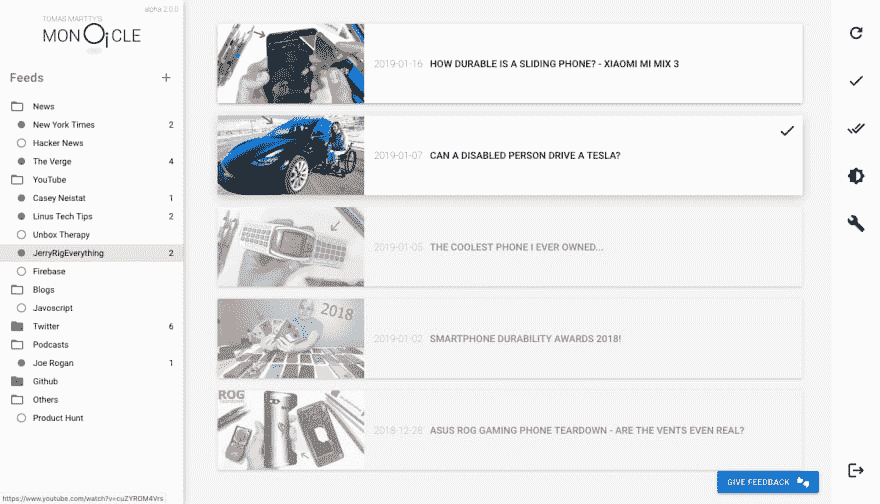
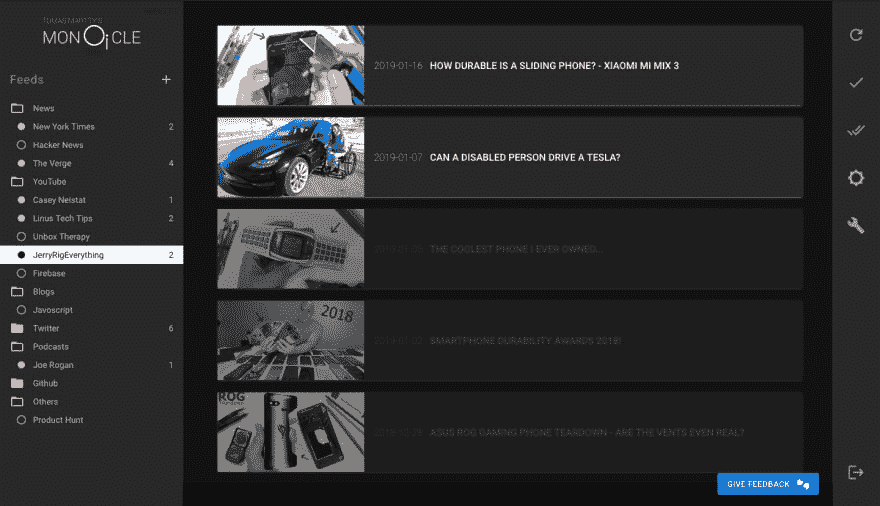

# 单片阅读器-简易的选择。

> 原文：<https://dev.to/tmartty/monocle-reader---the-feedly-alternative-4p6g>

是的，现在说这是一个很好的选择有点过了，但这是我的方向。我正在开发下一代现代阅读器应用程序。这个想法是将经典的 RSS 阅读器与 Pocket 合并，简化互联网浏览，使之成为一个单一的网站，以保持每天都有新的内容。

它还处于早期阶段，但已经具备了日常驱动程序的基本功能:feeds & folders。哦，还有一个闪亮迷人的“OPML 导入文件”可以放入你的提要。

[www.monoclereader.com](http://www.monoclereader.com)

真的，试一试，看看我将要实现的未来特性，然后告诉我你对它的想法！

当然，还有黑暗模式...
[T3】](https://res.cloudinary.com/practicaldev/image/fetch/s--KcXWHWw---/c_limit%2Cf_auto%2Cfl_progressive%2Cq_auto%2Cw_880/https://thepracticaldev.s3.amazonaws.com/i/kmmetrd6zdb3d9fzgsp5.png)

干杯！