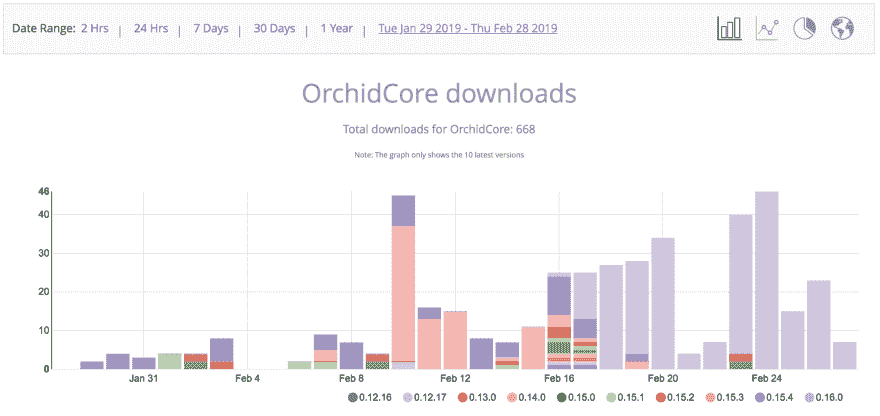
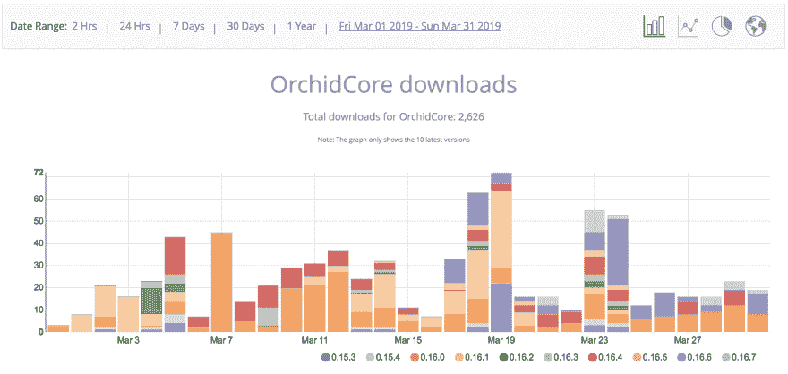
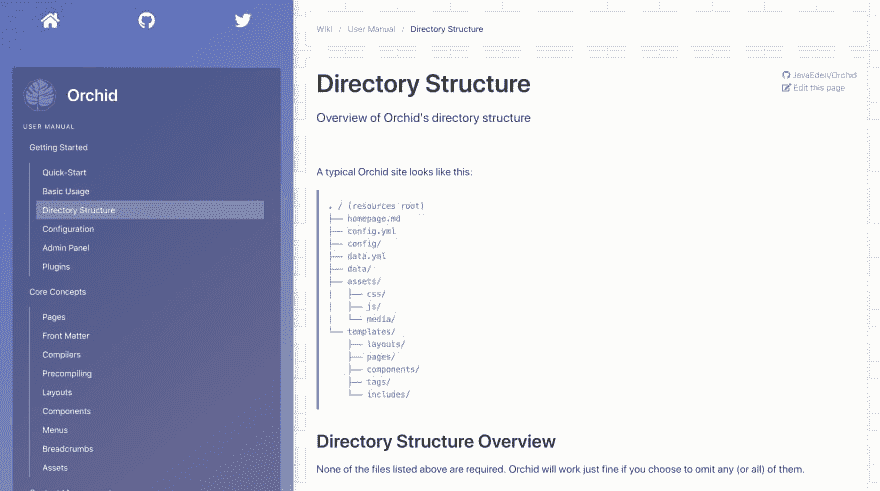

# 兰花通讯:疯狂三月

> 原文：<https://dev.to/cjbrooks12/monthly-orchid-update-march-madness-1622>

我喜欢看篮球，这使得三月成为一年中最好的月份之一，因为 NCAA 全国锦标赛“疯狂三月”就要举行了。我的首选，密歇根州立大学，已经击败了杜克大学，并正在成为全国冠军！

对于兰花来说，这也是相当“疯狂”的一个月，有许多重大的变化在进行中。从能够将你的站点发布到 Gitlab 和 Bitbucket，到与 Github Wikis 的集成，以及文档站点的重新主题化都在进行中，可以肯定地说我一直都很忙！

这是一份关于兰花的月度时事通讯，兰花是 JVM 最新最好的静态站点生成器。越来越需要让社区了解有关兰花的最新消息，在这里我将分享兰花在上个月的进展！跟随本系列，了解兰花的最新特性，跟踪 Github 上的采用情况，并了解谁在使用兰花！

##  [兰花](https://github.com/orchidhq) / [兰花](https://github.com/orchidhq/Orchid)

### 构建和部署与您一起成长的漂亮的文档站点

<article class="markdown-body entry-content container-lg" itemprop="text">

 
**构建和部署与您一起成长的精美文档网站**

* * *

[快速入门](https://orchid.run/wiki/user-manual/getting-started/quickstart)[文档](https://orchid.run/wiki/user-manual/getting-started)[教程](https://orchid.run/wiki/learn)[展示](https://orchid.run/showcase)[支持](https://gitter.im/JavaEden/Orchid)

## 快速启动

*   
*   
*   
*   

## 证明文件

兰花的用户手册将带您了解兰花的主要功能，并让您更深入地了解每个主题和功能。

[文档](https://orchid.run/wiki/user-manual/getting-started)

## 教程

有几个教程旨在引导您从头开始构建一个兰花站点。所有教程的源代码也可以在[或教程库](https://github.com/orchidhq/OrchidTutorials)中找到。

[教程](https://orchid.run/wiki/learn)

## 显示优点的东西

查看陈列柜，看看兰花的行动。

[展示区](https://orchid.run/showcase)

## 支持

### 贡献者

这个项目的存在要感谢所有做出贡献的人。要参与，请见[投稿. md](https://github.com/orchidhq/orchid/blob/dev/.github/CONTRIBUTING.md)

 

### 巴克斯

感谢我们所有的支持者！<g-emoji class="g-emoji" alias="pray" fallback-src="https://github.githubassets.cimg/icons/emoji/unicode/1f64f.png">🙏</g-emoji>

 

### 赞助商

通过成为赞助商来支持这个项目。您的徽标将显示在此处，并带有指向您网站的链接。

          

### 许可证

Orchid 是在 GNU 宽松通用公共许可证(LGPL-3.0)下许可的开源软件。请看 [License.md](https://github.com/orchidhq/orchid/blob/dev/License.md)

### 接触

…

</article>

[View on GitHub](https://github.com/orchidhq/Orchid)

# Github 上的

截至发稿时，兰花在 Github 上的排名是 175 位。尤其是这个月，我对 Github 的增长感到非常惊讶。随着 3 个贡献者的 4 次拉请求，Github、Twitter 和 Gitter 上出现了大量的问题，本月 Bintray 上的下载量是上个月的四倍多，Orchid 看到了我从未想象过的前所未有的增长。

非常感谢大家，没有你们的大力支持，我肯定不会一直这么努力工作！但这些成功完全是因为你，我喜欢给予应有的信任，所以让我们更深入地探讨一下。

## 贡献

*   @alejandrohdezma 帮助修复了一个错误的字体图标( [#239](https://github.com/JavaEden/Orchid/pull/239) )
*   [@ Sumo99](https://github.com/Sumo99) 摆脱了龙目岛的最后，为纯科特林的未来铺平了道路！他们还帮助删除了 Google Plus 的社交链接，现在这项服务已经正式成为 dea 的一部分。( [#243](https://github.com/JavaEden/Orchid/pull/243) 和 [#249](https://github.com/JavaEden/Orchid/pull/249) )
*   [@ dkowis](https://github.com/dkowis) 修复了一个断开的文档链接( [#252](https://github.com/JavaEden/Orchid/pull/252) )

## 下载量增加 4 倍

截至 2 月 28 日的 31 天期间，下载量略低于 700 次。

统计数据显示，下载量在月底左右真正开始上升，那时我发表了关于如何使用 Orchid 来记录 Kotlin 项目的教程。如果你还没有看过，我强烈建议你去看看。

 [## 如何记录 Kotlin 项目

### 凯西布鲁克斯 2 月 18 日 1914 分钟阅读

#kotlin #documentation #orchid](/cjbrooks12/how-to-document-a-kotlin-project-edc)

与此同时，截至 3 月 31 日的 31 天内，下载量超过了 2600 次！你们提出的关于如何使用它的问题越来越多，我很高兴能够帮助你们解决兰花的问题！

所有这些统计数据都可以在 Bintray 上免费获得，[请点击这里](https://bintray.com/beta/#/javaeden/Orchid/OrchidCore?tab=statistics)亲自查看。

# 有什么新鲜事？

兰花目前的版本是 0.16.7 。自上个月以来没有重大变化，大部分只是一系列关于 Copper 主题的错误修复和较小的可用性改进。

# 即将到来

## 新单据

兰花的文件要重启了！当我开始研究兰花时，Bootstrap 是我所知道的唯一的 CSS 框架。我不知道有这么多好的选择，最终我真的喜欢上了布尔玛的简单和灵活。

因此，我一直在构建基于布尔玛的“铜”主题，作为所有兰花自己的文档及其补充库的主页。这里有一个预览:

随着新主题的出现，docs 网站上的*内容*也将进行重大调整，因为我将继续迭代这些文档，并找出向您呈现信息的最佳方式。

## 更多集成

从一开始，Orchid 就被设计成具有无限的灵活性，能够与各种不同的系统和内容结构一起工作，但是直到现在，它仍然与 Netlify 和 GitHub 紧密地联系在一起。我自己经常在工作中使用 Microsft Azure 和 BitBucket，并希望在这些地方使用兰花，我可以想象你们也一样。

因此，目前正在进行的工作是使集成兰花到这些不同的 Git 平台更容易，所以你不需要改变您当前的过程，以充分利用兰花的力量！很快，你就可以将 Github、Bitbucket、Gitlab 和 Azure DevOps 上的原生 Wikis 作为一个无头 CMS 使用，你也可以直接部署到它们的静态托管平台并创建发布！

# 卷入其中

你不必成为 Java、Kotlin、兰花或任何其他方面的专家来帮助完成兰花项目。你现在可以通过多种方式做出贡献:

*   修复错别字并提高文档文章的清晰度
*   将 Java 类转换成 Kotlin

然而，我目前正在寻找几个特定领域的更熟练的帮助:

*   我正在寻找目前使用我正在集成的 git 平台特性的人，以帮助他们构建集成:
    *   GitLab
        *   [维基适配器](https://github.com/JavaEden/Orchid/blob/features/integrations/integrations/OrchidGitlab/src/main/kotlin/com/eden/orchid/gitlab/wiki/GitlabWikiAdapter.kt)
        *   [GitLab 页面发布者](https://github.com/JavaEden/Orchid/blob/features/integrations/integrations/OrchidGitlab/src/main/kotlin/com/eden/orchid/gitlab/publication/GitlabPagesPublisher.kt)
    *   Bitbucket
        *   [维基适配器](https://github.com/JavaEden/Orchid/blob/features/integrations/integrations/OrchidBitbucket/src/main/kotlin/com/eden/orchid/bitbucket/wiki/BitbucketWikiAdapter.kt)
        *   [Bitbucket 云发布者](https://github.com/JavaEden/Orchid/blob/features/integrations/integrations/OrchidBitbucket/src/main/kotlin/com/eden/orchid/bitbucket/publication/BitbucketCloudPublisher.kt)
    *   Azure DevOps
        *   [维基适配器](https://github.com/JavaEden/Orchid/blob/features/integrations/integrations/OrchidAzure/src/main/kotlin/com/eden/orchid/azure/wiki/AzureWikiAdapter.kt)

我也喜欢设计师的帮助，使一个真正伟大的主页和兰花的新标志。

请[联系我](https://www.caseyjbrooks.com/contact/)如果你有兴趣为这个项目做出贡献，我(和整个社区！)真的会很感激！

* * *

你对兰花入门感兴趣吗？没有更好的方法来管理您项目的所有文档，我很乐意帮助您进行设置！

如果你有一个需要文档的开源项目，正在建立一个新的作品集，或者正在建立任何其他类型的静态站点，我想和你一起帮助你建立一个兰花！对这篇文章发表评论，在 Dev.to 上给我发一个 PM，或者在这里联系我，我会一直陪着你。

和往常一样，如果你开始使用兰花，请让我知道，以便我可以在下个月的更新中介绍你！