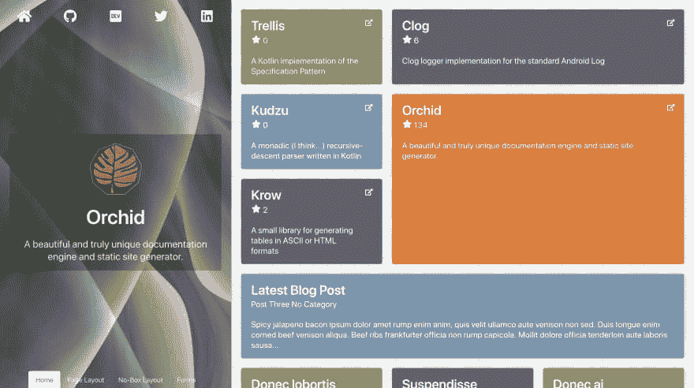

# 兰花通讯:一份爱

> 原文：<https://dev.to/cjbrooks12/monthly-orchid-update-one-love-33he>

啊，二月，一个庆祝各种意义上的爱情的月份:庆祝与你重要的另一半相爱的情人节，庆祝与我们不同的人相爱的黑人历史月，对于兰花来说，嬉皮之爱有了对时髦编程语言的新支持。

这是一份关于兰花的月度时事通讯，兰花是 JVM 最新最好的静态站点生成器。越来越需要让社区了解有关兰花的最新消息，在这里我将分享兰花在上个月的进展！跟随本系列，了解兰花的最新特性，跟踪 Github 上的采用情况，并了解谁在使用兰花！

##  [兰花](https://github.com/orchidhq) / [兰花](https://github.com/orchidhq/Orchid)

### 构建和部署与您一起成长的漂亮的文档站点

<article class="markdown-body entry-content container-lg" itemprop="text">

 
**构建和部署与您一起成长的精美文档网站**

* * *

[快速入门](https://orchid.run/wiki/user-manual/getting-started/quickstart)[文档](https://orchid.run/wiki/user-manual/getting-started)[教程](https://orchid.run/wiki/learn)[展示](https://orchid.run/showcase)[支持](https://gitter.im/JavaEden/Orchid)

## 快速启动

*   
*   
*   
*   

## 证明文件

兰花的用户手册将带您了解兰花的主要功能，并让您更深入地了解每个主题和功能。

[文档](https://orchid.run/wiki/user-manual/getting-started)

## 教程

有几个教程旨在引导您从头开始构建一个兰花站点。所有教程的源代码也可以在[或教程库](https://github.com/orchidhq/OrchidTutorials)中找到。

[教程](https://orchid.run/wiki/learn)

## 显示优点的东西

查看陈列柜，看看兰花的行动。

[展示区](https://orchid.run/showcase)

## 支持

### 贡献者

这个项目的存在要感谢所有做出贡献的人。要参与，请见[投稿. md](https://github.com/orchidhq/orchid/blob/dev/.github/CONTRIBUTING.md)

 

### 巴克斯

感谢我们所有的支持者！<g-emoji class="g-emoji" alias="pray" fallback-src="https://github.githubassets.cimg/icons/emoji/unicode/1f64f.png">🙏</g-emoji>

 

### 赞助商

通过成为赞助商来支持这个项目。您的徽标将显示在此处，并带有指向您网站的链接。

          

### 许可证

Orchid 是在 GNU 宽松通用公共许可证(LGPL-3.0)下许可的开源软件。请看 [License.md](https://github.com/orchidhq/orchid/blob/dev/License.md)

### 接触

…

</article>

[View on GitHub](https://github.com/orchidhq/Orchid)

# Github 上的

截至发稿时，兰花在 Github 上的排名是 157 位。这是一个非常棒的月份，兰花的新功能和一篇博客文章引起了相当多的关注。感谢所有的支持！

# [媒体中的](#in-the-media)

在发布 0.16.0 之后，我在 Dev.to 上发表了一篇文章，详细介绍了如何使用兰花从头到尾记录 Kotlin 项目。它得到了相当多的关注，如果你想开始在你的项目中使用兰花，它绝对是最好的起点。如果你还没有看过，一定要去看看！

 [## 如何记录 Kotlin 项目

### 凯西布鲁克斯 2 月 18 日 1914 分钟阅读

#kotlin #documentation #orchid](/cjbrooks12/how-to-document-a-kotlin-project-edc)

# 有什么新鲜事？

兰花现在是版本 [0.16.1](https://github.com/JavaEden/Orchid/releases/tag/0.16.1) ，这是 0.16.0 之后的一个错误修复版本，它带来了大量很酷的新功能，我在上个月的文章中调侃过。所有这些特性都已经发布，随时可供您使用！

### 新主题:**铜**

我为自己的网站建立的主题，现在你可以用在你的网站上了！基于布尔玛，这个主题非常适合展示你的投资组合中的最佳项目，但同样适合文档。

关于使用这个新主题的兰花站点的例子，请查看[caseyjbrooks.com](https://www.caseyjbrooks.com/)或 [Trellis 文档](https://copper-leaf.github.io/trellis/)和 [JSON 文档格式器文档](https://copper-leaf.github.io/dokka-json/)。

### 新捆绑:**兰花单据**

在用 Orchid documentation 建立了我的许多其他库项目之后，我注意到自己一遍又一遍地给每个项目添加相同的插件。为了让其他人更容易开始使用作为文档工具的兰花，我创建了一个新的包，`OrchidDocs`，它包含以下插件:

*   `OrchidCore`:核心兰花框架
*   默认主题(在以后的版本中可能会有变化)
*   `OrchidPages`:静态页面，用于保存变更日志、联系表单、项目许可证等。
*   站点的完整维基文档
*   `OrchidForms`:轻松添加联系人或 bug 报告表单
*   `OrchidChangelog`:管理项目版本，部署时自动更新 Github 版本
*   `OrchidSearch`:对您的文档启用全文搜索
*   用图表和流程图描述你的项目
*   您可以选择服务器端或基于 Javascript 的高亮显示

### 新插件: **Groovydoc**

根据要求，Groovy 将成为官方支持的兰花代码文档语言。Groovy 插件允许您轻松地记录您的 Groovy 和 Java 源代码，并将其嵌入到您喜欢的任何兰花主题中。

# 即将到来

Orchid 目前正处于发布主要版本的后期，这通常意味着专注于错误修复、测试和文档。在接下来的几周/几个月里，你可以期待越来越多的稳定性和主题改进。

此外，添加 Groovydoc 插件帮助我更好地理解了 Orchid *应该如何处理代码文档，并且正在为所有语言进行改进。这项工作正在进行中，它将使添加 Orchid 可以使用的额外编程语言变得更加容易，也使您记录项目变得更加容易和灵活。您可以在 Github 的下一期文章中关注这项工作。*

# [ 模块化统一代码文档插件 #232](https://github.com/orchidhq/Orchid/issues/232) 

 **[cjbrooks12](https://github.com/cjbrooks12)** posted on [<time datetime="2019-02-22T16:59:49Z">Feb 22, 2019</time>](https://github.com/orchidhq/Orchid/issues/232)

这是对 Orchid 处理代码文档的方式进行重大改造的开始。这些变化主要是结构性的，我希望最终用户在完成后只需要做一些小的改动。

# 摘要

而不是拥有各自提供自己的生成器/模板/菜单项等的独立插件。，兰花应该有一个单一的插件，做配置和生成所有兰花的东西需要的工作。语言插件只需要提供通用“代码文档”模型的适配器就可以工作了。

具体来说， [copper-leaf/dokka-json](https://github.com/copper-leaf/dokka-json) 将提供一个通用的接口和配置策略，主兰花插件将与它一起工作，并且 repo 中的各个语言都提供了与它一起工作所需的适配器。

通过包含所需的主要代码文档插件和单独的语言适配器，不需要做任何额外的特定于 Orchid 的工作来支持新的语言。所有需要做的就是创建一个符合 copper-leaf/dokka-json 公共接口的语言模型，这是与工具无关的。

# 要求

*   [x] 1。将目前由 Orchid 支持的所有语言移植到 copper-leaf/kodiak 项目中使用的模型中
*   [X] 1.1。Java 语言(一种计算机语言，尤用于创建网站)
*   [X] 1.2。科特林
*   [X] 1.3。绝妙的
*   [x] 1.4。迅速发生的
*   [x] 2。在 copper-leaf/dokka-json 项目中创建一个兰花最终将读取的公共接口。让所有支持的语言都符合这个通用规范
*   [x] 3。在 Orchid 中创建一个通用的“code doc”插件，它可以读取抽象模型并生成任何它需要的代码。它应该有一种方法来注册单独的语言扩展(潜在地使用 Java 服务定位器来实现兰花独立性)
*   [x] 3.1。生成与现有插件相似的文档页面(但有命名空间)
*   [x] 3.2。允许每个源类型有多个模块，每个模块有多个源目录
*   [x] 3.3。每个模块带有`README`页面内容的登录页面
*   [x] 3.4。菜单项
*   [x] 3.4.1。页面链接(链接到单个页面上的 id)
*   [x] 3.4.2。模块页面(链接到单个模块的子页面)
*   [x] 3.4.3。模块(链接到每个模块的主页)
*   [x] 3.5。收集
*   [x] 3.5.1。每个模块的节点类型页面
*   [x] 3.5.2。每个模块的所有文档页面
*   [x] 3.5.3。所有模块的登录页面
*   [x] 4。反对并删除现有的代码文档插件，支持使用上述统一的模块化方法。
*   [x] 4.1。反对现有插件，但保留 0.18.0 版本
*   [ ] 4.2.在 0.19.0 版本中完全删除现有插件

# 新代码文档编制方法

目前，每个代码文档插件都有多个源目录，并为每种语言创建一个“文档模块”。这可能会导致一个问题，即被分成多个模块的代码在 Orchid 中会显示出来，就好像它们不是一样。此外，不同语言的代码文档不一定能很好地协同工作。

不是每种语言都有一个单独的生成器，而是只有一个生成器。该生成器的配置指定了一个“代码模块”列表。每个模块都有其源语言，它将独立地为每个模块生成页面。但是它也会创建一个"模块索引"和相关的菜单项等。例如，您可以在您的 Orchid 文档中为项目中的每个 Gradle 模块创建单独的模块，其中每个模块被单独处理，即使它们具有相同的源语言。

这也将提供一个更好的系统，将代码 API 放在你的站点的子目录中，同时仍然能够索引和引用外部 API 文档。这将涉及在`meta/code-modules.json`(或类似的东西)中发布站点模块的注册表，并在运行时读取外部站点的`code-modules.json`文件，使用它来索引每个模块呈现的页面，然后在呈现其自己的站点时执行的页面查找将在那些单独模块的元数据中查找，而不是依赖于外部站点的特定文件夹结构。

[View on GitHub](https://github.com/orchidhq/Orchid/issues/232)

* * *

你对兰花入门感兴趣吗？没有更好的方法来管理您项目的所有文档，我很乐意帮助您进行设置！

如果你有一个需要文档的开源项目，正在建立一个新的作品集，或者正在建立任何其他类型的静态站点，我想和你一起帮助你建立一个兰花！对这篇文章发表评论，在 Dev.to 上给我发一个 PM，或者在这里联系我，我会一直陪着你。

和往常一样，如果你开始使用兰花，请让我知道，以便我可以在下个月的更新中介绍你！