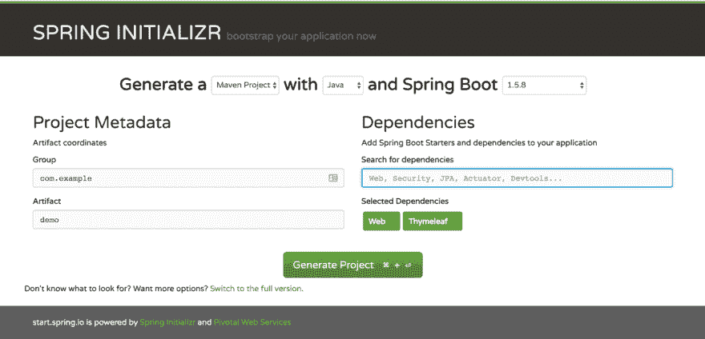

# 最流行的 Java Web 框架

> 原文：<https://dev.to/mostlyjason/most-popular-java-web-frameworks-gm>

随着 Java 多年来的发展，已经进行了多种尝试来简化各种用例的开发。从像 Java 企业版这样的官方标准，到社区驱动的框架，Java 一直在证明自己的适应性和可行性。

我们的排行榜是基于 Hotframework.com 的 Java 排名 和其他几个来源的使用情况，包括博客帖子和 GitHub 下载数量。

前三名是:

*   [春天](#Spring)
*   [JSF](#JSF)
*   [GWT](#GWT)

其他著名的 Java Web 框架:

*   [玩！](https://www.playframework.com/)
*   [支柱](https://struts.apache.org/)
*   [我要求](https://vaadin.com/)
*   Grails

流行但不适合 Web 的 Java 框架(我们不想忘记它们):

*   [休眠](http://hibernate.org/)(数据聚焦)
*   Maven (侧重于构建)
*   [阿帕奇蚂蚁](http://ant.apache.org/)与[常春藤](https://ant.apache.org/ivy/)(专注于构建)

## 春天

工程地点:[https://spring.io/](https://spring.io/)

主要赞助商: [Pivotal 软件](https://pivotal.io/)

Spring 不仅仅是一个 web 框架。它是一个完整的编程模型，构建于 Java 之上，由 Spring Boot 开始，这是一种以最少的配置启动并运行 Spring 应用程序的方法，不需要应用服务器。另一端是 Spring Cloud，它是一个组件组合，允许开发人员构建弹性和可靠的云原生应用程序，这些应用程序利用最新的分布式模式，如微服务架构——两个例子包括应用程序[安全](https://projects.spring.io/spring-security/)和[批处理](https://projects.spring.io/spring-batch/)。

Spring 有很多用例，随着 Spring Boot 的引入，它对于那些正在转向容器的公司来说是一个很好的解决方案，因为它极大地简化了支持运行应用程序所需的组件。

开始使用 Spring 非常简单，只需转到 [Spring Initializr](https://start.spring.io/) 并选择您想要的构建框架以及您想要包含在初始应用程序中的任何和所有 Spring 项目。它将创建 Maven 或 Gradle 配置以及启动所需的所有基本 spring 配置。

从 Initializr 开始创建一个简单的 web 应用程序(图 1):

[](https://res.cloudinary.com/practicaldev/image/fetch/s--SY3rEuLT--/c_limit%2Cf_auto%2Cfl_progressive%2Cq_auto%2Cw_880/https://thepracticaldev.s3.amazonaws.com/i/ejn2edbcelm2z1191hqb.png)

…这将创建一个 Zip 文件，其中包含以下文件:

```
./mvnw.cmd
./pom.xml
./.gitignore
./.mvn/wrapper/maven-wrapper.properties
./.mvn/wrapper/maven-wrapper.jar
./mvnw
./src/test/java/com/example/demo/DemoApplicationTests.java
./src/main/resources/application.properties
./src/main/java/com/example/demo/DemoApplication.java 
```

你需要一个控制器— `src/main/java/com/example/demo/DemoController.java` :

```
package com.example.demo;

import org.springframework.stereotype.Controller;
import org.springframework.web.bind.annotation.RequestMapping;

@Controller
public class DemoController {

    @RequestMapping("/hello")
    public String hello() {
        return "hello";
    }

} 
```

还有一个模板文件— `src/main/resources/templates/hello.html`

```
<!DOCTYPE HTML>
<html>
<head>
    Hello World
    <meta http-equiv="Content-Type" content="text/html; charset=UTF-8" />
</head>
<body>
    <p>Hello World</p>
</body>
</html> 
```

## JSF (Java Server Faces)

项目地点:**[http://www . Oracle . com/tech network/Java/javaee/Java server faces-139869 . html](http://www.oracle.com/technetwork/java/javaee/javaserverfaces-139869.html)T3】**

主发起人: **[甲骨文](https://www.oracle.com/index.html) ( [即将独立基金会](https://blogs.oracle.com/theaquarium/opening-up-java-ee) )**

JSF 是用于显示 web 用户界面的规范，被定义为 Java 平台企业版(JEE)的一部分。JSF 1 于 2004 年发布，并入了 JEE 5，并使用 Java 服务器页面。jsp)作为它的模板。JSF 2 于 2009 年作为 JEE 6 的一部分发布，利用 Facelets 进行模板化，并支持浏览器的 AJAX 调用，以支持现代 web 应用程序的生命周期。JSF 是基于组件的，允许用附加组件来扩展它。 **[IceFaces](https://www.icesoft.com/icefaces/)** 和 **[MyFaces](https://myfaces.apache.org/)** 是流行的附加组件的例子。

由于 JSF 是 Java 标准的一部分，所以它很受希望坚持已发布标准以提高跨平台可移植性的开发团队的欢迎。JSF 还允许用 web 接口扩展现有的后端 Java 代码，而不必通过引入新的框架来重构基础应用程序。

一个简单的 JSF 应用程序需要一个托管 Bean、Facelet 和映射 servlet。

helloworld.java

```
package helloworld;

import javax.faces.bean.ManagedBean;

@ManagedBean
public class HelloWorld {

    final String world = "Hello World!";

    public String getworld() {
        return world;
    }
} 
```

helloworld.xhtml

```
<html lang="en"
      xmlns="http://www.w3.org/1999/xhtml"
      xmlns:h="http://java.sun.com/jsf/html">
    <h:head>
        Facelets Hello World
    </h:head>
    <h:body>
        #{hello.world}
    </h:body>
</html> 
```

web.xml

```
<servlet>
    <servlet-name>Faces Servlet</servlet-name>
    <servlet-class>javax.faces.webapp.FacesServlet</servlet-class>
    <load-on-startup>1</load-on-startup>
</servlet>
<servlet-mapping>
    <servlet-name>Faces Servlet</servlet-name>
    <url-pattern>/faces/*</url-pattern>
</servlet-mapping> 
```

## GWT(谷歌网络工具包)

工程地点:**[http://www.gwtproject.org/](http://www.gwtproject.org/)T3】**

主要赞助商:谷歌

GWT 很像 JSF，它严格地专注于构建网络界面。它比原生 JSF 更受欢迎，因为它使得用 Java 代码维护复杂的 JavaScript 用户界面变得容易。在过去的几年里，随着越来越多的开发团队将 Java 推到后端，并让它使用像 **[Angular](https://angular.io/)** 这样的框架，公开由本地移动应用程序和 Node.js 中内置的用户界面使用的 REST APIs，GWT 已经失去了一些人气。

如何构建一个简单的 GWT 应用程序的教程可以在它的项目网站上找到: **[开始构建一个 GWT 应用程序](http://www.gwtproject.org/doc/latest/tutorial/gettingstarted.html)** 。

## 结论

总之，有许多可行的 Java Web 框架可以用来满足您的需求。前三名没有一个是不好的选择——这取决于个人偏好。请注意，一旦您致力于一个框架并开始利用它的特性，切换到另一个框架并不是一件微不足道的工作。

*原载于[rollbar.com](https://rollbar.com/blog/most-popular-java-web-frameworks/)T3】*