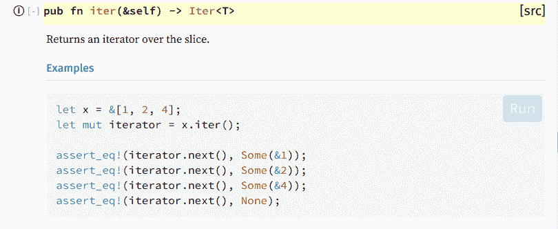
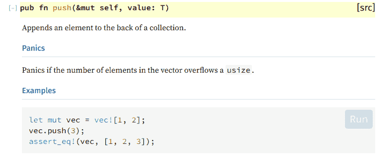

# 移动语义与复制语义

> 原文：<https://dev.to/werner/move-semantics-vs-copy-semantics-pkb>

这是我想写的一个帖子，因为我觉得当我清楚地理解了移动语义的时候，我就能够在基础层面上使用 Rust 了。显然 Rust 有一个陡峭的学习曲线，特别是对于像我这样来自 Ruby 的人，所以我认为这可以帮助像我这样的 Rust 初学者学习如何使用这种语言。

## **复制**

在一些情况下，您需要复制语义，这意味着保存在变量中的值将从内存的一个点复制到另一个点。例如在 C 语言中你可以这样做:

```
#include <stdio.h> 
int main() {
    struct Books {
        char  name[50];
        char  author[50];
        char  subject[100];
        int   book_id;
    } book1;

    strcpy( book1.name, "C Programming");

    struct Books book2 = book1;

    strcpy( book2.name, "Copy Semantics");

    printf( "book 1 name is %s\n", book1.name );
    printf( "book 2 name is %s\n", book2.name );
} 
```

```
$ gcc test.c -o test
$ ./test
book 1 name is C Programming
book 2 name is Copy Semantics 
```

如您所见，C/C++中的赋值操作符执行了从 book1 到 book2 的结构复制，因此，您可以自由地修改 book2 而不改变 book1 中的值，现在如果您想在 Rust 中做同样的事情:

```
struct Books {
    name: String,
    author: String,
    subject: String,
    book_id: i32
}

fn main() {
    let book1 = Books { 
        name: "Rust Programming".to_string(),
        author: "Jhon Doe".to_string(),
        subject: "Programming".to_string(),
        book_id: 12
    };
    let book2 = book1;

    println!("{}", book1.name);
} 
```

```
error[E0382]: use of moved value: `book1.name`
  --> src/main.rs:18:20
   |
16 |     let book2 = book1;
   |         ----- value moved here
17 |     
18 |     println!("{}", book1.name);
   |                    ^^^^^^^^^^^ value used here after move
   | 
```

发生了什么事？，指针地址 book1 被复制到 book2，使 book1 无效，所有权转移到 book2。像 Ruby 这样的其他语言做了类似的事情，但是 book1 和 book2 仍然有效(没有所属部分)，但如果你仔细想想，这是令人困惑的，如果你修改 book2，book1 也会被修改，但这不是我们的意图(至少大多数时候)，因为你想复制值，而不是被两个变量引用，至少 Rust 有一个合理的方法来处理这个问题。

现在回到铁锈的例子，在这种情况下我们能做什么？根据情况，我们可以借用值，取`book1`的[引用](https://en.wikipedia.org/wiki/Reference_(computer_science))，像这样:`let book2 = &book1;`或者我们可以这样导出克隆性状:

```
#[derive(Clone)]
struct Books {
    name: String,
    author: String,
    subject: String,
    book_id: i32
}

fn main() {
    let book1 = Books { 
        name: "Rust Programming".to_string(),
        author: "Jhon Doe".to_string(),
        subject: "Programming".to_string(),
        book_id: 12
    };

    let book2 = book1.clone();

    println!("{}", book1.name);
} 
```

## **移动**

在另一种情况下，您需要移动语义，就像这样:

```
struct Books {
    name: String,
    author: String,
    subject: String,
    book_id: i32
}

fn main() {
    let book1 = Books { 
        name: "Rust Programming".to_string(),
        author: "Jhon Doe".to_string(),
        subject: "Programming".to_string(),
        book_id: 12
    };

    let book2 = Books { 
        name: "C Programming".to_string(),
        author: "Pete Jhones".to_string(),
        subject: "Programming".to_string(),
        book_id: 13
    };

    let books = vec![book1, book2];
    let mut new_books: Vec<Books> = vec![];
    for book in books.iter() {
        let mut book_1 = book;
        //do something with book_1
        new_books.push(book_1);
    }
} 
```

```
error[E0308]: mismatched types
  --> src/main.rs:28:24
   |
28 |         new_books.push(book_1);
   |                        ^^^^^^ expected struct `Books`, found &Books
   |
   = note: expected type `Books`
              found type `&Books` 
```

这个错误意味着 new_books 期望的是一个 struct，而不是一个引用，但是为什么会有引用呢？，它从哪里来？，如果你看一看 [iter](https://doc.rust-lang.org/std/vec/struct.Vec.html#method.iter) 的方法，你可以看到:

[](https://res.cloudinary.com/practicaldev/image/fetch/s--ditm3kc1--/c_limit%2Cf_auto%2Cfl_progressive%2Cq_auto%2Cw_880/https://werner.github.io/assets/iter_method.png)

iter 方法接受 self 的一个引用，在本例中是 books，使得每一个 book 条目也成为一个引用。我们能做什么？我们有一个选择，我们可以[取消引用](https://en.wikipedia.org/wiki/Dereference_operator) `book_1`将第 28 行改为`new_books.push(*book_1);`，但是现在我们有:

```
error[E0507]: cannot move out of borrowed content
  --> src/main.rs:28:24
   |
28 |         new_books.push(*book_1);
   |                        ^^^^^^^ cannot move out of borrowed content 
```

变量 book_1 被 iter 方法借用了，所以我们不能把它移出来，但是，它为什么需要移动呢？，好吧，我们来看看[推](https://doc.rust-lang.org/std/vec/struct.Vec.html#method.push)的方法:

[](https://res.cloudinary.com/practicaldev/image/fetch/s--3hr_fZNB--/c_limit%2Cf_auto%2Cfl_progressive%2Cq_auto%2Cw_880/https://werner.github.io/assets/push_method.png)

value 参数需要消耗 T，在本例中是 book_1。我们有什么选择？，我们可以使用 [into_iter](https://doc.rust-lang.org/std/iter/trait.IntoIterator.html#tymethod.into_iter) ，我们来看一下:

[](https://res.cloudinary.com/practicaldev/image/fetch/s--JV86vflP--/c_limit%2Cf_auto%2Cfl_progressive%2Cq_auto%2Cw_880/https://werner.github.io/assets/into_iter_method.png)

它确实消耗了 self，将书籍移动到迭代器中，坏消息是我们不能再使用书籍了，所以，在使用这个方法之前，你需要考虑到这一点。

```
 #[derive(Debug)]
struct Books {
    name: String,
    author: String,
    subject: String,
    book_id: i32
}

fn main() {
    let book1 = Books { 
        name: "Rust Programming".to_string(),
        author: "Jhon Doe".to_string(),
        subject: "Programming".to_string(),
        book_id: 12
    };

    let book2 = Books { 
        name: "C Programming".to_string(),
        author: "Pete Jhones".to_string(),
        subject: "Programming".to_string(),
        book_id: 13
    };

    let mut books = vec![book1, book2];
    let mut new_books: Vec<Books> = vec![];
    for book in books.into_iter() {
        let mut book_1 = book;
        //do something with book_1
        new_books.push(book_1);
    }
    println!("{:?}", books);
} 
```

```
error[E0382]: use of moved value: `books`
  --> src/main.rs:31:22
   |
26 |     for book in books.into_iter() {
   |                 ----- value moved here
...
31 |     println!("{:?}", books);
   |                      ^^^^^ value used here after move
   |
   = note: move occurs because `books` has type `std::vec::Vec<Books>`, which does not implement the `Copy` trait 
```

## 结论

我知道 Rust 应该是 C/C++的替代品，而不是 Ruby/Python 的替代品，但是，我觉得缺少垃圾收集器是一个特点，因为你现在没有内存泄漏，除了 Rust 解决的性能问题和安全性使它非常有吸引力。