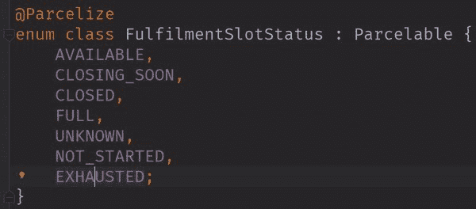
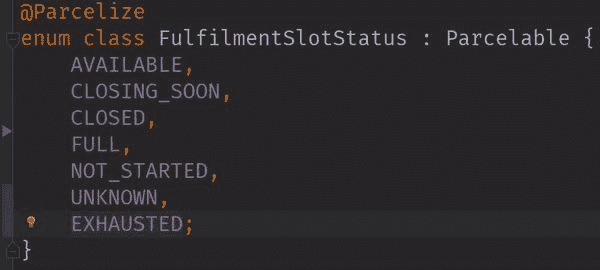
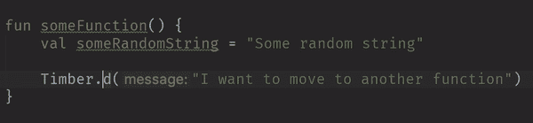
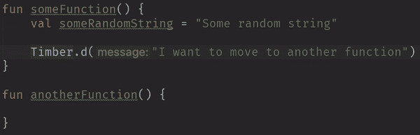

# 向上(或向下)移动

> 原文：<https://dev.to/zmdominguez/moving-on-up-or-down-k13>

> <video loop="" controls=""><source src="https://video.twimg.com/tweet_video/D3MGtFoUIAAeObm.mp4" type="video/mp4"></video>扎拉·多明戈斯🦉@ zarahjutz对枚举中的元素重新排序时使用 CMD+SHIFT+UP/DOWN 表示分号。😍这是小事！00:52am-03 2019 年 4 月17129

我今天早上在重新发现 CMD+SHIFT+UP 后发了这条微博。我知道这条捷径已经有一段时间了，但我想我直到最近才有理由使用它。

然后我想起了这个快捷方式的一个变体，字面意思是“移动不关心的东西”。

> <video loop="" controls=""><source src="https://video.twimg.com/tweet_video/D3M60E5V4AAKMSQ.mp4" type="video/mp4"></video>扎拉·多明戈斯🦉@ zarahjutz编辑:(vs SHIFT+ALT+UP/DOWN 只移动行而不考虑上下文)04:32am-03 Apr 201909

这是 IntelliJ，这些动作不仅仅作用于属性。它们基本上适用于代码中任何有作用域的东西——单独的行、函数，甚至是类！

有两个主要的移动动作，*移动语句*和*移动线*。取决于你想做什么，这些都有各自的好处。

移动一个*语句*意味着 IDE 将考虑特定元素所在的上下文。在单行代码的情况下，这意味着维护其当前范围。这意味着——如果一行代码在函数内部，使用 CMD+SHIFT+UP/DOWN,*永远不会*将它移出函数。

也就是说:

但是这一行想挪到另一个功能！这是它自己说的！这时 CMD+ALT+UP/DOWN 就派上用场了:

当重新排序或重构函数时，这个快捷方式非常方便:

我把它作为一个练习留给读者，让他们看看快捷方式如何处理类。动起来，停止复制粘贴！👯