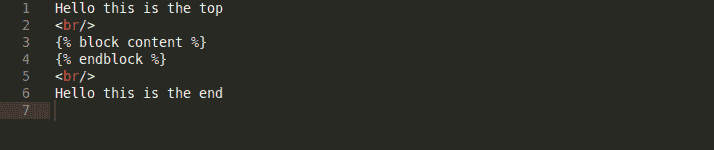
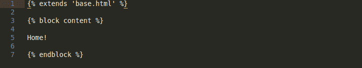

# 进入下一个项目

> 原文：<https://dev.to/wesleyruede/moving-onto-the-next-project-1838>

[https://github.com/wesley-ruede/product-hunt](https://github.com/wesley-ruede/product-hunt)

所以这个会更复杂，因为它有用户认证，html 会更简洁，因为它是可扩展的。随着我对它的深入了解，以及我对它的实际管理过程，我会对它进行更新。这就是我所知道的。

字典中的 For 循环允许 Python 在框架中发挥它的“魔力”:

这段代码将解析另一个 html 文档中的数据，并对其进行组织。手动复制导航条并进行所有的修改可能有点古怪和/或耗时。解决方案是使用 for 循环来扩展此数据，如下所示:

这将获取块内容和 endblock 之间的所有数据，并将其传递回 base.html。当我学习新技术时，我会把它们贴在这里。