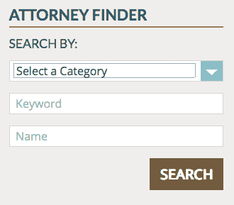
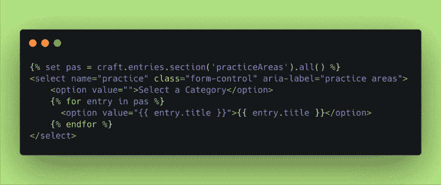
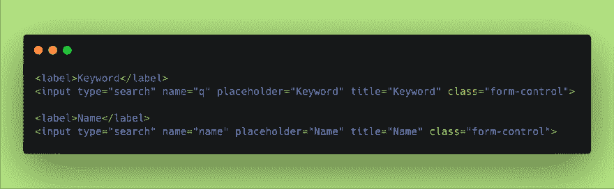
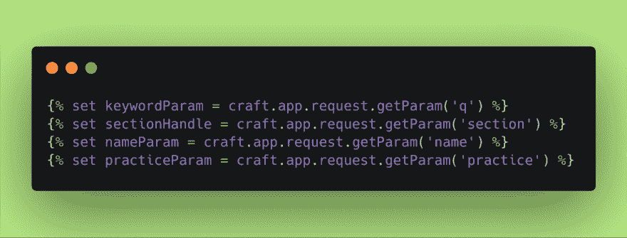
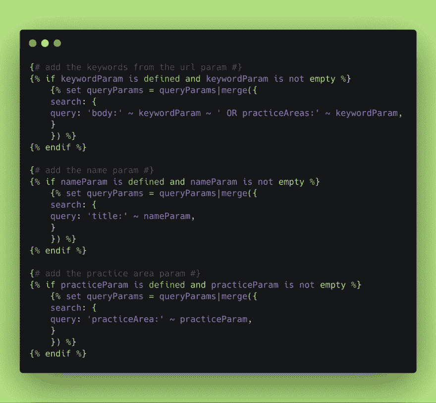
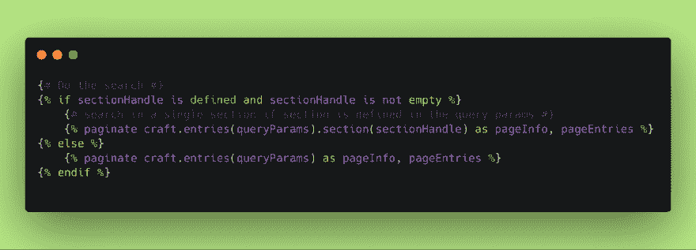
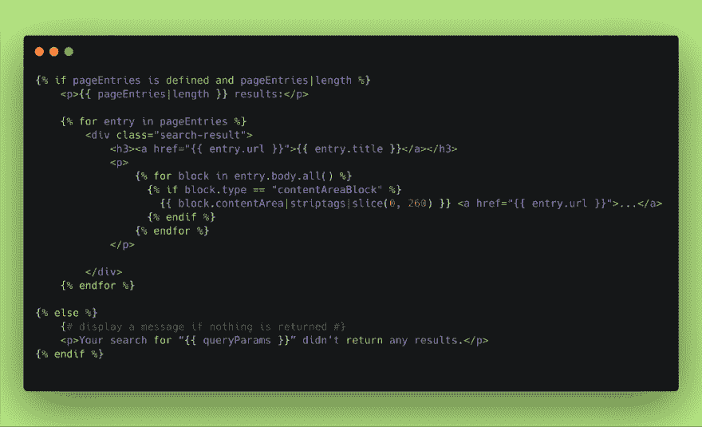

# Craft CMS 中的多参数搜索

> 原文：<https://dev.to/epicosity/multi-parameter-search-in-craft-cms-57oj>

**挑战** —律师搜索功能，可通过以下任意或所有方式进行搜索:

*   律师姓名
*   律师业务领域(类别)
*   关键字

**填充类别下拉列表**

第一步是构建搜索表单。我们只需要将附加字段添加到典型的 Craft CMS 搜索表单中。在本例中，我们在网站上有一个练习区。每个条目都是一个不同的实践领域，我们可以用每个实践领域条目的标题填充一个下拉字段。

 

<figcaption>练习区场地由练习区场地段</figcaption>

填充

关键字字段只是默认的搜索字段，而律师姓名字段是附加的基本文本字段。

 

<figcaption>关键字和律师姓名搜索字段</figcaption>

**设置搜索参数**

在典型的方式中，用户输入他们的搜索参数并点击搜索按钮。

实际发生的是，Craft CMS 表单用表单中输入的搜索参数构建了一个 URL，它看起来像这样:[http://domain.com/search?section=attorneys&惯例=家庭+法律&q =家庭& name=smith](http://domain.com/search?section=attorneys&practice=Family+Law&q=family&name=smith)

**从 URL 中提取参数**

 

<figcaption>从 URL</figcaption>

获取所有参数

使用方便的 dandy[craft . app . request . getparam](https://docs.craftcms.com/api/v3/craft-web-twig-variables-request.html#method-getparam)公共方法，我们可以从 URL 查询字符串中获取这些搜索项。

**用这些参数建立一个搜索查询**

 

<figcaption>构建包含所有搜索参数的数组</figcaption>

在将每个参数合并到主 queryParams 变量之前，我们希望检查每个参数是否都已定义。Craft CMS 默认使用“AND”作为多个搜索参数，因此我们的所有参数都将包含在搜索中。

我们还决定在用户屏幕上显示搜索参数。

 

<figcaption>显示用户的搜索参数</figcaption>

然后我们可以运行搜索，使用 Craft CMS 配置来显示结果。在这个具体的例子中，我们还检查了一个附加参数“sectionHandle ”,该参数只有在我们使用律师搜索功能在律师部分中进行搜索时才会被定义。我们可以在进行常规网站搜索时使用相同的搜索模板。在这种情况下，我们不会定义 sectionHandle，而是搜索整个站点。

 

<figcaption>使用搜索参数数组，运行搜索(带分页)</figcaption>

**最后显示搜索结果**

现在我们可以用我们选择的任何布局显示搜索结果，类似于默认的 [Craft CMS 搜索](https://docs.craftcms.com/v3/searching.html#searching-for-specific-element-attributes)结果。

 

<figcaption>显示搜索结果</figcaption>

* * *