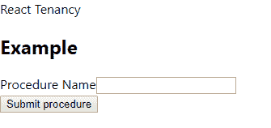
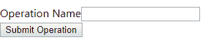

# 反应中多租户内容变化

> 原文：<https://dev.to/wozzo/multi-tenanted-content-changes-in-react-11be>

# 简介

我们有许多租户需要相同的基本功能，但使用的术语略有不同，这导致我们的用户界面需要根据所使用的租户而有所不同。事实证明，在 React 中，在 [React-Intl](https://github.com/yahoo/react-intl) 的帮助下，这是非常容易做到的。

## 备注

我使用 yarn 作为我的主要包管理器，所以期待 yarn 命令被引用。如果您使用 npm 或其他东西，您将需要翻译命令。如果这比用`npm install ...`代替`yarn add ...`更复杂，我会试着添加更多信息。

我将使用 Windows、VS Code、PowerShell 进行我的开发工作，但我的意图是，无论您将使用什么样的类似工具，本教程都将适用。

## 设置

您可以从 Github 中检索[项目文件](https://github.com/wozzo/react-tenancy)。从项目的第二次提交开始，我们有一个简单的表单，没有内容管理。所有的字符串都是组件的硬编码部分。我们将从这里开始工作来改变这一点，或者你可以只看完成的东西。

[](https://res.cloudinary.com/practicaldev/image/fetch/s--JtgQNJAh--/c_limit%2Cf_auto%2Cfl_progressive%2Cq_auto%2Cw_880/https://thepracticaldev.s3.amazonaws.com/i/kq1q8du3o4zwjzu756on.png)

要使用开发服务器编译和查看页面，请导航到目录并运行`yarn start`。这将监视文件更改，并用最新版本刷新浏览器窗口。

# 反应-国际

React-Intl 主要是为了让你的应用程序国际化，但事实证明，如果你也需要国际化，我们也可以用它来实现上述目标，而不会损害它的原始目的。

## 添加反应-输入

通过运行`yarn add react-intl`将 react-intl 添加到项目中。我们现在要将 react-intl 添加到我们的应用程序中，以便组件可以使用它来管理字符串内容。

在`index.js`中添加以下行

```
import { IntlProvider } from 'react-intl'; 
```

然后，我们需要将整个应用程序包装在`IntlProvider` HOC 中。

```
<IntlProvider locale="en">
    <App />
</IntlProvider> 
```

## 我们第一个托管字符串

现在我们已经添加了 react-intl，我们可以将它与 react-intl 提供的`FormattedMessage`组件一起使用。在`ExampleForm.jsx`中添加以下

```
import {FormattedMessage} from 'react-intl' 
```

这里我们要改变的第一个字符串是文本输入的标签。目前它是“过程名”。当我们完成时，它仍然是，但是它将由 react-intl 管理，使我们能够改变它。

在`ExampleForm`上增加一个新的`const`，如下

```
const messages = {
  procedureNameLabel: {
    id: "ExampleForm.ProcedureName.Label",
    defaultMessage: "Procedure Name",
    description: "Label text for the procedure name input text box on the Example form"
  }
} 
```

(注意:描述是可选的，但是您必须为与`react-intl`一起使用的所有消息提供唯一的`id`和`defaultMessage`。

现在替换标签标记中的“过程名”文本，使其看起来像下面的

```
<label htmlFor="procedureName">
    <FormattedMessage {...messages.procedureNameLabel} /> </label> 
```

最终的结果应该是看起来和以前完全一样。这并不完全相同，因为 FormattedMessage 在`<span />`中呈现文本。检查 html 应该会显示以下内容

```
<label for="procedureName">
    <span>Procedure Name</span>
</label> 
```

这可能意味着你需要对你的 css 做一些改变。你可以使用下面的替代方法

## 普通格式的消息

创建一个名为`PlainFormattedMessage.jsx`的新文件，并将以下内容放入其中

```
import React from 'react';
import { FormattedMessage } from 'react-intl'

const PlainFormattedMessage = (props) => 
    <FormattedMessage {...props}>
        {(message) => message }
    </FormattedMessage> 
export default PlainFormattedMessage 
```

这将呈现不带`<span />`标签的消息。你可以在`ExampleForm.jsx`文件中用`import PlainFormattedMessage from './PlainFormattedMessage'`替换`import { FormattedMessage } from 'react-intl'`并将`<FormattedMessage ...>`改为`<PlainFormattedMessage ...>`来使用它。

## 改变属性中的字符串

上面的方法在字符串是标签的子元素的情况下工作得很好，但是在我们想要改变属性的文本的情况下，我们需要使用一个与`PlainFormattedMessage`非常相似的新组件。这里我们要使用的例子是提交按钮的`value`属性。向文本的消息对象添加新值。

```
exampleFormSubmitProcedureButtonText: {
    id: "ExampleForm.SubmitProcedure.ButtonText",
    defaultMessage: "Submit procedure"
} 
```

然后用下面的
替换`<input ... />`

```
<FormattedMessage {...messages.exampleFormSubmitProcedureButtonText}>
    {(message) => <input type="submit" value={message} />} </FormattedMessage> 
```

同样，如果我们做的一切都是正确的，它仍然应该编译和渲染完全一样，就像以前一样。到目前为止还没有任何改变，这是一个很大的工作量，但是我们接下来的步骤是覆盖默认设置，并开始从这些改变中获得价值。

注意:您可能希望将此功能转移到一个单独的组件中。我们有一个专门用于呈现我们的`<input />`的`<Input />`组件，并通过将消息作为属性传递给该组件来包含此功能，还有一个工具提示属性，它也使用托管字符串。

## 改变琴弦

所以我们的新租户要求我们用文本“操作名”而不是“过程名”来标记`procedureName`输入文本框。事实上，在我们说“过程”的任何地方，他们都希望我们说“操作”，所以我们覆盖了当前的默认消息。我们可以通过创建一个包含所有被覆盖字符串的文件来做到这一点。您不必从文件中检索这些覆盖，如果适合您的用例，您可以使用`fetch()`并在运行时检索它们。

创建一个新文件，并将其命名为标识租户的名称。以`op-tenant.json`为例。
键应该与我们希望覆盖的消息的`id`相对应，而值应该是新的文本，所以到目前为止，我们的两个字符串应该是这样的:

```
{  "ExampleForm.ProcedureName.Label":  "Operation Name",  "ExampleForm.SubmitProcedure.ButtonText":  "Submit Operation"  } 
```

在`index.js`中，我们需要导入/检索租户消息覆盖。如果已经选择了租户，那么需要将它们传递给`messages`属性上的`IntlProvider`。我假设您已经有了一些确定租户的方法，在本例中，我将使用一个常量字符串值来设置它。现在我们需要一个方法，如果租户匹配，它将返回覆盖。

```
import opTenantMessages from './messages/op-tenant.json'

const tenant = "normal-tenant"
const getMessages = () => {
    if (tenant && tenant === "op-tenant")
        return opTenantMessages
    return {}
} 
```

然后，为了使用它，我们改变`<IntlProvider>`，以便它使用这个方法

```
<IntlProvider locale="en" messages={getMessages()}> 
```

有了上面的内容，我们的网站仍然应该像以前一样呈现。
[](https://res.cloudinary.com/practicaldev/image/fetch/s--JtgQNJAh--/c_limit%2Cf_auto%2Cfl_progressive%2Cq_auto%2Cw_880/https://thepracticaldev.s3.amazonaws.com/i/kq1q8du3o4zwjzu756on.png) 
但是只要将租户值更改为“op-tenant”就应该更新字符串
[](https://res.cloudinary.com/practicaldev/image/fetch/s--m7_q4jjT--/c_limit%2Cf_auto%2Cfl_progressive%2Cq_auto%2Cw_880/https://thepracticaldev.s3.amazonaws.com/i/yhsu3pr0wcvwymj8rqh4.png)

## 最后的想法

我建议你用消息替换所有的字符串内容，不管你的应用是租户还是国际用户。有一天，这些中的一个可能会成为一个需求，你会很高兴基础已经到位。这也意味着字符串内容不会使您的标记混乱。

这里使用的`FormattedMessage`只是`react-intl`提供的组件之一。其他大多数对国际化更有用，比如管理货币符号等。另一个对租赁应用特别有用的是`FormattedHtmlMessage`，它允许消息包含 HTML 标记，然后可以被租户覆盖。

如果你需要改变由其他变量组成的字符串，那么`react-intl`也支持字符串插值或者模板字符串。例如，需要根据有错误的字段进行更改的错误消息。如果 defaultMessage 包含类似下面的模板字符串

```
`The {fieldName} is a required field` 
```

我们需要提供一个`fieldName`给组件，该组件呈现如下的消息

```
<FormattedMessage {...messages.errorMessage} values={ fieldName: "Date of birth"} /> 
```

这将输出“出生日期是必填字段”。我将把它作为一个练习，让读者弄清楚如何用一个受`react-intl`控制的字符串覆盖`fieldName`。

希望我已经为您提供了足够的内容，使您能够让您的应用程序根据租户改变内容。