# 我的 2018 年回顾

> 原文：<https://dev.to/schlende/my-2018-year-in-review-1lla>

2018 年，我写了一些文章，提升了我的设计技能，开发了一些 android 应用程序，并使用数据研究了一些 oneline 市场。我学到了很多关于创业的知识。希望你喜欢！

## 2018:写作年

回顾 2018 年的主题是更少的代码…更多的写作。

今年年初，我发布了几篇我写的文章…然后又回到了写软件…然后又回到了写文章。

我对创业过程的理解从-

1.  想出一个主意
2.  建造它
3.  寻找客户…

到

1.  寻找客户
2.  用迷你产品测试市场(内容/登录页面)
3.  有市场就造更大的产品

下面是我 2018 年尝试的事情中的一些亮点。

## 情人节那天，我送给妻子一个编码难题，我向 Reddit 挑战，要它解答

我通过为媒体写一篇文章开始了我的营销测试。

这是 2018 年的情人节，**整个世界**都痴迷于以太。

我刚刚完成了一项工作，我写了一些代码，将一些数据存储到以太坊区块链。

一天早上，我妻子问我以太坊是如何工作的，我灵机一动！

我在区块链的一个秘密地址存放了 100 美元的以太坊，并为我的妻子制作了一个拼图。如果她能解决它，她会得到钱。

我在情人节那天把这个谜题发给了她，然后[写了一篇文章，这样其他人也可以尝试这个谜题](https://medium.com/@walt.schlender/i-gave-my-wife-a-programming-puzzle-for-valentines-day-can-you-solve-it-ad4b2786009b)！

[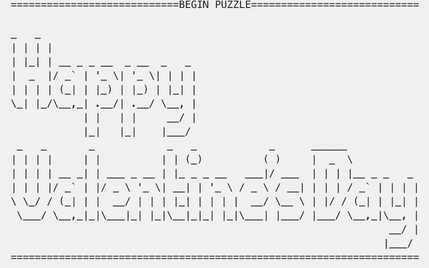](https://res.cloudinary.com/practicaldev/image/fetch/s--jYeUBzK4--/c_limit%2Cf_auto%2Cfl_progressive%2Cq_auto%2Cw_880/https://walt.fyi/asseimg/2018-02-01-my-2018-year-in-review.assets/1%2ALud1DjaUFP1NUiQWyDeGEQ.png)

*情人节拼图*

#### 结果

我在 Reddit 上分享了这篇文章，并将其发布到黑客新闻上。

这是我第一次在网上分享我写的东西，所以我不知道自己在做什么。我最终违反了两个 reddit 社区的服务条款，并点击了黑客新闻垃圾邮件过滤器。

尽管如此，那篇文章还是获得了大约 3000 的浏览量，向我证明了写文章是接触人们的好方法。

我从这第一篇文章中学到了很多！一些亮点包括:

这些故事实际上是小产品- [看看唐娜·李乔](https://www.donnalichaw.com/)

创造像病毒一样传播的故事是一门艺术——卡伦 X 张太不可思议了！

学会清晰地写作真的很有挑战性(也很重要)——看看关于如何写好文章的

这只是一个小小的胜利，但却非常重要。我的写作水平提高了很多，但那是在那年的晚些时候。首先，我必须学习设计。

## 我提升了我的设计技能

如果你想制造自己的产品，设计是非常重要的。

设计过程包括弄清楚*一个产品是为谁*准备的，*该产品正在解决什么*问题，*该产品将如何*解决该问题，以及*为什么*生活会因此变得更好。

好的设计师回答这些问题，然后拿出可以做成产品的蓝图。

我很幸运，因为我的妻子是一名设计师。我让她教我她的过程，她没有让我失望。

我推荐[查看她的设计挑战并下载她的设计备忘单](http://www.uxchallenge.co/)。我学到了很多，我已经用我所学到的知识建立了模型和登陆页面。

下面是她教我她的流程后，我设计的第一个 app 的截图。

[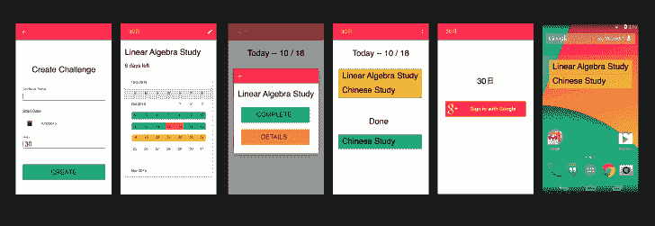](https://res.cloudinary.com/practicaldev/image/fetch/s--oNrgX6H9--/c_limit%2Cf_auto%2Cfl_progressive%2Cq_auto%2Cw_880/https://walt.fyi/asseimg/2018-02-01-my-2018-year-in-review.assets/1%2AC6o2Pqgyh269J4-NqePcPQ.png)

*我的 30 天挑战追踪应用的设计*

## 我用了 3 天时间构建(并发布)了我设计的应用程序

自从我有了一个设计，我就给自己设定了一个挑战…我能多快组装一个应用程序？结果是三天。

对于一个工程项目来说，三天是相当快的(即使是一个简单的项目)。构建很快，因为我使用了 [Firebase](https://firebase.google.com/) 和 [React Native](https://facebook.github.io/react-native/) 。这些技术对于构建快速原型非常有用。如果您正在构建 MVP，这是我推荐的堆栈。

#### 结果

我在 Google Play 应用商店上推出了这款应用。

该应用上线一个月，我就获得了 800 次下载。一个用户购买了完整版本，所以这个项目是有利可图的！我赚了 3 美元。

一个月后，我把这款应用从应用商店撤下，尝试其他创意。应用程序需要工作，我想在其他事情上努力。

## 我为 freeCodeCamp 出版物写了一篇受欢迎的文章

我在寻找一种方法，在不花很多钱在脸书广告上的情况下，让我们的项目获得流量。

我曾经读到过，经营博客和出版物的人总是在为他们的读者寻找新的高质量的内容。

我做了一个实验…就一个我非常熟悉的主题写一篇文章，看看我是否能发表。

#### 结果

[我写的关于登陆编码工作的文章](https://www.freecodecamp.org/news/how-you-can-land-a-coding-job-with-very-little-experience-b96517e00da7/)被 [freeCodeCamp](https://www.freecodecamp.org/) 出版社接受，并发布了“自由职业者”媒体主题。

我很惊讶我的文章写得这么好。它在第一周就获得了 2000 多个掌声，并出现在互联网上。

这篇文章于 8 月份发表，每天仍有约 200 人浏览。

我在文章中添加了我的博客和电子邮件列表以及 twitter 的链接，这些链接启动了一个个人电子邮件列表。

[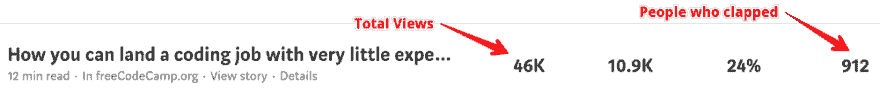](https://res.cloudinary.com/practicaldev/image/fetch/s--X7YVcVKM--/c_limit%2Cf_auto%2Cfl_progressive%2Cq_auto%2Cw_880/https://walt.fyi/asseimg/2018-02-01-my-2018-year-in-review.assets/1%2AMT1Gheba8YO9KY87R6CfuQ.png)

*关于如何用很少的编码经验找到一份编码工作的文章的统计数据*

我了解到-

*   客座博文是接触大量受众的一种非常有效的方式
*   出版物很容易接近——当你写一篇好文章的时候，你在帮助他们
*   互联网是为传播文章而设计的…所以文章(以及视频、图片等)是吸引注意力的好方法，可以将注意力转移到更大的产品上

这是一个巨大的胜利。我一直在努力提高网络流量。我的 android 应用程序非常成功，因为谷歌每天能带来大约 30 名新客户。我一直在寻找一种方法来获得网络产品的客户流。这似乎很有效。

## 我运行了 2 次登陆页面测试，1 周内有 40 人注册了我的预发布列表

我在九月开始时又上了一堂设计课。我觉得我需要能够创造漂亮的设计来推销我的想法。

这门课非常有帮助。我对 Adobe XD 变得非常熟悉，并且能够制作一些非常漂亮的登录页面。

[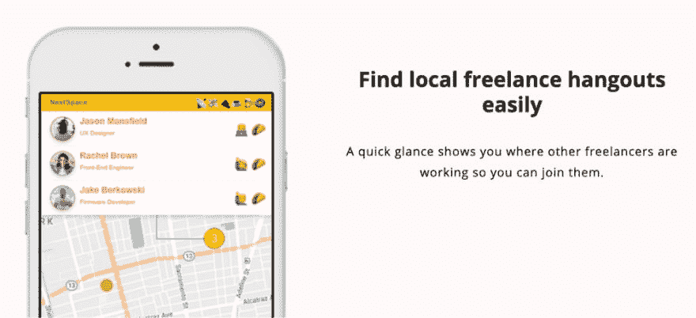](https://res.cloudinary.com/practicaldev/image/fetch/s---xZEi9Y0--/c_limit%2Cf_auto%2Cfl_progressive%2Cq_auto%2Cw_880/https://walt.fyi/asseimg/2018-02-01-my-2018-year-in-review.assets/1%2AvtDQ7agIjH8shs_Dcp8neA.png)

*自由职业地图登陆页面测试*

[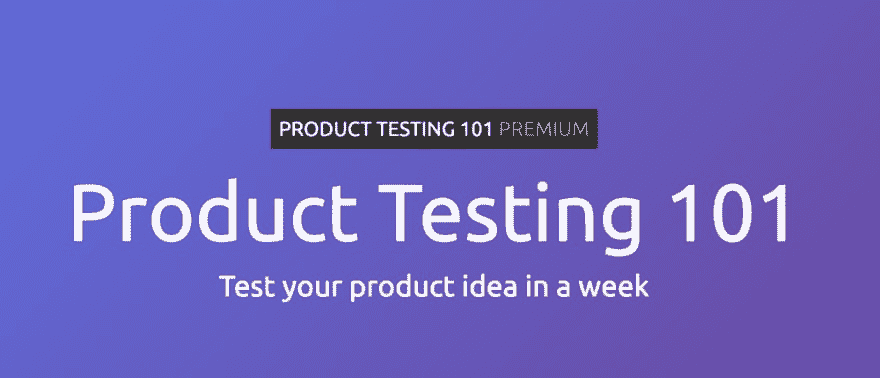](https://res.cloudinary.com/practicaldev/image/fetch/s--wfb_9ULp--/c_limit%2Cf_auto%2Cfl_progressive%2Cq_auto%2Cw_880/https://walt.fyi/asseimg/2018-02-01-my-2018-year-in-review.assets/1%2AJB1gWpfrcvBz7uUU35OwJA.png)

*产品测试 101 课登陆页面*

### 自由职业地图

我的第一个登陆页面测试是针对 FreelanceMap 的。

我所说的痛苦来自个人经历。

一个人工作会很孤独。有了 FreelanceMap，你可以用一个应用程序找到其他当地的自由职业者。

为了测试这一价值主张，我建立了一个登录页面，并使用脸书广告为其增加流量。

主登录页面指向预发布注册表单。

[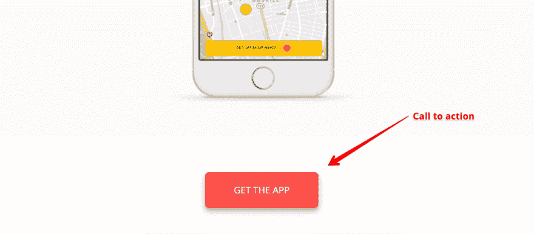](https://res.cloudinary.com/practicaldev/image/fetch/s--7JpZZHfC--/c_limit%2Cf_auto%2Cfl_progressive%2Cq_auto%2Cw_880/https://walt.fyi/asseimg/2018-02-01-my-2018-year-in-review.assets/1%2Az-jat2Vhqqex5LqeeGIejg.png)

*“获取应用”——行动号召*

当应用程序准备好时，人们可以注册收听。

#### 结果

我运行了 1 周的广告，有 39 人注册了，当应用程序准备好的时候会收到通知。

[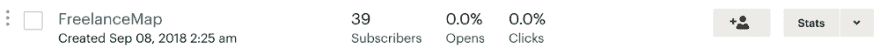](https://res.cloudinary.com/practicaldev/image/fetch/s--B0zzrK4q--/c_limit%2Cf_auto%2Cfl_progressive%2Cq_auto%2Cw_880/https://walt.fyi/asseimg/2018-02-01-my-2018-year-in-review.assets/1%2ANUxCuYODcOfO_8Xy-sDTWA.png)

以每天 5 美元的价格投放广告一周之后，我有了 39 个订户

我觉得测试进行得很顺利。

实验设计相当不错，但并不完美。

首先，广告是在印度投放的，因为那里的交通更便宜。我仍然想知道美国的交通是否会有不同的转变。

第二，我从来没有要求人们为任何事情付钱。运行测试后，我想知道构建该产品是否会让我赚钱。

我不想构建人们不愿意为之付费的东西，所以我尝试运行另一个测试。

### 产品测试 101

产品测试 101 提出了一个关于建立登陆页面测试的课程。

对于这个测试，我的实验设计有点不同。

登录页面的文字太多了。我非常努力地试图让人们相信*课程是值得*付费的。

在登陆页面的底部，我向人们要钱，我安装了一个插件，让我跟踪人们阅读页面的深度。

[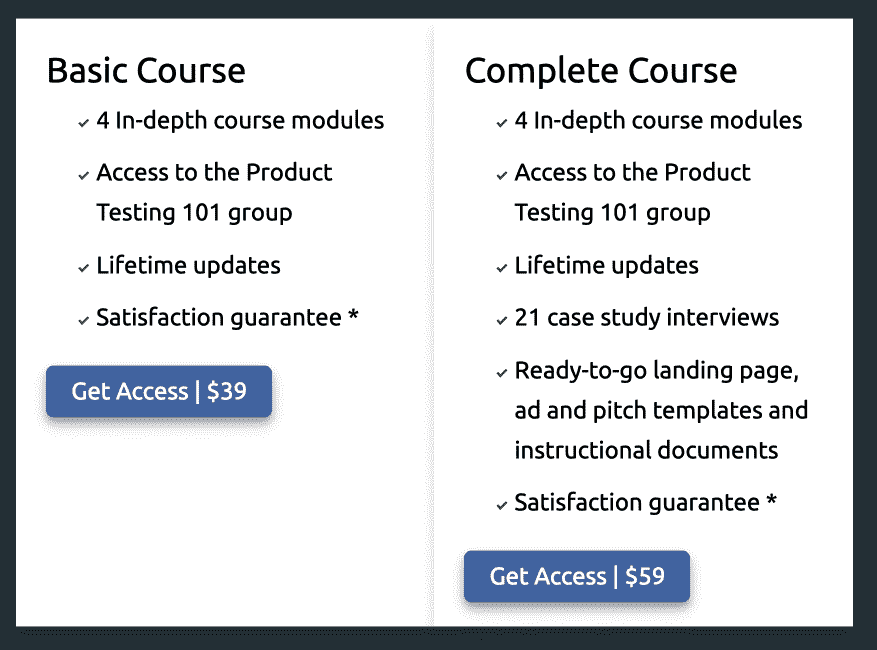](https://res.cloudinary.com/practicaldev/image/fetch/s--K_XnMD3v--/c_limit%2Cf_auto%2Cfl_progressive%2Cq_auto%2Cw_880/https://walt.fyi/asseimg/2018-02-01-my-2018-year-in-review.assets/1%2A-YHdxY6zI5n8WGyXPdhv9w.png)

*向人要钱*

当你想出一个产品创意时，你是否找到了一个真正理解其痛苦的观众，这是有很大风险的。

我个人认为这种产品的价值主张更为做作。

显然脸书用户同意我的观点。你可以看到产品测试 101 的点击率是 FreelanceMap 点击率的一半。

[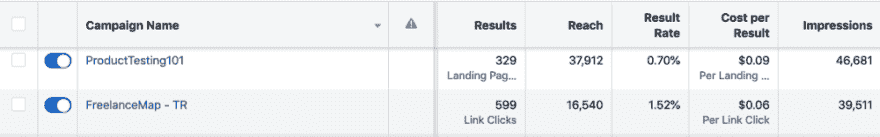](https://res.cloudinary.com/practicaldev/image/fetch/s--aAgHwD68--/c_limit%2Cf_auto%2Cfl_progressive%2Cq_auto%2Cw_880/https://walt.fyi/asseimg/2018-02-01-my-2018-year-in-review.assets/1%2AISBEurBqXOIB_P3znmQY-g.png)

*产品测试 101 的点击率为 0.7%，而自由职业地图的点击率为 1.52%*

#### 结果

没有人点击进入预发布列表注册页面。

也就是说，我认为测试是成功的。

滚动跟踪显示，很多人阅读了我的整个推介。

大多数人在拿到 CTA 定价时都会反弹。

我觉得这个测试设计给了我一个明确的答案——这个产品宣传(针对这个受众)不够强大，不足以让人们愿意为此付费。

总的来说，我觉得这些登陆页面测试确实有效。当你找到了一个听众，理解他们的痛苦，并想知道你是否能接触到更多的听众时，这样的测试真的很好。

当你不清楚谁是你的受众或者你希望解决的问题时，这些测试就不会很有效。如果你想了解受众，我认为做一些调查会有更好的结果。在运行了登陆页面测试之后，我尝试了一种基于研究的方法…继续读下去，听听效果如何。

## 我做了一些研究，并在 10 月份的 freeCodeCamp 上写了一篇最受欢迎的文章

我发现自己在寻找一种方法来识别受众，并了解他们在哪里需要帮助。

我设计了一个实验，我挑选了一个我很了解的观众(新程序员)，我花了一些时间阅读论坛，以了解他们正在努力解决什么样的问题。

我把我的笔记和我自己的亲身经历结合起来，写了一篇关于学习编程的心理层面的文章。

那篇文章结果证明非常有用。人们似乎真的很喜欢它。

在我写这篇文章的时候，这篇文章已经获得了超过 25000 次的点击，一天之内被浏览了超过 9000 次。它还在谷歌的关键词“苦苦挣扎的开发者”中排名第一。

[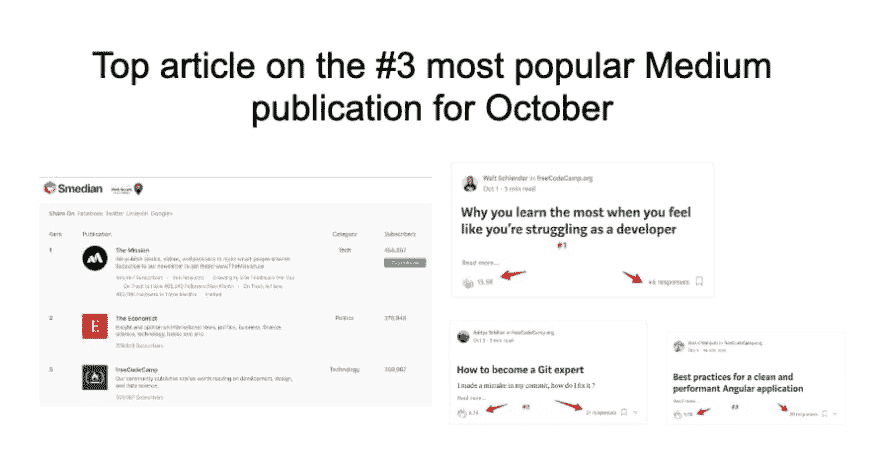](https://res.cloudinary.com/practicaldev/image/fetch/s--R7Abt97m--/c_limit%2Cf_auto%2Cfl_progressive%2Cq_auto%2Cw_880/https://walt.fyi/asseimg/2018-02-01-my-2018-year-in-review.assets/image-20190527162425292.png)

[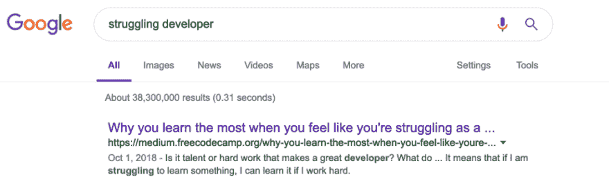](https://res.cloudinary.com/practicaldev/image/fetch/s--KF6X_f85--/c_limit%2Cf_auto%2Cfl_progressive%2Cq_auto%2Cw_880/https://walt.fyi/asseimg/2018-02-01-my-2018-year-in-review.assets/1%2AZpgC21NI2_1IR_F_uXmzuA.png)

那篇文章继续为我带来流量和关注者。

对我来说，通过研究发现市场漏洞是可能的，这是一种验证。

我开始相信研究是一个非常有价值的工具，可以让你清楚你在为谁做什么，以及 T2 需要什么帮助。

研究帮助你从猜测走向事实……但我发现这真的很难。什么是受众，你如何在网上找到他们？当你看一个论坛的帖子时，你怎么知道你所阅读的问题是广泛经历的？

我认为软件可以使研究过程更容易。此外，我的背景是数据工程+我认为我真的在寻找编码的东西。

我建立了一些数据工具。它们在技术上非常“酷”,但结果并不十分有用。尽管如此，它们还是值得一提。

## Reddit 研究工具

当我开始研究受众时，我求助于 Reddit。

Reddit 通过“子编辑”来划分社区。不同的社区有不同的关注点、文化和兴趣。我认为这将是一个很酷的子编辑，从论坛帖子中提取所有的关键词，总结重复出现的关键词，看看什么被谈论得最多。

我建立了一个界面，你可以搜索一个关键字，并看到所有提到该关键字的子编辑。你也可以搜索一个 subreddit，看看那里提到了哪些关键词。

[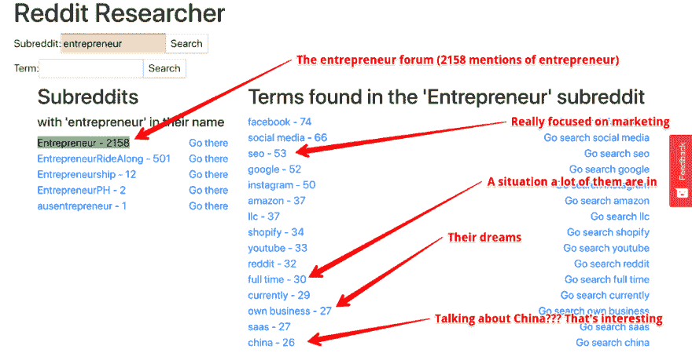 ](https://res.cloudinary.com/practicaldev/image/fetch/s--zexKBMvA--/c_limit%2Cf_auto%2Cfl_progressive%2Cq_auto%2Cw_880/https://walt.fyi/asseimg/2018-02-01-my-2018-year-in-review.assets/1%2A9K8fojXDyBxAuMxF4lEYRw.png) *我的 reddit 研究工具可以很容易地对一个子编辑进行 x 光透视，以了解子编辑中出现了什么主题*

在我制作了这个工具后，我开始使用它。

这个工具实际上非常有用。它可以让你使用关键词来快速锁定人们谈论某个话题的子主题。我发现了很多有趣的子编辑，我从来不知道使用这个工具。

也就是说，我在搜索 reddit 论坛时还没有太多成功的商业点子。Reddit 有很多学生，所以我不断发现自己陷入与学术工作或找工作相关的痛苦之中。我不是说这种方法行不通…但它对我来说行不通。

尽管如此，我还没有准备好放弃定量方法。

## 安卓市场调研工具

在做研究时，我偶然发现一家公司使用亚马逊数据在亚马逊上寻找产品机会。

Jungle Scout 使用亚马逊的“销售排名”指标来估计亚马逊目录中每个产品的日销售额。通过将这种销售估计与产品评论数据相结合，使用丛林侦察兵的人可以找到尽管需要改进但销售良好的产品。

我认为这种方法可能适用于谷歌 Play 商店。如果我能找到下载量很大但评价很差的应用程序，也许我能做得更好。

我最终搜索了 google play 商店，收集了大约 60，000 个应用列表。

事实证明，很容易看出哪种应用程序获得了最多的下载量…

游戏！

经过一点数据处理，我发现了一些我认为可以开发应用的领域。

[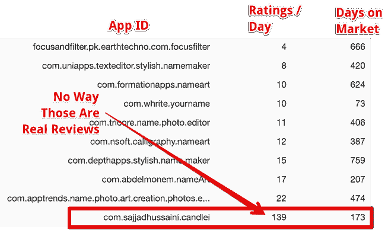](https://res.cloudinary.com/practicaldev/image/fetch/s--CjnOHX_z--/c_limit%2Cf_auto%2Cfl_progressive%2Cq_auto%2Cw_880/https://walt.fyi/asseimg/2018-02-01-my-2018-year-in-review.assets/1%2AMO69Fi6K1VWYoUy3bmZXJQ.png)

*我想我已经在“名字艺术”市场找到了一个利基市场*

当我偶然发现一些创建名字艺术的应用程序时，我认为我已经发现了一个市场机会。

这些应用程序是一些小的绘图程序，孩子们用它们写出自己的名字，然后发给他们的朋友。

这些应用程序质量都很差，而且充斥着广告。

我想我可以做一个类似的应用程序，所以我开始编码。这就是结果。

[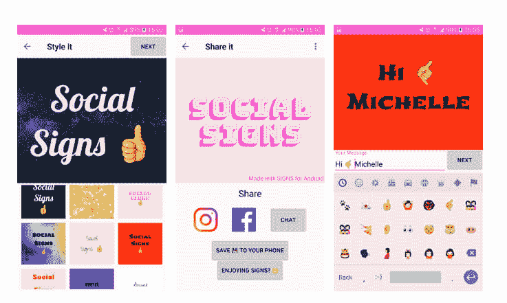](https://res.cloudinary.com/practicaldev/image/fetch/s--N-Sv0PNM--/c_limit%2Cf_auto%2Cfl_progressive%2Cq_auto%2Cw_880/https://walt.fyi/asseimg/2018-02-01-my-2018-year-in-review.assets/1%2Anl7kCiuAVAYCWLoC1DrT_A.png)

*我的社交标志应用*

我发布这个应用后，下载量并不多。

一些调查显示，我做决定所依据的评论是假的。

此外，我通过观察竞争对手来开发产品，这对我来说不太好。我不断发现新的竞争对手…由于我与我的客户群没有联系，我真的不明白为什么他们会或不会想要这样的应用程序。

也许“复制竞争对手”的方法可能会奏效，但我认为研究客户似乎更容易。毕竟，如果他们有问题并且不了解竞争，那么竞争就无关紧要了。

## 2019

这让我想到了 2019 年。

当我写这篇文章时，我仍然在寻找我的产品构建方法。

毫无疑问，这段旅程并不容易。每一次成功都伴随着大量的失败……即使是成功的事情(比如写文章)也不总是可重复的。

不过，我还是很乐观。

回顾过去，我可以看到我已经走了多远。我带着非常不同的创业世界观开始了 2018 年。我的理解变得越来越复杂和微妙。

我想我找到适合自己的产品构建方法只是时间问题。

在那之前，我只专注于每天起床并投入工作。