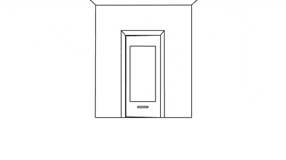

# Vue 路由器架构和嵌套路由

> 原文：<https://dev.to/berniwittmann/my-approach-on-vue-router-architecture-and-nested-routes-2kmo>

使用嵌套路径可能会很麻烦...

[](https://i.giphy.com/media/fnspESRmMpwwUGS9hs/giphy.gif)

因此，我总结了如何保持路由配置的整洁，并简化嵌套路由的工作。

已经有一些关于如何使用 Vue 路由器的教程，但是我想把重点放在这个特殊的问题和它的架构上。

下面我将指导您创建示例回购，并向您展示我是如何解决这个问题的

### 主要议题

主要问题是，如果您想要嵌套路由，父路由组件需要始终包含一个`<router-view></router-view>`。这有时会很烦人，在我看来，这就是感觉不对。这也导致组件本身与其子路由/路由之间的高耦合。

### 第一步:添加一个`EmptyRouterView`组件

首先我们创建一个`EmptyRouterView`组件，它只包含`<router-view></router-view>`。

```
<template>
  <router-view></router-view>
</template> 
```

Enter fullscreen mode Exit fullscreen mode

这几乎是全部的魔术。现在我们只需要在路由配置中正确使用这个组件

### 第二步:调整你的组件以适应新的架构

前往您的路线配置(可能是`router.js`)

当前配置可能看起来像这样

```
// Old Config
  {
      path: '/my-route',
      component: MyRouteView,
      name: 'route',
      children: [...]
  } 
```

Enter fullscreen mode Exit fullscreen mode

我们这样改吧:

```
// New Config
 {
      path: '/my-route',
      component: EmptyRouterView,
      children: [{
        name: 'route',
        path: '',
        component: MyRouteView
      }]
  } 
```

Enter fullscreen mode Exit fullscreen mode

我们声明某种以`EmptyRouterView`为组件的*抽象*路由。作为默认的子组件，我们现在添加旧的路由配置，但是路径为空。当用户导航到`/my-route`时，空路径导致该子路由被呈现。

您还会注意到，我们没有给我们的*抽象*父路由命名。这也很有帮助，因为当我们向应用程序添加链接并通过名称引用路由时，我们不会意外地将*呈现为空的*父路由。

### 第三步:套料路线

现在我们可以轻松地嵌套路线:

```
// Nested Config
 {
      path: '/my-route',
      component: EmptyRouterView,
      children: [{
        name: 'route',
        path: '',
        component: MyRouteView
      }, {
        name: 'route.child-one'
        path: 'child-one',
        component: ChildOneView
      }, {
        name: 'route.child-two'
        path: 'child-two',
        component: ChildTwoView
      }]
  } 
```

Enter fullscreen mode Exit fullscreen mode

看看嵌套路由有多容易💪🏻当用户导航到`/my-route/child-one`时，`ChildOneView`应该按照预期呈现。

### 第四步:深度嵌套路线

我们还可以在嵌套路由中嵌套路由。某种路线观念

[](https://i.giphy.com/media/cNWU2Zeh54VJC/giphy.gif)

(是的，我知道:糟糕的文字游戏😁)

```
// Deep Nested Config
 {
      path: '/my-route',
      component: EmptyRouterView,
      children: [{
        name: 'route',
        path: '',
        component: MyRouteView
      }, {
        path: 'sub',
        component: EmptyRouterView,
        children: [{
            name: 'deep',
            path: '',
            component: MyDeepRouteView
          }, {
            name: 'deep.child-one'
            path: 'deep-one',
            component: ChildOneView
          }, {
            name: 'route.child-two'
            path: 'deep-two',
            component: ChildTwoView
          }]
      }]
  } 
```

Enter fullscreen mode Exit fullscreen mode

路径`/my-route/sub/deep-one`将导致子视图被渲染。

我想我已经达到了单词 routes 的字数限制，因此我将把这个留给你。我将所有这些浓缩在一个回购协议中，你可以看到所有的行动

## [【bernwittmann】](https://github.com/BerniWittmann)/[vista 路由器体系结构](https://github.com/BerniWittmann/vue-router-architecture)

### 我的 Vue 路由器架构方案

<article class="markdown-body entry-content container-lg" itemprop="text">

# 我的 Vue 路由器架构方法

这个库应该展示我在 Vue 路由器架构和嵌套路由上的基本方法。它还显示了使用 Vue 路由器处理对话的可能性

我使用一个名为`EmptyRouterView`的视图(它只包含一个路由器视图和一个对话框视图)来实现一种简洁的方式来构建我的嵌套路由配置和一种简单的方式来处理对话框。

> 相应的博文可以在 [dev.to](https://dev.to/berniwittmann/) 上找到
> 
> [第一部分:路线处理](https://dev.to/berniwittmann/my-approach-on-vue-router-architecture-and-nested-routes-2kmo)
> 
> [第二部分:对话处理](https://dev.to/berniwittmann/handling-dialogs-with-vue-router-29ji)

## 项目设置

```
npm install 
```

### 为开发进行编译和热重新加载

```
npm run serve 
```

## ❓ 有什么问题吗？

不要犹豫，给我发电子邮件到[dev@bernhardwittmann.com](https://github.com/BerniWittmann/vue-router-architecturemailto:dev@bernhardwittmann.com)

</article>

[View on GitHub](https://github.com/BerniWittmann/vue-router-architecture)

### 短剧透:Modals

在这个关于 Vue 路由器架构的小系列的下一部分，我想谈谈用 Vue 路由器处理模态。我上面解释的方法还有另一个优点。它使得处理对话框变得非常容易(这些弹出窗口/模态，我从来不知道该怎么称呼它们🙄).在这里找到第 2 部分:

[](/berniwittmann) [## 使用 Vue 路由器处理对话

### Bernhard Wittmann 2017 年 4 月 19 日 2 分钟阅读

#vue #tutorial #javascript #programming](/berniwittmann/handling-dialogs-with-vue-router-29ji)

我知道在这个问题上可能有一百种不同的方法，我很高兴听到你对此的想法😉一如既往:如果你有任何问题，请不要犹豫

[](https://i.giphy.com/media/XJc7H1ne2pc9lPyVkL/giphy.gif)