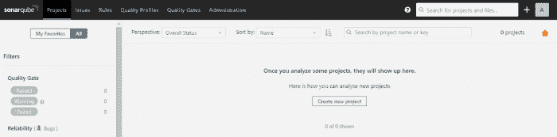
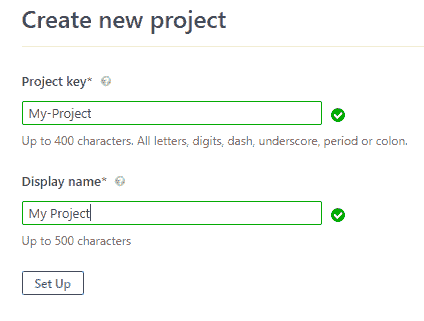
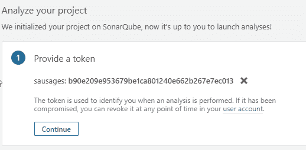
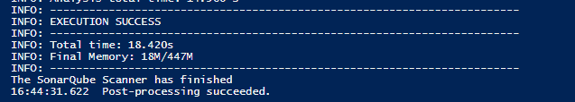
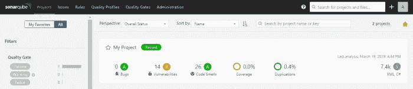
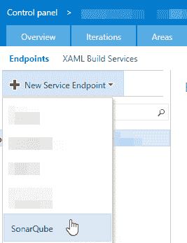
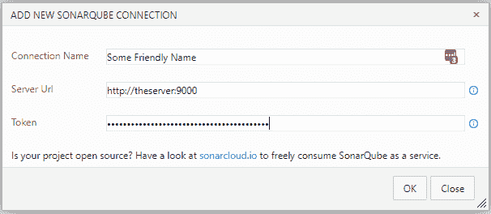
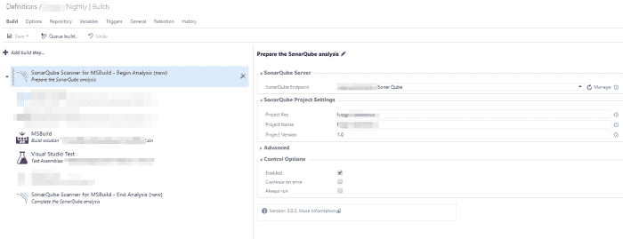
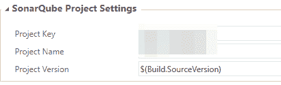

# 🔎📉使用 SonarQube 识别和监控技术债务

> 原文：<https://dev.to/yerac/my-attempt-at-using-sonarqube-for-static-code-analysis-23ck>

这篇文章涵盖了我尝试使用[sonar cube](https://www.sonarqube.org/)作为独立安装来定期执行静态代码分析。这将包括纯粹的让工具工作，也许我会在以后的文章中学习如何使用这些数据？

我将在一个非常狭窄的焦点上做这件事，这是我目前正在做的项目。NET 堆栈，编译运行在 VSTS 使用 MSBUILD。

SonarQube 在解决方案构建过程中运行代码分析，并提供一个 web 仪表板，显示代码味道、安全漏洞、重复等信息。我的目标是用它来识别技术债务，以及跟踪债务随着时间的推移而减少。

注意，你也可以很容易地将它与 Azure Dev-ops 挂钩，只需几次点击和更少的设置，但我想在我们自己的基础设施上零成本地托管该工具。我也相信如果你是开源的，你可以免费使用他们的云版本。

我的目标是:

*   要安装/设置 SQ 的自托管版本
*   让它在本地解决方案上运行
*   找出如何将这一点与我们的 VSTS 建设流程挂钩(如果可能)

## 入门

首先，我下载并提取了 SQ(社区版)的免费自托管版本，并将其放在我们的一个构建服务器上。这个包本质上是一个自托管的应用程序，按照 2 分钟的入门指南[这里](https://docs.sonarqube.org/latest/setup/get-started-2-minutes/)，在这 2 分钟内让仪表板运行起来真的很容易(只要满足系统要求——看起来你只需要安装一个最新的 Java JRE/JDK)

按照上面的指南，启动您选择的 shell/batch 脚本，然后您可以导航到 [http://localhost:9000](http://localhost:9000) 并看到 SonarQube 仪表板要求您创建一个新项目。

[](https://res.cloudinary.com/practicaldev/image/fetch/s--KAAU1yjy--/c_limit%2Cf_auto%2Cfl_progressive%2Cq_auto%2Cw_880/https://i0.wp.com/yer.ac/blog/wp-content/uploads/2019/03/image.png%3Fresize%3D700%252C173)

创建新项目时，系统会提示您输入项目关键字和显示名称。该键将用于集成，显示名称将是显示在仪表板上的名称。

[](https://res.cloudinary.com/practicaldev/image/fetch/s--YlKUWpY---/c_limit%2Cf_auto%2Cfl_progressive%2Cq_auto%2Cw_880/https://i1.wp.com/yer.ac/blog/wp-content/uploads/2019/03/image-1.png%3Fw%3D840)

接下来是代币。该令牌用于在上传分析文件时进行身份验证，并且可以在以后进行更改和撤销。我只是用单词“香肠”作为例子，但是当你点击“生成”时，它会提供你的令牌。

[](https://res.cloudinary.com/practicaldev/image/fetch/s--7VO06mAA--/c_limit%2Cf_auto%2Cfl_progressive%2Cq_auto%2Cw_880/https://i0.wp.com/yer.ac/blog/wp-content/uploads/2019/03/image-3.png%3Fw%3D840)

接下来，它将告诉您如何为 SQ 配置项目。我是针对. NET 项目(C#、JS 等)这样做的，所以将继续这个例子。

对于将使用 MSBUILD 构建的 C#项目，您首先需要“**[sonar scanner for MSBUILD](https://docs.sonarqube.org/display/SCAN/Install+the+SonarScanner+for+MSBuild)**”。SonarScanner 是一个执行分析的工具，它在 MSBUILD 开始之前开始，然后结束，并在结束时整理结果以发送到服务器。

这个工具可以放在任何地方，但是需要将文件夹添加到您的 windows 环境的路径中。

在这一点上，我们可以做一些 powershell 来测试它是否正确连接！(您也可以使用构建前/后事件，但这对于测试来说要简单得多)在这个示例中，我们将 CD 放入 SLN 所在的目录，使用我们之前的项目名称和密钥启动 scanner 工具，并构建我们的解决方案文件(在 rebuild 中)。最后我们将结束扫描。

```
cd 'C:\path to your SLN'
 SonarScanner.MSBuild.exe begin /k:" **My-Project**" /d:sonar.host.url="http://localhost:9000" /d:sonar.login=" **Your Key**"
 msbuild **MySolution.sln** /t:Rebuild
 SonarScanner.MSBuild.exe end /d:sonar.login=" **Your Key**" 
```

Enter fullscreen mode Exit fullscreen mode

请注意，这假定您的 PATH 变量中有 scanner 和 MSBUILD。如果没有，可以直接调用 exe。注意 MSBUILD exe 位于 C:\ Program Files(x86)\ Microsoft Visual Studio \ \ \ MSBUILD \ \ Bin \ MSBUILD . exe，我相信 SQ 需要 MSBUILD 12 及以上版本——我目前使用的是 15.0。

如果我们运行此程序，将需要一些时间来启动，完成时间长短不一(主要取决于您的解决方案的规模)。在最后你会看到一行“执行成功”,如果你还开着你的 dash，你可能会看到它更新。

[](https://res.cloudinary.com/practicaldev/image/fetch/s--ziqF6OGm--/c_limit%2Cf_auto%2Cfl_progressive%2Cq_auto%2Cw_880/https://i1.wp.com/yer.ac/blog/wp-content/uploads/2019/03/image-4.png%3Fw%3D840)

如果您导航回 [http://localhost:9000](http://localhost:9000) ，您现在应该看到您的项目。请注意，如果您的 sln 特别大，您可能只会在导入分析文件时看到“后台处理”消息。

<figure>[](https://res.cloudinary.com/practicaldev/image/fetch/s--222zym0H--/c_limit%2Cf_auto%2Cfl_progressive%2Cq_auto%2Cw_880/https://i0.wp.com/yer.ac/blog/wp-content/uploads/2019/03/image-5.png%3Fresize%3D700%252C152) 

<figcaption>
</figcaption>

</figure>

这是好消息！然而，在仪表板的底部有一个不祥的警告，它写道

> 嵌入式数据库应仅用于评估目的。嵌入式数据库无法扩展，不支持升级到 SonarQube 的新版本，也不支持将数据从其中迁移到不同的数据库引擎。

这很容易解决，只需为 SQ 提供一个后备数据库。然而，你将失去迄今为止的所有进展。

## 超越概念的证明。

因此，我们可以在我们的构建/部署管道中使用它，我希望将它连接到数据库，并安装到我们的一台服务器上，最后让我们的一个 CI 构建运行它！

除了我们还必须在 Windows 防火墙上为 TCP 端口 9000 打一个洞以便可以远程访问之外，将提取的文件放在服务器上的过程与上面相同。现在运行 start batch 脚本会将您带到与之前相同的仪表板和警告，这是我们想要避免的，因此我们需要连接一个数据库。

对于数据库，我将使用 2016 年托管的 MS SQL。您可以找到其他数据库类型(MySql、Oracle 等)的文档。)在 SQ 文档上。

首先，我在 SQL 2016 服务器上创建了一个名为“Sonar cube”的空数据库，还创建了一个名为“Sonar”的新 SQL 用户，他是 Sonar cube 数据库上的 dbo。

回到 SQ 安装，在\ sonarqube \ conf 文件夹中有一个 *sonar.properties* 文件。在这里我们需要添加以下:

```
sonar.jdbc.url=jdbc:sqlserver://myserver;databaseName=SonarQube
 sonar.jdbc.username=sonar
 sonar.jdbc.password=thepassword 
```

Enter fullscreen mode Exit fullscreen mode

**注意:**如果像我一样，您的 SQL 实例被命名为“server\instancename”，那么您需要对实例前的斜杠进行转义，这样它就像“server\instancename”。产生的错误不会导致 SQ 无法启动，这是一个痛苦的原因！

接下来，我想让我的 VSTS 构建自动运行分析并处理它。我希望这是部门 CI 构建的一部分，但由于项目的规模，它需要 30 分钟以上才能完成，所以我们将其移至夜间构建。

现在，您应该能够再次启动 SQ，而不会在页脚看到横幅。应该像以前一样创建一个新项目。

由于我们在内部使用 TFS/VSTS，本指南将展示如何使用自托管 TFS。还有很多更深入(也更有用！)SQ 文档上的指南[此处](https://docs.sonarqube.org/display/SCAN/Analyzing+with+SonarQube+Extension+for+VSTS-TFS)。继续之前需要采取的步骤是:

*   下载适合您的 https://github.com/SonarSource/sonar-scanner-vsts/releases 版本的 TFS/VSTS 的 SQ VSTS 扩展
*   安装 TFS 分机
*   将扩展添加到集合中。

一旦安装了扩展，您应该会看到两个新的构建步骤:

*   MSBUILD 的 SonarQube 扫描仪–开始分析
*   MSBUILD 的 SonarQube 扫描仪–最终分析

在使用这些功能之前，您需要配置 SQ 端点。为此，您可以转到集合管理页面，然后转到“服务”选项卡，或者将“sonar cube Scanner For MSBUILD–Begin analysis”构建步骤添加到您的 VSTS 构建中，然后单击“管理”服务器面板。在这里，你可以点击“新服务端点”,然后点击“SonarQube”

[](https://res.cloudinary.com/practicaldev/image/fetch/s--_IbqQLff--/c_limit%2Cf_auto%2Cfl_progressive%2Cq_auto%2Cw_880/https://i1.wp.com/yer.ac/blog/wp-content/uploads/2019/03/image-6.png%3Fw%3D840)

当您添加一个新的 SQ 端点时，您可以使用一个友好的名称、仪表板的 URL 和您为项目/用户设置的令牌来配置它(很像以前的 powershell 脚本)

[](https://res.cloudinary.com/practicaldev/image/fetch/s--3QRq1o5s--/c_limit%2Cf_auto%2Cfl_progressive%2Cq_auto%2Cw_880/https://i2.wp.com/yer.ac/blog/wp-content/uploads/2019/03/image-7.png%3Fw%3D840)

现在如果你回去编辑你的构建定义。您将能够在构建操作的开始和结束任务中使用 Sonar Qube(同样，很像早期的 powershell)

[](https://res.cloudinary.com/practicaldev/image/fetch/s--kl900qME--/c_limit%2Cf_auto%2Cfl_progressive%2Cq_auto%2Cw_880/https://i2.wp.com/yer.ac/blog/wp-content/uploads/2019/03/image-8.png%3Fresize%3D700%252C269)

要设置它，选择前面配置的 SQ 端点，然后在 Project Settings 下，适当地设置项目键和项目名(基于 SQ 中项目的设置方式)，最后，在“Advanced”下，选中“Include full analysis report in build summary”。最终分析构建步骤不需要配置。

现在运行它很可能会导致失败，除非承载生成代理的计算机安装了正确的软件。

就像我们对本地版本所做的一样，我们需要下载并设置 SonarScanner，并将其添加到构建路径中。托管代理的服务器也需要运行 MSBUILD **v14 或 v15** (在撰写本文时)。您可以直接从微软的下载页面获得 MSBUILD v15 的独立版本。我花了一段时间才找到，所以这是 v14 的直接链接。(由于另一个问题，我不得不使用它)

[https://download . Microsoft . com/download/E/E/D/eedf 18 a 8-4 aed-4c E0-BEBE-70a 83094 fc5a/build tools _ full . exe](https://download.microsoft.com/download/E/E/D/EEDF18A8-4AED-4CE0-BEBE-70A83094FC5A/BuildTools_Full.exe)。希望这是 14.0.25420.1 的正确版本

现在，如果您运行您的构建，它应该(希望)产生一些输出。在这个阶段，我确实遇到了一些错误，这可能只是我有点孤陋寡闻(并且没有真正阅读文档……)

## 我遇到的一些“问题”

*   如前所述，包含斜杠的 MS SQL server 名称必须进行转义，它所抛出的错误并不表明是这种情况！
*   奇怪的，模糊的信息。分析器 SonarAnalyzer 的一个实例。不能从 SonarAnalyzer.CSharp.dll 创建 rules . cs harp . threadstaticwithininitializer，这实际上与此无关，实际上与 MSBUILD 版本有关。直到我看到[这个](https://community.sonarsource.com/t/new-install-warning-cs8032-an-instance-of-analyzer-sonaranalyzer-rules-csharp-donothidebaseclassmethods-cannot-be-created/1536/8)帖子，我都快气炸了，帖子上说你需要来自更新 3 (14.0.25420.1)的 MSBUILD v14+，而我用的是 MSBUILD v14，而不是 14.0.23107.10。
*   MSBUILD 版本问题。构建可以工作，但是 SQ 分析会失败，并显示一个关于支持的 MSBUILD 版本的错误。为了解决这个问题，我确保 VSTS 版本中的 MSBUILD 步骤使用了一个参数 */tv:14.0* ，以确保它将使用一个特定的版本。
*   由于节点 JS 版本(*错误:仅支持 Node.js v6 或更高版本，获得<版本>，无法对 CSS 文件完成静态代码分析。不会分析任何 CSS 文件。*)。只需将最新的 nodeJS 安装到托管代理的服务器上。
*   暂停！这只是我的一个问题，因为项目 LOC 有几十万个，所以它会生成一个大日志。(*# #[错误]分析没有在规定的 300 秒时间内完成。考虑将构建变量 SonarQubeAnalysisTimeoutInSeconds 设置为一个更高的值*。)要解决这个问题，您需要在 VSTS 构建中添加一个名为“SonarQubeAnalysisTimeoutInSeconds”的构建变量。我尝试将其设置为零(通常为“无穷大”)，但随后我得到了“*# #[错误]分析没有在分配的 0 秒时间内完成*”。我找不到任何关于最大值的可靠信息，所以为了安全起见，把我的设置为 20 分钟。

## 结论:

最后，(对我来说)经过一些小修小补，一切都正常了。当我扫描 google/stackoverflow 时，似乎有些人和我有同样的问题，所以我第一次尝试时并不觉得太糟糕！

我们的每夜构建现在将一些可爱的代码分析输出到仪表板上，我已经与团队分享了这些分析，结果正在反馈到我们有待解决的技术积压中。我打算让它运行至少一个月，看看我们是否能真正使用它。

稍后也许会有更多结果？

这并不是一个完整的一步一步写出来的，更像是我试图学习新事物时的一个意识流，但希望它能帮助某人，即使那是未来的我，当我回来重新记住它是如何工作的。

* * *

**更新** : *今天早上我意识到 SonarQube dash 上的项目版本从未增加或更改，这意味着如果不交叉引用日期和签入历史，很难检查问题何时实现。如果您在 Begin Analysis 步骤中设置了“项目版本”,那么内置变量$(Build。SourceVersion)您将获得作为版本运行的变更集。*

[](https://res.cloudinary.com/practicaldev/image/fetch/s--TEjBFESS--/c_limit%2Cf_auto%2Cfl_progressive%2Cq_auto%2Cw_880/https://i1.wp.com/yer.ac/blog/wp-content/uploads/2019/03/image-9.png%3Fw%3D840)

帖子[我尝试使用 SonarQube 进行静态代码分析](http://yer.ac/blog/2019/03/19/my-attempt-at-using-sonarqube-for-static-code-analysis/)首先出现在[yer . AC | Adventures of a developer 和其他东西上。](http://yer.ac/blog)。