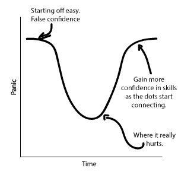
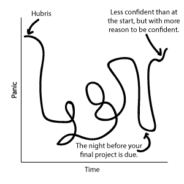
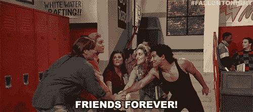

# 我的训练营经历

> 原文：<https://dev.to/nikacodes/my-bootcamp-experience-4jh>

## 之前

在我开始我的编码训练营的前一天，这是我的车的样子:

<figure>

<figcaption>Don't worry, my insurance covered it and I got it fixed before the end of the month.</figcaption>

</figure>

在接下来的三个月里，这不会是我唯一的汽车故障，但肯定会是最糟糕的。我不记得我生气或难过，只是叹了口气，然后把它加到我长长的待办事项清单上。

在不到 24 小时的时间里，我将在大会(General Assembly)上开始沉浸式 Web 开发。不用说，我脑子里还有很多其他的事情。比如在接下来的三个月里，我每周五天从巴尔的摩通勤到 DC，上 9 到 5 节课，学习 10 多种不同的编程语言和实践。

在 2018 年的过程中，我一直在评估我的生活，我在哪里，我想去哪里，*我想要什么*。大学没有回答这些问题，所以我不愿意回到任何正规学校。

我得益于自学 HTML、CSS 和一些 JavaScript，所以编码和逻辑对我来说并不陌生。事实上，当我申请 GA 时，我是一名自由职业的前端/电子邮件开发人员。我喜欢这份工作，但没有足够的信心申请任何全职职位。

在与出于类似原因完成了类似项目的朋友交谈(也就是说，他们职业生涯中的一次彻底检查)并研究了符合我条件的项目(具体来说，我想要一次亲身经历)后，我申请并被 GA 录取。

## 期间

说 GA 确保我们有现实的期望可能是一种保守的说法。在审查我们的 HTML、CSS 和 Javascript 前期工作时，他们确保我们理解了我们注册的目的。

他们选择用图表来说明这一点:

有几天下午 4 点左右，我不知所措，无法接受更多的信息，只能在火车上听静态音乐或器乐。

我的班级很快意识到这不会像我们经历过的任何其他班级设置那样运作。在我们满意之前，老师不可能深入回答每一个问题，否则我们将无法涵盖课程中的所有内容，并且在时间表中没有任何空间来弥补任何损失的时间。

如果有些东西在课堂上没有涉及到，除了课后布置的补充作业之外，我们还得做额外的跑腿工作。

整整三个月后，我现在可以自信地说，它更像这张图:

我很幸运有这样耐心的老师，他们尽最大努力回答我们的问题，而不会占用我们太多的时间。

在某种程度上，要求我们自己学习材料有助于培养一种自立的意识，这种意识将伴随我们整个开发生涯。

## 在 GA 学到的经验教训

#### (那不仅仅是编码)

### 睡眠很重要。

牺牲睡眠可能有助于完成一两个作业，这大大降低了我在课堂上精神集中的可能性。更不用说有多少次我睡觉时抱怨一个问题，然后醒来，用全新的眼光看待它，并在几分钟内解决它。

### 交朋友。

虽然有时当权威人士告诉我“这是我教过的最好的班级”时，我可能会持怀疑态度，但当涉及到我的同学时，我多少会相信他们。我们是不同力量的强强组合，彼此互补得非常好。它不仅强调了团队编码的优势，而且当我们的课程变得特别具有挑战性时，它也有助于人们同情。

### 诚实

和你自己。和你的老师一起。知道什么时候斗争是帮助你还是阻碍你。知道自己的极限。让你的朋友知道你过得怎么样，而不仅仅是在事情进展顺利的时候。

因为事实是:没有人希望你失败。不是你的家人，不是你的朋友，不是你的训练营。每个人都希望你过上最好的生活，但是他们帮不了你，除非你在需要帮助的时候告诉他们。

我在 GA 的时间还没开始，我就告诉了一个不在这个项目中的好朋友我认为事情会如何发展。

> “我可能会开始超级兴奋，然后杀了它。接下来是漫长的中期，你会有几个星期见不到我，如果你看到了，我会看起来像不死之身。然后，当我接近终点线时，当我几乎完成时，我会准备放弃一切，因为我会迫不及待地继续下一步。”

你瞧，它几乎和我预测的一模一样。当我还有两个星期就要毕业的时候，我的朋友耐心地提醒我，我已经预测到了这一切，并给了我一次急需的鼓励。

## [后](#after)

完成 GA 后的轻松感很快被找工作的焦虑所取代。现在，当我告诉你我找工作花了多长时间的时候，你可能会翻白眼，但是找一份没有固定收入来源的工作把我带到了一个非常黑暗的地方。我饱受焦虑和抑郁之苦，当拒绝，无论多么礼貌，开始滚滚而来时，这是很困难的。

我非常依赖我的朋友，当我毕业后仅仅两周就愉快地接受了一份工作时，他们非常乐意提醒我一切是如何进行的。

我很高兴能够说，我接受了美国海岸警卫队 JavaScript 开发顾问的职位，老实说，这感觉很不真实。

这也意味着 DC 和我还没完！

我非常感激在 GA 的这段经历以及以任何方式支持我的每一个人。我迫不及待地想知道我人生的下一个篇章会是什么。

## 一些数字

**143** 小时的交通(大致)
**38** 天的正式指导
**36** 小时的有声读物听了
**20** (稍纵即逝)天的专注项目
**5** 中度病休的日子
**4** 有价项目
**3** 舞蹈活动我所在的工作人员
**2** )
**1**web 开发工作！