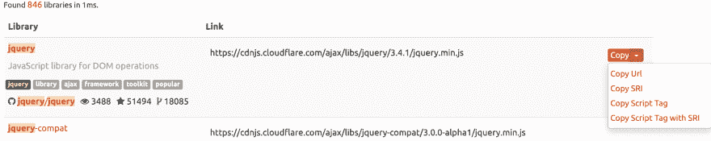

# 我对 CDNJS 的贡献

> 原文：<https://dev.to/glennmen/my-contribution-to-cdnjs-53fd>

**🎉7 个月后，我的公关被并入 [CDNJS](https://cdnjs.com/) ！🎉**

## 先稍微介绍一下 CDNJS

CDNJS 是一个公共 CDN，托管了大多数(如果不是全部)流行的库(JavaScript，CSS，...).因此，您可以非常容易地在 web 应用程序中包含一个库。如果你不熟悉 NPM，构建或捆绑脚本，或者如果你只是想使用公共 CDN 制作一个小型静态网站是一个不错的选择。你也不必自己保存文件，这可能会降低带宽成本。

使用 CDNJS 的另一个好处是它使用了 Cloudlfare，因此一个库可能会缓存在你附近的一个边缘服务器上，这导致了更快的响应时间，也可能会提高你的网站加载速度。

它也是开源的，对我来说这是一个很大的好处。

## 为什么是 CDNJS？

当然还有替代方案(不打算说付费 CDN 提供商)。
几个众所周知的可能是[谷歌托管图书馆](https://developers.google.com/speed/libraries/)和 [jQuery CDN](https://code.jquery.com/) ，它们的问题是它们只托管非常精选的图书馆。

[jsDelivr](https://www.jsdelivr.com/) 接近 CDNJS。他们还托管几乎所有流行的库，并与其他 CDN 提供商结合使用 Cloudflare。这可能看起来更好，但正因为如此，他们有额外的层来路由 CDN 提供商之间的请求。[这里有一些我找到的关于这个的信息](https://github.com/cdnjs/cdnjs/issues/7715)，但是请注意，它是由一个 CDNJS 维护者写在 CDNJS Github 上的(但他也是 jsDelivr 的贡献者)。
这篇文章来自 2016 年，所以不知道它是否正确。也许有人可以在评论中提供更多信息。

[如此处所示](https://w3techs.com/technologies/comparison/cd-cdnjs,cd-jsdelivr,cd-googlelibraries,cd-microsoftajax,cd-jquerycdn) CDNJS 比 jsDelivr 使用得更多，因此可能会增加边缘服务器的缓存命中率，从而加快响应时间。

## [T1】我的公关](#my-pr)

这实际上始于 2017 年 12 月，当时我在 Twitter 上问为什么 CDNJS 没有 SRI，它有，但不在搜索结果页面上。在这里，彼得·戴夫挑战我为它做一个公关。

> 格伦卡雷曼斯@格伦卡雷曼斯[@ cdnjs](https://twitter.com/cdnjs)[@ cloud flare](https://twitter.com/Cloudflare)为什么 cdnjs 没有 SRI？使用 jsDelivr 或者甚至自宿主静态库文件更好吗？2017 年 12 月 22 日上午 09:3900

> 彼得·戴夫·hello͌ͯͦ̉[@ peterdavehello](https://dev.to/peterdavehello)[@ glencarremans](https://twitter.com/GlennCarremans)[@ cdnjs](https://twitter.com/cdnjs)[@ cloud flare](https://twitter.com/Cloudflare)搜索结果尚未启用，欢迎拉取请求🙂2017 年 12 月 22 日下午 14:2100

就这样快进了将近一年，到了 2018 年 10 月，我发现了 Hacktoberfest，想贡献一份力量。完美的项目！

我从未在 Node.js 中做过任何事情，所以在开始工作之前，需要一些时间在本地设置项目。谢天谢地，网上有很多信息，最后甚至没有那么难。所以我做了我的公关，我等了又等...我对彼得·戴夫没有恶意，我也遇到过同样的情况。为某事腾出时间可能很难。但最后，上周彼得能够审查和测试我的公关，它得到了合并！

# [ 【网站】在库搜索结果  #251](https://github.com/cdnjs/new-website/pull/251) 中增加了“用 SRI 复制脚本标签”选项

 **[Glennmen](https://github.com/Glennmen)** posted on [<time datetime="2018-10-06T11:19:02Z">Oct 06, 2018</time>](https://github.com/cdnjs/new-website/pull/251)

我确实有 JS 方面的经验，但这是我第一次使用 Node.js 项目。如果我犯了什么错误，我会完全理解的。

所以我实际上在大约一年前就已经在推特上“报道”过这件事了，并且 T2 的@peterdavehello 要求我为这件事做一个公关。我从来没有忘记它，现在因为 Hacktoberfest，我决定花些时间来尝试它。

我还看到了一些关于同一问题的公开问题:修复#152 SRI 对搜索结果的支持修复 cdnjs/cdnjs#12746 添加带 SRI 选项的复制脚本标记

[View on GitHub](https://github.com/cdnjs/new-website/pull/251)

所以现在每个人都可以直接从搜索结果中快速复制一个包含 SRI 信息的图书馆链接。

[链接到 CDNJS](https://cdnjs.com/)