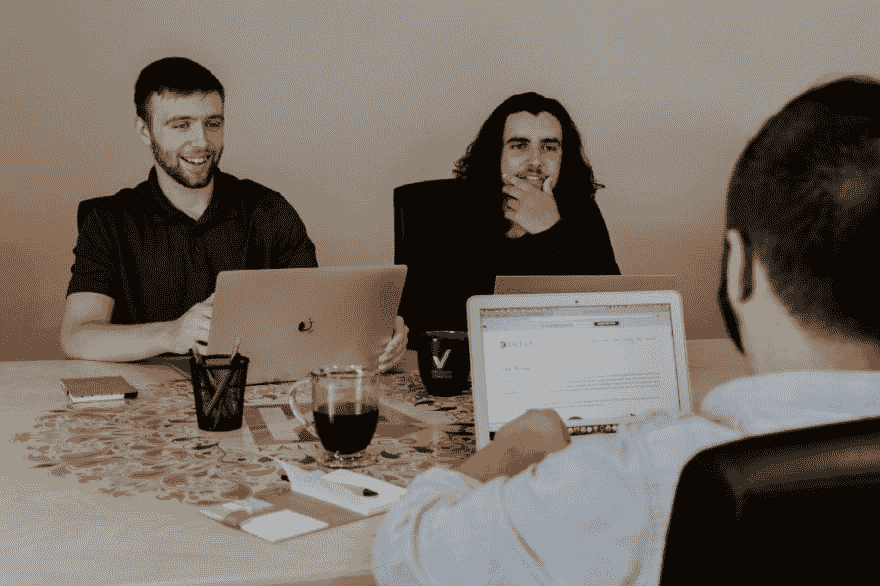

# 我的开发人员面试原则

> 原文：<https://dev.to/vorahsa/my-developer-interviewing-principles-3k67>

<figure> 

<figcaption>照片由[万花筒](https://unsplash.com/photos/RDYdOvk8ats?utm_source=unsplash&utm_medium=referral&utm_content=creditCopyText)上 [Unsplash](https://unsplash.com/search/photos/meeting?utm_source=unsplash&utm_medium=referral&utm_content=creditCopyText)</figcaption>

</figure>

作为一名高级开发人员，我工作的一部分是对未来公司的开发人员职位的候选人进行技术面试。开发人员面试在互联网上是一个被广泛讨论的话题，随着时间的推移，通过这些讨论和思考我想看到的东西，我已经形成了一种风格。在这篇文章中，我试图将这种风格提炼为一套原则，在我面试的任何时候都要遵循。

### 面试不是考试

在面试中，我在评估你的开发者知识。这类似于考试，也是对自己知识的评估。但是一门考试被限定在一个特定的知识领域，这就使得为它“填鸭式”考试成为可能。面试应该涵盖比考试更广泛的领域，也应该比典型的考试更具互动性。

事实上，我认为如果有可能或有必要为面试而临时抱佛脚，那就是糟糕的面试。我在面试中的任务是确定候选人是否具备我的公司需要的开发人员的技能。如果我参加了一个可以临时抱佛脚“通过”的面试，却不具备现实中所需的技能，那我就犯了一个潜在的代价高昂的错误。

当我第一次寻找开发人员职位时，我就遵循了这个原则。我从来没有为面试做准备。我只是走进去，做我自己，根据我当场想到的回答问题，而不是给出事先准备好的答案。我觉得我不想在这种方法行不通的公司工作。

### 面试不是审问

有些面试官似乎把面试当成了审问。他们以连珠炮式的方式提问，只希望得到简短的回答，并列出一份具体的清单。我不喜欢这样做事。大部分时间我都试着让你说话，因为我觉得这样我才能从你身上得到最好的评价。我会试着从你的回答中挑选出具体的要点，并就这些要点提出后续问题，让面试更像是一场讨论，而不是问答。

这并不意味着我没有准备好的问题清单。列出一个具体的清单，清楚地知道应该得到什么样的答案，有助于确保对不同的候选人进行类似的评估。不同的是，我的问题通常没有简单的答案，所以它们更多地是作为讨论的开始，有可能跟进到你精通的任何水平。

### 应该没有一个正确答案

软件开发不是一门精确的科学。即使是这样，变量的数量也是如此之大，以至于即使是非常相似的问题也可能需要非常不同的解决方案。一个实际问题很少每次只有一个正确的答案。因此，我更喜欢开放式的问题，有许多可能的解决方案，而不是我想寻找一个非常具体的答案的问题。

是的，这意味着我不会问关于语言语法或库的细节。我确实希望开发人员具备这些方面的工作知识，但是这些知识最好通过编写代码来展示，而不是回答关于它们的问题。当我关心一些库的功能时，比如说，我更喜欢介绍一般的问题，讨论它，看看你是否知道解决这个问题的通用库或方法。我不指望你知道准确的函数，更不用说它们的语法了，但是对功能的了解是可以预期的。

### 我的观点并不是唯一正确的

即使记住前面的观点，我们开发人员也倾向于选择最喜欢的。对于常见的问题，我们倾向于寻求特定的解决方案，假设它们不是不可行的。我承认我和你都会有这些最爱，而且我们可能选择了不同的。只要你表现出熟悉你的解决方案，包括它的潜在缺点，如果我们没有选择相同的解决方案，我不会因此而反对你。

通常，无论我问什么，你都不会找到我的意见。知道我喜欢什么很容易让你偏向给出那个答案，即使你更喜欢别的。那会让我更少地了解你的想法。所以我尽量保持我的问题中立，我尽量意识到任何潜在解决方案的缺点，并询问你将如何解决它们。

### 有时我会问一些糟糕的问题

我实际上没有偶尔问坏问题的原则…但我们都是人，无论我试图遵循什么崇高的原则，我都会犯错误。对我来说，重要的是认识到我问了一个糟糕的问题，把责任推到我自己身上，而不是因为你不理解我要做什么而惩罚你，并为未来从中吸取教训。

当我发现我问了一个糟糕的问题时，最重要的是让你放松。无法回答面试问题很容易让人觉得你失败了。所以我不会继续前进。我会试着重新措辞我的问题，如果需要的话进行澄清，如果合适的话，承认这不是一个好问题。我们不是机器人，作为一名面试官，承认自己会犯错误对我来说是件好事。

### 我不在乎你在压力下表现如何

求职面试是一个充满压力的场合。但作品本身不应该是这样的。如果你在工作中一直处于压力之下，那么环境中一定有什么问题需要解决。所以在面试中给你压力不会告诉我任何关于你的有用信息。例如，这意味着没有实时编码。对你来说，这不是一个典型的环境，我认为时间可以用得更好。

记住上面提到的所有要点也应该有助于减轻压力。当我把面试更多地视为讨论时，根据你所说的提出问题，不要让你回忆细节，这通常有助于让你更放松。但我仍然需要观察，如果你开始看起来有压力，试着适应，因为不是每个人都一样，也不是每个人都有相同的压力阈值。

### 但是我确实想看你的代码

要被聘为开发人员，你应该知道如何编码。正如我上面所说的，我不认为让你在面试中写代码会有所帮助。但我还是要评估你的编码能力。所以这意味着，你需要提供一些你的代码给我看。而且这个要在面试前做好，这样我才能好好考虑。

我不太在乎代码是从哪里来的。可以是你已经做过的事情，也可以是专门为面试用自己的时间做的编码练习。最适合你的。我不会要求你准备展示一个广泛的现有开源产品组合，我认为要求这样做通常是一个坏主意。

面试的大部分时间将花在一起看你的代码上。我将寻找典型的良好编码实践。我会要求你解释为什么你这样设计代码。我将询问您接下来可能需要实现的功能。我会询问具体的代码片段，在这些代码中，我看到了实现目标的多种合理方式。

由于我想问的问题，我倾向于进行一个简短的、2-3 小时的特定编码练习。这样的练习将被定义为需要我们在实际项目中经常遇到的功能，我可以问每个人同样的问题。此外，因为你是在面试前不久写的代码，所以你可能会更清楚。但是只要你提供的代码具有有趣的功能，并且是为了展示你的技能而写的，而不是一个快速的黑客，它就应该是好的。