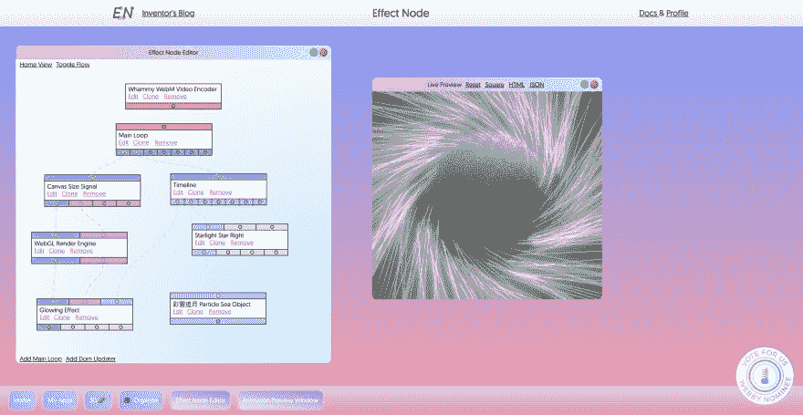

# 我的效果节点被 Webbys Top5 网站提名技术成就耶！

> 原文：<https://dev.to/wonglok/my-effect-node-got-nominated-by-webbys-top5-website-tech-achievement-yay-3jn2>

# 哎呀我的 EffectNode.com

我非常惊讶，我甚至可以赢得威比提名。

[链接到网络投票](https://vote.webbyawards.com/PublicVoting#/2019/websites/features-design/technical-achievement)

请随意尝试库 NPM-I Enos；它在 github 上是完全开源的，也只有前端。

尽情享受吧！woop woop！:D

[https://github . com/effect node/effect node-lib](https://github.com/EffectNode/EffectNode-Lib)