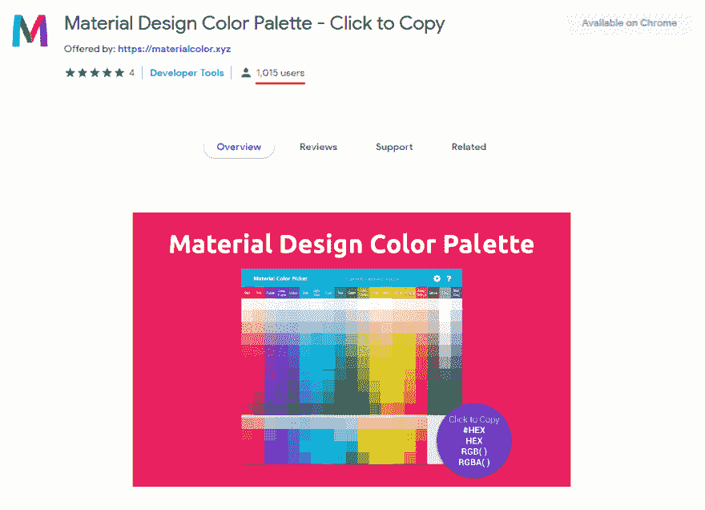

# 我的分机刚刚破 1K 用户！

> 原文：<https://dev.to/jackharner/my-extension-just-broke-1k-users-596l>

我现在兴奋极了！我的材质调色板扩展刚刚突破了一千个用户。这对我来说太疯狂了，我做的东西居然在现实世界中被使用和滥用。我是因为自己的懒惰才把这个东西拼凑起来的，我很自豪我的懒惰激发了这么多人的~~懒惰~~ **效率**。

Chrome 说我有 1015 个用户，Firefox 说我有 63 个，尽管 Chrome 做的是“每周用户”，Firefox 做的是“每日用户”，所以我肯定这就是差额的来源。

如果你想试试，让我知道你的想法(也许在你喜欢的网上商店给我一个⭐⭐⭐⭐⭐？): [MaterialColor.xyz](https://materialcolor.xyz)