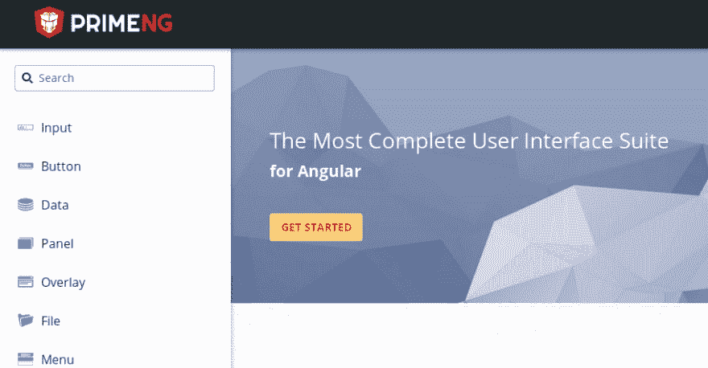
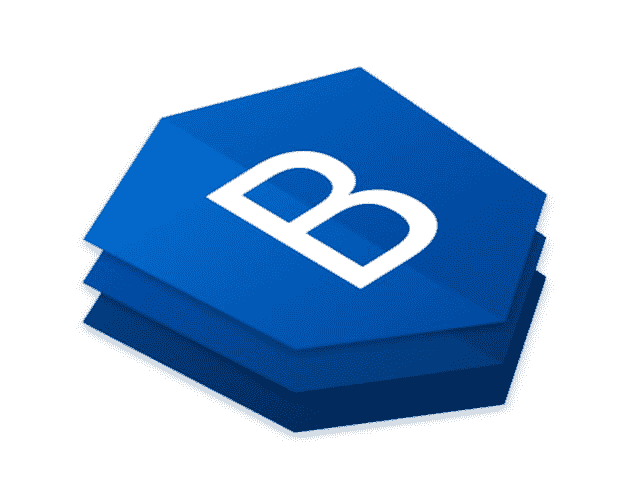
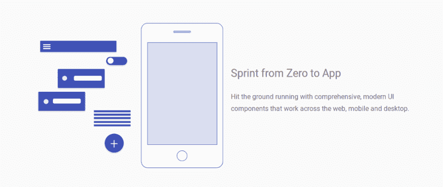
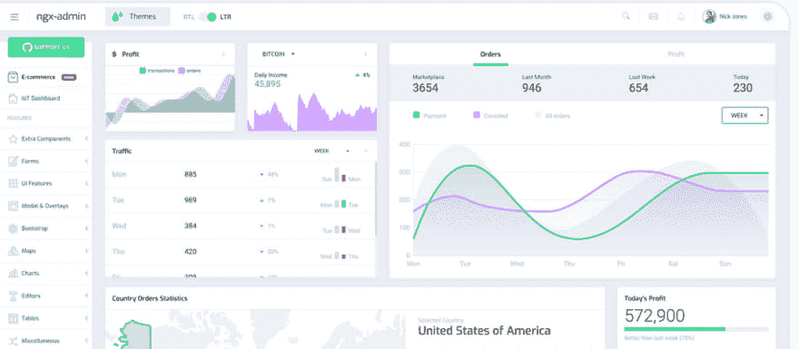
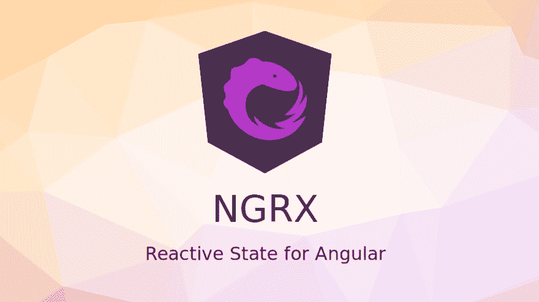
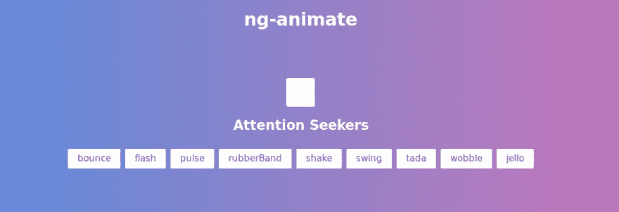
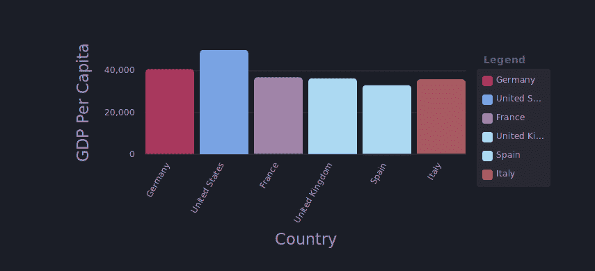
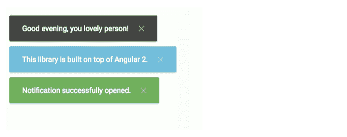
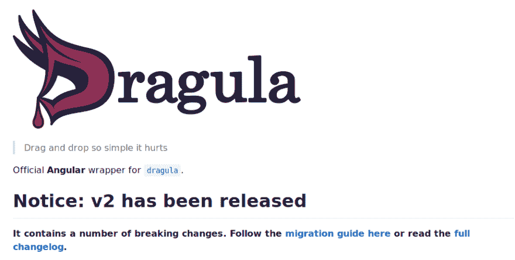

# 我最喜欢在任何项目中使用的角度库

> 原文：<https://dev.to/frostqui/my-favorite-angular-libraries-to-use-in-any-project-47ai>

我在这里用西班牙语写的帖子: [Mejores librerías Angular](https://codingpotions.com/angular-mejores-librerias/)

与许多框架一样，Angular 也有一个由社区创建的库生态系统，最常见的是组件库。在下面的列表中，我将向你展示我个人认为最有趣的。该列表没有遵循任何特定的顺序。

我建议使用真正需要的最少数量的库，因为您失去了对应用程序组件的控制，并且您依赖于库的开发人员来维护这些组件。

## PrimeNG

收集了许多组件，也准备用于移动。它有某些主题，您可以选择这些主题来定制组件的外观。

它有数据显示组件(表格，图形，统计数据等)，许多类型的面板，按钮，菜单，甚至有一个拖放组件，所以你不必为这个功能寻找另一个库。

[官方页面](https://www.primefaces.org/primeng/#/)

## NG 自举

如果你想和 Angular 一起使用 Bootstrap，你可以像在普通页面上一样直接使用 Bootstrap。这样做的问题是，Bootstrap 中使用 JS 的部分对您不适用，因为它们使用的是 Jquery，而它不适合 Angular。如果你需要使用 Bootstrap 的 JS 组件，最好的方法就是使用这个库。

该库包含许多适应 Angular 的引导组件，所以，例如，您可以使用引导下拉菜单，而不必做奇怪的事情。

[官方页面](https://ng-bootstrap.github.io/#/home)

## 有角的物质

最近基于谷歌的设计材料非常流行，这个库让我们可以使用 Angular。

与以前的库一样，它是一套广泛的现成组件。这些部件的特殊性在于它们的设计受到材料设计的启发。

像 PrimeNG 一样，它提供了各种组件，尽管它没有提供很多用于数据可视化的组件。

[官方页面](https://material.angular.io/)

## NGX 管理员

如果我们想在 web 应用程序中包含一个控制面板，最简单快捷的方法就是使用这些组件进行创建。

它有两种颜色主题，一种浅色，一种深色。在其官方网站上，您可以看到一个已经在使用这些组件运行的控制面板的示例，正如您所看到的，尽管它专注于控制面板，但它附带了各种组件。

[官方页面](http://akveo.com/ngx-admin/)

## Ngrx

这个库对于大型应用程序来说是必不可少的，用于在一个叫做 store 的点上管理 web 应用程序的状态。

该系统还允许在组件之间共享数据，并有助于大型应用程序的可维护性。

[官方页面](https://github.com/ngrx/platform)

## NG 禀

在 Angular 组件中使用的小动画。虽然 Angular 自带了一个系统来创建我们自己的动画，但是有一个库可以为我们创建这些动画。

虽然没有多少动画出现，但是那些默认出现的动画在组件被加载的时候就很好了。

[官方页面](https://jiayihu.github.io/ng-animate/)

## NGX 图表

所有类型图的特定组件库。

这些图形是完全可定制的，并且有大量的参数来适应所有类型的页面。

包含的图形类型如下:

*   水平和垂直条形图(标准、分组、堆积、标准化)
*   线条
*   面积(标准、堆积、标准化)
*   英尺(可展开、网格、自定义图例)
*   油炸圈饼
*   测量
*   线性标尺
*   力定向图
*   热图
*   树图
*   数字卡
*   气泡/散点

[官方页面](https://swimlane.github.io/ngx-charts/)

## 角度通知器

角度的通知。虽然您可以创建自己的组件来显示通知，但是该库附带了一些已经配置好的组件:

*   默认
*   成功
*   信息
*   通知；注意
*   错误

此外，通知带有动画，可以隐藏，并可定制各种参数。

[官方页面](https://github.com/dominique-mueller/angular-notifier)

## 德拉古拉

Dragula 是几个框架的库思想，其中就有 Angular。它是一个实现拖放组件和设计的库，也就是说，用户可以在智能手机中用鼠标或手指移动和拖动页面元素的界面。

[官方页面](https://github.com/valor-software/ng2-dragula)

## 结论

还有更多的库，但是我已经把那些我个人认为更有用或者至少是好奇的库放在了这里。Angular 的好处是你不需要安装很多库来创建一个项目，因为 Angular 不像其他框架，默认情况下会提供你需要的所有东西。