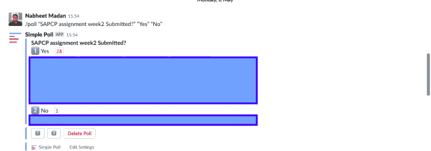
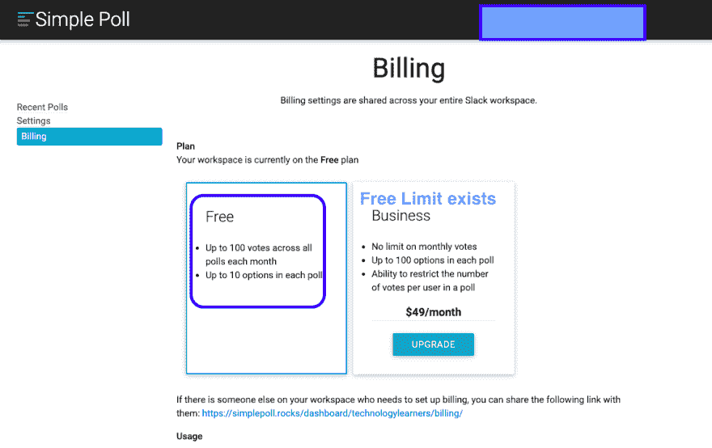
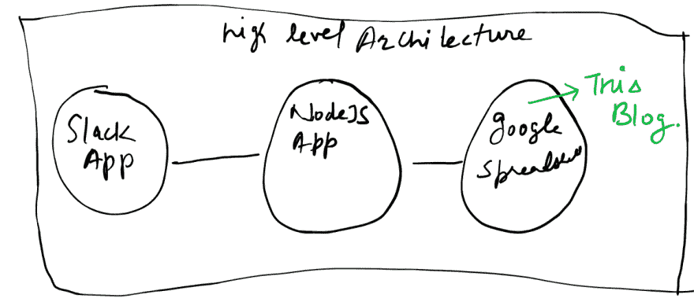
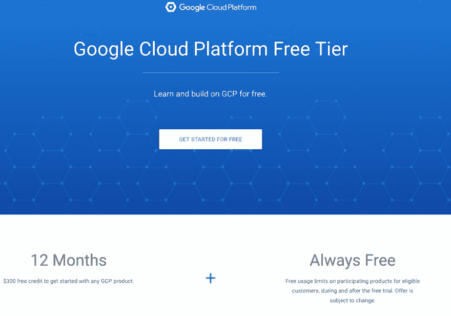
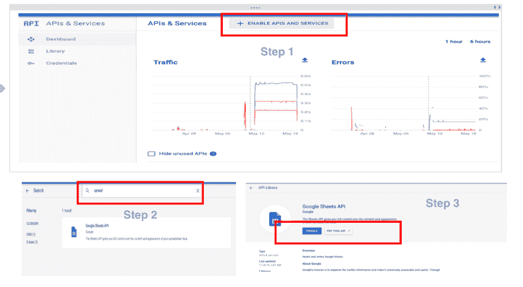
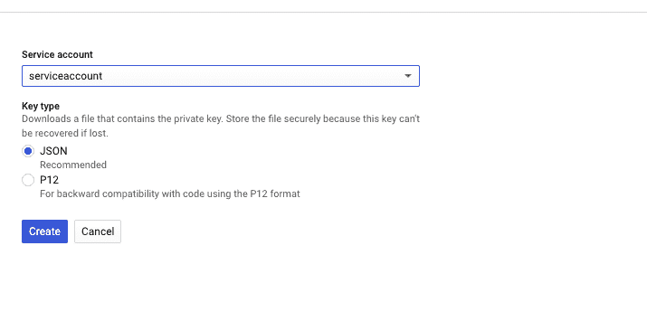
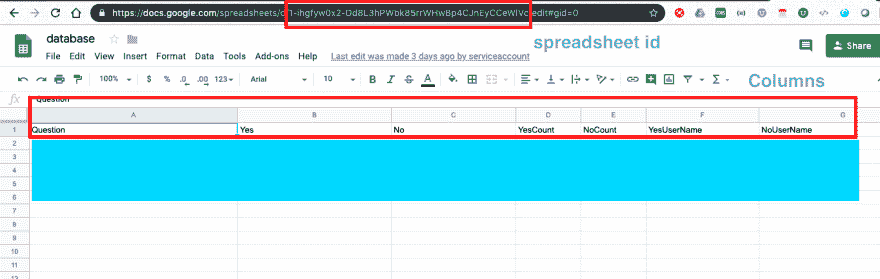

# 我的第一个定制 Slack 应用程序-第 1 部分

> 原文：<https://dev.to/nabheet/my-first-custom-slack-app-part-1-4o6j>

# 博客系列

| 部分 | 描述 |
| --- | --- |
| one | [设置后端](https://dev.to/nabheet/my-first-custom-slack-app-part-1-4o6j) |
| Two | [设置 API 服务器与后端和前端对话](https://dev.to/nabheet/my-first-custom-slack-app-part-2-28p5) |
| three | [设置前端与 API 服务器对话](https://dev.to/nabheet/my-first-custom-slack-app-part-3-4ahh) |
| four | 将应用程序部署到永久的地方 |
| five | 部署到 slack 应用商店的研究 |
|  |  |

# 背景

这是我在这里的第一篇博文，但我一直在默默地从这个伟大的社区中学到了很多。所以最后我认为是时候回报给我们这么多的社区了。最近，我一直在利用空闲时间密切工作。最近有一个需要得到一些小组成员对一些问题的意见。
 
一如既往地，我尝试了几个已经存在的 slack 应用程序，如[简单投票](https://technologylearners.slack.com/apps/A0HFW7MR6-simple-poll)，但遗憾的是没有一个是免费的，如下图所示。

所以我想到我们是开发者，为什么我们不能做一个定制的免费投票应用程序呢？这将有两个好处，一个是，这一组和下一组博客将是关于分享我的经验，同时做同样的事情，希望它可以帮助像我一样的人。我也将分享代码，这样任何人都可以根据自己的需要进行调整。让我们开始吧:)

# 我们打算怎么建？

由于我们希望我们的应用程序大部分是免费运行的，我想到了如下做法。

*   后端使用 [google spread sheet](https://www.google.com/sheets/about/) 存储结果。
*   我们的定制 [NodeJS](https://nodejs.org/en/) 应用程序免费托管在某个地方，它可以与[谷歌电子表格](https://www.google.com/sheets/about/)以及 [slack](https://slack.com/intl/en-in/) 应用程序对话。
*   自定义 [slack](https://slack.com/intl/en-in/) 应用程序与我们的[节点](https://nodejs.org/en/) api 进行对话。

# 设置后端

因此，在第一部分，我们将设置我们的谷歌电子表格和 API，它们可以被即将到来的博客中的 [NodeJS](https://nodejs.org/en/) 应用程序使用。

谷歌云平台为我们提供了 300 美元的免费信用额度，足够我们使用一年。所以让我们继续前进，让我们的[谷歌电子表格](https://www.google.com/sheets/about/)后端启动并运行

1.  创建您的免费 [GCP](https://cloud.google.com/free/) 账户
2.  登录[控制台](https://console.cloud.google.com) - >选择 API 和服务- >仪表板- >点击启用 API &服务- >搜索谷歌电子表格- >启用谷歌电子表格 API 
3.  保存启用 API 后生成的私钥文件。我们的 NodeJS 应用程序将使用它与后端对话。
4.  根据需要创建带有列的电子表格。记下电子表格 id，您将需要在以后的博客中在 NodeJS 后端引用它。

# 接下来是什么？

现在我们的后端已经准备好了，下一步是让我们的 NodeJS 应用程序运行，它将与前端和后端交互。在下一篇博客中，我们将讨论同样的问题。请随时提供您的反馈。