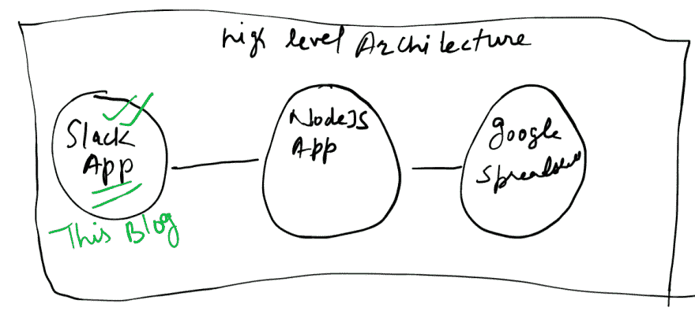
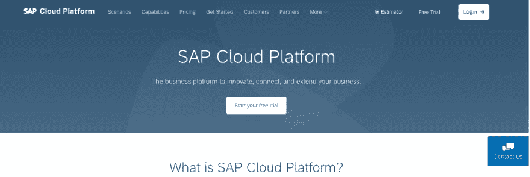
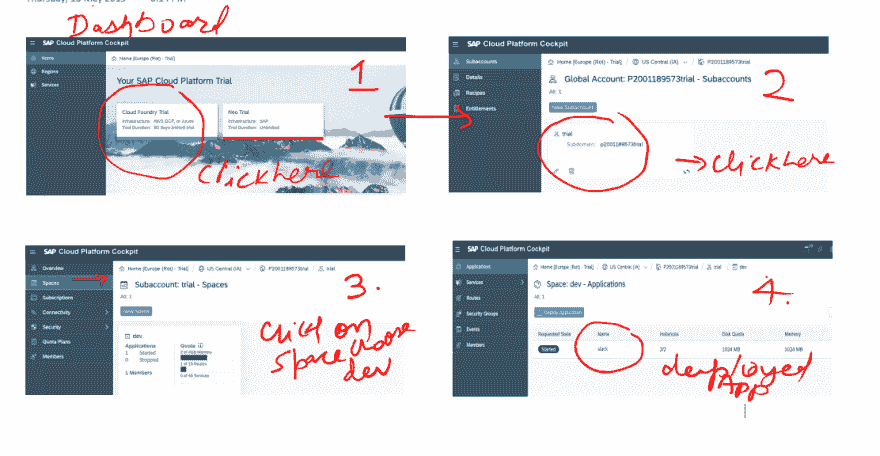
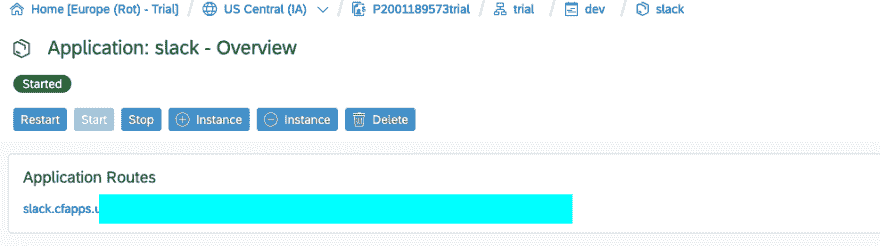
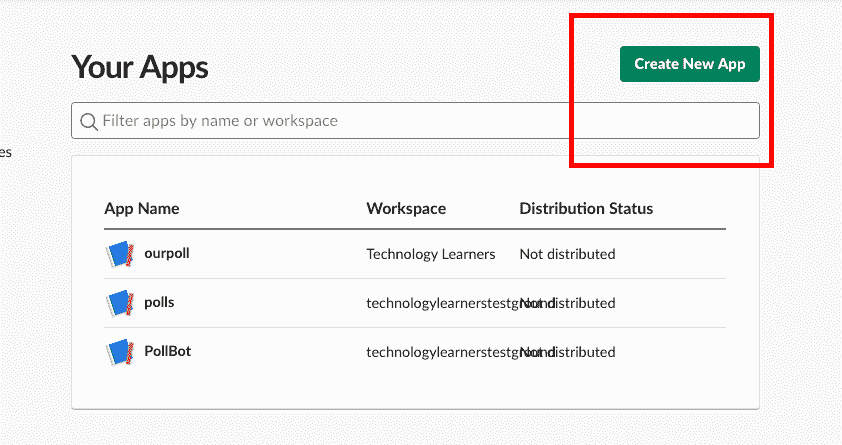
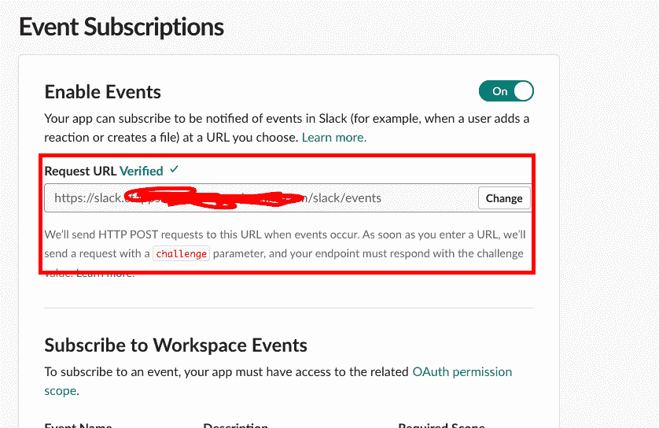
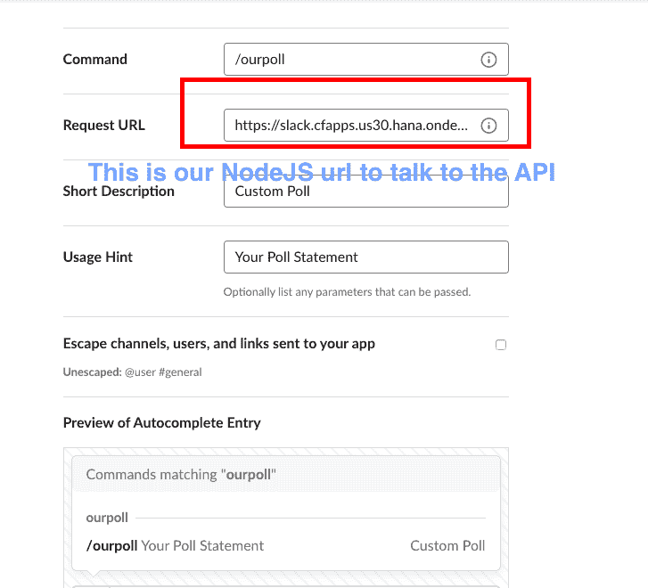
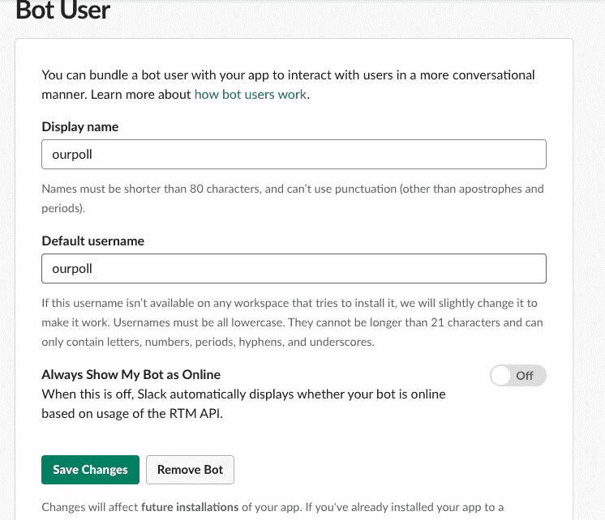
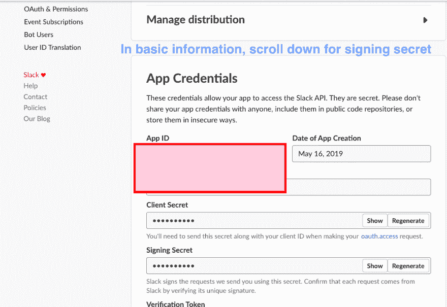
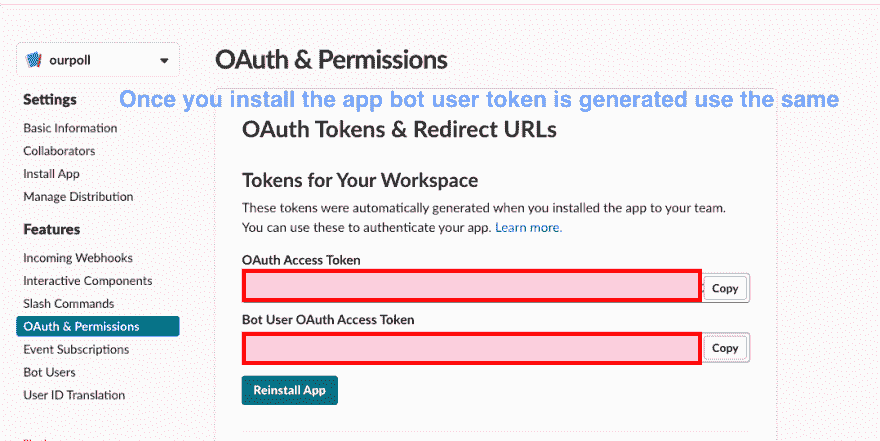

# 我的第一个定制 Slack 应用程序-第 3 部分

> 原文：<https://dev.to/nabheet/my-first-custom-slack-app-part-3-4ahh>

# 博客系列

| 部分 | 描述 |
| --- | --- |
| one | [设置后端](https://dev.to/nabheet/my-first-custom-slack-app-part-1-4o6j) |
| Two | [设置 API 服务器与后端和前端对话](https://dev.to/nabheet/my-first-custom-slack-app-part-2-28p5) |
| three | [设置前端与 API 服务器对话](https://dev.to/nabheet/my-first-custom-slack-app-part-3-4ahh) |
| four | 将应用程序部署到永久的地方 |
| five | 部署到 slack 应用商店的研究 |

# 到目前为止我们做了什么？

在我们之前的[博客](https://dev.to/nabheet/my-first-custom-slack-app-part-2-28p5)中，我们已经设置了我们的 [NodeJS](https://nodejs.org/en/) 应用程序，它将与[谷歌电子表格](https://www.google.com/sheets/about/)对话。现在让我们创建我们的前端 slack 应用程序，它将与我们的 NodeJS 应用程序进行交互，并将本地运行的 NodeJS 应用程序部署到 SAP cloud foundry 试用版。
[](https://res.cloudinary.com/practicaldev/image/fetch/s--ZKQQqN5N--/c_limit%2Cf_auto%2Cfl_progressive%2Cq_auto%2Cw_880/https://thepracticaldev.s3.amazonaws.com/i/ros032he6z5az16pkuto.png)

# 将 NodeJS 应用部署到 SAP Cloud foundry 试用版

在实际设置应用程序之前，我们需要部署我们的应用程序，以便我们可以提供部署的应用程序的回调 url。我来自 SAP 背景，所以使用了 SAP 云平台云铸造试用版，你可以使用任何。

*   转到 [SAP](https://cloudplatform.sap.com/index.html) 并创建一个免费试用版。
*   一旦您的帐户设置完毕，您需要登录，选择 Cloud Foundry 并继续创建和激活步骤
*   您一定已经在前面的图片中看到了部署的 NodeJS slack 应用程序。为了部署应用程序，您首先需要安装 CF CLI，按照本 [SAP 开发人员教程](https://developers.sap.com/india/tutorials/cp-cf-download-cli.html)进行安装。一旦您登录并设置了您的端点，您需要在 NodeJS 应用程序文件夹中执行下面提到的命令来部署应用程序。

```
cf push <app name> -b https://github.com/cloudfoundry/nodejs-buildpack 
```

*   部署应用程序后，您将在控制面板和 CLI 中看到端点。应用程序的此端点将用于设置 Slack app。

# 设置松弛度

现在我们的端点准备好了，让我们设置我们的 slack 应用程序。

*   转到 [Slack app](https://api.slack.com/apps) 并创建一个新的 app。
*   选择您想要激活的特性和功能。因为我们的应用程序有事件、交互组件、斜杠命令，所以我们选择它们。
*   事件设置，请注意我们已经将 **/slack/events** 附加到 URL。
*   斜线命令设置，请注意我们已经将 **/slack/events** 追加到 URL。
*   机器人设置
*   互动动作设置
*   如果你记得在我们以前的博客中，我们使用了签名秘密和令牌，你可以找到它们，如下所示。 

# 现场演示

这是现场工作演示。这是基本版本，可以根据需要进行扩展。
[https://www.youtube.com/embed/hqUKNliSwr8](https://www.youtube.com/embed/hqUKNliSwr8)

# 接下来是什么？

因此，现在我们有了部署到 SAP Cloud foundry 试用版的定制应用程序，下一步是为它找到永久的位置。还有什么比我们的 OpenFaaS 云更好的呢？我们将把这个应用程序部署到 OpenFaaS。