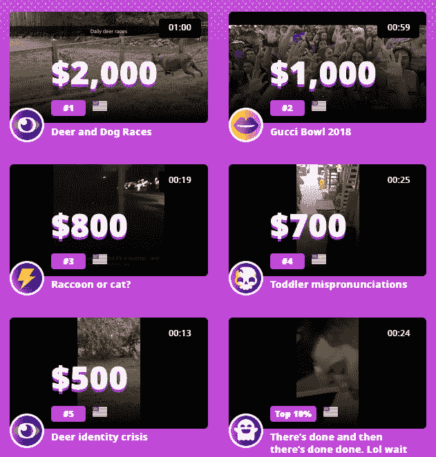

# 我在创业公司的头四周

> 原文：<https://dev.to/sublimegeek/my-first-four-weeks-at-a-startup-ma5>

## TL；博士；医生

人们分享你的职业道德和个人投资，工作时间长，但都朝着一个共同的目标前进。

## 倒影

我是 2015 年 12 月拿到学位的。从那以后，我在一家大型公司工作过，一家试图保持相关性的中型公司，一家生活在媒体应用技术边缘的小型国际公司，最后是一家初创公司。

创业公司有各种形式和规模。这将是我的第一次创业。我习惯了保守的(不是政治上的)企业文化，这是我父亲一直让我做好准备的。我工作的公司太熟悉了。当然，他们让我们想穿什么就穿什么，但你会觉得为此受到了更严格的评判。我从周一到周五朝八晚五地工作。这很安全，但没意思。

## 是什么样子

进入创业文化的西部边疆。有事情要做，但“不是你的工作”？无论如何都要做。现在是你的工作了。是的，你已经戴了三顶帽子了，但是没关系。

这很有趣，令人兴奋，也很有挑战性。我喜欢好的挑战。这也是我第一次使用 React。React 很好玩。我以前用过 Angular 和 Vue，但我觉得知道 React 更有市场。

我已经开始利用我对 DevOps 的公司知识，自动化我的部署管道。

## 企业 vs 创业

公司:我们需要自动化，走得更快！“太好了！让我们把这个推迟到明年，让业务对功能垂涎三尺”

*启动*:我们需要自动化，走得更快！“哦，我刚刚把它合并进去了。我们现在正在推进生产。”

我们刚刚推出了早期访问计划，并且正在为明年年初的大规模发布增加新功能。

时间很长，但我很享受。我可以和优秀的人一起工作，玩我想玩的所有技术。

## 什么叫创业？

看过美国最搞笑的视频吗？想那个，但是更大。我们通过更频繁地发放更多奖品来扰乱视频抽奖活动。

听起来不像一个推销员，我们正在送出一些相当大的钱。

*每周:*赢取高达 100 美元
*每月:*赢取高达 2000 美元
*年终:*赢取高达 50，000 美元

可能是任何东西的视频。你的宠物，一些编程失败，任何事情。获得足够的投票，您可以赢得 5 个奖项之一。

我们是[世界上最棒的视频](https://wgvs.com)

我非常希望开发者社区中有人能赢。

现在，我们需要一些数据和流量。我对你们要求不多，但是如果你们有时间，请过来开个账户。看一些视频，给你最喜欢的投票。

如果你发现一些好的，贴在下面。如果你有一些好的内容，我们需要它。请上传分享。我会自动投你一票。

现在我们的月度冠军看起来有点枯燥。想必你们都有更好的视频吧？

