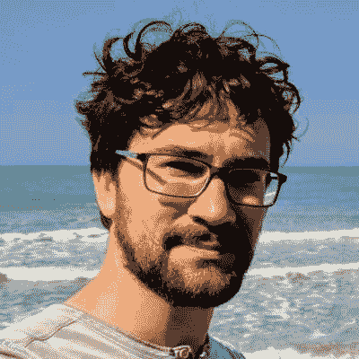
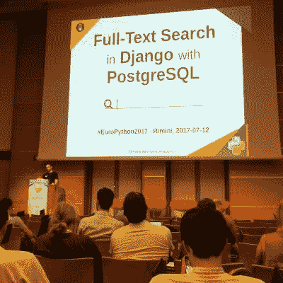
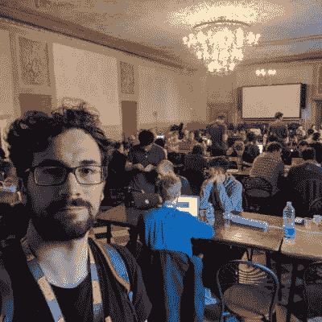
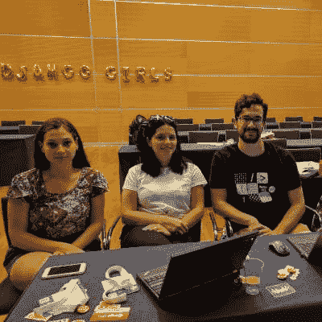
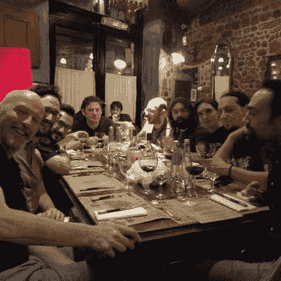

# 我在 Python 社区的参与

> 原文：<https://dev.to/pauloxnet/my-involvement-in-the-python-community-1m79>

> 一篇关于我作为自由软件开发者、GNU/Linux 用户和技术会议发言人参与 Python 社区(主要是 Django)的文章。

# 关于我

<figure>

<figcaption>© 2017 Paolo Melchiorre "Posing at Punta Aderci in Abruzzo, Italy"</figcaption>

</figure>

我毕业于博洛尼亚大学，获得了计算机科学学位。我的论文是关于自由软件的，从那以后，我一直是自由软件的倡导者。

我从 2000 年开始就是 GNU/Linux 用户，现在我是 Ubuntu 的快乐用户。

2007 年，我参加了我的第一次会议，Plone 会议，从那以后，我参加了欧洲的许多其他 pythonic 会议。

2017 年，我在意大利[PyCon](https://www.paulox.net/2017/04/08/pyconit-2017/)和[europhon](https://www.paulox.net/2017/07/12/europython-2017/)发表了演讲，从那以后，我一直是当地和国际活动的[会议演讲者](https://www.paulox.net/talks/)，用意大利语和英语。

<figure>

<figcaption>© 2017 Paolo Melchiorre "Giving a talk at EuroPython 2017"</figcaption>

</figure>

我在罗马和伦敦生活和工作，自 2015 年以来，我一直是一名远程工作者，住在我的家乡意大利佩斯卡拉。

我热爱大自然，喜欢游泳、滑雪或徒步旅行，也喜欢和妻子环游世界。

我喜欢通过阅读小说或听有声读物，看电视剧和电影，听播客和参加当地的英语演讲聚会来提高我的英语技能。

我在[栈溢出](https://stackoverflow.com/users/755343/)回答问题，在 [@pauloxnet](https://twitter.com/pauloxnet) 发微博，偶尔在【pauloxnet】的[发帖](https://www.paulox.net)。

# 我的编程语言之旅

我在高中期间开始用 Pascal 编程，然后我自学了 HTML 和 CSS，开发了我的第一个网站，作为我高中的最后一个项目。

在大学里，我学习了各种语言，如 C、C++、C#、Java、SQL 和 Javascript，过去我在工作中使用过其中一些语言。

自 2006 年以来，我主要使用 Python，毫无疑问这是我更喜欢的语言，尽管有时我仍然使用 SQL、Javascript，当然还有 HTML 和 CSS。

# 我是如何开始使用 Python 的

我在第一份工作中开始使用 Python，是因为我们用 Plone 和 Zope 开发网站。

我意识到 Python 比我以前学习和使用的其他语言好得多，因为它更容易学习。它专注于代码的简单性和可读性，它是可扩展的，写起来很快，并且有一个很棒的社区。

当我停止使用 Plone 时，我继续使用 Python 作为我的主要编程语言。

# 我最喜欢的 Python 库

我每天都在使用 Django 和 PostgreSQL，所以除了 Django 框架本身之外，我认为我最喜欢的 python 库是 Python-PostgreSQL 数据库适配器 psycopg2，因为它非常可靠，当我需要做非常低级的操作或者当我想使用 PostgreSQL 的所有强大功能时，它允许我在没有 Django ORM 的情况下使用数据库。

# 选择 Django 作为 web 框架

最初，我开始使用 Plone 和 Zope 应用程序框架，该框架将所有信息存储在 Zope 的内置事务对象数据库(ZODB)中。

然后当我需要在 PostgreSQL 这样的关系数据库中存储数据时，我开始使用 Django，经过一些研究，我意识到这是最佳选择。

我喜欢它的架构、ORM、管理模块、PostgreSQL 支持、所有现成可用的模块(如 GeoDjango)、所有第三方包，尤其是它背后的社区。

# 我是如何开始为 Django 做贡献的

<figure>

<figcaption>© 2017 Paolo Melchiorre "Sprinting at DjangoCon Europe 2017"</figcaption>

</figure>

在 DjangoCon Europe 2017 的冲刺日，我开始为 Django 的核心做出贡献，一个[拉请求](https://www.paulox.net/code/#django)将 PostgreSQL 加密扩展集成到其 contrib 包中，然后被合并到 Django 2.0 中。

我在 PyCon Italy 2017 大会上做了一个关于 Django 全文搜索功能的演讲，然后在此基础上写了文章[“用 Django 和 PostgreSQL 进行全文搜索”](https://www.paulox.net/2017/12/22/full-text-search-in-django-with-postgresql/)。后来我意识到 Django 的全文搜索功能在 djangoproject.com 网站上并没有使用。

<figure>

<figcaption>© 2017 Paolo Melchiorre "Sprinting at EuroPython 2017"</figcaption>

</figure>

在 EuroPython 2017 上，我组织了一次关于 djangoproject.com 搜索模块的冲刺。

我完成了一个 [pull 请求](https://www.paulox.net/code/#djangoproject-com)，在 Django 官方网站上用 PostgreSQL 全文搜索功能替换了 Elasticsearch，并且我继续更新这个功能，提高了速度和多语言支持。

作为我对 Django 项目贡献的一个例子，我做了一个关于这次经历的演讲。

# 我正在做的项目

<figure>

<figcaption>© 2017 Paolo Melchiorre "Coaching at Django Girls EuroPython 2017"</figcaption>

</figure>

我[向 Django 项目、其网站和一些相关的包贡献](https://www.paulox.net/code/)。

我以教练的身份参加了一些 Django 女孩研讨会，并为其教程做出了贡献。

此外，我正在用我在演讲中使用的代码更新我的 Django 查询项目，让人们自己尝试。

我正在开发一个 Django 项目模板,我们在工作中使用它来加速部署在 uWSGI 上的项目的引导。

我正在更新我的鹈鹕技术博客,在那里我会发布一些文章、关于我的信息、我的项目和我的演讲。

我正在更新我的 YouTube 频道，上面有我所有的[录制的演讲](https://www.paulox.net/2017/07/12/europython-2017/#video)和我的演讲者账户，上面有我所有的演讲幻灯片。

我还尽可能多地回答了关于堆栈溢出的 python 相关问题，特别是与 Django、全文搜索和 PostgreSQL 相关的问题，并基于其中一个问题撰写了文章[“使用注释和子查询更新 Django 查询集”](https://www.paulox.net/2018/10/01/updating-a-django-queryset-with-annotation-and-subquery/)。

# 作为自由软件开发者的经验教训

我认为自由软件是上个世纪最好的发明之一，成为其中的一部分是非常有益的。

尤其是作为一名自由软件开发者，我学到了:

*   分享知识(以想法、代码、文档、技能的形式)是提升自己作为一个人和开发人员的最好方式
*   自由软件最好的部分是它的人类社区
*   一些与代码无关的事情对于改进自由软件及其社区是非常重要的，比如选择一个好的许可证，添加有贡献的指南以及不要忘记文档

# 成为一名科技会议发言人

<figure>

<figcaption>© 2017 Paolo Melchiorre "Having fun at PyFiorentina during PyCon Italy 2018"</figcaption>

</figure>

作为自由软件相关会议的发言人，我有机会认识很多人，成为一个更好的人。

我鼓励每个人加入聚会，走出社区，参加会议，当然，如果我们在某个会议上相遇，请打招呼。

# 所有母语为英语的开发人员的想法

我还想对所有以英语为母语的开发者说，有很多优秀的开发者因为缺乏英语知识而对自由软件犹豫不决。就我个人而言，在为项目做贡献和积极参与社区之前，我等了很长时间，然后我强迫自己用大量的时间、精力和金钱来提高我的英语技能。

因此，我想提醒人们，当谈到非英语母语者时，要有耐心和包容性，因为我们需要更多的时间和努力来打开一个问题，发送一个拉式请求，在网上和会议上提问，或者在这样的采访中简单地谈论和写下我们自己和我们的想法。

* * *

> *这篇文章基于我在 2019 年 2 月 11 日发给 Mike Driscoll 的博客《鼠标与蟒蛇，️published》的电子邮件采访中的回答，文章[“本周 pydev:Paolo melchiorre”](https://www.blog.pythonlibrary.org/2019/02/11/pydev-of-the-week-paolo-melchiorre/)。*

# 原文

最初发布在我的博客上:

[paulox . net/2018/10/01/updating-a-django-query set-with-annotation-and-subquery/](https://www.paulox.net/2018/10/01/updating-a-django-queryset-with-annotation-and-subquery/)