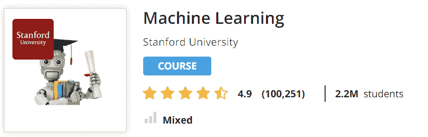
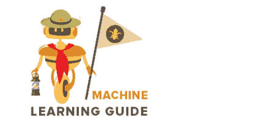

# 我的机器学习之旅，到目前为止...

> 原文：<https://dev.to/atapas/my-machine-learning-journey-so-far-528n>

# 有点背景

2017 年底，我从一家知名出版商那里拿起了一本关于机器学习(ML)的书。我开始读了几章，在开始下一章之前，我已经没有动力了，累了，并开始有一种感觉，“不是我的那杯茶”。嗯，这本书和内容都没有问题。这就是我不考虑自身局限性的方式。此外，自学 ML 并不是我的首要学习目标。

有了长期从事 Web 技术的经验，我想做的下一件很酷的事情是移动应用程序开发。一旦这股热潮过去，机器学习就是下一个。我在工程数学和统计学方面的专业知识一般，但我的思维被推了回来，不得不重新规划我学习机器学习的方法。

# 新方法

我采取了另一种学习方法。这个博客就是关于这段旅程的。

## 以我的速度完成一个课程

随着最初的挫折，我想去的东西，我会感到舒服。2018 年初，我在 Coursera 上了解到这个*常青*资源:[吴恩达在 Coursera 上的课程](https://www.coursera.org/learn/machine-learning)。

我花了将近 14 周的时间完成了这门课程。但是任何全心投入的人，只要每天投入一个小时，就可以在 3 周内完成课程。这门课程让我大开眼界。非常吸引人，简单的解释和大量的手把手帮助我找回了对这个主题的所有兴趣。你也可以在完成课程后获得证书，以防进一步激励。

## 保持连接了解 ML

正当吴恩达的课程进行得如火如荼的时候，我想继续关注这个话题。我对 OCDevel 的这个[音频播客感激不尽。这是一个很好的资源，可以与你在机器学习上做的任何事情并行进行。OCDevel 的播客曾经是(现在也是)我在家里-办公室-家里开车时的伴侣。](http://ocdevel.com/mlg)

接下来，发生在我身上最美好事情是，

*   Jason Brownlee 来自[机器学习大师](https://machinelearningmastery.com/)的简讯。订阅后，我开始收到解释概念、样本章节和 ML 上大量知识链接的电子邮件。
*   加入 [Analytics Vidya](https://www.analyticsvidhya.com/) 社区。你可以在[谷歌商店](https://play.google.com/store/apps/details?id=com.analyticsvidhya.android&hl=en_IN)上找到这个应用

# 一块动力

以上提到的都不仅仅是作为*一次性参考*。每当我有需要的时候，我都试着去查阅这些参考资料。

我的笔记本是我最大的动力😊😊😊。它经常被掸掉灰尘。我清洗它，阅读它，对我迄今为止的旅程感觉良好！
[T3】](https://res.cloudinary.com/practicaldev/image/fetch/s--5RMMLr4---/c_limit%2Cf_auto%2Cfl_progressive%2Cq_66%2Cw_880/https://cdn.hashnode.com/res/hashnode/image/upload/v1556364304674/L2BryBdR_.gif)

# 编程语言和工具

正如大多数编程概念一样，我们需要编程语言的支持来更好地实现这个概念。以下是我在过去几个月里学到的一些东西:

*   [Python](https://www.amazon.com/Learn-Python-Hard-Way-Introduction/dp/0321884914) (我爱上它了)
*   熊猫
*   [TensorFlow](https://www.tensorflow.org/)

# 接下来呢

在接下来的 3-6 个月里，我想继续写关于学习、预测和误差各个方面的中小型程序。我也在计划探索`Deep Learning`并更好地将其概念化。

*这篇文章最初发表在我的 [HashNode 博客](https://atapas.hashnode.dev/my-machine-learning-journey-so-far-cjv13atsb0015fhs1sd9xuc52)T3 上。*