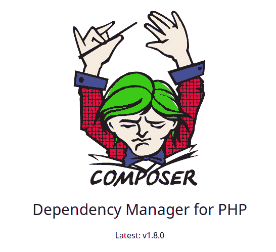
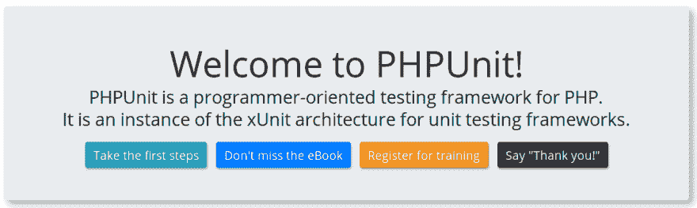
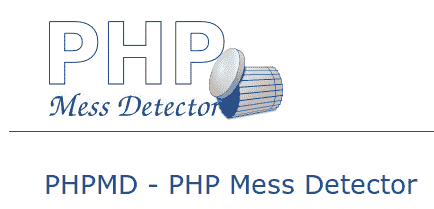
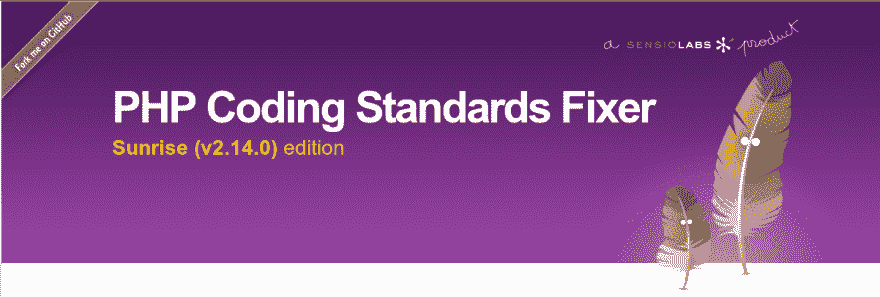
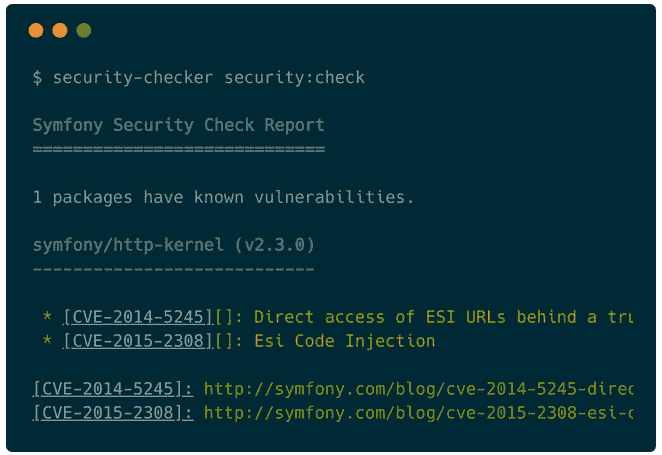
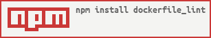
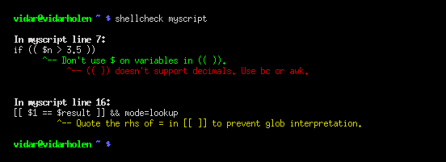
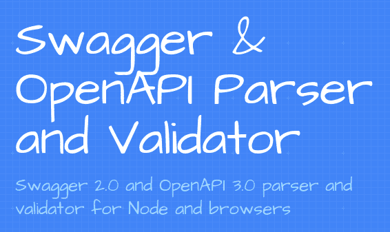

# 我的 PHP 工具包构建了一个(相当)无框架的应用程序

> 原文：<https://dev.to/biros/my-php-toolkit-to-build-a-quite-frameworkless-app-5f8g>

嘿，让我给你介绍一些我在许多 PHP 项目中使用的库和工具。

每当我开始一个新的 PHP 项目时，我习惯于从下面的列表中选择一些库来构建自己的框架。但说实话，我必须承认，我仍然使用基本 HTTP 内容的微框架: [Slim](https://www.slimframework.com/) 。

📝我不使用 ORM，我主要用 Web APIs 构建后端应用程序。

## 库

### 1。纤细的骨架

[](https://res.cloudinary.com/practicaldev/image/fetch/s--9gHQM-Kk--/c_limit%2Cf_auto%2Cfl_progressive%2Cq_auto%2Cw_880/https://thepracticaldev.s3.amazonaws.com/i/qrzabdcle0b75ecjqa1o.png)

🙋**目的:** *旨在构建 Web APIs 的微框架*
🌠 **GitHub 星辰:***9475*
🔗**网址:***[slim PHP/slim](https://github.com/slimphp/Slim)*

### 2。瘦框架 CSRF 保护中间件

## [Slim PHP](https://github.com/slimphp)/[Slim-Csrf](https://github.com/slimphp/Slim-Csrf)

### 瘦框架 CSRF 保护中间件

<article class="markdown-body entry-content container-lg" itemprop="text">

# 超薄框架 CSRF 保护

[ ](https://travis-ci.org/slimphp/Slim-Csrf) [ ](https://coveralls.io/github/slimphp/Slim-Csrf?branch=master)

这个存储库包含一个瘦框架 CSRF 保护 PSR-15 中间件。CSRF 保护适用于所有不安全的 HTTP 请求(POST、PUT、DELETE、PATCH)。

您可以使用其`getAttribute()`方法从请求对象中获取最新的 CSRF 令牌的名称和值。默认情况下，CSRF 令牌的名称存储在`csrf_name`属性中，CSRF 令牌的值存储在`csrf_value`属性中。

## 安装

通过作曲家

```
$ composer require slim/csrf
```

Enter fullscreen mode Exit fullscreen mode

需要 Slim 4.0.0 或更新版本。

## 使用

在大多数情况下，您希望为所有路由注册 Slim\Csrf，但是，由于它是中间件，您也可以为路由的子集注册它。

### 注册所有路线

```
use DI\Container
use Slim\Csrf\Guard
use Slim\Factory\AppFactory
require __DIR__ . '/vendor/autoload.php'
// Start PHP session
session_start();

// Create Container
$container = new Container();
AppFactory
```

…Enter fullscreen mode Exit fullscreen mode</article>

[View on GitHub](https://github.com/slimphp/Slim-Csrf)

🙋**目的:** *用 CSRF 令牌*
保护你的 GUI 页面🌠 **GitHub 星辰:** *201*
🔗**网址:***[slim PHP/csrf](https://github.com/slimphp/Slim-Csrf)*

### 3。超薄框架 Flash 消息

## [Slim PHP](https://github.com/slimphp)/[Slim-Flash](https://github.com/slimphp/Slim-Flash)

### Slim 框架快速消息服务提供商

<article class="markdown-body entry-content container-lg" itemprop="text">

# 超薄框架 Flash 消息

[](https://travis-ci.org/slimphp/Slim-Flash)

这个存储库包含一个 Slim Framework Flash messages 服务提供程序。这使您能够定义仅从当前请求持续到下一个请求的瞬态消息。

## 安装

通过作曲家

```
$ composer require slim/flash
```

Enter fullscreen mode Exit fullscreen mode

需要 Slim 3.0.0 或更新版本。

## 使用

```
// Start PHP session
session_start()
$app = new \Slim\App()
// Fetch DI Container
$container = $app->getContainer()
// Register provider
$container['flash'] = function () {
    return new \Slim\Flash\Messages()
};

$app->get('/foo', function ($req, $res, $args) {
    // Set flash message for next request
    $this->flash->addMessage('Test', 'This is a message');

    // Redirect
    return $res->withStatus(302)->withHeader('Location', '/bar');
```

…Enter fullscreen mode Exit fullscreen mode</article>

[View on GitHub](https://github.com/slimphp/Slim-Flash)

🙋**目的:** *这使您能够定义仅从当前请求持续到下一个请求的瞬时消息*
🌠 **GitHub 星辰:** *104*
🔗**网址:***[slim PHP/flash](https://github.com/slimphp/Slim-Flash)*

### 4。嫩枝

[](https://res.cloudinary.com/practicaldev/image/fetch/s--uTCMH9Hh--/c_limit%2Cf_auto%2Cfl_progressive%2Cq_auto%2Cw_880/https://thepracticaldev.s3.amazonaws.com/i/0s27wg4owzcagj2urnpf.png)

🙋**用途:** *一个非常流行的模板引擎，很好的集成了 Slim([slimpphp/twig-view](https://github.com/slimphp/Twig-View))*
🌠 **GitHub 星辰:***5705*
🔗**网址:***[twighp/twig](https://github.com/twigphp/Twig)*

### 5。独白

##  [塞尔代克](https://github.com/Seldaek) / [独白](https://github.com/Seldaek/monolog)

### 将您的日志发送到文件、套接字、收件箱、数据库和各种网络服务

<article class="markdown-body entry-content container-lg" itemprop="text">

# PHP 的独白日志 [](https://github.com/Seldaek/monolog/actions)

[ ](https://packagist.org/packages/monolog/monolog) [ ](https://packagist.org/packages/monolog/monolog)

Monolog 将您的日志发送到文件、套接字、收件箱、数据库和各种网络服务。请参阅下面完整的处理程序列表。特殊的处理程序允许您构建高级日志策略。

这个库实现了 [PSR-3](https://github.com/php-fig/fig-standards/blob/master/accepted/PSR-3-logger-interface.md) 接口，你可以在你自己的库中输入提示以保持最大的互操作性。您也可以在您的应用程序中使用它，以确保您可以在以后使用另一个兼容的日志记录器。从 1.11.0 开始，Monolog 公共 API 也将在内部接受 PSR-3 日志级别 Monolog 仍然使用自己的级别方案，因为它早于 PSR-3。

## 装置

使用安装最新版本

```
$ composer require monolog/monolog
```

Enter fullscreen mode Exit fullscreen mode

## 基本用法

```
<?php
use Monolog\Logger
use Monolog\Handler\StreamHandler;

// create a log channel
$log = new Logger('name');
$log->pushHandler(new StreamHandler('path/to/your.log', Logger
```

…Enter fullscreen mode Exit fullscreen mode</article>

[View on GitHub](https://github.com/Seldaek/monolog)

🙋**用途:** *将您的日志发送到文件、套接字、收件箱、数据库和各种 web 服务*
🌠 **GitHub 星辰:***13388*
🔗**网址:***[seldaek/monolog](https://github.com/Seldaek/monolog)*

### 6。Zend ACL 权限

## [Zend framework](https://github.com/zendframework)/[Zend-permissions-ACL](https://github.com/zendframework/zend-permissions-acl)

<article class="markdown-body entry-content container-lg" itemprop="text">

# Zend-权限-acl

> ## 仓库已废弃 2019-12-31
> 
> 这个存储库已经移动到[层/层-权限-acl](https://github.com/laminas/laminas-permissions-acl) 。

[ ](https://secure.travis-ci.org/zendframework/zend-permissions-acl) [ ](https://coveralls.io/github/zendframework/zend-permissions-acl?branch=master)

为权限管理提供了轻量级和灵活的访问控制列表(ACL)实现。

*   文件问题位于[https://github . com/Zend framework/Zend-permissions-ACL/issues](https://github.com/zendframework/zend-permissions-acl/issues)
*   文件在[https://docs.zendframework.com/zend-permissions-acl/](https://docs.zendframework.com/zend-permissions-acl/)

</article>

[View on GitHub](https://github.com/zendframework/zend-permissions-acl)

🙋**用途:** *为权限管理提供了一个轻量级、灵活的访问控制列表(ACL)实现*
🌠 **GitHub 星辰:** *55*
🔗**URL:***[Zend framework/Zend-permissions-ACL](https://github.com/zendframework/zend-permissions-acl)*

### 7。狂饮

##  [狂饮](https://github.com/guzzle) / [狂饮](https://github.com/guzzle/guzzle)

### 一个可扩展的 PHP HTTP 客户端

<article class="markdown-body entry-content container-lg" itemprop="text">

[](https://raw.githubusercontent.com/guzzle/guzzle/master/.github/logo.png?raw=true)

# Guzzle，PHP HTTP 客户端

[](https://github.com/guzzle/guzzle/releases)[](https://github.com/guzzle/guzzle/actions?query=workflow%3ACI)[](https://packagist.org/packages/guzzlehttp/guzzle)

Guzzle 是一个 PHP HTTP 客户端，它使得发送 HTTP 请求变得容易，并且易于与 web 服务集成。

*   一个简单的界面，用于构建查询字符串、发布请求、流式大规模上传、流式大规模下载、使用 HTTP cookies、上传 JSON 数据等...
*   可以使用同一个接口发送同步和异步请求。
*   对请求、响应和流使用 PSR-7 接口。这允许你用 Guzzle 利用其他 PSR-7 兼容库。
*   支持 PSR-18，允许其他 PSR-18 HTTP 客户端之间的互操作性。
*   抽象出底层的 HTTP 传输，允许您编写与环境和传输无关的代码；即，对 cURL PHP 流、套接字或非阻塞事件循环没有硬性依赖。
*   中间件系统允许您增加和组合客户端行为。

```
$client = new \GuzzleHttp\Client()
$response = $client->request('GET', 'https://api.github.com/repos/guzzle/guzzle')
echo $response->getStatusCode(); 
```

…Enter fullscreen mode Exit fullscreen mode</article>

[View on GitHub](https://github.com/guzzle/guzzle)

🙋**目的:** *Guzzle 是一个 PHP HTTP 客户端，它使得发送 HTTP 请求变得容易，并且与 web 服务的集成变得简单*
🌠 **GitHub 星辰:***15355*
🔗**网址:***[guzzle http/guzzle](https://github.com/guzzle/guzzle)*

### 8。PDO

🙋**目的:** *PHP 扩展构建并执行安全的 SQL 预备语句*
🔗**网址:** *[PDO](http://php.net/manual/en/book.pdo.php)*

### 9。Zend XML-RPC

## [Zend framework](https://github.com/zendframework)/[Zend-xmlrpc](https://github.com/zendframework/zend-xmlrpc)

### 来自 Zend Framework 的 XmlRpc 组件

<article class="markdown-body entry-content container-lg" itemprop="text">

# zend-xmlrpc

> ## 仓库已废弃 2019-12-31
> 
> 这个存储库已经移动到 [laminas/laminas-xmlrpc](https://github.com/laminas/laminas-xmlrpc) 。

[ ](https://secure.travis-ci.org/zendframework/zend-xmlrpc) [ ](https://coveralls.io/github/zendframework/zend-xmlrpc?branch=master)

在其主页上，XML-RPC 被描述为一个“...使用 HTTP 作为传输和 XML 作为编码的远程过程调用。XML-RPC 的设计尽可能简单，同时允许传输、处理和返回复杂的数据结构。”

`Zend\XmlRpc`为消费远程 XML-RPC 服务和构建新的 XML-RPC 服务器提供支持。

*   在[https://github.com/zendframework/zend-xmlrpc/issues](https://github.com/zendframework/zend-xmlrpc/issues)的文件问题
*   文件在[https://docs.zendframework.com/zend-xmlrpc/](https://docs.zendframework.com/zend-xmlrpc/)

</article>

[View on GitHub](https://github.com/zendframework/zend-xmlrpc)

🙋**目的:** *为消费远程 XML-RPC 服务和构建新的 XML-RPC 服务器提供支持*
🌠 **GitHub 星辰:** *14*
🔗**网址:***[Zend framework/Zend-xmlrpc](https://github.com/zendframework/zend-xmlrpc)*

### 10。PHPMailer

## [PHP mailer](https://github.com/PHPMailer)/[PHP mailer](https://github.com/PHPMailer/PHPMailer)

### PHP 的经典邮件发送库

<article class="markdown-body entry-content container-lg" itemprop="text">

[](https://camo.githubusercontent.com/e6af60518d5340b495cb281096e017e5a735d75e5b63012caed6cb185406a30f/68747470733a2f2f7261772e6769746875622e636f6d2f5048504d61696c65722f5048504d61696c65722f6d61737465722f6578616d706c65732f696d616765732f7068706d61696c65722e706e67)

# PHP mailer——一个全功能的 PHP 电子邮件创建和传输类

[](https://github.com/PHPMailer/PHPMailer/actions)[](https://packagist.org/packages/phpmailer/phpmailer)[](https://packagist.org/packages/phpmailer/phpmailer)[](https://packagist.org/packages/phpmailer/phpmailer)[](https://packagist.org/packages/phpmailer/phpmailer)[](http://phpmailer.github.io/PHPMailer/)

## 特征

*   可能是世界上最流行的从 PHP 发送电子邮件的代码！
*   被很多开源项目使用:WordPress，Drupal，1CRM，SugarCRM，Yii，Joomla！还有更多
*   集成 SMTP 支持–无需本地邮件服务器即可发送
*   发送带有多个收件人、抄送人、密件抄送人和回复地址的电子邮件
*   不阅读 HTML 电子邮件的邮件客户端的多部分/备选电子邮件
*   添加附件，包括内嵌
*   支持 UTF-8 内容和 8 位、base64、二进制和引用可打印编码
*   通过 SMTPS 和 SMTP+STARTTLS 传输使用 LOGIN、PLAIN、CRAM-MD5 和 XOAUTH2 机制进行 SMTP 身份验证
*   自动验证电子邮件地址
*   防止标头注入攻击
*   超过 50 种语言的错误信息！
*   DKIM 和 S/MIME 签名支持
*   兼容 PHP 5.5 及更高版本，包括 PHP 8.0
*   命名空间来防止命名类
*   多得多！

## 为什么你可能需要它

许多 PHP 开发人员需要从他们的代码中发送电子邮件。唯一的…

</article>

[View on GitHub](https://github.com/PHPMailer/PHPMailer)

🙋**目的:** *一个全功能的 PHP 电子邮件创建和传输类*
🌠 **GitHub 星辰:***12422*
🔗**网址:***[PHP mailer/PHP mailer](https://github.com/PHPMailer/PHPMailer)*

### 11。Firebase / PHP-JWT

## [firebase](https://github.com/firebase)/[PHP-jwt](https://github.com/firebase/php-jwt)

### JWT 的 PHP 包

<article class="markdown-body entry-content container-lg" itemprop="text">

[](https://travis-ci.org/firebase/php-jwt)[](https://packagist.org/packages/firebase/php-jwt)[](https://packagist.org/packages/firebase/php-jwt)[T11】](https://packagist.org/packages/firebase/php-jwt)

# PHP-JWT

一个用 PHP 编码和解码 JSON Web 令牌(JWT)的简单库，符合 [RFC 7519](https://tools.ietf.org/html/rfc7519) 。

## 装置

使用 composer 管理您的依赖项并下载 PHP-JWT:

```
composer require firebase/php-jwt
```

Enter fullscreen mode Exit fullscreen mode

## 例子

```
<?php
use \Firebase\JWT\JWT
$key = "example_key"
$payload = array(
    "iss" => "http://example.org"
    "aud" => "http://example.com"
    "iat" => 1356999524,
    "nbf" => 1357000000
);

/**
 * IMPORTANT:
 * You must specify supported algorithms for your application. See
 * https://tools.ietf.org/html/draft-ietf-jose-json-web-algorithms-40
 * for a list of spec-compliant algorithms.
 */
$jwt = JWT::encode($payload, $key);
$decoded = JWT::decode($jwt, $key, array('HS256'));

print_r($decoded);

/*
 NOTE: This will now be an object instead of an associative array. To get
 an associative array, you will need to cast it
```

…Enter fullscreen mode Exit fullscreen mode</article>

[View on GitHub](https://github.com/firebase/php-jwt)

🙋**用途:** *一个简单的库，用 PHP 编码和解码 JSON Web 令牌(JWT)，符合 RFC 7519*
🌠 **GitHub 星辰:***4574*
🔗**网址:***[firebase/PHP-jwt](https://github.com/firebase/php-jwt)*

### 12。Hassankhan / Config

##  [哈桑汗](https://github.com/hassankhan) / [配置](https://github.com/hassankhan/config)

### Config 是一个轻量级的配置文件加载器，支持 PHP、INI、XML、JSON 和 YAML 文件

<article class="markdown-body entry-content container-lg" itemprop="text">

# 配置

[](https://packagist.org/packages/hassankhan/config)[](http://hassankhan.mit-license.org)[](https://travis-ci.org/hassankhan/config)[](https://scrutinizer-ci.com/g/hassankhan/config/code-structure)[](https://scrutinizer-ci.com/g/hassankhan/config)[](https://packagist.org/packages/hassankhan/config)[](https://gitter.im/hassankhan/config?utm_source=badge&utm_medium=badge&utm_campaign=pr-badge)

Config 是一个文件配置加载器，支持 PHP、INI、XML、JSON YML、属性和序列化文件和字符串。

## 要求

Config 需要 PHP 5.5.9+。

> **重要:**如果你想使用 YAML 文件或字符串，需要在你的`composer.json`中有 [Symfony Yaml 组件](https://github.com/symfony/Yaml)。

## 装置

支持的配置安装方式是通过 Composer。

```
$ composer require hassankhan/config
```

Enter fullscreen mode Exit fullscreen mode

## 使用

Config 的设计非常简单，易于使用。你所能做的就是加载、获取和设置。

### 加载文件

`Config`对象可以通过工厂方法`load()`创建，也可以直接实例化:

```
use Noodlehaus\Config
use Noodlehaus\Parser\Json
// Load a single file
$conf = Config::load('config.json')
$conf = new Config('config.json');

// Load values from multiple files
$conf = new Config(['config.json', 'config.xml']);

//
```

…Enter fullscreen mode Exit fullscreen mode</article>

[View on GitHub](https://github.com/hassankhan/config)

🙋**用途:** *Config 是一个轻量级的配置文件加载器，支持 PHP、INI、XML、JSON、YAML 文件*
🌠 **GitHub 星辰:** *749*
🔗**网址:***[Hassan Khan/config](https://github.com/hassankhan/config)*

## 工具

作为一名 PHP 工匠，下面的工具是我的工具包中的必备工具。它们中的大多数(除了 *shellcheck* )都可以通过 *composer* 安装，这允许你将它们作为开发依赖项添加到你的项目的`composer.json`。

### 1。设计者

[](https://res.cloudinary.com/practicaldev/image/fetch/s--Y8ZFUgn4--/c_limit%2Cf_auto%2Cfl_progressive%2Cq_auto%2Cw_880/https://thepracticaldev.s3.amazonaws.com/i/vy9xvol1rclwo2a1q27m.png)

🙋**用途:** *必备 PHP 依赖管理器，更有*
🌠 **GitHub 星辰:***18049*
🔗**网址:** *[作曲](https://getcomposer.org/)*

### 2。PHPUnit

[](https://res.cloudinary.com/practicaldev/image/fetch/s--WVXDWlGq--/c_limit%2Cf_auto%2Cfl_progressive%2Cq_auto%2Cw_880/https://thepracticaldev.s3.amazonaws.com/i/7k6yp7wenwtj0eawb7ba.png)

🙋**目的:** *带有嘲讽特征的牛逼单元测试框架*
🌠 **GitHub 星辰:***12785*
🔗**网址:** *[PHPUnit](https://phpunit.de/)*

### 3。PHP 代码嗅探器

## [squizlabs](https://github.com/squizlabs)/[PHP _ code sniffer](https://github.com/squizlabs/PHP_CodeSniffer)

### PHP_CodeSniffer 标记 PHP 文件，并检测是否违反了一组已定义的编码标准。

<article class="markdown-body entry-content container-lg" itemprop="text">

## 关于

PHP_CodeSniffer 是一组两个 PHP 脚本；主`phpcs`脚本标记 PHP、JavaScript 和 CSS 文件，以检测对已定义的编码标准的违反，第二个`phpcbf`脚本自动纠正编码标准的违反。PHP_CodeSniffer 是一个重要的开发工具，可以确保你的代码保持干净和一致。

[](https://github.com/squizlabs/PHP_CodeSniffer/actions)[](https://github.com/squizlabs/PHP_CodeSniffer/actions)[](http://squizlabs.github.io/PHP_CodeSniffer/analysis/squizlabs/PHP_CodeSniffer)[T11】](https://gitter.im/squizlabs/PHP_CodeSniffer?utm_source=badge&utm_medium=badge&utm_campaign=pr-badge&utm_content=badge)

## 要求

PHP_CodeSniffer 需要 PHP 5 . 4 . 0 或更高版本，尽管个别的 sniffs 可能有额外的要求，如外部应用程序和脚本。有关这些要求的列表，请参见[配置选项手册页](https://github.com/squizlabs/PHP_CodeSniffer/wiki/Configuration-Options)。

如果你在团队中使用 PHP_CodeSniffer，或者你在一个 [CI](https://en.wikipedia.org/wiki/Continuous_integration) 服务器上运行它，你可能想要使用一个配置文件来配置你的项目的设置[。](https://github.com/squizlabs/PHP_CodeSniffer/wiki/Advanced-Usage#using-a-default-configuration-file)

## 装置

开始使用 PHP_CodeSniffer 最简单的方法是下载每个命令的 Phar 文件:

```
# Download using curl
curl -OL https://squizlabs.github.io/PHP_CodeSniffer/phpcs.phar
curl -OL https://squizlabs.github.io/PHP_CodeSniffer/phpcbf.phar
# Or download using
```

…</article>

[View on GitHub](https://github.com/squizlabs/PHP_CodeSniffer)

🙋**目的:** *静态分析工具检测&修复编码标准违规*
🌠 **GitHub 星辰:***5915*
🔗**网址:***[squizlabs/PHP _ code sniffer](https://github.com/squizlabs/PHP_CodeSniffer)*

### 4。PHP 混乱检测器又名 *phpmd*

[](https://res.cloudinary.com/practicaldev/image/fetch/s--aIT_NVmZ--/c_limit%2Cf_auto%2Cfl_progressive%2Cq_auto%2Cw_880/https://thepracticaldev.s3.amazonaws.com/i/17tn178k0o2ko760xhi5.png)

🙋**用途:** *静态分析工具，检测代码气味、糟糕的设计、bug、未使用的参数等。*
🌠 **GitHub 星辰:***1315*
🔗**网址:***[phpmd/phpmd](https://phpmd.org/)*

### 5。PHP 编码标准固定器又名 *php-cs-fixer*

[](https://res.cloudinary.com/practicaldev/image/fetch/s--QziiX6Dl--/c_limit%2Cf_auto%2Cfl_progressive%2Cq_auto%2Cw_880/https://thepracticaldev.s3.amazonaws.com/i/d17gmfhu6g20uah8rp6n.png)

🙋**用途:** *自动修复编码标准违规*
🌠 **GitHub 星辰:***7036*
🔗**网址:***[friends ofphp/PHP-cs-fixer](https://github.com/FriendsOfPHP/PHP-CS-Fixer)*

### 6。SensioLabs 安全检查器

[](https://res.cloudinary.com/practicaldev/image/fetch/s--L1HoWDub--/c_limit%2Cf_auto%2Cfl_progressive%2Cq_auto%2Cw_880/https://thepracticaldev.s3.amazonaws.com/i/to78ce7ag0pfgzy45tzs.png)

🙋**目的:***sensio labs 安全检查器是一个命令行工具，它检查您的应用程序是否使用了具有已知安全漏洞的依赖关系*
🌠 **GitHub 星辰:***1397*
🔗**网址:** *[感官实验室/安检人员](https://github.com/sensiolabs/security-checker)*

### 7。XML Linter

##  [【可擦写】](https://github.com/sclable)/[【XML-lint】](https://github.com/sclable/xml-lint)

### 一个 php 工具，用于从命令行 lint 和验证 xml 文件。

<article class="markdown-body entry-content container-lg" itemprop="text">

# 可伸缩 xml lint

一个 php 工具，用于从命令行 lint 和验证 xml 文件。

[](https://travis-ci.com/sclable/xml-lint)[](https://raw.githubusercontent.com/sclable/xml-lint/main///packagist.org/packages/sclable/xml-lint)[](https://raw.githubusercontent.com/sclable/xml-lint/main///packagist.org/packages/sclable/xml-lint)[T11】](https://raw.githubusercontent.com/sclable/xml-lint/main///packagist.org/packages/sclable/xml-lint)

XML Lint 检查任何 XML 文件的语法，并根据文件中定义的 XSD 模式验证文件。

## 使用

### 使用 Composer 安装

如果您想使用 [composer](https://getcomposer.org/) 将这个库包含在您的项目中，只需运行:

```
composer require "sclable/xml-lint" 
```

### 命令行用法

要 lint 单个 xml 文件:

```
vendor/bin/xmllint path/to/file.xml 
```

要 lint 一个目录及其所有子目录:

```
vendor/bin/xmllint path/to/dir 
```

#### 帮助

`xmllint`内置 cli 帮助屏幕:

```
vendor/bin/xmllint --help 
```

#### 选择

*   `-v`冗长，显示当前文件的文件名到 lint
*   `-r 0`不要递归搜索(如果自变量是一个目录)
*   `-e name`排除包含“名称”的文件或目录
*   `-s`跳过 xsd 验证

## 变更日志

对于变更日志，请参见[变更日志](https://raw.githubusercontent.com/sclable/xml-lint/main/CHANGELOG)文件

## 许可证

关于许可证和版权，请参见[许可证](https://raw.githubusercontent.com/sclable/xml-lint/main/LICENSE)文件

</article>

[View on GitHub](https://github.com/sclable/xml-lint)

🙋**用途:** *从命令行 lint 并验证 XML 文件的 PHP 工具*
🌠 **GitHub 星辰:** *6*
🔗**URL:***[scable/XML-lint](https://github.com/sclable/xml-lint)*

### 8。YAML 棉绒

## [j13k](https://github.com/j13k)/[YAML-lint](https://github.com/j13k/yaml-lint)

### 用于检查 YAML 文件语法的紧凑命令行实用程序

<article class="markdown-body entry-content container-lg" itemprop="text">

# yaml-lint

[](https://packagist.org/packages/j13k/yaml-lint)[](https://raw.githubusercontent.com/j13k/yaml-lint/master/LICENSE)[](https://packagist.org/packages/j13k/yaml-lint/stats)[T11】](https://scrutinizer-ci.com/g/j13k/yaml-lint)

一个紧凑的命令行工具，用于检查 YAML 文件语法。使用 [Symfony Yaml 组件](https://github.com/symfony/yaml)的解析工具。

## 使用

```
usage: yaml-lint [options] [input source]
  input source    Path to file, or "-" to read from standard input
  -q, --quiet     Restrict output to syntax errors
  -h, --help      Display this help
  -V, --version   Display application version 
```

<g-emoji class="g-emoji" alias="information_source" fallback-src="https://github.githubassets.cimg/icons/emoji/unicode/2139.png">ℹ️</g-emoji> 注意，目前稳定版`1.1.3`只支持*单文件*或标准输入。

<g-emoji class="g-emoji" alias="loudspeaker" fallback-src="https://github.githubassets.cimg/icons/emoji/unicode/1f4e2.png">📢</g-emoji>在`1.1.x-dev`中提供了对多个文件的实验支持。

## 安装

使用 Composer 作为项目组件安装(可从项目的`vendor/bin`目录执行):

```
composer require j13k/yaml-lint
```

Enter fullscreen mode Exit fullscreen mode

通常二进制版本(`yaml-lint.phar`)也可以通过[下载，每个版本](https://github.com/j13k/yaml-lint/releases)。这嵌入了 Symfony Yaml 组件的最新稳定版本，该版本在发布时是最新的。

## 更改日志

请查看[变更日志](https://raw.githubusercontent.com/j13k/yaml-lint/master/CHANGELOG.md)了解最近发生的变化。

…</article>

[View on GitHub](https://github.com/j13k/yaml-lint)

🙋**用途:** *用于检查 YAML 文件语法的简洁命令行实用程序*
🌠 **GitHub 星辰:** *3*
🔗**网址:***[j13k/YAML-lint](https://github.com/j13k/yaml-lint)*

### 9。码头文件棉绒

##  [ projectatomic ](https://github.com/projectatomic) / [ dockerfile_lint](https://github.com/projectatomic/dockerfile_lint)

<article class="markdown-body entry-content container-lg" itemprop="text">

[ ](https://nodei.co/npm/dockerfile_lint/) [ ](https://travis-ci.org/projectatomic/dockerfile_lint)

# dockerfile-lint

用于 [Dockerfiles](https://docs.docker.com/engine/reference/builder/) 的基于规则的“linter”。linter 规则可用于检查文件语法以及由规则文件编写器确定的任意语义和最佳实践属性。linter 还可用于对照 docker 图像检查标签规则。

# 目录

*   [快速入门](https://raw.githubusercontent.com/projectatomic/dockerfile_lint/master/#quickstart)
*   [扩展和定制:规则文件](https://raw.githubusercontent.com/projectatomic/dockerfile_lint/master/#extending-and-customizing-rule-files)
    *   [剖面图截面](https://raw.githubusercontent.com/projectatomic/dockerfile_lint/master/#profile-section)
    *   [通用部分](https://raw.githubusercontent.com/projectatomic/dockerfile_lint/master/#general-section)
    *   [规则属性](https://raw.githubusercontent.com/projectatomic/dockerfile_lint/master/#rule-attributes)
    *   [线条规则部分](https://raw.githubusercontent.com/projectatomic/dockerfile_lint/master/#line-rule-section)
    *   [所需指令部分](https://raw.githubusercontent.com/projectatomic/dockerfile_lint/master/#required-instruction-section)
*   [库使用情况](https://raw.githubusercontent.com/projectatomic/dockerfile_lint/master/#library-usage)
    *   [Node.js 应用使用](https://raw.githubusercontent.com/projectatomic/dockerfile_lint/master/#nodejs-application-use)
    *   [命令行使用](https://raw.githubusercontent.com/projectatomic/dockerfile_lint/master/#command-line-use)
*   [学分](https://raw.githubusercontent.com/projectatomic/dockerfile_lint/master/#credits)
*   [执照](https://raw.githubusercontent.com/projectatomic/dockerfile_lint/master/#license)

# 快速启动

1.  切换到您有 Dockerfile 文件的目录
2.  奔跑

*   原子 CLI

    ```
     atomic run projectatomic/dockerfile-lint
        atomic run projectatomic/dockerfile-lint image <imageid&gt 
    ```

*   CLI 坞站

    ```
     docker run -it --rm -v $PWD:/root/ \
               projectatomic/dockerfile-lint \
               dockerfile_lint [-f Dockerfile]

        docker run -it --rm -v $PWD:/root/  \
               -v /var/run/docker.sock:/var/run/docker.sock \
               projectatomic/dockerfile-lint \
               dockerfile_lint  image <imageid> 
    ```

默认情况下，linter 以严格模式运行(错误和/或警告导致非零返回代码)。使用`-p`或`--permissive`运行命令…

</article>

[View on GitHub](https://github.com/projectatomic/dockerfile_lint)

🙋**用途:** *基于规则的 Dockerfile 过磅器*
🌠 **GitHub 星辰:** *259*
🔗**URL:***[project atomic/docker file _ lint](https://github.com/projectatomic/dockerfile_lint)*

### 10。外壳检查

##  [考拉曼](https://github.com/koalaman) / [谢尔克](https://github.com/koalaman/shellcheck)

### ShellCheck，一个用于 shell 脚本的静态分析工具

<article class="markdown-body entry-content container-lg" itemprop="text">

[](https://travis-ci.org/koalaman/shellcheck)

# shell check——一个 shell 脚本静态分析工具

ShellCheck 是一个 GPLv3 工具，它为 bash/sh shell 脚本提供警告和建议:

[](https://raw.githubusercontent.com/koalaman/shellcheck/master/doc/terminal.png)

拼写检查的目标是

*   指出并澄清典型的初学者语法问题，这些问题会导致 shell 给出模糊的错误消息。

*   指出并澄清典型的中级语义问题，这些问题会导致 shell 行为怪异且违反直觉。

*   指出可能导致高级用户的工作脚本在未来环境中失败的微妙警告、死角和陷阱。

请参见[错误代码库](https://raw.githubusercontent.com/koalaman/shellcheck/master/README.md#user-content-gallery-of-bad-code)中的示例，了解 ShellCheck 可以帮助您识别哪些错误代码！

## 目录

*   [如何使用](https://raw.githubusercontent.com/koalaman/shellcheck/master/#how-to-use)
    *   [在网络上](https://raw.githubusercontent.com/koalaman/shellcheck/master/#on-the-web)
    *   [从您的终端](https://raw.githubusercontent.com/koalaman/shellcheck/master/#from-your-terminal)
    *   [在你的编辑器里](https://raw.githubusercontent.com/koalaman/shellcheck/master/#in-your-editor)
    *   [在您的构建或测试套件中](https://raw.githubusercontent.com/koalaman/shellcheck/master/#in-your-build-or-test-suites)
*   [安装](https://raw.githubusercontent.com/koalaman/shellcheck/master/#installing)
*   [从源代码编译](https://raw.githubusercontent.com/koalaman/shellcheck/master/#compiling-from-source)
    *   [安装电缆](https://raw.githubusercontent.com/koalaman/shellcheck/master/#installing-cabal)
    *   [编译 ShellCheck](https://raw.githubusercontent.com/koalaman/shellcheck/master/#compiling-shellcheck)
    *   [运行测试](https://raw.githubusercontent.com/koalaman/shellcheck/master/#running-tests)
*   [不良代码库](https://raw.githubusercontent.com/koalaman/shellcheck/master/#gallery-of-bad-code)
    *   [报价](https://raw.githubusercontent.com/koalaman/shellcheck/master/#quoting)
    *   [条件句](https://raw.githubusercontent.com/koalaman/shellcheck/master/#conditionals)
    *   [频繁误用的命令](https://raw.githubusercontent.com/koalaman/shellcheck/master/#frequently-misused-commands)
    *   [初学者常见的错误](https://raw.githubusercontent.com/koalaman/shellcheck/master/#common-beginners-mistakes)
    *   [风格](https://raw.githubusercontent.com/koalaman/shellcheck/master/#style)
    *   [数据和打字错误](https://raw.githubusercontent.com/koalaman/shellcheck/master/#data-and-typing-errors)
    *   …

</article>

[View on GitHub](https://github.com/koalaman/shellcheck)

🙋**用途:** *一个针对 shell 脚本的静态分析工具*
🌠 **GitHub 星辰:***13440*
🔗**URL:***[koalaman/shellcheck](https://github.com/koalaman/shellcheck)*

### 11。Swagger CLI

[](https://res.cloudinary.com/practicaldev/image/fetch/s--jkbY0nep--/c_limit%2Cf_auto%2Cfl_progressive%2Cq_auto%2Cw_880/https://thepracticaldev.s3.amazonaws.com/i/eidkatpr5zih7e4k9s4c.png)

🙋**目的:** *验证 JSON 或 YAML 格式的 Swagger/OpenAPI 文件*
🌠 **GitHub 星辰:** *125*
🔗**URL:***[APIDevTools/swagger-CLI](https://github.com/APIDevTools/swagger-cli)*

* * *

所有这些工具都可以自动运行:

*   在您的 IDE 中
*   在一个大钩子里
*   在您的 CI/CD 渠道中

如果你想更进一步，请看看我以前的一篇文章:

[](/biros) [## 🚥如何在您的工作流程中自动化代码质量检查？⚙

### 鲍里斯·贾莫特·✊/9 月 10 日 188 分钟阅读

#git #automation #cleancode #bash](/biros/-how-to-master-your-code-through-your-project-lifecycle-22-2pej)

感谢阅读。

再见！