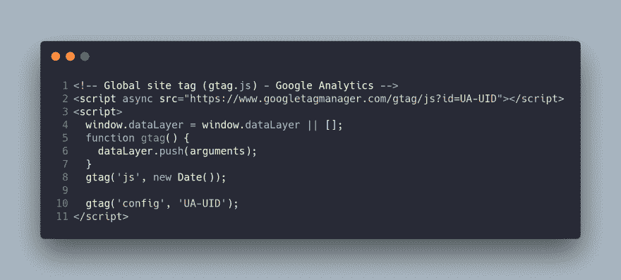
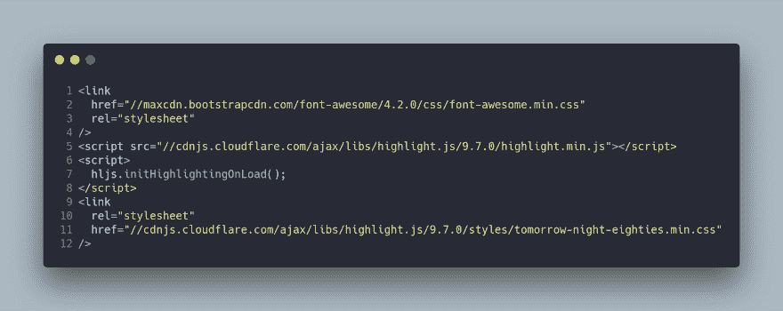
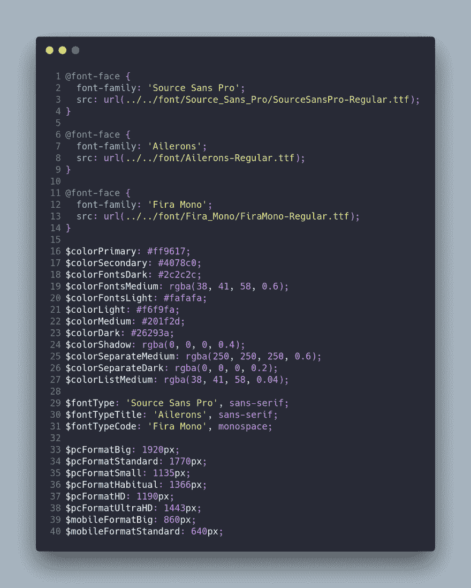
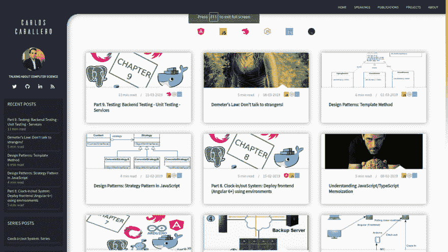
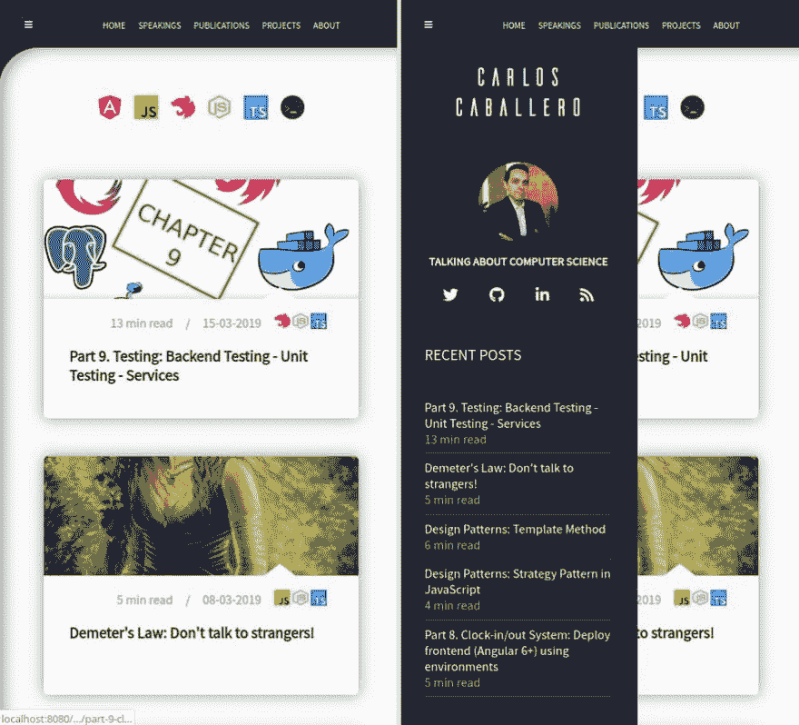

# 我为 GhostCMS 的主题是免费，开源和使用 ITCSS 开发

> 原文：<https://dev.to/carlillo/my-theme-for-ghostcms-is-free-open-source-and-develop-using-itcss-4igc>

## 一个免费的、开源的 Ghost 主题

我和我的学生 Alejandro Torres 一起使用 ITCSS 架构重新设计了这个博客的主题。

在致力于博客的完全重新设计之后，我们认为最好是将它发布给社区，让任何用户研究和改进它。

你可以在 [GitHub](https://github.com/caballerog/ares-designer) 上找到源代码。

在下一篇文章中，我将解释什么是 ITCSS，以及我们是如何构建模板的。

## 简介

Ares Designer 是 Ghost 从零开始打造的一个主题，它提供了一系列与极简设计风格一致的有趣功能。

这个主题是由亚历杭德罗·托雷斯和卡洛斯·卡瓦列罗为 T2 的博客 CarlosCaballero.io 开发的。如果你想改善这个博客，不要犹豫做公关，我们将很乐意改善这个项目！

## 特性

*   完全用 HTML5 和 CSS3 写。

*   移动优先的设计方法。

*   完全响应的布局。

*   ITCSS 架构来构建您的 SASS 项目。

*   在卡片中使用标题图像。

*   从图像 alt 标签(和图像)自动生成 figcaption。

*   使用 npm 的脚本改进开发工作流程

*   提高响应速度和移动体验。

*   改进了带有 meta 标签的 SEO 内容。

*   多帐户支持。

*   关于阅读时间的估计。

*   系列博文。

*   FontAwesome 实现了易于使用的图标字体

*   Highlight.js 集成语法高亮— [高亮 JS](http://highlightjs.org/) 。

你可以在我自己的博客里看到一个演示。你也可以检查 [ITCSS 架构](https://carloscaballero.io/understanding-itcss-real-case-using-itcss-https-carloscaballero-io)来查看它的外观。

## 安装

1.  克隆回购。

2.  将此回购的内容压缩到一个 Zip 文件中。

3.  通过 Ghost 管理面板上传您的 Zip 文件。

4.  把你的主题切换到这个主题。

5.  玩得开心。

## 设置

post.hbs
可配置的 javascript 标识符。

disqus_shortname:您的 disqus 唯一标识符

相反，您需要在 Ghost 安装的代码注入中将一个粘贴到博客标题中:

博客页脚:

## 开发和定制

您可以通过编辑 settings.scss 文件并执行样式表生成脚本来配置您的模板:``npm run prod``。

最后，压缩整个模板目录，并使用 Ghost 控制面板上传。

settings.scss 文件的内容如下:

## 截图

## 路线图

*   一个很好的 404 页错误。

*   搜索支持。

*   加载每个页面的进度状态。

## 你在用战神设计师吗？

如果你在一个实时网站上使用 Ares Designer，我希望你能给我发一条带有 URL 的消息。我喜欢看到世界各地的定制和实现。无论如何，感谢使用战神设计！

*最初发布于[www . carloscaballero . io](https://carloscaballero.io/ares-theme/)2019 年 4 月 11 日。*