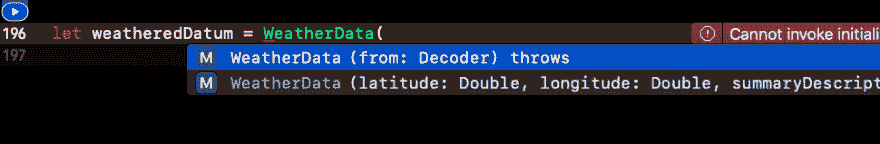
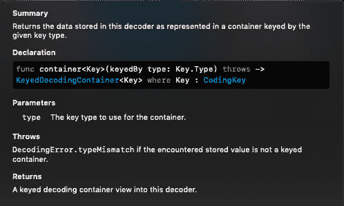

# 我向可爱的过渡

> 原文：<https://dev.to/myerschris78/my-transition-to-codable-41fk>

在我的 iOS 训练营开始的两三个星期里，我看到了类似这样的东西...

```
{  "latitude":  37.8267,  "longitude":  -122.4233,  "timezone":  "America/Los_Angeles",  "currently":  {  "time":  1557685055,  "summary":  "Mostly Cloudy",  "icon":  "partly-cloudy-day",  "nearestStormDistance":  0,  "precipIntensity":  0,  "precipProbability":  0,  "temperature":  53.72,  "apparentTemperature":  53.72,  "dewPoint":  50.31,  "humidity":  0.88,  "pressure":  1016.37,  "windSpeed":  6.11,  "windGust":  10.03,  "windBearing":  260,  "cloudCover":  0.9,  "uvIndex":  4,  "visibility":  10,  "ozone":  351.5  }  }  ~~~  I  remember  how  magical  it  felt  when  I  was  taught  how  to  parse  web  data  (JSON)  and  use  it  in  meaningful  objects  in  my  code.  Hundreds  of  lines  of  data,  parsed  down  into  usually  5-7  pieces  of  useful  data  relevant  to  what  I  was  doing.   The  first  time  was  some  sample  JSON  that  our  instructor  had  given  us,  the  second  time  was  creating  JSON  of  our  own  and  grouping  it  together.  Finally,  we  started  getting  JSON  from  the  web.  DarkSkys,  Spotify,  Google  APIs,  we  were  consuming  their  data  and  making  it  useful  to  our  own  needs.  Thousands  of  pieces  of  data  bending  their  will  to  my  fingertips--obey  me  puny  pieces  of  binary!  The  process  we  were  taught  was  to  create  a  model  with  the  relevant  data  you  want,  then  write  some  code  to  take  the  data  that  comes  in  from  a  network  call,  turn  it  into  a  dictionary,  and  extract  the  values  from  the  necessary  keys.  Then  inject  that  data  into  your  model  instance.  My  very  first  attempt  looked  like  this...  #####  Step  One:  Create  the  model  I  wanted  a  few  things  to  show.  Weather  summary,  temperature,  chance  of  rain,  basically  every  piece  of  data  a  farmer  with  crops  in  the  field  might  find  relevant.  (I'm  from  the  South.  Weather  is  ALWAYS  a  topic  of  conversation!).  I  was  shown  a  neat  trick  where  I  could  create  a  custom  initializer  that  accepted  a  dictionary  and  parse  the  data  right  there  in  the  model.  I  was  indeed  feeling  good  about  my  skills.  ~~~swift  class  WeatherData:  NSObject  {  var  latitude:  Double  =  0.0  var  longitude:  Double  =  0.0  var  summaryDescription  :  String  =  ""  var  icon  :  String  =  ""  var  precipProbability  :  Double  =  0.0  var  temperature  :  Double  =  0.0  var  humidity  :  Double  =  0.0  var  windSpeed  :  Double  =  0.0  override  init()  {  super.init()  self.latitude  =  0.0  self.longitude  =  0.0  self.summaryDescription  =  ""  self.icon  =  ""  self.precipProbability  =  0.0  self.temperature  =  0.0  self.humidity  =  0.0  self.windSpeed  =  0.0  }  init(dict:  [String:  AnyObject])  {  super.init()  if  let  latitude  =  dict["latitude"]  as?  Double  {  self.latitude  =  latitude  }  if  let  longitude  =  dict["longitude"]  as?  Double  {  self.latitude  =  latitude  }  if  let  currentlyDict  =  dict["currently"]  as?  [String:  AnyObject]  {  print(currentlyDict)  if  let  summary  =  currentlyDict["summary"]  as?  String  {  self.summaryDescription  =  summary  }  else  {  print("I could not parse summary")  }  if  let  icon  =  currentlyDict["icon"]  as?  String  {  self.icon  =  icon  }  else  {  print("I could not parse the icon")  }  if  let  precipitation  =  currentlyDict["precipProbability"]  as?  Double  {  self.precipProbability  =  precipitation  }  else  {  print("I could not parse precipitation")  }  if  let  temp  =  currentlyDict["temperature"]  as?  Double  {  self.temperature  =  temp  }  else  {  print("I could not parse the temperature")  }  if  let  humid  =  currentlyDict["humidity"]  as?  Double  {  self.humidity  =  humid  }  else  {  print("I could not parse humidity")  }  if  let  wind  =  currentlyDict["windSpeed"]  as?  Double  {  self.windSpeed  =  wind  }  else  {  print("I could not parse speed")  }  }  }  }  ~~~  #####Step  Two:  Take  data  and  turn  it  into  a  dictionary  I'd  then  make  a  network  call,  and  if  all  went  according  to  plan,  would  take  raw  data  and  process  it  with  a  handle  little  function...  ~~~swift  func  parseJSON(_  data:  Data?)  ->  [String:  AnyObject]?  {  var  theDictionary  :  [String:  AnyObject]?  =  nil  if  let  data  =  data  {  do  {  if  let  jsonDictionary  =  try  JSONSerialization.jsonObject(with:  data,  options:  [])  as?  [String:  AnyObject]  {  theDictionary  =  jsonDictionary  //print(jsonDictionary)  }  else  {  print("Could not parse jsonDictionary")  }  }  catch  {  }  }  else  {  print("Could not unwrap data")  }  return  theDictionary  }  ~~~  #####Step  Three:  Call  for  the  data,  parse,  and  inject  into  the  model  Finally,  somewhere  in  my  completion  handler  to  the  network  call,  I  wrote  some  code  where  I  take  the  raw  data  that  comes  back,  use  my  handy  `parseJSON`  to  serialize  it  and  turn  it  into  a  dictionary,  and  then  inject  it  into  my  `WeatherData`  model  using  my  custom  initializer.  ~~~swift  //  ...somehwere  in  the  network  call...  if  let  jsonDictionary  =  self.parseJSON(data)  {  print(jsonDictionary)  let  theWeatherData  =  WeatherData(dict:  jsonDictionary)  DispatchQueue.main.async(execute:  {  self.delegate?.passWeather(theWeatherData)  })  print(theWeatherData)  }  }  else  {  print("I could not parse the dictionary")  }  ~~~  The  process  got  pretty  involved  pretty  quickly.  If  you  had  an  array  or  dictionary  of  information  and  within  that  more  arrays  of  dictionaries,  the  parsing  strategy  got  incredibly  complex.  It  wasn't  uncommon  for  me  to  write  down  on  paper  how  I  needed  to  get  into  deeper  levels  of  nested  information.  It  reminds  me  of  the  old  Atari  game  "Dig Dug".  When  Codable  came  out  a  couple  years  later,  I  was  impressed  but  never  had  much  need  to  use  it.  Scratch  that.  I  was  too  lazy  to  bother  learning.  At  the  time,  my  job  didn't  require  much  pulling  down  of  data,  and  what  little  there  was  I  just  parsed  the  way  I  knew  how--`JSONSerialization`.  A  few  months  later,  I  had  to  send  some  data  back  and  I  thought,  "hey, maybe now is a good time to update my knowledge base here."  My  data  wasn't  particularly  complex--a  few  values,  nor  did  it  have  anything  nested,  but  you  know,  start  small.  So  I  watched  a  couple  videos,  read  some  blogs  on  how  to  do  it,  and  away  I  went.  For  what  I  needed,  it  worked  great,  was  easy  to  read  by  my  fellow  developers  in  our  research  lab  and  I  felt  quite  proud  of  myself.  But  had  I  really  learned  anything?  No.  I  learned  how  to  take  some  code  someone  else  wrote  and  fit  it  into  what  I  needed,  which,  don't  get  me  wrong,  is  a  good  first  step  at  learning  something.  I've  never  been  good  at  taking  something  abstract  and  making  sense  of  it.  I  need  to  see  it  in  action,  play  with  it  and  then,  maybe  after  a  few  months  of  using,  start  to  make  sense  of  what  I'm  doing.  Last  year  I  left  the  research  lab  I  was  working  in  and  went  to  work  in  the  private  sector.  It  was  here  that  I  learned  just  how  often  big  production  apps  use  network  calls  to  send  and  receive  information.  My  old  method  of  using  NSObject  and  writing  some  parsing  initializer  got  way  too  convoluted.  I  decided  to  make  use  of  the  benefits  of  Codable  and  haven't  really  looked  back  since.  I  went  through  some  trial  and  error,  but  the  place  I  started  was  with  my  original  parsing  project  from  my  bootcamp.  Taking  weather  data  and  using  Codable  to  process  it.  #####Step  One:  How  do  I  use  Codable  again?!  By  this  point  in  my  development  career,  [Apple  Docs](https://developer.apple.com/documentation/foundation/archives_and_serialization/encoding_and_decoding_custom_types)  didn't  intimidate  me  as  much  as  they  used  to.  My  thinking  was  that  if  I  needed  to  really  understand  how  to  do  this,  I  should  get  use  to  seeing  Apple's  intentions  on  how  to  use  it.  As  it  turns  out,  Apple  had  really  good  documentation  and  an  example  to  follow  and  it  managed  to  make  the  code  above  look  incredibly  simple.  What  I  needed  to  do,  was  create  a  struct  with  the  values  I  wanted...  ~~~swift  struct  WeatherData  {  var  latitude:  Double  var  longitude:  Double  var  summaryDescription:  String  var  icon:  String  var  precipProbability  var  temperature:  Double  var  humidity:  Double  var  windspeed:  Double  }  ~~~  Now  the  problem  is  that  while  latitude  and  longitude  are  at  what  I  call  the  "top-level"  of  the  json  coming  in,  the  remainder  of  the  items  are  in  a  nested  dictionary  called  `currently`.  And  while  I  could  again  go  the  way  I  did  earlier  with  diving  into  a  nested  dictionary  and  pulling  out  relevant  information,  I  do  run  into  the  issue  where  I  may  misspell  something  by  making  key  stringly-typed.  Apple  helps  us  out  with  this  by  the  use  of  CodingKeys.  ~~~swift  //  appending  to  my  WeatherData  model...  enum  CodingKeys:  String,  CodingKey  {  case  latitude,  longitude,  currently  //  the  currently  case  is  necessary  to  go  down  one  level  to  get  into  summary,  temperature,  etc...  }  ~~~  CodingKeys  allow  us  to  create  an  enum  with  the  dictionary  keys  as  the  cases.  Since  the  enum  is  a  string,  it  allows  us  to  edit  the  raw  value  of  the  case  to  match  whatever  the  actual  json  dictionary  key  is.  For  instance,  the  word  `windspeed`  is  one  word.  I  decide  I  want  my  coding  key  to  be  `windspeed`.  However  when  I  look  back  into  the  json,  the  key  they  use  is  'windSpeed`.  I  can  edit  the  enum  case  to  match  the  actual  json  key...  ~~~swift  enum  CodingKeys:  String,  CodingKey  {  case  latitude,  longitude,  currently  }  enum  CurrentlyKeys:  String,  CodingKey  {  case  summary,  icon,  precipProbability,  temperature,  humidity,  windspeed  =  "windSpeed"  } 
```

Enter fullscreen mode Exit fullscreen mode

你会注意到我有两套枚举。`CodingKeys`是我在 json 的顶级数据。`CurrentlyKeys`是`currently`案例内的数据。

目前，如果我们试图解码，这些都不起作用。仅仅是因为 with 还没有要求我们的模型符合`Codable`协议。`Codable`只是`Encodable`和`Decodable`协议的类型别名。如果你只是接收信息，你可以选择在`Decodable`协议上实现。如果你发送的是`Encodable`，或者你认为你可能两者都需要，那就遵从`Codable`。由于我只接收信息，我将坚持使用`Decodable`。

如果你看看苹果文件的底部，它会提供一些关于手动解码的见解，特别是如果你的所有信息不在同一层(即嵌套)。它没有让结构符合`Decodable`，而是使用结构的扩展来编写所需的可解码初始化器。我个人更喜欢这种方式，因为你永远不知道什么时候你可能想让你的结构能够使用它的成员方式初始化器。

[](https://res.cloudinary.com/practicaldev/image/fetch/s--48_z2C2p--/c_limit%2Cf_auto%2Cfl_progressive%2Cq_auto%2Cw_880/https://thepracticaldev.s3.amazonaws.com/i/uesg7x4ozv6fwbiwfoip.png)

```
extension WeatherData: Decodable {
    init(from decoder: Decoder) throws {
        let values = try decoder.container(keyedBy: CodingKeys.self)
        latitude = try values.decode(Double.self, forKey: .latitude)
        longitude = try values.decode(Double.self, forKey: .longitude)

        let currently = try values.nestedContainer(keyedBy: CurrentlyKeys.self, forKey: .currently)
        summaryDescription = try currently.decode(String.self, forKey: .summary)
        icon = try currently.decode(String.self, forKey: .icon)
        precipProbability = try currently.decode(Double.self, forKey: .precipProbability)
        temperature = try currently.decode(Double.self, forKey: .temperature)
        humidity = try currently.decode(Double.self, forKey: .humidity)
        windspeed = try currently.decode(Double.self, forKey: .windspeed)

    }
} 
```

Enter fullscreen mode Exit fullscreen mode

这里发生了什么？

[](https://res.cloudinary.com/practicaldev/image/fetch/s--SdtPjabU--/c_limit%2Cf_auto%2Cfl_progressive%2Cq_auto%2Cw_880/https://thepracticaldev.s3.amazonaws.com/i/j2gvt6dhtbmp0cznst1p.png)

根据关于`container`的苹果文档，进来的数据存储在一个容器中，可以被相应的`CodingKey`引用。所以`let values...`要求将数据分类到我们之前指定的三个编码键类别中。从那里我们可以很容易地解析出纬度和经度，给出它们的类型和早先分配给它的编码键。

然而，所有剩余的值都位于当前的字典中，它也是一个容器。所以 Decodable 有另一个叫做`nestedContainer`的方法，它的工作方式很像容器。它只需要一组编码键来整理里面的信息。因此，一旦我使用`CurrentlyKeys`确定了`currently`是一个嵌套容器，我就可以进入并解析我的模型中剩余的值。最后，我们有一些类似的东西:

```
struct WeatherData {
    var latitude: Double
    var longitude: Double

    var summaryDescription: String
    var icon: String
    var precipProbability: Double
    var temperature: Double
    var humidity: Double
    var windspeed: Double

    enum CodingKeys: String, CodingKey {
        case latitude, longitude, currently
    }

    enum CurrentlyKeys: String, CodingKey {
        case summary, icon, precipProbability, temperature, humidity, windspeed = "windSpeed"
    }
}

extension WeatherData: Decodable {
    init(from decoder: Decoder) throws {
        let values = try decoder.container(keyedBy: CodingKeys.self)
        latitude = try values.decode(Double.self, forKey: .latitude)
        longitude = try values.decode(Double.self, forKey: .longitude)

        let currently = try values.nestedContainer(keyedBy: CurrentlyKeys.self, forKey: .currently)
        summaryDescription = try currently.decode(String.self, forKey: .summary)
        icon = try currently.decode(String.self, forKey: .icon)
        precipProbability = try currently.decode(Double.self, forKey: .precipProbability)
        temperature = try currently.decode(Double.self, forKey: .temperature)
        humidity = try currently.decode(Double.self, forKey: .humidity)
        windspeed = try currently.decode(Double.self, forKey: .windspeed)

    }
} 
```

Enter fullscreen mode Exit fullscreen mode

之后，就是获取 json 数据，转换它并使用我们的解码器

```
 let weatherJson = """
{
"latitude": 37.8267,
"longitude": -122.4233,
"timezone": "America/Los_Angeles",
"currently": {
"time": 1557685055,
"summary": "Mostly Cloudy",
"icon": "partly-cloudy-day",
"nearestStormDistance": 0,
"precipIntensity": 0,
"precipProbability": 0,
"temperature": 53.72,
"apparentTemperature": 53.72,
"dewPoint": 50.31,
"humidity": 0.88,
"pressure": 1016.37,
"windSpeed": 6.11,
"windGust": 10.03,
"windBearing": 260,
"cloudCover": 0.9,
"uvIndex": 4,
"visibility": 10,
"ozone": 351.5
}
}
"""

let jsonData = weatherJson.data(using: .utf8)!
let decoder = JSONDecoder()
let currentWeather = try decoder.decode(WeatherData.self, from: jsonData)

print(currentWeather.latitude)
print(currentWeather.temperature) 
```

Enter fullscreen mode Exit fullscreen mode

我想还有其他的例子遵循同样的模式。我是说，苹果公司的文件就是这么设置的。然而，在工作中，有时我有几个嵌套的信息层，在初始化器中反复使用`nestedContainer`会使已经涉及的扩展变得更加复杂。所以我更喜欢用不同的方式来攻击它。每个嵌套层次都有自己的结构、自己的编码键和自己的扩展名。我更喜欢这样，因为它让我的结构更小，而且在我看来，更容易阅读。请允许我重构以上内容。

我将从我的 WeatherData 模型开始

```
struct WeatherData {
    var latitude: Double
    var longitude: Double
    var currentWeather: CurrentWeather

    private enum CodingKeys: String, CodingKey {
        case latitude
        case longitude
        case currentWeather = "currently"
    }
}

extension WeatherData: Decodable {
    init(from decoder: Decoder) throws {
        let values = try decoder.container(keyedBy: CodingKeys.self)
        latitude = try values.decode(Double.self, forKey: .latitude)
        longitude = try values.decode(Double.self, forKey: .longitude)
        currentWeather = try values.decode(CurrentWeather.self, forKey: .currentWeather)
    }
} 
```

Enter fullscreen mode Exit fullscreen mode

我更喜欢将当前天气作为它自己的结构。所以在这里，我的顶层有一个对顶层属性的引用，我的下一层只引用其中的属性，以此类推。我已经改变了我从早期模型发回的内容，以使内容更简短。您还会注意到，我包含了一种处理选项的方法。在我处理制造数据的工作中，我们确实有一些模型比其他模型包含更多的信息，而这些字段中有许多是空白的或者是零。

```
struct CurrentWeather {
    var summary: String
    var temperature: Double
    var windspeed: Double
    var uvIndex: Int?

    private enum CurrentWeatherCodingKeys: String, CodingKey {
        case summary
        case temperature
        case windspeed = "windSpeed"
        case uvIndex
    }
}

extension CurrentWeather: Decodable {
    init(from decoder: Decoder) throws {
        let values = try decoder.container(keyedBy: CurrentWeatherCodingKeys.self)
        summary = try values.decode(String.self, forKey: .summary)
        temperature = try values.decode(Double.self, forKey: .temperature)
        windspeed = try values.decode(Double.self, forKey: .windspeed)
        uvIndex = try values.decodeIfPresent(Int.self, forKey: .uvIndex)
    }
} 
```

Enter fullscreen mode Exit fullscreen mode

对我来说，把它分解成独立的模型让我更容易理解这些层次。它也保持它的小。我通常将所有的模型保存在同一个文件中，并给它贴上类似于`WeatherDataResponse`的标签。

我注意到，如果你打算不使用扩展来编写自己的初始化程序，而只是让`WeatherData`符合 Decodable，那么我的顶层编码键必须被命名为`CodingKeys`。如果我给它取别的名字，操场会给我一个错误。编码键的嵌套级别名称似乎无关紧要。然而，我通常喜欢使用扩展来保持我的成员明智的初始化式，所以这对我来说不是问题。

总而言之，这篇文章是关于我解释 Codable(嗯，大部分是可解码的...)对我自己，因为它是关于向别人解释它。我希望，也许，有些人能从中找到一些用处，或者至少，鼓励你去学习一些新的东西。欢迎任何建设性的反馈。