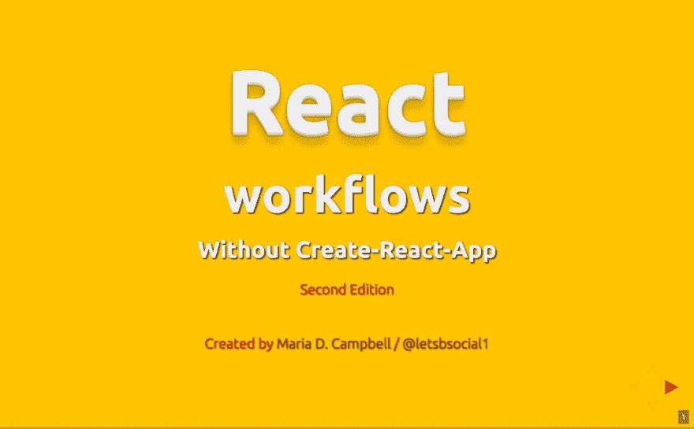

# 我更新的自定义反应工作流程(第二版)在这里

> 原文：<https://dev.to/letsbsocial1/my-updated-custom-react-workflow-2nd-edition-ishere-6g4>

**2018 年 12 月 3 日更新:**由于**巴别塔 7** 中**的突破性改动**影响了 ***Jest*** 、 ***React*** 、以及 **ESLint** ，一路上出现了一些问题。 ***除非*** 你正在**使用** ***创建-反应-应用*** ，否则你的**工作流**可能不得不 ***调整*** 取决于什么**支持**你想要 ***在任何给定的**应用**中提供*** 。我已经把 ***所有资源*** **一起**放在 ***资源库*** 中，用于我的**自定义 React 工作流**在 **Github** 上的**第二版**。请访问[问题](https://github.com/interglobalmedia/react-workflow-updated-2018/issues/1)了解更多信息。

你们有些人可能知道我去年用 **create-react-app*8 创建了一个**自定义工作流*****没有*** ，但是* * *仿效** *其**核心特性**。然后，我在纽约的 React Meetup 上做了一个演讲。组织者认为它太长了，我无法现场完成演示，但没关系！我让 ***用 [reveal.js](https://revealjs.com/#/) 创建了*****presentation**，其中包含了 ***完整的*** **工作流文档**。要 ***查看*** 我的**自定义 React 工作流**的**第一版**(现在有点过时)，请访问 [React 工作流展示库](https://github.com/interglobalmedia/react-workflow-presentation)。

我开始专注于更深入的研究 **Javascript** (没有 **React** ，不要问 lol】， **Nodejs** ，和**后端**，所以我的注意力 ***暂时从*** **React** 移开了。

当我回到 ***更新*** 一些**反应**应用和其他 **JS 相关**的事情，我看到了很多改变。就在那时，我决定**更新我的**工作流**的**第一版**，这样我就可以赶上 ***JavaScript 半球*** 中发生的事情！**

我昨晚刚完成工作流程。当我在与存储库相关的项目中写作时，

> 这是我为我的 React
> 应用程序创建的定制工作流的第二版，合并了 React 16.6.3、ESLint
> 5.9.0、Babel 7 和 Webpack 4 中发生的变化。这并不意味着这些依赖项/开发依赖项中发生了什么变化的一个包罗万象的例子
> 。希望它能鼓励其他人更深入地研究它们，并扩展他们作为 T4 开发者的视野。我知道创建这个平台拓展了我的视野，我在学习新事物的过程中获得了很多乐趣。

我也鼓励那些决定尝试我的工作流程的人让我知道进展如何！我希望能够继续改进我的实现和文档。如果您有任何问题，请在存储库的问题部分创建它们！谢谢！

**相关资源:**

[React 工作流程 2018 年更新](https://github.com/interglobalmedia/react-workflow-updated-2018)