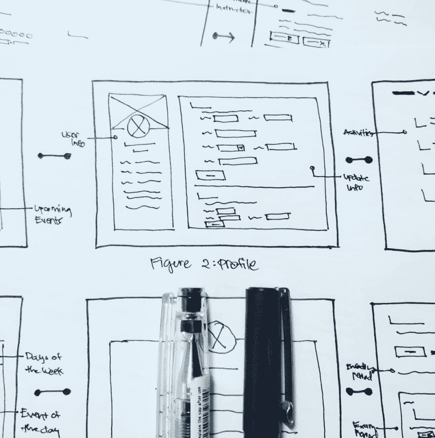
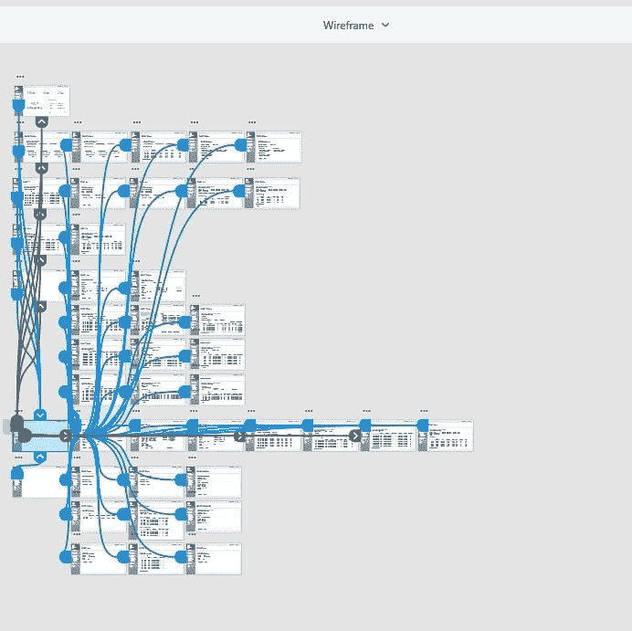
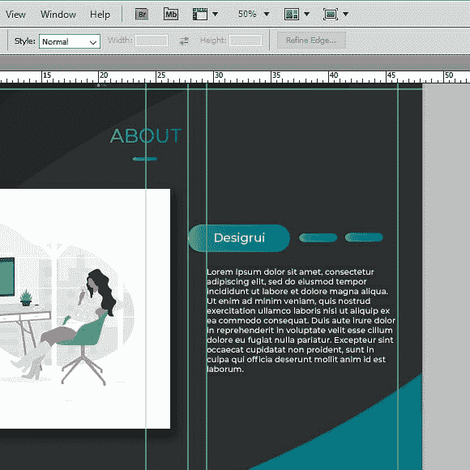
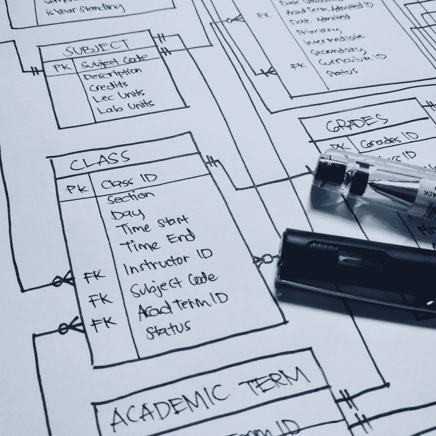

# 我的 Web 开发过程第 1 部分:设计

> 原文：<https://dev.to/jorenrui/my-web-development-process-part-1-design-7l1>

> 我将讨论如何开发基于网络的应用程序。我将包括我如何做事，我使用什么软件，以及对我有帮助的资源。我还是个大学生。所以我预计，一旦我进入职场，获得更多的经验，我的 web 开发过程将会有很大的发展。

在一年多的时间里，在构建几个基于 web 的应用程序的过程中，我的过程经历了几次变化。在以前，我直接去编码。我经常发现自己盯着屏幕看几分钟，思考我将如何进行。我也会尝试一些想法，只到最后才刮。

没有任何方向的开发会变得相当混乱。这可能会导致一个构思不良或考虑不周的应用程序。所以，我重新设计了我的工作流程。随着我在 web 开发方面获得更多的知识，我意识到这不仅仅是关于编码。它是关于解决问题的。

目前，我正在遵循以下步骤:

1.  [研究和构思](#research)
2.  [设计](#design)
    *   [用户体验(UX)设计](#ux-design)
        *   [草图](#rough-sketches)
        *   [Wireframe](#wireframe)
    *   [用户界面设计](#ui-design)
    *   [数据库设计](#database-design)
3.  编码
    *   前端开发
    *   后端开发
4.  测试和部署

仔细看，类似于[软件开发生命周期(SDLC)](https://online.husson.edu/software-development-cycle/) 。它是一个项目团队开发软件的过程。它由六个步骤组成——规划、分析、设计、实现、测试和维护。

* * *

## 研究和构思

首先，我会努力理解这个项目，它的目的，客户和观众。这可以通过研究或询问客户来完成。通过这样做，我会对应用程序应该包含什么内容有一个清晰的想法。

我也会看看别人建的 app。这有助于我了解这种应用程序的相似之处和不同之处。例如，电子商务 web 应用程序通常有一个购物车。

我问自己这些问题:

1.  客户是谁？
2.  对他/她来说什么是重要的？
3.  观众是谁？
4.  对他们来说什么是重要的？

我是在看 DevTips 的 Travis Neilson 如何建立他的个人网站时产生这个想法的。观看多名设计师的作品让我对 UX 设计产生了兴趣。

无论如何，作为设计师，你的工作是决定内容将被放置在哪里，以满足客户和观众。确定对他们两个来说什么是重要的可以指导你做决定。如果没有这一步，您可能会在错误的方向上构建项目。

知道了哪些内容需要优先处理，我列出了清单。根据优先级排序。然后，我会思考它们是如何相互联系的。这样，我就可以建立内容的层次结构。像登录页面，然后是管理仪表板页面。

最后，我会考虑我将使用什么技术堆栈。我将决定该项目的框架或库。也许，我可能想尝试普通的 HTML & CSS，和香草 JS 来取乐或练习呵呵。

* * *

## 设计

### 用户体验(UX)设计

> **用户体验(UX)设计**是创造产品的过程，为用户提供有意义和相关的体验。
> - [交互设计基础](https://www.interaction-design.org/literature/topics/ux-design)

现在我对项目应该包含什么有了一个清晰的想法，我将继续进行设计。在进行设计时，我考虑了以下几点:

*   布局
*   用户使用应用程序时的流量(我猜是用户流量)

#### 草图

<figure>

<figcaption>[Wireframe via pen and paper](https://www.instagram.com/p/BsKrL4eAseh/)</figcaption>

</figure>

在这一步，我将考虑如何组织和展示内容。我先从草图开始。按照我写的内容列表，我将为每一个项目创建至少三个设计。

我会用纸笔勾勒出我的想法，以减少干扰。我会让我所有的想法自由流动。不管这些线是不是直的。不关心它是否看起来很棒，只关注布局。只是让我的大脑疯狂地形成我脑海中的想法。我在决定内容应该采取什么形式。

当我想不出办法时，我就在那里停下来。我会删除我不满意的设计。然后，从所有设计中挑选出最合适的。

接下来，我将以一种更整洁的方式重新搜索它。我组织屏幕并连接它们，显示应用程序的流程。有时，由于不断的重新评估和改进，设计可能会发生变化。

#### Wireframe

<figure>

<figcaption>[Wireframe and Prototyping using Adobe XD](https://www.instagram.com/p/BsnmaQIAP98/)</figcaption>

</figure>

现在，我已经准备好用 Adobe XD 制作一些线框了。有些应用是为设计而做的。这些是:

*   [Adobe 体验设计](https://www.adobe.com/sea/products/xd.html) - Mac 和 Windows(目前使用这个)
*   [草图](https://sketchapp.com/) -仅适用于 Mac 用户
*   [Figma](https://www.figma.com/) -基于网络，Mac，Windows，Linux
*   还有其他像[视觉工作室](https://www.invisionapp.com/studio)和 [UX 销](https://www.uxpin.com/)

我会把我的草图从纸上转移到软件上。我只在做线框时使用不同深浅的黑色。这迫使我关注布局，而不是外观或风格。我将通过在屏幕之间使用*线*使其互动。比如当我点击*登录按钮*，它会把我转到仪表板屏幕。

有了这个，我可以从我的团队或者我的客户那里得到早期的反馈。根据其他人的意见，我可以看到我忽略了哪些设计问题。这有助于改进设计。因此它将专注于解决最终用户遇到的问题。也防止我把 app 建错方向。完成线框后，我开始用户界面设计。

T2】

### 用户界面设计

> **用户界面(UI)设计**是在软件或计算机化设备中制作界面的过程，重点是外观或风格。
> - [交互设计基础](https://www.interaction-design.org/literature/topics/ui-design)

<figure>

<figcaption>[Designing the Website using Photoshop](https://www.instagram.com/p/BskTW1UArej/)</figcaption>

</figure>

当我决定使用模板时，我将跳过这一步。否则，我会创建自己的设计。

我每周至少看一次别人的作品来寻找灵感。这让我的创造性思维得以继续。每当我遇到困难时，它帮助我想出新的想法。

对于配色方案，我使用标志的颜色作为基础。挑颜色的时候也会考虑主题。对于自然，我会选择绿色。对于快餐，我会用红色和黄色来煽动饥饿感。如果是为了好玩，我会尝试我在环境中看到的调色板。

我在使用字体的时候会限制自己。两三个对我来说足够了。我使用互补的字体。我也展示了它们之间的对比。比如将大的、粗体的、无衬线的标题和常规的、有衬线的段落搭配起来。

当我把这些都记在心里时，我优先考虑可读性。我选择悦目的颜色。我会选择不会影响阅读内容的字体。我更喜欢短的段落，而不是长的(如果它不是一篇文章的话)。

对于图像，我会选择高分辨率的。永远不要拉伸它，这会扭曲图像，只是为了适应屏幕。

最后，对于动画和过渡，我还在学习呵呵。

我在设计中使用的软件有:

*   [Adobe Photoshop](https://www.adobe.com/sea/products/photoshop.html)
*   [Adobe 体验设计](https://www.adobe.com/sea/products/xd.html)

还有其他一些你可以用的词，比如:

*   [Adobe Illustrator](https://www.adobe.com/sea/products/illustrator.html)
*   [GIMP](https://www.gimp.org/)
*   我之前提到过的软件，如[图玛](https://www.figma.com/)和[草图](https://sketchapp.com/)。

对我有帮助的资源有:

*   [Dribble](https://dribbble.com/) -包含了众多优秀设计师和创意人员的作品。我用它来获得灵感。
*   [色彩空间](https://mycolor.space/) -用于创建调色板或渐变。
*   [调色板按钮](http://paletton.com) -用于创建调色板。
*   [字体牛逼](https://fontawesome.com/) -可以使用的图标套件。
*   [谷歌字体](https://fonts.google.com/) -你可以使用的各种字体。
*   [Unsplash](https://unsplash.com/) -可以免费使用的超赞照片。
*   [unDraw](https://undraw.co/illustrations) -开源插图。
*   Lorem Ipsum 生成器 -占位符文本生成器。

### 数据库设计

这适用于需要数据库的应用程序。我主要做前端的东西。因此，除非别无选择，否则我很少处理这个问题。我经常使用 RDBMS。我还没试过 noSQL。

在数据库设计中，我从分析我收集的手工表单或文档开始。这些文件可以是收据或登记表。然后，我将数据标准化。这有助于防止数据异常。

> **数据库规范化**是为了减少[数据冗余](https://en.wikipedia.org/wiki/Data_redundancy)和提高[数据完整性](https://en.wikipedia.org/wiki/Data_integrity)
> - [维基百科](https://en.wikipedia.org/wiki/Database_normalization)按照一系列所谓的[范式](https://en.wikipedia.org/wiki/Database_normalization#Normal_forms)构造一个[关系数据库](https://en.wikipedia.org/wiki/Relational_database)的过程

<figure>

<figcaption>[Data Normalization via pen and paper](https://www.instagram.com/p/BtQtWyaA9yk/)</figcaption>

</figure>

然后我创建一个实体关系图来帮助我可视化它们的关系。每当我编程和维护数据库时，这个图就成了我的指南。

<figure>

<figcaption>[Entity Relationship Diagram via pen and paper](https://www.instagram.com/p/BtXVaEEAGnx/)</figcaption>

</figure>

正如你所看到的，我更喜欢在把它转换成数字之前先勾画出我的想法。

* * *

## 包装完毕

花时间研究、计划和设计会极大地影响应用程序的质量。直接跳到代码中，就像我过去做的那样，会让 web 开发变得一团糟。

研究和规划可以让你有目的、有意图地开发应用。它帮助你识别什么是重要的，以及需要解决的问题。设计可以让你的应用变得有用和易懂。也让你思考用户体验。

我一直在学习 web 开发。因此，随着我获得更多的经验，我希望我的流程会有所改变。知道每一步在 web 开发中都有一个特殊的角色真是太棒了。因为它不仅仅是关于编码，而是关于解决问题。这就是为什么我渴望了解更多除了编码以外的其他领域。

这是我网站开发过程的第一部分。第 2 部分是关于编码的。

 [## 我的 Web 开发过程第 2 部分:代码

### joey lene Rivera 3 月 4 日 196 分钟阅读

#webdev](/jorenrui/my-web-development-process-part-2-code-2c91)

我希望你喜欢读这篇文章。感谢您的时间和愉快的编码！😊