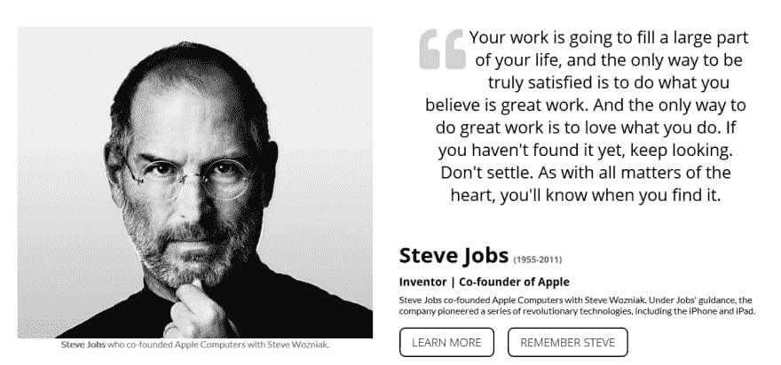
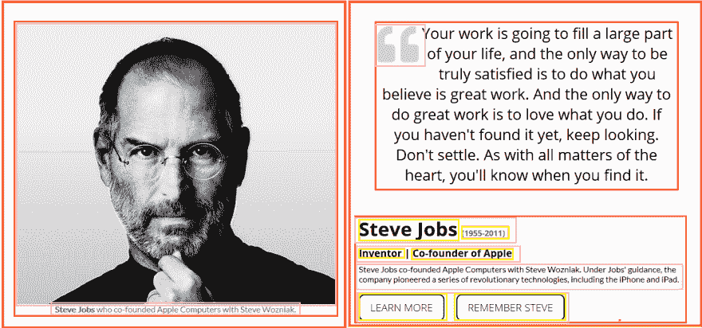
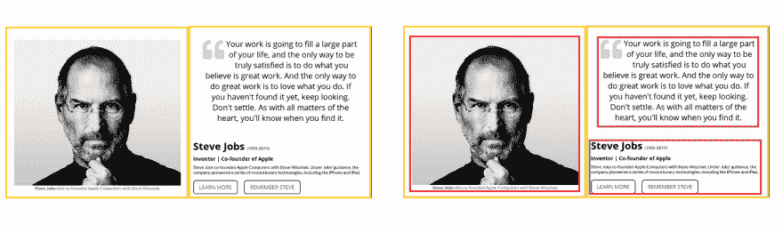
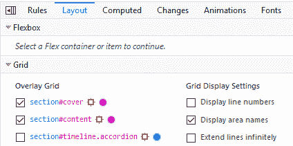
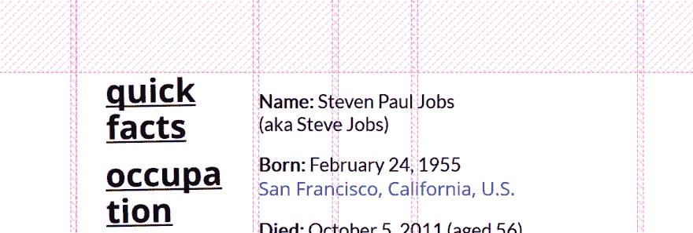
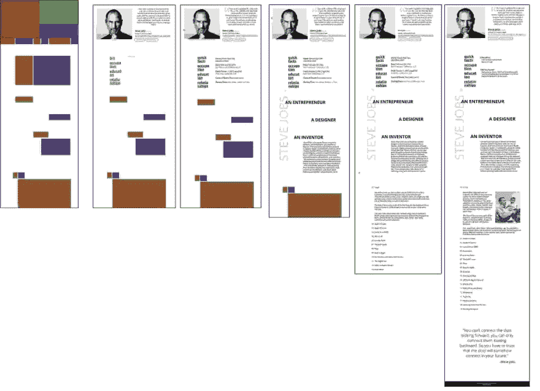

# 我的 Web 开发过程第 2 部分:代码

> 原文：<https://dev.to/jorenrui/my-web-development-process-part-2-code-2c91>

> 我将讨论如何开发基于网络的应用程序。我将包括我如何做事，我使用什么软件，以及对我有帮助的资源。我还是个大学生。所以我预计，一旦我进入职场，获得更多的经验，我的 web 开发过程将会有很大的发展。

在这篇文章中，我将讨论我的过程中的**代码**部分。如果你错过了第一个，请随意阅读我的过程中的设计部分。😊

 [## 我的 Web 开发过程第 1 部分:设计

### 乔伊·李·里维拉

#webdev #design](/jorenrui/my-web-development-process-part-1-design-7l1)

目前，我正在遵循以下步骤:

1.  研究和构思
2.  设计
    *   用户体验(UX)设计
        *   草图
        *   三维线框模型
    *   用户界面(UI)设计
    *   数据库设计
3.  [编码](#code)
    *   [前端开发](#front-end)
    *   [后端开发](#back-end)
4.  [测试和部署](#test-deploy)

* * *

## 编码

既然设计已经完成，我们现在可以开始编码了。我的过程由两部分组成:

*   [前端开发](#front-end)——我将设计转化为代码。
*   [后端开发](#back-end) -我添加了一些逻辑和数据库。

我先做前端，然后做后端。

每当我写代码的时候，我都会在中间休息一下。这让我思考我正在做的任务。我还意识到，当我遇到一个 bug，breaks 帮助。我会设定一个时间框架来解决这个问题。时间到了，不管我喜不喜欢，我都休息了一会儿。

当我做其他没有编码的事情时，我会让我的思想游荡。这让我从一个不同的角度思考解决方案。过度使用时，不仅机器会过热，你的大脑也会。如果你想做到最好，那么你应该练习自我保健。

T2】

### 前端开发

在我编码之前，我收集我需要的资产，例如:

*   字体和图标
*   图片
*   其他人

我也想到这些问题

*   我是要使用模板，还是应该使用*自定义模板*？
*   我是不是在用*规模*来构建这个应用程序？

这些问题通常是在设计和规划阶段考虑的。所以你现在可能知道答案了。

*如果*你使用的是**模板**，那么你可以跳过这一部分，直接进入[后端开发](#back-end)。

*否则，如果*你要创建一个**定制的**，那就继续吧。

#### 网格

我首先从分析设计的布局开始。我识别每个屏幕中的*方块*。

让我们以此为例:

<figure>

<figcaption>[Tribute Page I built for CSS Grid practice](https://jorenrui.gitlab.io/fcc-tribute-page/). Check the repo [here](https://gitlab.com/jorenrui/fcc-tribute-page).</figcaption>

</figure>

这些元素都包含在一个*盒子*中。突出显示它们，结果将是:

我采取了自上而下的方法。从较大的组件开始，然后向下到较小的组件。

这样我就能清楚地掌握它的**网格布局**。在这里，设计有两个主要的栏目。左边是带有标题的图片，右边是引用和一些信息。如果左边的图像覆盖了整个左栏，那么我就知道这是一个`div`的背景。但是既然它不是，我可以断定它是一个在`div`中的`img`标签。不过，这要看情况。一个答案可以有多种解法。你只需要选择最适合那种情况的。

了解布局是如何组织的有助于了解你要做什么样的网格。然后，我对网格(CSS 网格，Bootstrap 等)进行编码。).我临时添加背景色来使它形象化。

您可以使用开发人员工具查看 CSS 网格:

但是，您也可以使用它来查看您使用框架制作的网格。只需使用对你有利的开发工具。

#### 遍历网站的所有页面

然后，我会重复这些步骤:

*   制作网格(HTML 和 CSS)
*   添加元素(HTML) -最好使用语义标签
*   添加样式(CSS)
*   添加行为(JS)
*   让它在不同浏览器上都好看(支持 IE，我敢 lol。就想到[优雅的退化](https://developer.mozilla.org/en-US/docs/Glossary/Graceful_degradation)
*   完善它对手机、平板电脑等的响应能力。(媒体查询)

当我编码时，我会浏览每页的每一部分。然后每个网站的每个页面。

不要忘记为搜索引擎优化和可访问性润色你的网站。

当前端完成后，我测试部署应用程序。然后，请一个队友来测试和复习。在那之后，我会修改版本或者修复错误。

但是，当您决定使用框架、库、预处理器、任务运行器等时，您的过程可能会发生变化。我展示的是做前端的简单方法(对我来说，我觉得哈哈)。

T2】

### 后端开发

我只做过两次后端:一次是在我的 OJT，另一次是在我现在的学校项目中。所以，我对此没什么好说的。

不管怎样，我的过程看起来有点像这样:

*   对数据库(表、视图等)进行编码。)
*   填充数据库
*   进行身份验证(登录、注册等)。)
*   处理每个模块(根据优先级进行处理)
    *   添加 CRUD 操作
    *   添加棘手的操作
*   打磨门禁
*   完善安全性/验证

我更喜欢使用模拟数据，这就是我从数据库开始的原因。

T2】

### 代码编辑器(以防你好奇)

对于我的代码编辑器，我使用:

*   [Visual Studio 代码](https://code.visualstudio.com/)(内置 git 和终端的强大编辑器)
*   崇高的文本(快速易用的简单编辑器)，然后将其与[超链接](https://hyper.is/)(漂亮的界面)配对

我经常根据我的心情在这两个编辑器之间切换。无论如何，你也可以尝试其他的编辑器:

*   [原子](https://atom.io/)
*   [括号](http://brackets.io/)
*   [Vim](https://www.vim.org/)
*   其他人

我已经安装了[火狐](https://www.mozilla.org/en-US/firefox/new/)和 [Chrome](https://www.google.com/chrome/) 。而[微软 Edge](https://www.microsoft.com/en-ph/windows/microsoft-edge) 已经安装。我主要使用 Firefox 进行开发，然后使用其他浏览器检查应用程序。

* * *

## 测试和部署

既然编码/开发阶段已经完成，我们现在可以开始测试了。顺便说一下，你可以在前一阶段进行测试驱动开发。这是您首先编写测试，然后创建通过这些测试的功能代码的地方。

在做了一些前端工作后，我测试了我的代码是否能在所有浏览器上运行。然后，在添加了一些后端之后，我逐一测试了这些功能。当一切都设置好了，我测试部署应用程序，并请其他人来检查和测试它。通常，他们会发现一个问题。

一开始，我使用这些进行部署:

*   [000 web host](https://ph.000webhost.com/)——可以免费托管 PHP+MySQL 应用。(是的，我现在用 PHP...呵呵)
*   [GitHub 页面](https://pages.github.com/) -用于静态网站

起初，我被命令行界面(CLI)吓住了。我甚至上传文件到 GitHub，而不是用 Git lol。

现在，我已经看到了使用 CLI 的美妙和荣耀。因此，我现在将这些用于部署:

*   对于静态网站:
    *   [Netlify](https://www.netlify.com/)
    *   [浪涌](https://surge.sh/)
    *   github pages
    *   [GitLab Pages](https://about.gitlab.com/product/pages/)
*   对于 Web 应用程序:
    *   [Heroku](https://www.heroku.com/)
    *   和[remote MySQL](https://remotemysql.com/)——仅用于测试

您可能想看看这篇关于部署的文章👇

 [## 6 种免费部署个人网站/ PHP+ MySQL 网络应用的方法

### 乔伊·李·里维拉

#webdev #deployment #netlify #heroku](/jorenrui/6-ways-to-deploy-your-personal-websites--php-mysql-web-apps-for-free-4m3a)

* * *

## 包装完毕

看到需求如何转化为设计，而设计又转化为代码是非常棒的。在其他阶段，您不需要深入研究。获得一些见解就足够了。理解除了编码以外的其他领域的基础知识可以帮助你成长为一名开发人员。

对于编码部分，我能做的就是*测试*很重要。在编写功能代码之前或之后进行。只是不要忘记它。此外，从队友那里获得反馈也很有价值。他们可能会看到一些你可能忽略的东西。

希望分享我的网页开发过程对你有所帮助。我很好奇你们是怎么做的。😆

感谢阅读和快乐编码！✨