# 帮助我提高工作效率的工作流程和工具

> 原文：<https://dev.to/lauragift21/my-workflow-and-tools-that-help-me-speed-up-productivity-47dj>

[https://api.parler.io/ss/player?url=https://www.parler.io/audio/16923918848/ced7e23d65e4de6be29891bea620bd7a773b51e7.720c916f-cf13-44a3-af8c-8fe331d3c0f8.mp3](https://api.parler.io/ss/player?url=https://www.parler.io/audio/16923918848/ced7e23d65e4de6be29891bea620bd7a773b51e7.720c916f-cf13-44a3-af8c-8fe331d3c0f8.mp3)

几乎每个开发人员每天都使用不同的工具来帮助他们实现目标或完成特定的任务。在这篇文章中，我将概述我在日常活动中使用的工具。我想做的第一件事是定义一个工作流程。

## 什么是工作流？

工作流是处理一组数据的一系列事件或任务。工作流出现在各种商业和行业中。它们是描述事物如何从正在进行的工作到完成或原始到处理的路径。这里有一个例子，我有一个写文章的工作流程，我开始为一篇文章寻找想法，创建一个大纲，然后写文章的实际内容，发布所有这些都是完成一项任务的一系列事件。作为一名开发人员，我倾向于使用某些工具来帮助加快完成特定任务的过程。尽管这些过程对每个人来说可能都不一样，但我仍然觉得有必要与你分享。最后，没有知识是正确的！

## 我用来提高工作效率的工具

这将是一个广泛的列表，所以我会尝试将它们分成不同的类别，我会重点介绍我在编码、写作时使用的工具，以及我认为总体上对您有帮助的其他工具。

### 编码工具

#### git krak

我最近从一个朋友那里知道了这个工具，我真的很喜欢使用它。比起使用 GUI，我更喜欢使用命令行，但是这个工具是如此的不同。GitKraken 是一个 GitHub 客户端应用程序，它的工作方式就像您已经习惯的命令行一样，但是它具有直观的 UI/UX，当您在命令行上使用它时会有很好的体验。

#### 失眠

[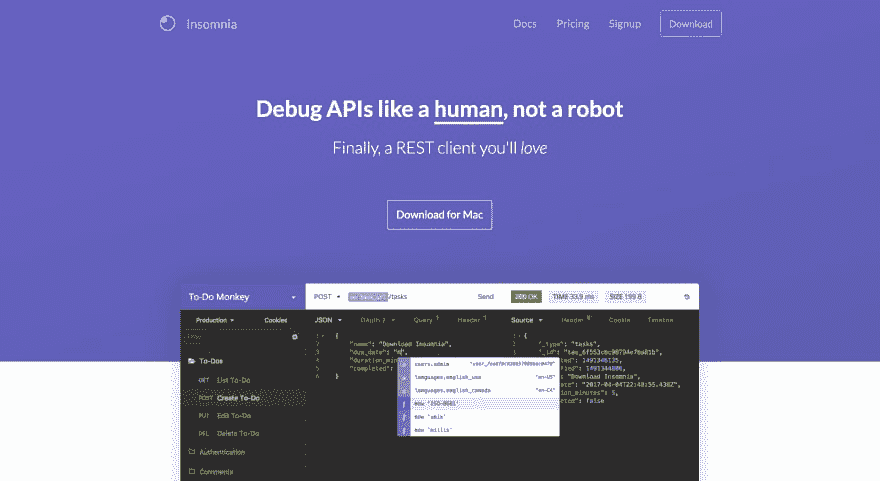](https://res.cloudinary.com/practicaldev/image/fetch/s--CDRRg7S---/c_limit%2Cf_auto%2Cfl_progressive%2Cq_auto%2Cw_880/https://d2mxuefqeaa7sj.cloudfront.net/s_E948749FFF9AABC92D46BF495805D213A4C4E2668CE3B0F9FAB1649B51E48A0F_1550393433785_Screen%2BShot%2B2019-02-17%2Bat%2B9.50.15%2BAM.png)

这个工具是我非常喜欢使用的另一个工具。它类似于 Postman，但也允许您查询 GraphQL 端点，这很酷吧。失眠症是一个强大的 HTTP 和 GraphQL 工具带，可以在 Mac、Linux 和 Windows 平台上使用。它的特性包括 GraphQL 支持，SVG 和图像预览，AWS 认证等。

#### Visual Studio 代码

[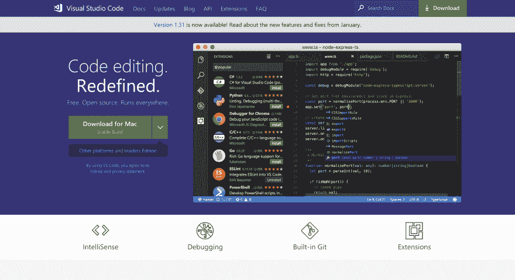](https://res.cloudinary.com/practicaldev/image/fetch/s--TxfyRlvH--/c_limit%2Cf_auto%2Cfl_progressive%2Cq_auto%2Cw_880/https://d2mxuefqeaa7sj.cloudfront.net/s_E948749FFF9AABC92D46BF495805D213A4C4E2668CE3B0F9FAB1649B51E48A0F_1550393805099_Screen%2BShot%2B2019-02-17%2Bat%2B9.56.28%2BAM.png)

Visual Studio Code 是一个我非常喜欢使用的代码编辑器。我已经使用了几年了，我还没有找到任何停止的理由，随着不断的改进和新功能的定期添加，这是我对代码编辑器的 goto 选择。

#### 破折号

[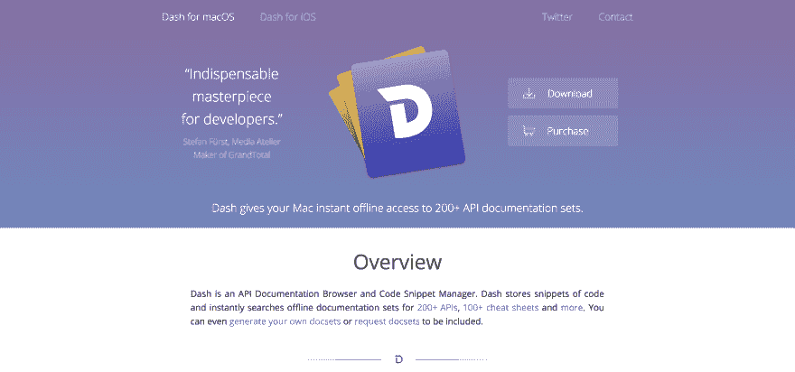](https://res.cloudinary.com/practicaldev/image/fetch/s--S9ed0GzM--/c_limit%2Cf_auto%2Cfl_progressive%2Cq_auto%2Cw_880/https://d2mxuefqeaa7sj.cloudfront.net/s_E948749FFF9AABC92D46BF495805D213A4C4E2668CE3B0F9FAB1649B51E48A0F_1550393860313_Screen%2BShot%2B2019-02-17%2Bat%2B9.57.24%2BAM.png)

Dash 是一款面向开发者的 Mac 应用，可以让你免费离线访问 200 多种 API 文档。您可以创建自己的文档集，甚至请求不包含的文档。对于 Windows 用户来说，这款应用的替代产品是 Zeal App。

#### 源代码管理

[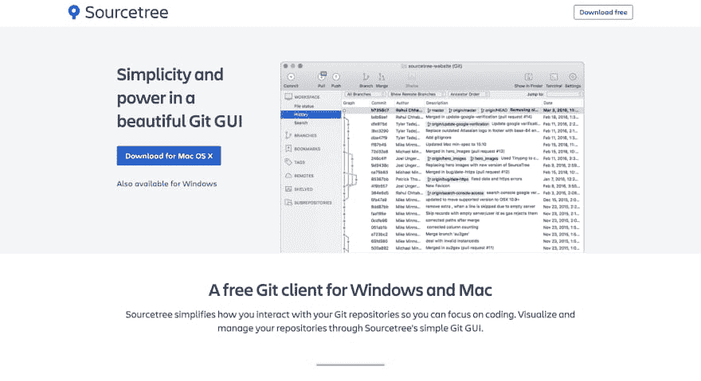](https://res.cloudinary.com/practicaldev/image/fetch/s--lWwvXwl6--/c_limit%2Cf_auto%2Cfl_progressive%2Cq_auto%2Cw_880/https://d2mxuefqeaa7sj.cloudfront.net/s_E948749FFF9AABC92D46BF495805D213A4C4E2668CE3B0F9FAB1649B51E48A0F_1550393949878_Screen%2BShot%2B2019-02-17%2Bat%2B9.58.09%2BAM.png)

曾经想用 GUI 代替 Git 的命令行吗？那么 SourceTree 是你最好的选择。我已经提到了 GitKraken，它们都做着同样的工作，我通常会偶尔在两个应用程序之间切换。所以我会说用最适合你的，它们都是很棒的应用。

#### 邮政汇票

[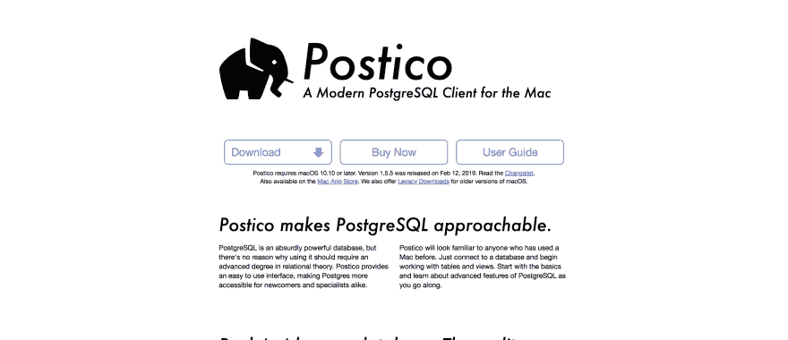](https://res.cloudinary.com/practicaldev/image/fetch/s--biI4SD0h--/c_limit%2Cf_auto%2Cfl_progressive%2Cq_auto%2Cw_880/https://d2mxuefqeaa7sj.cloudfront.net/s_E948749FFF9AABC92D46BF495805D213A4C4E2668CE3B0F9FAB1649B51E48A0F_1550393941779_Screen%2BShot%2B2019-02-17%2Bat%2B9.58.20%2BAM.png)

Postico 是 Postgres 的一款客户端应用。它有一个漂亮的用户界面，很容易访问，我更喜欢用它，而不是我找到的其他应用程序，甚至是使用 Postgres 命令行。

#### 超

[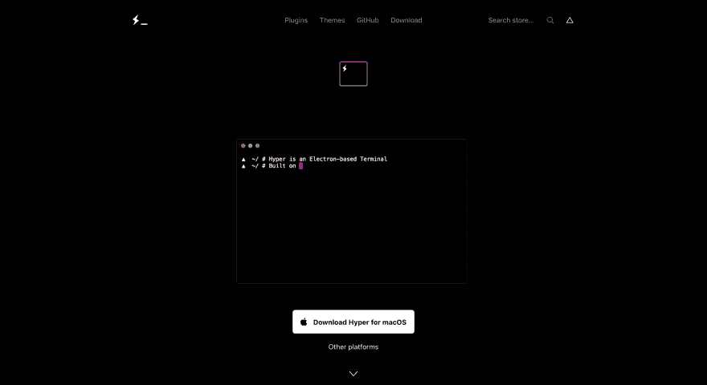](https://res.cloudinary.com/practicaldev/image/fetch/s--kkqgToG4--/c_limit%2Cf_auto%2Cfl_progressive%2Cq_auto%2Cw_880/https://d2mxuefqeaa7sj.cloudfront.net/s_E948749FFF9AABC92D46BF495805D213A4C4E2668CE3B0F9FAB1649B51E48A0F_1550393934437_Screen%2BShot%2B2019-02-17%2Bat%2B9.58.38%2BAM.png)

Hyper 是我喜欢使用的一个工具，事实上，它是我编程的默认终端。Hyper 很容易定制，可以集成很多插件，对我来说是一个很好的选择。

### 书写工具

#### 观念

[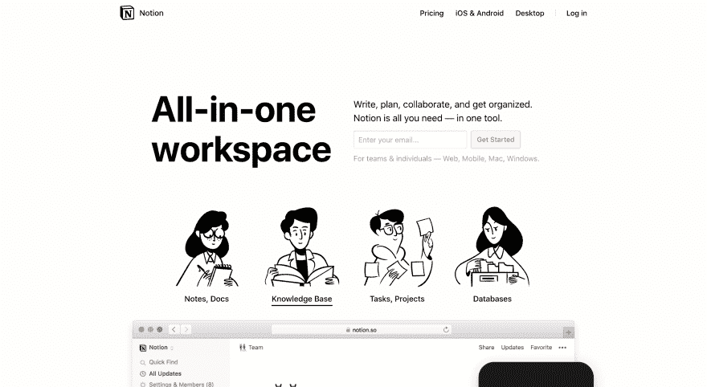](https://res.cloudinary.com/practicaldev/image/fetch/s--2b67jQw3--/c_limit%2Cf_auto%2Cfl_progressive%2Cq_auto%2Cw_880/https://d2mxuefqeaa7sj.cloudfront.net/s_E948749FFF9AABC92D46BF495805D213A4C4E2668CE3B0F9FAB1649B51E48A0F_1550394087029_Screen%2BShot%2B2019-02-17%2Bat%2B10.01.08%2BAM.png)

观念是你需要的几乎所有东西的工具。我还没有接触过对这个工具有负面想法的人。超级有帮助。你可以用意念写作、计划和合作。

#### 收纳盒纸

[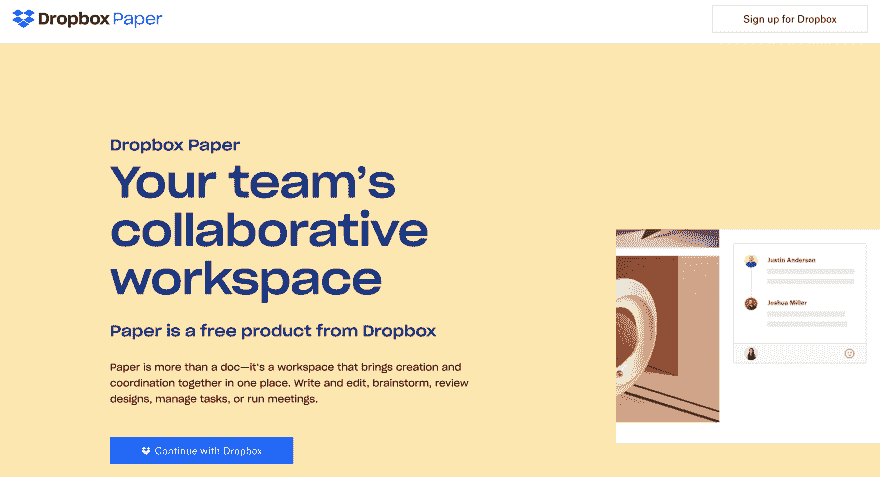](https://res.cloudinary.com/practicaldev/image/fetch/s--NBE7jPr---/c_limit%2Cf_auto%2Cfl_progressive%2Cq_auto%2Cw_880/https://d2mxuefqeaa7sj.cloudfront.net/s_E948749FFF9AABC92D46BF495805D213A4C4E2668CE3B0F9FAB1649B51E48A0F_1550394131871_Screen%2BShot%2B2019-02-17%2Bat%2B10.01.53%2BAM.png)

Dropbox 的纸张是一个很好的写作工具。我经常用它来写笔记、写文章和做其他事情。它支持降价格式。

#### 小熊 App

[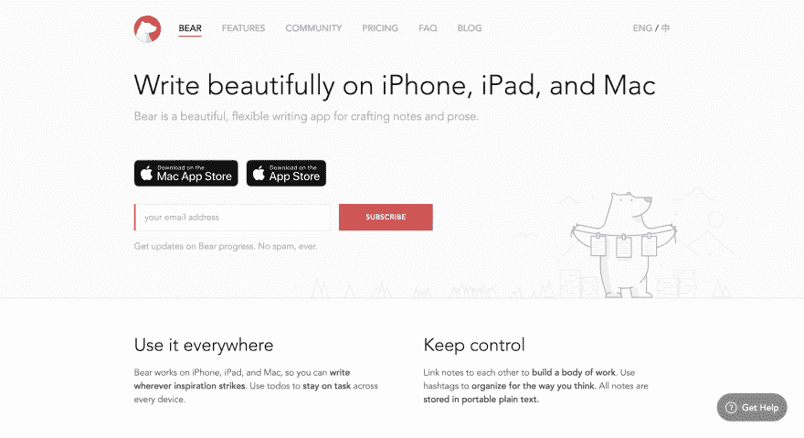](https://res.cloudinary.com/practicaldev/image/fetch/s--DIf5A4Gi--/c_limit%2Cf_auto%2Cfl_progressive%2Cq_auto%2Cw_880/https://d2mxuefqeaa7sj.cloudfront.net/s_E948749FFF9AABC92D46BF495805D213A4C4E2668CE3B0F9FAB1649B51E48A0F_1550394165002_Screen%2BShot%2B2019-02-17%2Bat%2B10.02.32%2BAM.png)

我喜欢多样化，所以如果我分享了许多执行类似任务的应用程序，请原谅我。小熊应用程序是一个制作和编写任何可能东西的应用程序。它可以用来写文章，记笔记，也可以作为一个待办事项应用程序。

#### 插入符号

Caret 是一个面向 Mac、Windows 和 Linux 用户的 markdown 编辑器，它使你能够在 Markdown 中编写内容，并且附带了相当多的功能，这些功能非常有用，比如我非常喜欢的黑暗模式。

### 正在部署

#### Netlify

Netlify 是一个我喜欢用来部署我的应用程序的工具，它是一个统一的平台，自动化你的代码来创建高性能、易于维护的网站和 web 应用程序。

#### GitHub 页

当你需要免费升级你的网站的部署版本时，GitHub Pages 非常有用，只需从你的 git 库进行几个步骤的设置，你就有了一个部署好的网站。我经常用这个。

#### 萨帕尔

[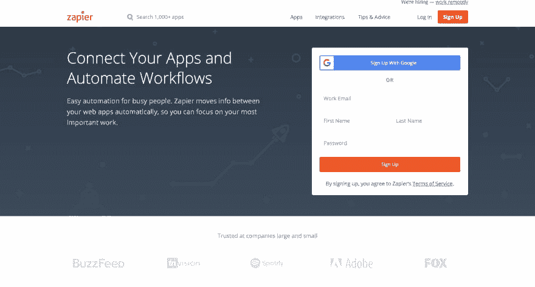](https://res.cloudinary.com/practicaldev/image/fetch/s--RY4pibzE--/c_limit%2Cf_auto%2Cfl_progressive%2Cq_auto%2Cw_880/https://d2mxuefqeaa7sj.cloudfront.net/s_E948749FFF9AABC92D46BF495805D213A4C4E2668CE3B0F9FAB1649B51E48A0F_1550394485706_Screen%2BShot%2B2019-02-17%2Bat%2B10.05.11%2BAM.png)

Zapier 是一个自动化工具，几乎可以自动化你能想到的任何东西。当我发表一篇新文章时，我用它来自动发送推文，通过我的 twitter 账户和 RSS feed 创建一个 zap。

### 杂项

#### 火箭

火箭是一个松弛风格的苹果表情符号。它的工作原理就像 Slack 中的表情符号查找器一样，当你想使用表情符号时，输入它的名称，然后再次按 Enter 键进行插入。比用 Mac 内置的表情符号键盘方便多了。

#### Numi

[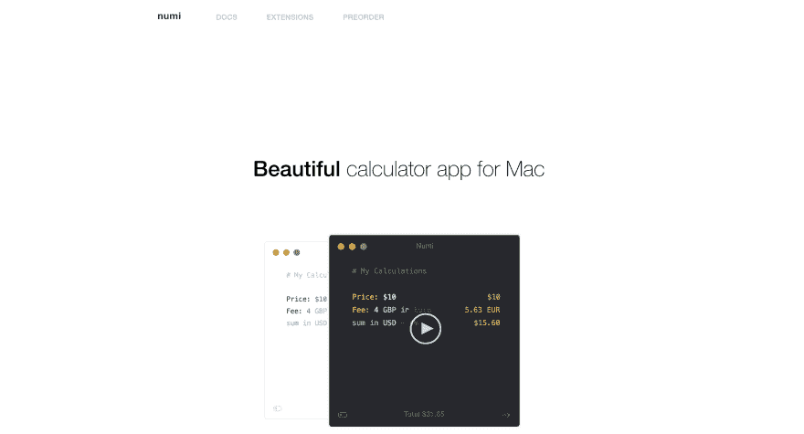](https://res.cloudinary.com/practicaldev/image/fetch/s--gi0d8rjV--/c_limit%2Cf_auto%2Cfl_progressive%2Cq_auto%2Cw_880/https://d2mxuefqeaa7sj.cloudfront.net/s_E948749FFF9AABC92D46BF495805D213A4C4E2668CE3B0F9FAB1649B51E48A0F_1550394514506_Screen%2BShot%2B2019-02-17%2Bat%2B10.07.06%2BAM.png)

Numi 是一款适用于 Mac 电脑的计算器应用。我必须说，这不仅仅是一个计算器，因为它的功能远不止于此，当我发现我可以用它来转换几乎任何东西时，我大吃一惊，例如将美元转换成我的当地货币奈拉！🤯

#### 口袋

Taskade 是一个有很多功能的应用程序，我用它来做待办事项、周计划和创建笔记。与此同时，这个应用程序可以做很多事情。难怪它被标记为敏捷团队的即时协作工具。

#### RecordIt

[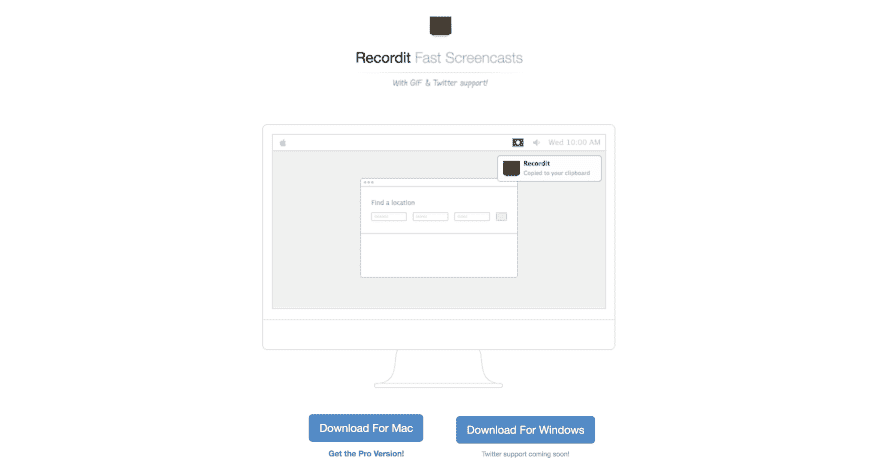](https://res.cloudinary.com/practicaldev/image/fetch/s--Huhuds-R--/c_limit%2Cf_auto%2Cfl_progressive%2Cq_auto%2Cw_880/https://d2mxuefqeaa7sj.cloudfront.net/s_E948749FFF9AABC92D46BF495805D213A4C4E2668CE3B0F9FAB1649B51E48A0F_1550394524806_Screen%2BShot%2B2019-02-17%2Bat%2B10.06.59%2BAM.png)

[RecordIt](http://recordit.co/) 是一款录制截屏视频的应用。我发现当我需要创建一个快速演示或展示一个特定的东西如何以 gif 格式工作时，这真的很有帮助。

#### 意识到

[Aware](https://awaremac.com/) 是一款 Mac 应用程序，可以帮助您记录自己活跃使用电脑的时间。我用它来记录我工作或完成一项特定任务所花的时间。

### 结论

我希望你会发现列出的这些工具都很有用，并开始使用它们来使你的工作变得容易得多。我的想法是与你分享我发现有用的工具，如果你也能与我分享这里没有列出的你发现有用的工具，我真的很高兴。让我们都保持生产力！