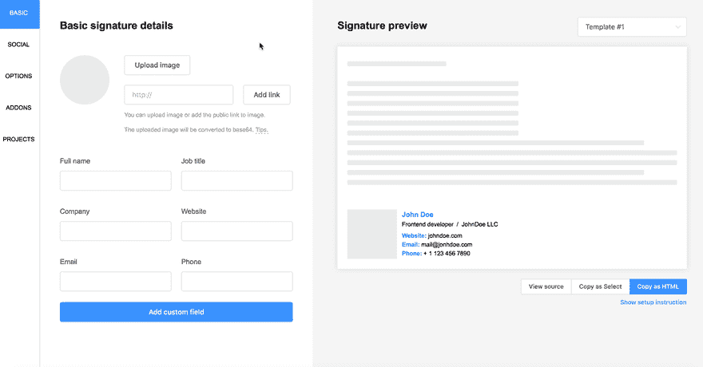

# MySigMail 1 . 6 . 0 版

> 原文：<https://dev.to/antonreshetov/mysigmail-release-160-3cen>

你好。

MySigMail 刚刚发布到 1.6.0
有一个小特性:

1.  裁剪图像工具
2.  移动应用徽章

酷&所有人的免费签名！

[https://github.com/antonreshetov/mysigmail](https://github.com/antonreshetov/mysigmail)