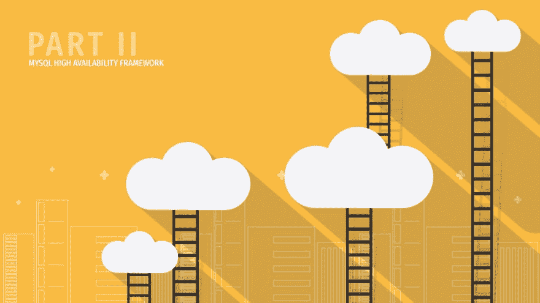

# MySQL 高可用性框架讲解–第二部分

> 原文：<https://dev.to/scalegrid/mysql-high-availability-framework-explained--part-ii-1kf3>

在[第一部分](https://scalegrid.io/blog/mysql-high-availability-framework-explained-part-1/)中，我们介绍了用于 [MySQL 托管](https://scalegrid.io/mysql.html "MySQL Hosting")的高可用性(HA)框架，并讨论了各种组件及其功能。现在，在[第二部分](https://scalegrid.io/blog/mysql-high-availability-framework-explained-part-2/)中，我们将讨论 MySQL 半同步复制的细节以及相关的配置设置，帮助我们确保 HA 设置中数据的冗余和一致性。请务必查看第三部分，在那里我们将回顾可能出现的各种故障场景，以及框架从这些情况中响应和恢复的方式。

## 什么是 MySQL 半同步复制？

简而言之，在 [MySQL 半同步复制](https://scalegrid.io/blog/data-integrity-and-performance-considerations-in-mysql-semisynchronous-replication/ "Data Integrity and Performance Considerations in MySQL Semisynchronous Replication")配置中，只有在从至少一个从服务器收到确认后，主服务器才会将事务提交给存储引擎。只有在接收到事件并将其复制到中继日志以及刷新到磁盘之后，从属才会提供确认。这保证了对于提交并返回给客户机的所有事务，数据至少存在于两个节点上。半同步(复制)中的术语“半”是因为一旦事件被接收并刷新到中继日志，主节点就提交事务，但不一定提交到从节点上的数据文件。这与完全同步复制形成对比，在完全同步复制中，在会话返回到客户端之前，事务已经在从属服务器和主服务器上提交。

MySQL 中固有的半同步复制有助于 HA 框架确保提交事务的数据一致性和冗余性。如果主服务器出现故障，主服务器上提交的所有事务都将被复制到至少一个从服务器上(保存到中继日志中)。因此，故障转移到该从站将是无损的，因为从站是最新的(在从站的中继日志完全耗尽之后)。

## 复制和半同步相关设置

让我们讨论一些关键的 MySQL 设置，这些设置用于确保我们框架中高可用性和数据一致性的最佳行为。

### 管理从机的执行速度

首先要考虑的是处理半同步复制的“半”行为，该行为仅保证数据已被从属服务器的 I/O 线程接收并刷新到中继日志，但不一定由 SQL 线程提交。默认情况下，MySQL 从服务器中的 SQL 线程是单线程的，无法与多线程的主服务器保持同步。这样做的明显影响是，如果主服务器出现故障，从服务器将不会是最新的，因为它的 SQL 线程仍在处理中继日志中的事件。这将延迟故障转移过程，因为我们的框架希望从服务器在升级之前完全保持最新。这是保持数据一致性所必需的。为了解决这个问题，我们使用选项 [slave_parallel_workers](https://dev.mysql.com/doc/refman/5.7/en/replication-options-slave.html#sysvar_slave_parallel_workers) 来启用多线程从属服务器，以设置并行 SQL 线程的数量来处理中继日志中的事件。

此外，我们还配置了以下设置，以确保从机不会进入主机未进入的任何状态:

*   [从并行型](https://dev.mysql.com/doc/refman/5.7/en/replication-options-slave.html#option_mysqld_slave-parallel-type) =逻辑时钟
*   [从 _ 保存 _ 提交 _ 顺序](https://dev.mysql.com/doc/refman/5.7/en/replication-options-slave.html#sysvar_slave_preserve_commit_order) = 1

这为我们提供了更强的数据一致性。通过这些设置，我们将能够在从属服务器上获得更好的并行化和速度，但是如果有太多的并行线程，线程之间协调所涉及的开销也会增加，并且不幸地抵消了好处。

我们可以用来提高从机上并行执行效率的另一种配置是调整主机上的[binlog _ group _ commit _ sync _ delay](https://dev.mysql.com/doc/refman/5.7/en/replication-options-binary-log.html#sysvar_binlog_group_commit_sync_delay)。通过在主服务器上设置此项，主服务器上的二进制日志条目以及从服务器上的中继日志条目将拥有可以由 SQL 线程并行处理的批量事务。这在 [J-F 加涅的博客](https://jfg-mysql.blogspot.com/2017/02/metric-for-tuning-parallel-replication-mysql-5-7.html)中有详细的解释，他将这种行为称为“*减慢主人的速度以加快奴隶的速度”*。

如果您通过 [ScaleGrid 控制台](https://console.scalegrid.io/ "MySQL Hosting Console at ScaleGrid")管理您的 MySQL 部署，您将能够持续监控并接收关于从服务器复制延迟的实时警报。它还允许您动态调整上述参数，以确保从设备与主设备协同工作，从而最大限度地减少故障转移过程中所花费的时间。

### 重要的半同步复制选项

根据设计，MySQL 半同步复制可以根据从机确认超时设置或任何时间点可用的半同步从机数量退回到异步模式。根据定义，异步模式不保证提交的事务被复制到从机，因此主机丢失会导致未被复制的数据丢失。ScaleGrid HA 框架的默认设计是为了避免退回到异步模式。让我们回顾一下影响这种行为的配置。

*   #### [rpl _ semi _ sync _ master _ wait _ for _ slave _ count](https://dev.mysql.com/doc/refman/5.7/en/server-system-variables.html#sysvar_rpl_semi_sync_master_wait_for_slave_count)

    该选项用于配置在半同步主机提交事务之前必须发送确认的从机数量。在 3 节点主从配置中，我们将其设置为 1，这样我们就可以确保数据在至少一个从机中可用，同时避免因等待两个从机的确认而对性能造成任何影响。

*   #### [rpl _ semi _ sync _ master _ time out](https://dev.mysql.com/doc/refman/5.7/en/server-system-variables.html#sysvar_rpl_semi_sync_master_timeout)

    该选项用于配置半同步主机在切换回异步模式之前等待从机确认的时间。我们将它设置为相对较高的超时值，这样就不会退回到异步模式。

    由于我们使用 2 个从机运行，并且[rpl _ semi _ sync _ master _ wait _ for _ slave _ count](https://dev.mysql.com/doc/refman/5.7/en/server-system-variables.html#sysvar_rpl_semi_sync_master_wait_for_slave_count)设置为 1，我们注意到至少有一个从机在合理的时间内进行了确认，并且主机在网络暂时中断期间不会切换到异步模式。

*   #### [rpl _ semi _ sync _ master _ wait _ no _ slave](https://dev.mysql.com/doc/refman/5.7/en/replication-options-master.html#sysvar_rpl_semi_sync_master_wait_no_slave)

    这控制主机是否等待由[rpl _ semi _ sync _ master _ time out](https://dev.mysql.com/doc/refman/5.7/en/replication-options-master.html#sysvar_rpl_semi_sync_master_timeout)配置的超时周期到期，即使在超时周期内从机计数下降到小于由[rpl _ semi _ sync _ master _ wait _ for _ slave _ count](https://dev.mysql.com/doc/refman/5.7/en/replication-options-master.html#sysvar_rpl_semi_sync_master_wait_for_slave_count)配置的从机数量。我们保留默认值 ON，这样主服务器就不会退回到异步复制。

### 失去所有半同步从站的影响

正如我们在上面所看到的，如果所有的从设备都停止运行或者变得无法从主设备获得，我们的框架会阻止主设备切换到异步复制。这样做的直接影响是写操作在主服务器上停止，从而影响服务的可用性。这实质上是由关于任何分布式系统的限制的[上限定理](https://en.wikipedia.org/wiki/CAP_theorem)所描述的。该定理指出，在存在网络分区的情况下，我们必须选择可用性或一致性，但不能两者都选。在这种情况下，网络分区可以被认为是与主服务器断开连接的 MySQL 从服务器，因为它们要么关闭，要么无法访问。

我们的一致性目标是确保对于所有提交的事务，数据至少在 2 个节点上可用。因此，在这种情况下，ScaleGrid HA 框架更倾向于一致性而不是可用性。尽管 MySQL master 仍将为读取请求提供服务，但不会接受来自客户端的进一步写入。这是我们有意识的设计决策，作为默认行为，当然可以根据应用要求进行配置。

请务必订阅 ScaleGrid 博客，这样您就不会错过第三部分，在那里我们将讨论 MySQL HA 框架的更多故障场景和恢复能力。敬请期待！！