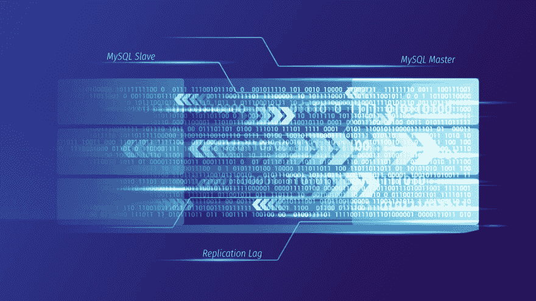
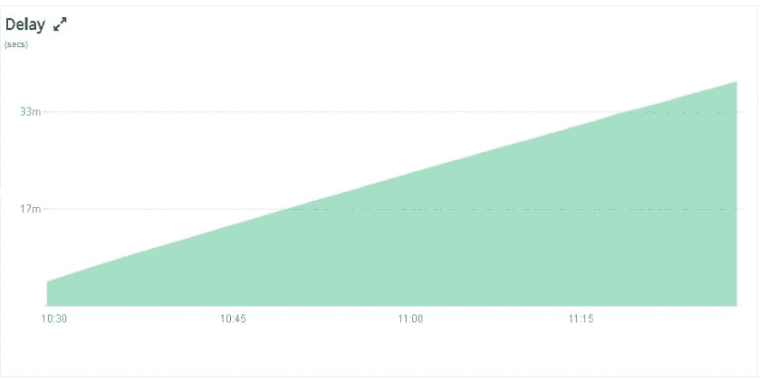

# MySQL 教程——了解主价值背后的秒

> 原文：<https://dev.to/scalegrid/mysql-tutorial--understanding-the-seconds-behind-master-value-292e>

在托管复制设置的 [MySQL 中，参数 Seconds_Behind_Master (SBM ),如 SHOW SLAVE STATUS 命令所示，通常用于指示从服务器的当前复制滞后。在这篇博文中，我们考察了如何在各种情况下理解和解释主值](https://scalegrid.io/mysql.html "MySQL Hosting")后面的 [MySQL 秒。](https://scalegrid.io/blog/mysql-tutorial-understanding-the-seconds-behind-master-value/ "MySQL Hosting")

## 主秒后的可能值

正如在 [MySQL 文档](https://dev.mysql.com/doc/refman/5.7/en/show-slave-status.html)中解释的那样，SBM 的值通常取决于 MySQL 从属服务器的状态，特别是 MySQL 从属服务器 SQL_THREAD 和 IO_THREAD 的状态。当 IO_THREAD 与主服务器连接并读取更新时，SQL_THREAD 将这些更新应用于从服务器。让我们检查一下在 MySQL 从服务器的不同状态下 SBM 的可能值。

### 当 SBM 值为空时

*   如果您的从属服务器停止了，或者您的 SQL 线程停止了(或者没有运行)，那么 SBM 总是 NULL。
*   如果 IO 线程停止，SBM 也将为 NULL，前提是 SQL 线程已经处理了中继日志中的所有事件。SHOW SLAVE STATUS 的一个示例输出(被裁剪为只显示感兴趣的值)演示了这一点:

Slave _ IO _ 状态:

主控 _ 主机:172.19.0.13

Slave_IO_Running:否

Slave_SQL_Running:是

秒 _ 后 _ 主:空

主人 _ UUID:23b 326 B1-a452-11e 8-91ca-000 D3 a065 e8e

Slave _ SQL _ Running _ State:Slave 已读取所有中继日志；等待更多更新

retrieved _ Gtid _ Set:23b 326 B1-a452-11e 8-91ca-000 d3a 065 e8e:818-389213

executed _ Gtid _ Set:23b 326 B1-a452-11e 8-91ca-000 d3a 065 e8e:1-389213

### 当 SBM 值为零或正时

*   当 SQL 线程主动处理事件时，SBM 将反映一个有效值(> = 0)。无论 IO 线程状态如何，都是如此。例如:

Slave _ IO _ 状态:

主控 _ 主机:172.19.0.13

Slave_IO_Running:否

Slave_SQL_Running:是

秒 _ 后 _ 主:3399

主人 _ UUID:23b 326 B1-a452-11e 8-91ca-000 D3 a065 e8e

Slave_SQL_Running_State:等待从属工作进程处理其队列

Retrieved _ Gtid _ Set:23b 326 B1-a452-11e 8-91ca-000 D3 a065 e8e:818-389213

Executed _ Gtid _ Set:23b 326 B1-a452-11e 8-91ca-000 D3 a065 e8e:1-118774

在上面的例子中，通过比较 Retrieved_GTID_Set 和 Executed_GTID_Set，我们可以看到 slave 在 master 后面。在这种情况下，Seconds_Behind_Master 将表示由 SQL 线程处理的最新事务的时间戳与同一事务在主服务器上处理时的时间戳之间的差异。主设备的事务时间戳通过复制得以保存，因此从设备将能够在本地计算 SBM。

此外，一旦从站完全赶上所有中继日志(即，执行的 GTID 变为 23b 326 B1-a452-11e 8-91ca-000 D3 a065 e8e:1-389213/)，如果 IO 线程正在运行，Seconds_Behind_Master 将变为“0”，如果 IO 线程未运行，则变为“NULL”。

## 了解 MySQL 从属服务器的执行速度

假设从服务器上的 SQL 线程和 IO 线程处于运行状态，通过监视 SBM 值可以了解主服务器和从服务器的相对执行速度。一致的“0”值或常数值表示从机以与主机相同的速度执行。另一方面，Seconds_Behind_Master 的向上斜率表示从机的执行速度比主机慢。

ScaleGrid 针对 Azure 上的 MySQL 的监控控制台绘制了从节点的 SBM 值随时间的变化。

### SBM 的零值或常数值

在上面的示例中，从机在主机有活动写操作后大约 40 小时启动。一旦启动，从机就开始复制数据，我们看到 SBM 非常平坦，表明从机与主机以相同的速度执行。还要注意，SBM 急剧下降到“0 ”,这实际上意味着尽管从模块运行的最后一个事务是在大约 40 小时前在主模块上执行的，但是一旦我们赶上了，就会有“0”延迟。

### 合成基泥浆的增值

在下图中，我们可以看到 SBM 在不断增加，这意味着从机的执行速度比主机的执行速度要低。这实际上是一种情况，我们在主服务器上运行 20 个线程进行连续写入，而单线程从服务器无法与之保持同步。

最后，值得注意的是，在我们到目前为止的讨论中，我们没有假设任何网络瓶颈。在慢速网络的情况下，从 IO 线程本身将落后于主线程，如果 SQL 线程足够快，SBM 将在“0”和正数之间振荡。在这种情况下，SBM 将不是理解与主设备的真实滞后的有用参数。

如果您的 MySQL 部署是使用[半同步复制](https://scalegrid.io/blog/data-integrity-and-performance-considerations-in-mysql-semisynchronous-replication/)设置的，您也可以查看我们的 [MySQL 高可用性框架解释-第二部分](https://scalegrid.io/blog/mysql-high-availability-framework-explained-part-2/)帖子，了解更多关于管理您的从服务器的执行速度的信息。