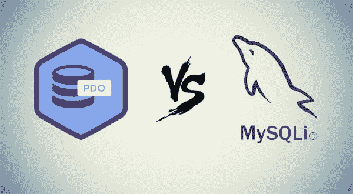

# MySQL vs MySQL vs PDO 性能基准、差异和安全性比较- 2022 年

> 原文：<https://dev.to/mega6382/mysql-vs-mysqli-vs-pdo-performance-benchmark-difference-and-security-comparison-565o>

### 1。PDO vs MySQL vs MySQL

### 2。使用 MySQLi 和 PDO 连接的区别

### 3。PDO vs MySQL vs MySQL 性能基准测试

### 4。使用预准备语句的 PDO vs MySQL 安全

### 5。PDO 和 MySQLi 使用条款的比较

### 6。将 MySQL 应用程序转换为使用 PDO 或 MySQLi

### 7。用于 PDO 和 MySQLi 的软件包建议

### 8。在新项目中使用什么:PDO 还是 MySQLi？

[](https://res.cloudinary.com/practicaldev/image/fetch/s--h0BgLvPq--/c_limit%2Cf_auto%2Cfl_progressive%2Cq_auto%2Cw_880/https://cdn-images-1.medium.com/max/600/0%2AN884HE7J-twKG4zq.png)

### 1。PDO vs MySQL vs MySQL

众所周知，MySQL 是一个开源的关系数据库管理系统(RDBMS)，使用结构化查询语言(SQL)。MySQL 是 LAMP 开源 Web 应用软件栈(以及其他“AMP”栈)的核心组件:Apache MySQL 和 PHP。

MySQL 是几乎所有开源 PHP 应用程序的重要组成部分。基于 PHP 和 MySQL 的脚本的好例子是 phpBB、osCommerce 和 Joomla。

PHP 曾经内置了最初的 MySQL 扩展，支持旧的 MySQL 版本。然而，这个扩展被 MySQLi 所取代(I 代表改进)。与此同时，PHP 继续发展，PDO (PHP 数据对象)扩展被引入，成为访问多种类型数据库的通用接口。

MySQL 是访问 MySQL 数据库服务器的三种方法之一。像 MySQL 扩展一样，新的 MySQL 旨在更好地利用最新的 MySQL 服务器功能。

PHP 数据对象(PDO)扩展定义了一个轻量级的通用接口，用于访问 PHP 中的数据库。PDO 接口支持的每个数据库驱动程序都可以展示数据库特定的特性以及公共功能。

PDO 提供了一个数据访问抽象层，这意味着无论您使用哪种数据库类型，都可以使用相同的函数来执行查询和获取结果。PDO 没有提供完整的数据库抽象。也就是说，它不会重写 SQL 查询或模拟缺失的功能。如果你需要这种能力，你应该使用一个成熟的抽象层包。

### 2。使用 MySQLi 和 PDO 连接的区别

PDO 和 MySQLi 都为扩展函数提供了面向对象的接口，但是 MySQLi 也提供了过程化的 API，这使得新手更容易理解。如果您熟悉最初的 PHP MySQL 扩展，您会发现迁移到过程化 MySQL 接口更容易。下面是一个例子:

```
// PDO 
$pdo = new PDO( "mysql:" . "host=localhost;" . "dbname=database",
    'username', 'password');

// mysqli, procedural way 
$mysqli = mysqli_connect( 'localhost', 'username', 'password', 'database');

// mysqli, object oriented way 
$mysqli = new mysqli( 'localhost', 'username', 'password', 'database'); 
```

Enter fullscreen mode Exit fullscreen mode

PDO 相对于 MySQLi 的主要优势在于数据库支持。PDO 支持 12 种不同的数据库类型，而 MySQL 只支持 MySQL。

当您必须切换您的项目以使用另一个数据库时，PDO 使这一过程变得更简单。因此，您所要做的就是更改连接字符串，如果它们使用了新数据库不支持的语法，最多更改几个查询。

### 3。使用预准备语句的 PDO vs MySQL 安全

PDO 和 MySQLi 都提供了对预备查询的支持。这有助于防止 SQL 注入安全问题，只要您只使用准备好的查询在查询中插入动态参数。

例如，考虑一个黑客，他试图注入恶意的 SQL，向 HTTP POST 请求的参数**代码**传递一个伪造的值，可以这样模拟:

```
$_POST['code'] = "'; DELETE FROM products; /*"; 
```

Enter fullscreen mode Exit fullscreen mode

如果不转义该值，它将按原样插入查询中，因此它将删除 products 表中的所有行。

使查询更安全避免 SQL 注入的一种方法是引用字符串参数值来插入转义字符。

```
// PDO, “manual” escaping

$name = PDO::quote( $_POST['code'] );
$pdo->query( "SELECT id, name FROM products WHERE code = $code" );

// mysqli, “manual” escaping

$name = mysqli_real_escape_string( $_POST['code'] );
$mysqli->query( "SELECT id, name FROM products WHERE name = '$code'" ); 
```

Enter fullscreen mode Exit fullscreen mode

PDO::quote()不仅转义字符串，还添加了引号。mysqli_real_escape_string()只会对字符串进行转义，所以您需要手动添加引号。

```
// PDO, prepared statement

$pdo->prepare( 'SELECT id, name FROM products WHERE code = :code' );
$pdo->execute( array( ':code' => $_POST['code'] ) );

// mysqli, prepared statements

$query = $mysqli->prepare('SELECT id, name FROM users WHERE code = ?');
$query->bind_param('s', $_POST['code']);
$query->execute(); 
```

Enter fullscreen mode Exit fullscreen mode

PDO 还支持客户端查询。这意味着当它准备一个查询时，它不必与服务器通信。

因为 MySQLi 使用本机预准备语句，所以实际上使用 mysqli_real_escape_string 可能比使用预准备语句更快，同时它仍然是一个安全的解决方案。

### 4。PDO vs MySQL vs MySQL 性能基准测试

几年前，乔纳森·罗布森和 T2【Radu Potop】进行了一些 PHP MySQL 性能基准测试。尽管这些测试是用 PHP 5.3 执行的，而现在我们用的是 PHP 7 或更高版本，让我们把这些结果作为参考。

基本上，它们表明对于使用预处理语句的 SELECT 查询，MySQLi 运行得更快一些。尽管如此，这可能并不重要，取决于你的目的。

请记住，默认情况下，PDO 使用客户端准备语句模拟。使用本机预准备语句时，有一个到服务器的额外往返行程来准备语句，因此总的查询执行时间实际上可能比使用本机预准备语句仅运行一次查询时要长。

如上所述，您可以使用 mysqli_real_escape_string 函数引用动态参数，就像使用原始 MySQL 扩展时一样。这就像用 PDO 模拟准备好的查询一样，因为您不需要额外执行一次到服务器的往返来准备语句。

### 5。PDO 和 MySQLi 使用条款的比较

虽然 MySQL 在访问 MySQL 服务器特性方面有其优势，但 PDO 有时更胜一筹，可能更适合用户，这取决于个人偏好和便利性。像大多数事情一样，最有效的选择取决于你问谁，以及你在什么情况下需要 MySQLi 或 PDO。

MySQL 只支持 MySQL 数据库，而 PDO 很灵活，可以支持多种数据库系统，包括 IBM、Oracle 和 MySQL。如果您必须切换数据库或提供独立于数据库的解决方案，直接使用 MySQLi 不是最佳选择。您仍然可以在使用抽象层的独立于数据库的解决方案中使用 MySQLi。

用 MySQLi 绑定参数不像用 PDO 那样容易或灵活。MySQLi 使用编号参数系统，不支持命名参数，如 PDO。MySQLi 有良好的支持和维护，使得向新系统的过渡和使用安全可靠。

您将能够利用 MySQL 服务器新版本中的新特性。这是 MySQLi 最大的优势之一。PDO 可能没有足够的支持来充分利用 MySQL 的新功能。

MySQLi 的安装过程不仅简单，而且当 PHP 5 MySQL 扩展内置在 Windows 或 Linux 发行版中时，安装过程是自动的。

### 6。将 MySQL 应用程序转换为使用 PDO 或 MySQLi

如果您有一个项目使用旧的 MySQL 扩展，并且您需要将其转换为使用 MySQL 或 PDO，如果您没有使用数据库抽象层，可能需要一段时间来重写它。

如果你需要一个快速简单的解决方案，不需要对你的代码做太多的修改，你可以试试 PDO 软件包或者 MySQLi，通过 MySQL 包装函数调用 [mysql_*函数，使用 Aziz S. Hussain 的 PDO](https://www.phpclasses.org/package/8221-PHP-Access-MySQL-databases-using-PDO-wrapper-functions.html) 或者戴夫·史密斯的 [PHP MySQL to MySQLi](https://www.phpclasses.org/package/9199-PHP-Replace-mysql-functions-using-the-mysqli-extension.html) 分别调用 PDO 和 MySQLi 扩展函数。

这将允许你在 PHP 7 上运行你的代码，同时你做一个不需要包装器的真正的代码移植。

戴夫·史密斯还写了一篇关于如何将 mysql 代码移植到 mysqli 的教程，考虑到这些扩展之间的差异。